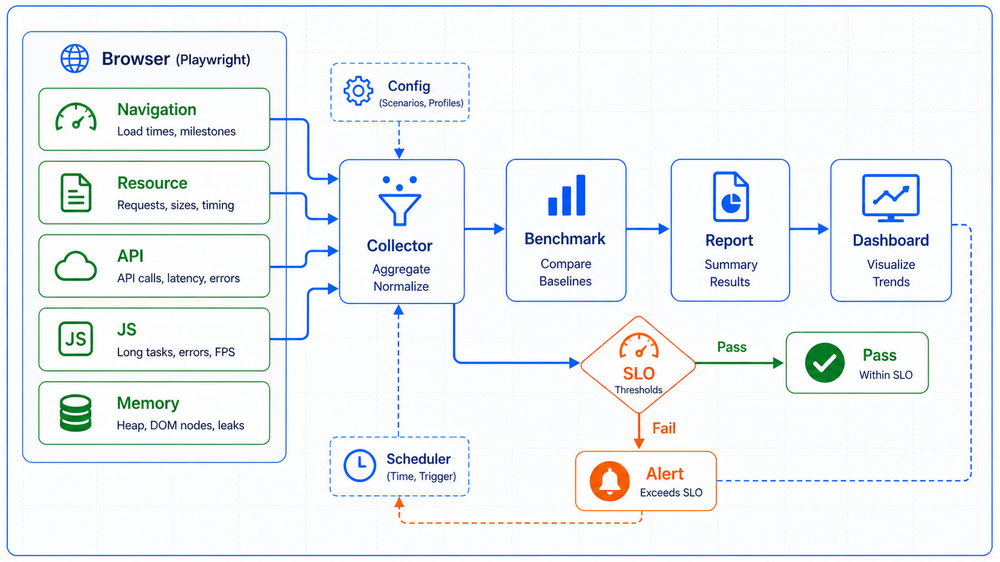

## 概述

性能是用户体验的关键因素。使用 Playwright，你不仅可以进行功能测试，还可以进行全面的性能测试和监控。本教程将详细介绍如何测量页面加载时间、网络性能、JavaScript 执行效率等关键指标。



### 性能测试类型

```text
┌─────────────────────────────────────────────────────────────┐
│                    性能测试类型                               │
├─────────────────────────────────────────────────────────────┤
│                                                              │
│  ┌─────────────┐  ┌─────────────┐  ┌─────────────┐          │
│  │   负载测试  │  │  压力测试  │  │  稳定性测试  │          │
│  │             │  │             │  │             │          │
│  │ 并发用户数  │  │ 峰值负载   │  │ 长时间运行  │          │
│  │ 响应时间   │  │ 极限情况   │  │ 内存泄漏   │          │
│  └─────────────┘  └─────────────┘  └─────────────┘          │
│                                                              │
│  ┌─────────────┐  ┌─────────────┐  ┌─────────────┐          │
│  │ 页面加载   │  │  网络性能   │  │  JS 执行   │          │
│  │             │  │             │  │             │          │
│  │ TTFB        │  │ 请求延迟   │  │ 执行时间   │          │
│  │ FCP        │  │ 下载速度   │  │ 堆内存    │          │
│  │ LCP        │  │ 并发数    │  │ 事件耗时  │          │
│  └─────────────┘  └─────────────┘  └─────────────┘          │
│                                                              │
└─────────────────────────────────────────────────────────────┘
```

## 基础性能测量

### 页面加载时间

```python
from playwright.sync_api import sync_playwright, Page
from dataclasses import dataclass
from datetime import datetime

@dataclass
class PageLoadMetrics:
    """页面加载指标"""
    url: str
    load_started: datetime
    load_completed: datetime
    total_duration: float  # 毫秒
    
    navigation_start: float = 0
    dom_content_loaded: float = 0
    load: float = 0
    first_paint: float = 0
    first_contentful_paint: float = 0
    first_meaningful_paint: float = 0

def measure_page_load():
    """测量页面加载时间"""
    with sync_playwright() as p:
        browser = p.chromium.launch()
        page = browser.new_page()
        
        # 启用性能跟踪
        client = page.context.new_cdp_session(page)
        client.send("Performance.enable")
        
        # 记录开始时间
        start_time = datetime.now()
        
        # 导航并等待
        page.goto("https://example.com", wait_until="networkidle")
        
        # 获取性能指标
        metrics = client.send("Performance.getMetrics")
        
        # 计算加载时间
        end_time = datetime.now()
        duration = (end_time - start_time).total_seconds() * 1000
        
        # 提取关键指标
        metric_dict = {m["name"]: m["value"] for m in metrics["metrics"]}
        
        page_metrics = PageLoadMetrics(
            url="https://example.com",
            load_started=start_time,
            load_completed=end_time,
            total_duration=duration,
            navigation_start=metric_dict.get("Navigation.navigationStart", 0),
            dom_content_loaded=metric_dict.get("Navigation.domContentLoaded", 0),
            load=metric_dict.get("Navigation.load", 0),
            first_paint=metric_dict.get("Paint.first-paint", 0),
            first_contentful_paint=metric_dict.get("Paint.first-contentful-paint", 0)
        )
        
        print(f"页面加载时间: {page_metrics.total_duration:.2f}ms")
        print(f"DOM Content Loaded: {page_metrics.dom_content_loaded:.2f}ms")
        print(f"First Contentful Paint: {page_metrics.first_contentful_paint:.2f}ms")
        
        browser.close()
        
        return page_metrics
```

### Navigation Timing API

```python
def navigation_timing():
    """使用 Navigation Timing API"""
    with sync_playwright() as p:
        browser = p.chromium.launch()
        page = browser.new_page()
        
        page.goto("https://example.com", wait_until="networkidle")
        
        # 获取 Navigation Timing 指标
        timing = page.evaluate("""
            () => {
                const timing = performance.timing;
                return {
                    navigationStart: timing.navigationStart,
                    domLoading: timing.domLoading,
                    domInteractive: timing.domInteractive,
                    domContentLoaded: timing.domContentLoadedEventEnd,
                    domComplete: timing.domComplete,
                    loadEventEnd: timing.loadEventEnd,
                    // 计算各阶段耗时
                    ttfb: timing.responseStart - timing.requestStart,
                    fcp: timing.domContentLoadedEventEnd - timing.navigationStart,
                    lcp: timing.loadEventEnd - timing.navigationStart
                };
            }
        """)
        
        print("Navigation Timing 指标:")
        for key, value in timing.items():
            print(f"  {key}: {value:.2f}ms")
        
        browser.close()
        return timing
```

### Resource Timing API

```python
def resource_timing():
    """测量资源加载时间"""
    with sync_playwright() as p:
        browser = p.chromium.launch()
        page = browser.new_page()
        
        page.goto("https://example.com", wait_until="networkidle")
        
        # 获取所有资源的加载时间
        resources = page.evaluate("""
            () => {
                const resources = performance.getEntriesByType('resource');
                return resources.map(r => ({
                    name: r.name,
                    duration: r.duration.toFixed(2),
                    size: r.transferSize,
                    type: r.initiatorType,
                    dns: (r.dnsEnd - r.dnsStart).toFixed(2),
                    tcp: (r.connectEnd - r.connectStart).toFixed(2),
                    ttfb: (r.responseStart - r.requestStart).toFixed(2)
                }));
            }
        """)
        
        # 按加载时间排序
        resources_sorted = sorted(resources, key=lambda x: float(x["duration"]), reverse=True)
        
        print("资源加载时间（Top 10）:")
        for i, res in enumerate(resources_sorted[:10], 1):
            print(f"{i}. {res['name'][:60]}...")
            print(f"   耗时: {res['duration']}ms, 大小: {res['size']/1024:.1f}KB")
        
        browser.close()
        return resources
```

## 网络性能监控

### 监听网络请求

```python
from playwright.sync_api import sync_playwright, Request, Response
from dataclasses import dataclass, field
from typing import List, Dict

@dataclass
class RequestMetrics:
    """请求指标"""
    url: str
    method: str
    status: int
    timing: float  # 总耗时(ms)
    dns_lookup: float = 0
    tcp_connection: float = 0
    tls_handshake: float = 0
    waiting_ttfb: float = 0
    content_download: float = 0
    size: int = 0

def monitor_network_requests():
    """监控网络请求"""
    requests: List[Request] = []
    responses: List[Response] = []
    request_times: Dict[str, float] = {}
    
    with sync_playwright() as p:
        browser = p.chromium.launch()
        page = browser.new_page()
        
        def on_request(request: Request):
            requests.append(request)
            request_times[request.url] = datetime.now().timestamp()
        
        def on_response(response: Response):
            responses.append(response)
        
        page.on("request", on_request)
        page.on("response", on_response)
        
        # 执行操作
        page.goto("https://example.com", wait_until="networkidle")
        
        # 计算请求统计
        metrics: List[RequestMetrics] = []
        for response in responses:
            if response.status >= 200 and response.status < 400:
                timing = response.request.timing
                
                if timing:
                    metric = RequestMetrics(
                        url=response.url,
                        method=response.request.method,
                        status=response.status,
                        timing=timing.responseEnd - timing.requestStart if timing.requestStart else 0,
                        dns_lookup=timing.domainLookupEnd - timing.domainLookupStart if timing.domainLookupStart else 0,
                        tcp_connection=timing.connectEnd - timing.connectStart if timing.connectStart else 0,
                        waiting_ttfb=timing.responseStart - timing.requestStart if timing.requestStart else 0,
                        content_download=timing.responseEnd - timing.responseStart if timing.responseStart else 0,
                        size=response.body_size if hasattr(response, 'body_size') else 0
                    )
                    metrics.append(metric)
        
        # 统计输出
        print(f"总请求数: {len(requests)}")
        print(f"成功请求: {len([r for r in responses if r.status < 400])}")
        print(f"失败请求: {len([r for r in responses if r.status >= 400])}")
        
        avg_time = sum(m.timing for m in metrics) / len(metrics) if metrics else 0
        print(f"平均响应时间: {avg_time:.2f}ms")
        
        browser.close()
        return metrics
```

### API 性能测试

```python
def api_performance_test():
    """API 性能测试"""
    import statistics
    
    with sync_playwright() as p:
        browser = p.chromium.launch()
        page = browser.new_page()
        
        # 记录响应时间
        response_times: List[float] = []
        
        def on_response(response: Response):
            if "/api/" in response.url:
                timing = response.request.timing
                if timing and timing.responseEnd:
                    duration = (timing.responseEnd - timing.requestStart) * 1000
                    response_times.append(duration)
        
        page.on("response", on_response)
        
        # 执行多次请求
        for _ in range(10):
            page.goto("https://example.com/dashboard")
            page.wait_for_load_state("networkidle")
        
        # 统计分析
        if response_times:
            print("API 响应时间统计:")
            print(f"  最小值: {min(response_times):.2f}ms")
            print(f"  最大值: {max(response_times):.2f}ms")
            print(f"  平均值: {statistics.mean(response_times):.2f}ms")
            print(f"  中位数: {statistics.median(response_times):.2f}ms")
            print(f"  标准差: {statistics.stdev(response_times):.2f}ms")
            
            # 计算百分位数
            sorted_times = sorted(response_times)
            p50 = sorted_times[int(len(sorted_times) * 0.5)]
            p90 = sorted_times[int(len(sorted_times) * 0.9)]
            p95 = sorted_times[int(len(sorted_times) * 0.95)]
            p99 = sorted_times[int(len(sorted_times) * 0.99)]
            
            print(f"  P50: {p50:.2f}ms")
            print(f"  P90: {p90:.2f}ms")
            print(f"  P95: {p95:.2f}ms")
            print(f"  P99: {p99:.2f}ms")
        
        browser.close()
```

## JavaScript 性能

### JS 执行时间测量

```python
def measure_js_performance():
    """测量 JavaScript 执行性能"""
    with sync_playwright() as p:
        browser = p.chromium.launch()
        page = browser.new_page()
        
        page.goto("https://example.com")
        
        # 启用 Performance 观察者
        page.evaluate("""
            () => {
                // 创建一个复杂的数据处理任务
                window.testData = [];
                for (let i = 0; i < 10000; i++) {
                    window.testData.push({
                        id: i,
                        name: `item_${i}`,
                        value: Math.random() * 1000,
                        nested: {
                            a: Math.random(),
                            b: Math.random(),
                            c: Math.random()
                        }
                    });
                }
            }
        """)
        
        # 测量 JSON 序列化
        serialize_time = page.evaluate("""
            () => {
                const start = performance.now();
                const result = JSON.stringify(window.testData);
                const end = performance.now();
                return end - start;
            }
        """)
        print(f"JSON 序列化: {serialize_time:.2f}ms")
        
        # 测量数据过滤
        filter_time = page.evaluate("""
            () => {
                const start = performance.now();
                const result = window.testData.filter(item => item.value > 500);
                const end = performance.now();
                return { duration: end - start, count: result.length };
            }
        """)
        print(f"数据过滤 (找到 {filter_time['count']} 项): {filter_time['duration']:.2f}ms")
        
        # 测量 DOM 操作
        dom_time = page.evaluate("""
            () => {
                const start = performance.now();
                const container = document.createElement('div');
                for (let i = 0; i < 1000; i++) {
                    const el = document.createElement('div');
                    el.textContent = `Item ${i}`;
                    container.appendChild(el);
                }
                document.body.appendChild(container);
                const end = performance.now();
                document.body.removeChild(container);
                return end - start;
            }
        """)
        print(f"DOM 操作 (1000 元素): {dom_time:.2f}ms")
        
        browser.close()
```

### 内存泄漏检测

```python
def detect_memory_leaks():
    """检测内存泄漏"""
    with sync_playwright() as p:
        browser = p.chromium.launch()
        page = browser.new_page()
        
        page.goto("https://example.com")
        
        # 获取初始内存
        initial_memory = page.evaluate("""
            () => performance.memory.usedJSHeapSize
        """)
        print(f"初始内存: {initial_memory / 1024 / 1024:.2f}MB")
        
        # 执行可能导致内存泄漏的操作
        for i in range(5):
            page.evaluate(f"""
                () => {{
                    // 创建大量对象
                    window.leakData = window.leakData || [];
                    for (let j = 0; j < 10000; j++) {{
                        window.leakData.push({{
                            id: {i}_{j},
                            data: new Array(1000).fill('leaked')
                        }});
                    }}
                }}
            """)
            
            # 强制垃圾回收（如果有的话）
            try:
                page.evaluate("() => if (window.gc) window.gc()")
            except:
                pass
        
        # 获取最终内存
        final_memory = page.evaluate("""
            () => performance.memory.usedJSHeapSize
        """)
        print(f"执行后内存: {final_memory / 1024 / 1024:.2f}MB")
        print(f"内存增长: {(final_memory - initial_memory) / 1024 / 1024:.2f}MB")
        
        # 强制垃圾回收后检查
        try:
            page.evaluate("() => if (window.gc) window.gc()")
        except:
            pass
        
        after_gc_memory = page.evaluate("""
            () => performance.memory.usedJSHeapSize
        """)
        print(f"GC 后内存: {after_gc_memory / 1024 / 1024:.2f}MB")
        
        browser.close()
```

## 性能基准测试

### 创建基准测试

```python
import time
import statistics
from dataclasses import dataclass
from typing import Callable, List

@dataclass
class BenchmarkResult:
    """基准测试结果"""
    name: str
    iterations: int
    total_time: float
    avg_time: float
    min_time: float
    max_time: float
    std_dev: float
    
def benchmark(name: str, func: Callable, iterations: int = 100) -> BenchmarkResult:
    """运行基准测试"""
    times: List[float] = []
    
    for _ in range(iterations):
        start = time.perf_counter()
        func()
        end = time.perf_counter()
        times.append((end - start) * 1000)  # 转换为毫秒
    
    return BenchmarkResult(
        name=name,
        iterations=iterations,
        total_time=sum(times),
        avg_time=statistics.mean(times),
        min_time=min(times),
        max_time=max(times),
        std_dev=statistics.stdev(times) if len(times) > 1 else 0
    )

def page_benchmark():
    """页面性能基准测试"""
    with sync_playwright() as p:
        browser = p.chromium.launch()
        page = browser.new_page()
        
        benchmarks = [
            benchmark("页面加载 (networkidle)", 
                     lambda: page.goto("https://example.com", wait_until="networkidle")),
            benchmark("页面加载 (domcontentloaded)",
                     lambda: page.goto("https://example.com", wait_until="domcontentloaded")),
        ]
        
        for result in benchmarks:
            print(f"\n{result.name}:")
            print(f"  迭代次数: {result.iterations}")
            print(f"  总耗时: {result.total_time:.2f}ms")
            print(f"  平均耗时: {result.avg_time:.2f}ms")
            print(f"  最小耗时: {result.min_time:.2f}ms")
            print(f"  最大耗时: {result.max_time:.2f}ms")
            print(f"  标准差: {result.std_dev:.2f}ms")
        
        browser.close()
        return benchmarks
```

### 并发性能测试

```python
from concurrent.futures import ThreadPoolExecutor, as_completed

def concurrent_performance_test():
    """并发性能测试"""
    import threading
    import queue
    
    results_queue = queue.Queue()
    
    def run_page_task(task_id: int):
        """单个页面任务"""
        with sync_playwright() as p:
            browser = p.chromium.launch()
            page = browser.new_page()
            
            start = time.time()
            page.goto("https://example.com", wait_until="networkidle")
            end = time.time()
            
            results_queue.put({
                "task_id": task_id,
                "duration": (end - start) * 1000
            })
            
            browser.close()
    
    # 并发执行多个任务
    concurrent_users = 10
    print(f"开始并发测试 ({concurrent_users} 个并发用户)...")
    
    start_time = time.time()
    
    with ThreadPoolExecutor(max_workers=concurrent_users) as executor:
        futures = [executor.submit(run_page_task, i) for i in range(concurrent_users)]
        for future in as_completed(futures):
            future.result()
    
    total_time = (time.time() - start_time) * 1000
    
    # 收集结果
    results = []
    while not results_queue.empty():
        results.append(results_queue.get())
    
    avg_response = statistics.mean(r["duration"] for r in results)
    throughput = concurrent_users / (total_time / 1000)
    
    print(f"\n并发测试结果:")
    print(f"  并发用户数: {concurrent_users}")
    print(f"  总耗时: {total_time:.2f}ms")
    print(f"  平均响应时间: {avg_response:.2f}ms")
    print(f"  吞吐量: {throughput:.2f} req/s")
```

## 性能监控仪表板

### 实时监控

```python
from datetime import datetime
import json

class PerformanceMonitor:
    """性能监控器"""
    
    def __init__(self):
        self.metrics: List[Dict] = []
        self.start_time: datetime = None
    
    def start_monitoring(self):
        """开始监控"""
        self.start_time = datetime.now()
        self.metrics = []
        print("开始性能监控...")
    
    def record_metric(self, name: str, value: float, unit: str = "ms"):
        """记录指标"""
        self.metrics.append({
            "name": name,
            "value": value,
            "unit": unit,
            "timestamp": datetime.now().isoformat()
        })
    
    def get_summary(self) -> Dict:
        """获取监控摘要"""
        if not self.metrics:
            return {}
        
        summary = {}
        for metric in self.metrics:
            name = metric["name"]
            if name not in summary:
                summary[name] = {"values": [], "unit": metric["unit"]}
            summary[name]["values"].append(metric["value"])
        
        # 计算统计信息
        for name, data in summary.items():
            values = data["values"]
            data["count"] = len(values)
            data["min"] = min(values)
            data["max"] = max(values)
            data["avg"] = statistics.mean(values)
            data["median"] = statistics.median(values)
            del data["values"]
        
        return summary
    
    def export_report(self, filepath: str):
        """导出报告"""
        report = {
            "monitoring_period": {
                "start": self.start_time.isoformat() if self.start_time else None,
                "end": datetime.now().isoformat()
            },
            "summary": self.get_summary(),
            "all_metrics": self.metrics
        }
        
        with open(filepath, "w", encoding="utf-8") as f:
            json.dump(report, f, ensure_ascii=False, indent=2)
        
        print(f"报告已导出: {filepath}")
        return report

def monitor_page_performance():
    """监控页面性能"""
    monitor = PerformanceMonitor()
    monitor.start_monitoring()
    
    with sync_playwright() as p:
        browser = p.chromium.launch()
        page = browser.new_page()
        
        # 启用性能监控
        client = page.context.new_cdp_session(page)
        client.send("Performance.enable")
        
        # 访问多个页面并记录指标
        urls = [
            "https://example.com",
            "https://example.org",
            "https://example.net"
        ]
        
        for url in urls:
            start = time.time()
            page.goto(url, wait_until="networkidle")
            duration = (time.time() - start) * 1000
            
            # 获取性能指标
            metrics = client.send("Performance.getMetrics")
            metric_dict = {m["name"]: m["value"] for m in metrics["metrics"]}
            
            monitor.record_metric("page_load", duration)
            monitor.record_metric("fcp", metric_dict.get("Paint.first-contentful-paint", 0))
            monitor.record_metric("dom_content_loaded", metric_dict.get("Navigation.domContentLoaded", 0))
        
        # 导出报告
        report = monitor.export_report("performance_report.json")
        
        print("\n性能摘要:")
        for name, data in report["summary"].items():
            print(f"  {name}: {data['avg']:.2f}{data['unit']} (min: {data['min']:.2f}, max: {data['max']:.2f})")
        
        browser.close()
```

## 性能优化建议

### 常见性能问题

```python
def performance_optimization():
    """性能优化检查"""
    with sync_playwright() as p:
        browser = p.chromium.launch()
        page = browser.new_page()
        
        page.goto("https://example.com", wait_until="networkidle")
        
        # 检查优化建议
        checks = []
        
        # 1. 检查未压缩的资源
        resources = page.evaluate("""
            () => {
                return performance.getEntriesByType('resource')
                    .filter(r => r.transferSize > 10000 && !r.name.includes('.gz'))
                    .map(r => ({ url: r.name, size: r.transferSize }));
            }
        """)
        if resources:
            checks.append({
                "issue": "未压缩的大资源",
                "details": resources,
                "severity": "warning"
            })
        
        # 2. 检查渲染阻塞资源
        render_blocking = page.evaluate("""
            () => {
                const scripts = document.querySelectorAll('script[src]');
                const blocking = Array.from(scripts).filter(s => 
                    !s.async && !s.defer && !s.type.includes('module')
                );
                return blocking.map(s => s.src);
            }
        """)
        if render_blocking:
            checks.append({
                "issue": "渲染阻塞脚本",
                "details": render_blocking,
                "severity": "warning"
            })
        
        # 3. 检查未懒加载的图片
        lazy_images = page.evaluate("""
            () => {
                const images = document.querySelectorAll('img');
                return Array.from(images)
                    .filter(img => !img.loading)
                    .filter(img => {
                        const rect = img.getBoundingClientRect();
                        return rect.top > window.innerHeight; // 视口外
                    })
                    .length;
            }
        """)
        if lazy_images > 0:
            checks.append({
                "issue": "未使用懒加载的图片",
                "details": f"{lazy_images} 个图片",
                "severity": "info"
            })
        
        # 输出检查结果
        print("性能优化建议:")
        for check in checks:
            print(f"\n[{check['severity'].upper()}] {check['issue']}")
            if isinstance(check['details'], list):
                for detail in check['details'][:5]:
                    print(f"  - {detail}")
            else:
                print(f"  {check['details']}")
        
        browser.close()
```
