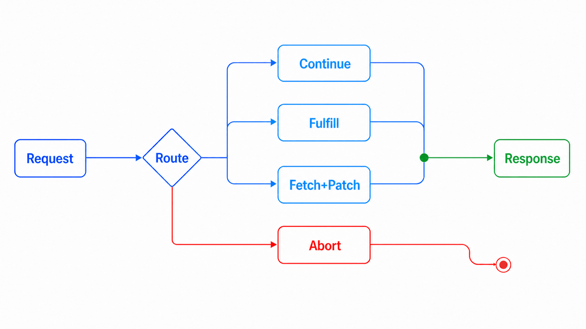
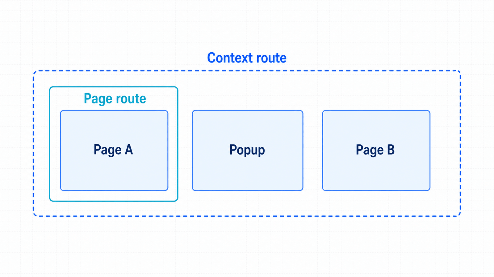

## 前置知识与学习目标

你应掌握事件时序与性能测量边界。完成本篇后，你能够：

- 区分只观察网络与实际改变网络；
- 在 page 和 context 作用域之间选择路由位置；
- 使用 `continue_()`、`fulfill()`、`abort()` 和 `route.fetch()`；
- 识别路由顺序、缓存、Service Worker 与敏感日志的边界。

## 场景：验证订单 API 失败时的降级界面

正常后端很难稳定返回 503。网络路由允许测试在浏览器侧拦截 `/api/orders` 并返回受控错误，从而验证页面是否显示重试提示，而不改动真实服务。

<!-- figure:s12-f01 -->



```text
Request
 -> 监听（不改变）
 -> 路由匹配
    -> continue_：放行/修改请求
    -> fulfill：构造响应
    -> fetch + fulfill：获取原响应后修改
    -> abort：中止
 -> Response / RequestFailed
```

## 先选择“观察”还是“干预”

仅记录请求/响应时使用事件：

```python
page.on("request", lambda request: print(">>", request.method, request.url))
page.on("response", lambda response: print("<<", response.status, response.url))
```

等待某动作的因果响应使用 `expect_response()`。真正需要模拟、修改或阻断时才注册 route。注册 route 会改变缓存等行为，不能把开启路由后的性能结果与普通访问直接比较。

## `fulfill`：完全模拟响应

```python
import json
from playwright.sync_api import expect

def mock_orders(route) -> None:
    route.fulfill(
        status=503,
        content_type="application/json",
        body=json.dumps({"error": "temporarily_unavailable"}),
    )

page.route("**/api/orders", mock_orders)
page.goto("https://app.example.test/orders")
expect(page.get_by_role("alert")).to_have_text("订单服务暂不可用")
```

Mock 数据必须符合真实 schema，包括状态码、内容类型和必要字段。过度简化的固定成功响应会让前端与真实 API 悄悄漂移。

## `continue_`、`abort` 与修改原响应

修改出站请求：

```python
def add_test_header(route) -> None:
    headers = {**route.request.headers, "x-test-run": "run-20260715-001"}
    route.continue_(headers=headers)

page.route("**/api/**", add_test_header)
```

中止图片可用于验证无图降级，但不应伪装成性能优化：

```python
page.route("**/*.{png,jpg,jpeg}", lambda route: route.abort())
```

读取真实响应再做小改动：

```python
def patch_orders(route) -> None:
    response = route.fetch()
    payload = response.json()
    payload["items"] = []
    route.fulfill(response=response, json=payload)

page.route("**/api/orders", patch_orders)
```

`route.fetch()` 会请求真实后端，因此仍受认证、网络与数据敏感性约束。修改后要保持 headers、状态和 schema 一致。

<!-- figure:s12-f02 -->



## page 路由、context 路由与清理

`page.route()` 只覆盖该页面；`context.route()` 适合上下文内页面和弹窗共享的规则。多页面流程优先 context 级路由，局部实验使用 page 级路由。测试结束应取消路由或销毁上下文，避免规则泄漏到其他测试。

精确模式优先于 `**/*`，并确保每个 handler 对请求恰好调用一次 `continue_`、`fulfill` 或 `abort`。多个重叠路由会增加顺序认知成本，应避免或集中管理。

## HAR、缓存与 Service Worker 边界

HAR 可录制并回放一组网络交互，适合离线复现和稳定第三方依赖，但会过期、可能包含令牌和个人数据，也可能把后端变化隐藏掉。HAR 文件必须脱敏、限制访问并有刷新策略。

Service Worker 可能在路由层之前处理请求，导致预期拦截看不到。网络 Mock 测试可在受控上下文中禁用 Service Worker，或明确将其纳入被测范围。浏览器缓存与路由同样会影响命中路径。

## 常见误区与不适用边界

1. **监听 response 就算拦截。** 事件观察不会改变流量。
2. **Mock 只返回 `{}`。** 前端可能在假数据上通过、真实 schema 上失败。
3. **全局 `**/\*` 路由最省事。\*\* 它会扩大影响面并增加误匹配。
4. **HAR 可永久使用。** 它是时间切片，需要脱敏与刷新。
5. **路由未命中一定是 glob 写错。** 还应检查 Service Worker、缓存和作用域。

## 自检题

1. 只想记录慢响应时，为什么不应注册 route？
2. 弹窗也需要同一 Mock 时，应优先 page 还是 context 路由？
3. `route.fetch()` 是否仍访问真实后端？

<details>
<summary>查看答案</summary>

1. 事件监听足够且不改变网络行为；route 会引入副作用。
2. context 路由，因为规则需覆盖上下文中新页面。
3. 是；它取得真实响应后再允许修改，因此仍需真实网络与授权。

</details>

## 本篇总结

网络能力应从最小干预开始：观察用事件，因果等待用 `expect_response`，只有故障实验与隔离依赖才使用路由。作用域、schema、安全和清理决定 Mock 是否可信。

## 下一篇衔接

最后一篇把环境、隔离、断言、trace、网络实验和性能预算装入 CI/CD，形成可重复执行、失败可诊断的交付门禁。

## 资料来源

- [Playwright Python：Network](https://playwright.dev/python/docs/network)
- [Playwright Python：Mock APIs](https://playwright.dev/python/docs/mock)
- [Playwright Python：API class BrowserContext](https://playwright.dev/python/docs/api/class-browsercontext)
