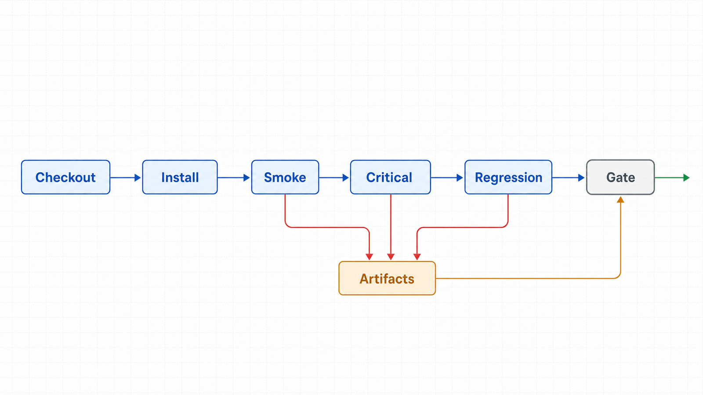
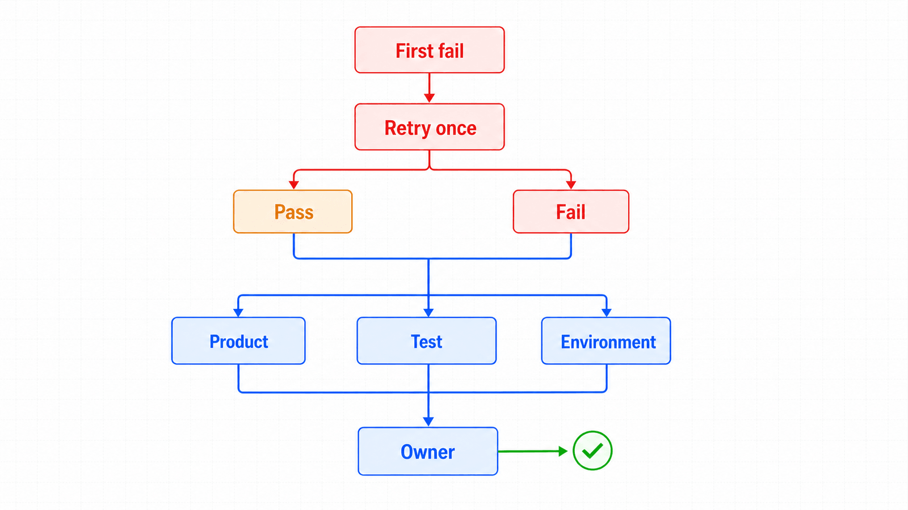

## 前置知识与学习目标

你已经掌握本系列的对象、环境、等待、断言、证据和网络边界。完成本篇后，你能够：

- 设计安装、冒烟、功能回归、跨浏览器与产物发布的流水线；
- 锁定 Python 包、浏览器和系统依赖的版本合同；
- 设置并行、分片、重试与隔离策略；
- 用 trace 和结构化摘要快速区分产品缺陷、测试缺陷与环境缺陷。

## CI 的目标是复现，不是“在另一台机器运行”

同一 commit 在相同输入和环境合同下应得到可解释结果。流水线必须明确代码版本、依赖锁、浏览器、操作系统镜像、目标环境、测试数据和 Secret 来源。

<!-- figure:s13-f01 -->



```text
Checkout
 -> Restore dependency cache
 -> Install locked Python dependencies
 -> Install matching browser + OS deps
 -> Runtime smoke test
 -> Fast critical path
 -> Parallel regression / browser matrix
 -> Aggregate reports
 -> Upload failure evidence
 -> Quality gate
```

## GitHub Actions 最小基线

以下示例故意使用动作的主版本占位符；项目落地时应替换为组织批准并定期更新的固定版本或 commit SHA。

```yaml
name: playwright

on:
  pull_request:

jobs:
  test:
    runs-on: ubuntu-latest
    timeout-minutes: 30
    steps:
      - uses: actions/checkout@<approved-version>
      - uses: actions/setup-python@<approved-version>
        with:
          python-version: "3.12"
          cache: pip

      - name: Install Python dependencies
        run: python -m pip install -r requirements.txt

      - name: Install Chromium and OS dependencies
        run: python -m playwright install --with-deps chromium

      - name: Run tests
        env:
          BASE_URL: ${{ secrets.TEST_BASE_URL }}
          TEST_USER: ${{ secrets.TEST_USER }}
          TEST_PASSWORD: ${{ secrets.TEST_PASSWORD }}
        run: pytest -q --browser chromium --tracing retain-on-failure

      - name: Upload failure artifacts
        if: failure()
        uses: actions/upload-artifact@<approved-version>
        with:
          name: playwright-artifacts
          path: test-results/
          retention-days: 7
```

如果当前插件版本的 CLI 参数不同，以锁定版本的 `pytest --help` 和官方插件参考为准，并把冒烟命令加入升级验收。

## 分层门禁与浏览器矩阵

PR 阶段运行关键路径和变更相关测试，目标是快速反馈；主分支或定时任务运行完整回归和三浏览器矩阵。不要让每个提交都承担全部长测，也不要让完整回归永远只在人工需要时运行。

| 层级           | 触发        | 内容                      | 失败处理       |
| -------------- | ----------- | ------------------------- | -------------- |
| Smoke          | 每次 PR     | 启动、登录、核心页面      | 阻断           |
| Critical       | 每次 PR     | 下单/审核等关键路径       | 阻断           |
| Regression     | 合并或定时  | 完整功能集                | 阻断发布或告警 |
| Browser matrix | 定时/发布前 | Chromium、Firefox、WebKit | 按支持策略判定 |

<!-- figure:s13-f02 -->



## 并行、分片与测试数据隔离

并行前先保证测试独立：每个测试新上下文，每个 worker 使用唯一账号或数据命名空间，业务资源带 `run_id`，清理由幂等 API 或受控 fixture 完成。共享同一订单或同一账号写操作会制造假失败。

分片目标是缩短墙钟时间，不是隐藏慢测。记录每个测试时长，按历史耗时平衡分片，并为执行机设置资源上限。浏览器进程、上下文数量和应用配额共同决定并发度。

## 重试、隔离区与 flaky 治理

CI 重试可区分偶发环境问题，但首次失败仍要记录。建议最多一次重试，并分别统计：首轮通过、重试通过、稳定失败。重试通过的测试不能长期被视为绿色。

隔离 flaky 测试应有 owner、原因、工单和到期日；关键支付或权限测试不应仅靠隔离维持流水线。先看断言日志和 trace，再判断是产品缺陷、定位/等待缺陷、测试数据冲突还是执行环境故障。

## 产物与安全

失败时保留 trace、最小截图、JUnit/HTML 摘要和必要的控制台/网络错误。成功时只保留聚合指标，降低成本。产物设置访问控制和保留期，并在采集前屏蔽密码、Token、Cookie、个人信息和上传文件内容。

认证状态文件由 CI 在运行时生成或从 Secret 安全注入，不进入构建产物。fork PR 不应获得生产或高权限测试 Secret。

## 发布判定与范围外故障

门禁至少检查：测试退出码、关键路径通过率、重试通过数、性能预算、产物上传是否成功。环境故障应与产品失败分开标记，但不能简单忽略；连续环境失败同样会使门禁失去可信度。

构建系统的既有错误要单独记录并保留原始证据。本系列验收不会擅自修改范围外的 Astro、CSS 或其他文章问题。

## 常见误区与不适用边界

1. **CI 每次安装最新版。** 今天通过不代表明天可复现，应锁定并按升级流程更新。
2. **重试通过就是通过。** 它仍是 flaky 信号。
3. **并行只需加 worker。** 测试数据、账号和外部系统必须隔离。
4. **失败上传所有日志最方便。** 可能泄露 Secret，且大量噪声降低诊断效率。
5. **本地通过即可跳过浏览器安装冒烟。** CI 的系统依赖和浏览器合同仍可能破裂。

## 自检题

1. 为什么依赖缓存命中后仍要执行浏览器启动冒烟？
2. 一个测试首次失败、重试通过，应如何计入质量信号？
3. 为什么 fork PR 不应直接获得测试环境高权限 Secret？

<details>
<summary>查看答案</summary>

1. 缓存存在不等于版本、权限、系统库与浏览器能正常启动。
2. 本次可继续按策略判定，但必须计为 flaky，并进入治理而非当作首轮通过。
3. fork 代码可读取环境和产物，高权限 Secret 会造成越权访问与泄露风险。

</details>

## 本篇总结

可信 CI 由版本合同、隔离数据、分层门禁、有限重试和最小失败证据组成。流水线不仅回答“通过了吗”，还要回答“在哪个环境、依据什么、失败属于哪一层”。

## 下一篇衔接：系列收束

至此，贯穿订单后台的路径形成闭环：对象模型 -> 可复现环境 -> 会话隔离 -> 稳定定位 -> 可操作交互 -> 精确等待 -> 回归断言 -> 文件证据 -> 数据管线 -> RPA 状态机 -> 性能基线 -> 网络实验 -> CI 门禁。实践中应从最小关键路径开始，逐步增加复杂度与治理能力。

## 资料来源

- [Playwright Python：Continuous Integration](https://playwright.dev/python/docs/ci)
- [Playwright Python：Pytest Plugin Reference](https://playwright.dev/python/docs/test-runners)
- [Playwright Python：Trace viewer](https://playwright.dev/python/docs/trace-viewer)
- [Playwright Python：Browsers](https://playwright.dev/python/docs/browsers)
