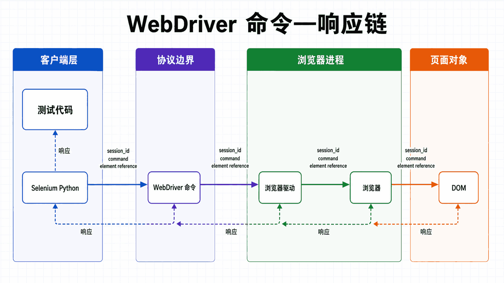
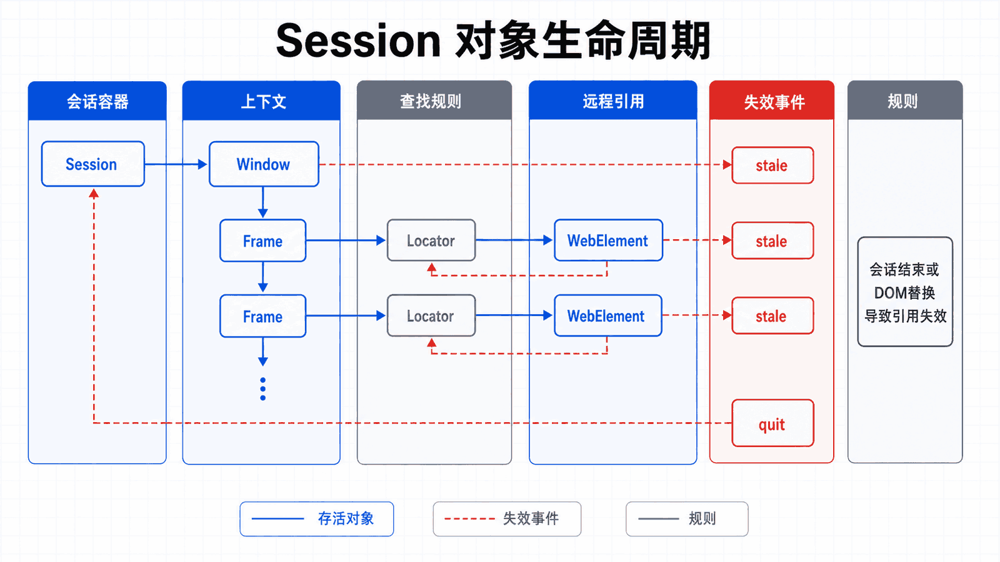

## 前置知识与学习目标

会运行 Python 脚本，并知道浏览器由 HTML、CSS 与 JavaScript 构成；不要求了解 WebDriver 协议。

读完后，你应该能够：

- 区分 Selenium、WebDriver、浏览器驱动、浏览器与 Grid 的职责；
- 解释一条 Python 命令如何跨进程到达浏览器并返回结果；
- 用最小脚本创建、使用并可靠关闭一个会话；
- 判断 Selenium 适合解决的问题，以及应优先选择 API 或其他工具的边界；

全系列沿用同一个案例：在测试环境自动化 Acme 采购门户。用户登录后搜索采购单 PO-2026-0715，在明细页导出 CSV；测试使用 data-testid 作为稳定定位契约，并把失败截图、日志和下载文件写入独立运行目录。

**本篇边界：**本篇只完整解释会话、命令、响应、定位器与 WebElement；等待、表单、上下文、pytest 和 Grid 在后文展开。

## 真实场景与核心问题

Selenium 是目前最流行的网页自动化测试框架之一，最初由 Jason Huggins 于 2004 年开发。经过近二十年的发展，Selenium 已经成为 Web 自动化领域的行业标准。本教程将带你全面了解 Selenium 的核心概念和架构。

<!-- figure-anchor:s01-a01 -->

<!-- figure-managed:s01-f01:start -->



<!-- figure-managed:s01-f01:end -->

### Selenium 工具集

Selenium 不仅仅是一个工具，而是一套完整的工具集：

```text
┌─────────────────────────────────────────────────────────────┐
│                      Selenium 工具集                          │
├─────────────────────────────────────────────────────────────┤
│                                                              │
│  ┌─────────────┐  ┌─────────────┐  ┌─────────────┐          │
│  │   IDE      │  │   Grid     │  │ WebDriver  │          │
│  │             │  │            │  │            │          │
│  │ 浏览器插件  │  │ 分布式执行 │  │ 核心API    │          │
│  │ 录制回放   │  │ 并行测试   │  │ 浏览器控制  │          │
│  └─────────────┘  └─────────────┘  └─────────────┘          │
│                                                              │
└─────────────────────────────────────────────────────────────┘
```

| 工具                   | 用途                   | 使用场景                           |
| ---------------------- | ---------------------- | ---------------------------------- |
| **Selenium IDE**       | 浏览器插件，录制和回放 | 快速创建简单测试，不需要编程经验   |
| **Selenium Grid**      | 分布式测试执行         | 并行运行测试，跨浏览器和平台测试   |
| **Selenium WebDriver** | 核心 API               | 编程控制浏览器，执行复杂自动化任务 |

### 为什么选择 Selenium？

| 特性             | 说明                                  |
| ---------------- | ------------------------------------- |
| **跨浏览器支持** | Chrome、Firefox、Edge、Safari、IE 等  |
| **跨平台支持**   | Windows、macOS、Linux                 |
| **多语言支持**   | Python、Java、C#、JavaScript、Ruby 等 |
| **开源免费**     | 完全开源，活跃社区                    |
| **生态丰富**     | 集成测试框架、日志工具、报告生成器等  |
| **行业标准**     | 广泛使用，大量学习资源                |

## Selenium 架构

### WebDriver 架构

Selenium WebDriver 是整个工具集的核心，它采用客户端-服务器架构：

```text
┌─────────────────────────────────────────────────────────────┐
│                   WebDriver 架构                             │
├─────────────────────────────────────────────────────────────┤
│                                                              │
│  ┌─────────────────┐          ┌─────────────────┐          │
│  │  Test Script   │          │    Browser     │          │
│  │  (Python/Java) │ ──JSON──▶ │    Driver      │          │
│  │                 │          │  (Chrome/Fire..)│          │
│  │  WebDriver API │          │                 │          │
│  └─────────────────┘          └────────┬────────┘          │
│                                        │                    │
│                                        ▼                    │
│                              ┌─────────────────┐          │
│                              │     Browser     │          │
│                              │                 │          │
│                              │  Chrome/Firefox │          │
│                              │                 │          │
│                              └─────────────────┘          │
│                                                              │
└─────────────────────────────────────────────────────────────┘
```

### 通信流程

1. **测试脚本**使用 WebDriver API 发送命令
2. WebDriver 将命令转换为 **JSON** 格式
3. JSON 通过 **HTTP POST** 请求发送到浏览器驱动
4. 浏览器驱动解析并执行命令
5. 执行结果通过 **HTTP 响应**返回给测试脚本

### 各组件职责

| 组件               | 职责                             |
| ------------------ | -------------------------------- |
| **Test Script**    | 编写测试逻辑，使用 WebDriver API |
| **WebDriver API**  | 提供编程接口，封装 HTTP 通信     |
| **Browser Driver** | 解析请求，与浏览器通信           |
| **Browser**        | 执行实际操作                     |

## WebDriver 核心概念

<!-- figure-anchor:s01-a02 -->

<!-- figure-managed:s01-f02:start -->



<!-- figure-managed:s01-f02:end -->### WebElement

WebElement 代表页面上的一个 HTML 元素，是与网页交互的基础：

```python
from selenium import webdriver
from selenium.webdriver.common.by import By

# 启动浏览器
driver = webdriver.Chrome()

# 访问网页
driver.get("https://example.com")

# 找到元素
element = driver.find_element(By.ID, "username")

# 操作元素
element.send_keys("testuser")
element.submit()

# 获取元素信息
text = element.text
attribute = element.get_attribute("value")

# 关闭浏览器
driver.quit()
```

### 定位策略

Selenium 支持多种定位策略：

```python
from selenium.webdriver.common.by import By

# ID 定位（最快）
driver.find_element(By.ID, "username")

# Name 定位
driver.find_element(By.NAME, "password")

# XPath 定位（最灵活）
driver.find_element(By.XPATH, "//input[@id='username']")

# CSS 选择器
driver.find_element(By.CSS_SELECTOR, "input.username")

# 链接文本
driver.find_element(By.LINK_TEXT, "登录")

# 标签名
driver.find_element(By.TAG_NAME, "button")
```

### 浏览器控制

```python
from selenium import webdriver

# 创建浏览器实例
driver = webdriver.Chrome()

# 访问网页
driver.get("https://example.com")

# 获取当前 URL
current_url = driver.current_url

# 获取页面标题
title = driver.title

# 浏览器导航
driver.back()       # 后退
driver.forward()     # 前进
driver.refresh()    # 刷新

# 关闭浏览器
driver.quit()  # 关闭所有窗口，退出驱动
# 或
driver.close()  # 关闭当前窗口
```

## 支持的浏览器

### 浏览器驱动对照表

| 浏览器  | 驱动           | 下载地址                       |
| ------- | -------------- | ------------------------------ |
| Chrome  | ChromeDriver   | chromedriver.chromium.org      |
| Firefox | GeckoDriver    | github.com/mozilla/geckodriver |
| Edge    | EdgeDriver     | developer.microsoft.com        |
| Safari  | SafariDriver   | 内置                           |
| IE      | IEDriverServer | selenium.dev                   |

### 选择浏览器的建议

1. **日常开发** - Chrome + ChromeDriver，最稳定
2. **跨浏览器测试** - 组合使用 Chrome、Firefox、Edge
3. **macOS 特殊测试** - Safari（需 Mac）
4. **遗留系统测试** - IE/Edge Legacy（仅 Windows）

## 第一个脚本

### 完整示例

```python
from selenium import webdriver
from selenium.webdriver.common.by import By
from selenium.webdriver.common.keys import Keys
from selenium.webdriver.support.ui import WebDriverWait
from selenium.webdriver.support import expected_conditions as EC

def first_selenium_script():
    # 1. 启动 Chrome 浏览器
    driver = webdriver.Chrome()

    try:
        # 2. 访问网页
        driver.get("https://www.google.com")

        # 3. 找到搜索框并输入
        search_box = driver.find_element(By.NAME, "q")
        search_box.send_keys("Selenium WebDriver")

        # 4. 按回车搜索
        search_box.send_keys(Keys.RETURN)

        # 5. 等待结果加载
        wait = WebDriverWait(driver, 10)
        wait.until(EC.title_contains("Selenium"))

        # 6. 打印结果
        print(f"页面标题: {driver.title}")
        print(f"当前 URL: {driver.current_url}")

    finally:
        # 7. 关闭浏览器
        driver.quit()

if __name__ == "__main__":
    first_selenium_script()
```

### 代码解析

| 步骤       | 说明                              |
| ---------- | --------------------------------- |
| 导入模块   | 导入 WebDriver、By、Keys、Wait 等 |
| 启动浏览器 | 创建 WebDriver 实例               |
| 访问网页   | 使用 `get()` 方法                 |
| 查找元素   | 使用定位器找到元素                |
| 操作元素   | 发送键盘输入、点击等              |
| 等待加载   | 使用显式等待确保元素可用          |
| 关闭浏览器 | 使用 `quit()` 清理资源            |

## 常见使用场景

### 1. 网页自动化测试

```python
def test_login():
    driver = webdriver.Chrome()
    driver.get("https://example.com/login")

    # 填写表单
    driver.find_element(By.ID, "username").send_keys("testuser")
    driver.find_element(By.ID, "password").send_keys("password123")

    # 提交
    driver.find_element(By.ID, "login-btn").click()

    # 验证
    assert "/dashboard" in driver.current_url

    driver.quit()
```

### 2. 网页爬虫

```python
def scrape_dynamic_content():
    driver = webdriver.Chrome()
    driver.get("https://example.com/products")

    # 等待内容加载
    wait = WebDriverWait(driver, 10)
    wait.until(EC.presence_of_element_located((By.CLASS_NAME, "product-item")))

    # 提取数据
    products = driver.find_elements(By.CLASS_NAME, "product-item")
    for product in products:
        name = product.find_element(By.CLASS_NAME, "product-name").text
        price = product.find_element(By.CLASS_NAME, "product-price").text
        print(f"{name}: {price}")

    driver.quit()
```

### 3. 表单自动化

```python
def fill_form():
    driver = webdriver.Chrome()
    driver.get("https://example.com/register")

    # 填写各种表单字段
    driver.find_element(By.NAME, "username").send_keys("testuser")
    driver.find_element(By.NAME, "email").send_keys("test@example.com")

    # 下拉选择
    from selenium.webdriver.support.ui import Select
    country = Select(driver.find_element(By.NAME, "country"))
    country.select_by_value("CN")

    # 复选框
    driver.find_element(By.ID, "agree-terms").click()

    # 提交
    driver.find_element(By.CSS_SELECTOR, "button[type='submit']").click()

    driver.quit()
```

## 最佳实践

### 1. 使用上下文管理器

```python
from selenium import webdriver

# 自动清理资源
with webdriver.Chrome() as driver:
    driver.get("https://example.com")
    # 执行测试...
# 自动调用 driver.quit()
```

### 2. 合理使用等待

```python
# ❌ 不好：硬编码等待
import time
time.sleep(5)  # 浪费等待时间

# ✅ 好：显式等待
from selenium.webdriver.support.ui import WebDriverWait
wait = WebDriverWait(driver, 10)
element = wait.until(EC.presence_of_element_located((By.ID, "content")))
```

### 3. 页面对象模式

```python
class LoginPage:
    def __init__(self, driver):
        self.driver = driver

    @property
    def username(self):
        return self.driver.find_element(By.ID, "username")

    @property
    def password(self):
        return self.driver.find_element(By.ID, "password")

    def login(self, username, password):
        self.username.send_keys(username)
        self.password.send_keys(password)
        self.driver.find_element(By.ID, "login-btn").click()
```

### 4. 日志记录

```python
import logging

logging.basicConfig(level=logging.INFO)
logger = logging.getLogger(__name__)

def test_example():
    logger.info("启动浏览器")
    driver = webdriver.Chrome()
    logger.info("访问网页")
    driver.get("https://example.com")
    logger.info("测试完成")
    driver.quit()
```

## Selenium vs Playwright

| 特性         | Selenium     | Playwright |
| ------------ | ------------ | ---------- |
| **诞生时间** | 2004 年      | 2020 年    |
| **学习曲线** | 较陡         | 较平缓     |
| **API 设计** | 命令式       | 声明式     |
| **等待机制** | 需要手动处理 | 自动等待   |
| **速度**     | 较慢         | 较快       |
| **跨浏览器** | 优秀         | 优秀       |
| **社区支持** | 非常成熟     | 快速增长   |
| **移动端**   | Appium       | 内置支持   |

**选择建议：**

- **Selenium** - 遗留系统、庞大生态系统、多语言需求
- **Playwright** - 新项目、需要稳定性、快速开发

## 常见误区与适用边界

- WebDriver 不是浏览器插件，而是客户端库与浏览器自动化端点之间的一套标准接口。
- driver.get 返回不等于业务页面已经可交互；业务状态同步要由等待条件表达。
- Selenium 擅长浏览器端到端交互，不应替代接口测试、性能测试或验证码服务。

## 本篇自检

<details>
<summary>1. 为什么 Python 代码不能直接复用一个 WebElement 到另一个浏览器会话？</summary>

WebElement 本质上是特定会话和当前浏览上下文中的远程元素引用；会话、页面或 DOM 变化后，该引用可能无效。

</details>

<details>
<summary>2. driver.close 与 driver.quit 的失败影响有什么不同？</summary>

close 只关闭当前窗口；quit 结束整个 WebDriver 会话并释放关联进程。资源清理通常以 quit 为准。

</details>

<details>
<summary>3. 何时不应首先选择 Selenium？</summary>

有稳定 API 时优先调用 API；做负载或协议测试时使用专用工具；遇到验证码、双因素认证或未获授权站点时不应尝试绕过。

</details>

## 本篇总结

WebDriver 会话把测试代码、驱动和浏览器连接成命令—响应链。后续所有定位、等待与断言都发生在这条链和当前浏览上下文之内。

## 下一篇衔接

下一篇把这条架构落到可复现环境：安装 Python 绑定，理解 Selenium Manager，并用版本与诊断输出定位启动失败。

## 资料来源与版本基线

本文以 Selenium 4 与 Python 3.10+ 为基线；具体版本与浏览器支持应以发布时的官方说明为准。

- [Selenium Overview](https://www.selenium.dev/documentation/overview/)
- [WebDriver getting started](https://www.selenium.dev/documentation/webdriver/getting_started/)
- [W3C WebDriver](https://www.w3.org/TR/webdriver2/)
