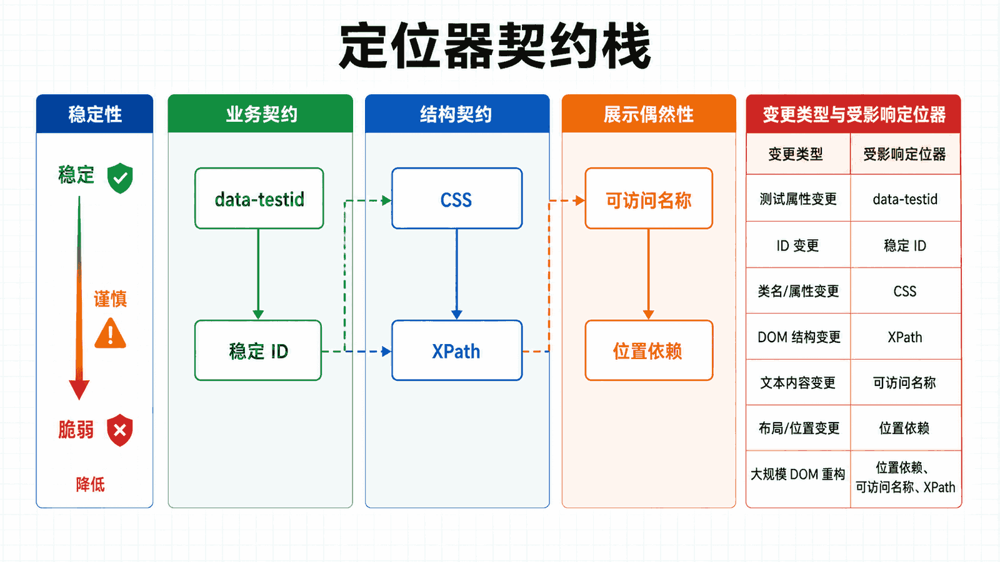
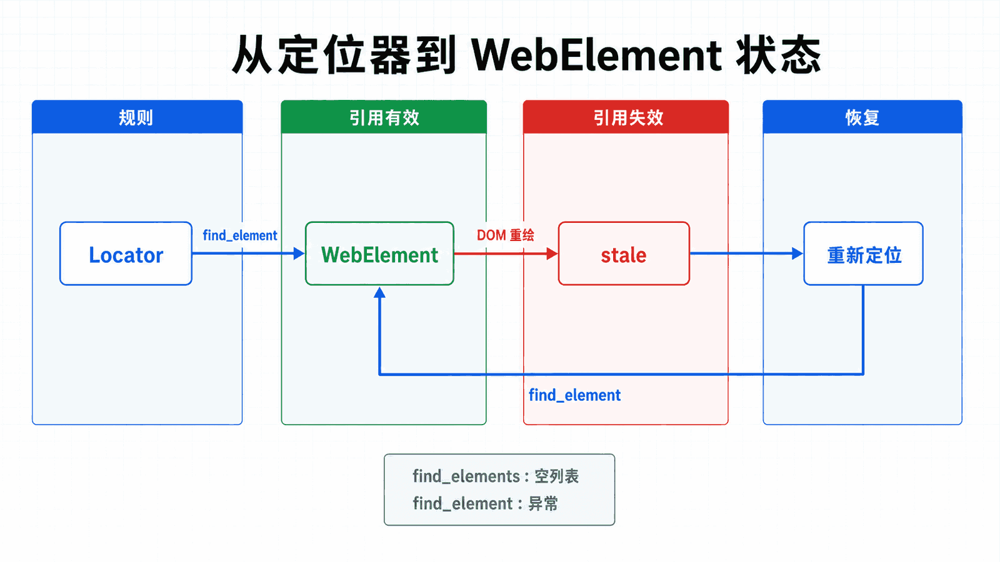

## 前置知识与学习目标

能够启动浏览器并打开开发者工具，了解 HTML 标签、属性和基本 CSS 选择器。

读完后，你应该能够：

- 把定位器视为页面与自动化代码之间的契约；
- 区分 find_element、find_elements 与 WebElement 的返回和失败行为；
- 按稳定性选择 data-testid、ID、CSS 或 XPath；
- 用重定位和显式等待处理 DOM 重绘后的过期引用；

全系列沿用同一个案例：在测试环境自动化 Acme 采购门户。用户登录后搜索采购单 PO-2026-0715，在明细页导出 CSV；测试使用 data-testid 作为稳定定位契约，并把失败截图、日志和下载文件写入独立运行目录。

**本篇边界：**本篇完整解释定位策略与元素引用，不展开等待实现和 JavaScript 兜底；二者分别在第 4、12 篇处理。

## 真实场景与核心问题

元素定位是 Selenium 自动化测试的核心。找到正确的元素后，我们才能对其进行各种操作。本教程将详细介绍各种定位策略和元素操作方法。

<!-- figure-anchor:s03-a01 -->

<!-- figure-managed:s03-f01:start -->



<!-- figure-managed:s03-f01:end -->

### 定位器优先级

| 优先级 | 定位方式     | 速度 | 稳定性 | 推荐场景         |
| ------ | ------------ | ---- | ------ | ---------------- |
| 1      | ID           | 最快 | 高     | 有唯一 ID 的元素 |
| 2      | Name         | 快   | 中     | 表单字段         |
| 3      | CSS Selector | 快   | 高     | 复杂选择         |
| 4      | XPath        | 较慢 | 中     | 复杂层级         |
| 5      | Link Text    | 中   | 高     | 链接             |

## 定位策略

### By ID

ID 是最快且最可靠的定位方式：

```python
from selenium import webdriver
from selenium.webdriver.common.by import By

driver = webdriver.Chrome()
driver.get("https://example.com")

# 定位具有唯一 ID 的元素
username = driver.find_element(By.ID, "username")
password = driver.find_element(By.ID, "password")
```

### By Name

适合定位表单字段：

```python
# 定位 name 属性
email = driver.find_element(By.NAME, "email")
search = driver.find_element(By.NAME, "q")
```

### By XPath

XPath 是最灵活的定位方式，支持复杂查询：

```python
# 绝对路径（不推荐）
driver.find_element(By.XPATH, "/html/body/div[2]/form/input[1]")

# 相对路径
driver.find_element(By.XPATH, "//input[@id='username']")

# 文本匹配
driver.find_element(By.XPATH, "//button[text()='登录']")
driver.find_element(By.XPATH, "//a[contains(text(), '更多')]")

# 多条件
driver.find_element(By.XPATH, "//input[@type='submit' and @class='btn-primary']")

# 位置选择
driver.find_element(By.XPATH, "(//div[@class='item'])[1]")  # 第一个
driver.find_element(By.XPATH, "(//div[@class='item'])[last()]")  # 最后一个
```

### XPath 轴

```python
# 父元素
driver.find_element(By.XPATH, "//input[@id='username']/parent::div")

# 子元素
driver.find_element(By.XPATH, "//form[@id='login']/input")

# 祖先元素
driver.find_element(By.XPATH, "//input[@id='username']/ancestor::div[@class='form-group']")

# 兄弟元素
driver.find_element(By.XPATH, "//label[@for='username']/following-sibling::input")
```

### By CSS Selector

CSS 选择器比 XPath 更快：

```python
# ID 选择器
driver.find_element(By.CSS_SELECTOR, "#username")

# 类选择器
driver.find_element(By.CSS_SELECTOR, ".btn-primary")

# 属性选择器
driver.find_element(By.CSS_SELECTOR, "input[type='text']")
driver.find_element(By.CSS_SELECTOR, "input[name='email']")
driver.find_element(By.CSS_SELECTOR, "a[href='/about']")

# 组合选择器
driver.find_element(By.CSS_SELECTOR, "form.login-form #username")
driver.find_element(By.CSS_SELECTOR, "div.container > button.submit")

# 伪类选择器
driver.find_element(By.CSS_SELECTOR, "input:focus")
driver.find_element(By.CSS_SELECTOR, "li:first-child")
driver.find_element(By.CSS_SELECTOR, "li:last-child")
driver.find_element(By.CSS_SELECTOR, "tr:nth-child(2)")
```

### By Link Text

适合定位链接：

```python
# 精确匹配
driver.find_element(By.LINK_TEXT, "登录页面")

# 部分匹配
driver.find_element(By.PARTIAL_LINK_TEXT, "登录")
```

### By Tag Name

```python
# 标签名定位
driver.find_element(By.TAG_NAME, "button")
driver.find_element(By.TAG_NAME, "input")

# 获取所有匹配的元素
all_inputs = driver.find_elements(By.TAG_NAME, "input")
```

### By Class Name

```python
# 定位具有特定类的元素
driver.find_element(By.CLASS_NAME, "btn-primary")

# 注意：如果元素有多个类，只能使用其中一个
driver.find_element(By.CLASS_NAME, "btn")
```

## 定位多个元素

### find_elements vs find_element

```python
# 找一个（找不到会抛异常）
element = driver.find_element(By.CLASS_NAME, "product")

# 找所有（返回列表）
elements = driver.find_elements(By.CLASS_NAME, "product")

# 遍历
for element in elements:
    name = element.text
    print(name)
```

### 实际应用

```python
def scrape_product_list():
    driver.get("https://example.com/products")

    # 找到所有产品
    products = driver.find_elements(By.CLASS_NAME, "product-item")

    results = []
    for product in products:
        result = {
            "name": product.find_element(By.CLASS_NAME, "product-name").text,
            "price": product.find_element(By.CLASS_NAME, "product-price").text,
            "link": product.find_element(By.TAG_NAME, "a").get_attribute("href")
        }
        results.append(result)

    return results
```

## 元素操作

<!-- figure-anchor:s03-a02 -->

<!-- figure-managed:s03-f02:start -->



<!-- figure-managed:s03-f02:end -->### 点击操作

```python
from selenium import webdriver
from selenium.webdriver.common.by import By
from selenium.webdriver.common.keys import Keys

driver = webdriver.Chrome()
driver.get("https://example.com")

# 普通点击
driver.find_element(By.ID, "submit-btn").click()

# 点击并按住
from selenium.webdriver import ActionChains

element = driver.find_element(By.ID, "draggable")
ActionChains(driver).click_and_hold(element).perform()

# 右键点击
ActionChains(driver).context_click(element).perform()

# 双击
ActionChains(driver).double_click(element).perform()
```

### 输入操作

```python
# 输入文本
driver.find_element(By.NAME, "username").send_keys("testuser")

# 清空并输入
driver.find_element(By.NAME, "username").clear()
driver.find_element(By.NAME, "username").send_keys("newuser")

# 追加输入
element = driver.find_element(By.NAME, "username")
element.send_keys("prefix_")
element.send_keys("_suffix")

# 特殊键
from selenium.webdriver.common.keys import Keys

element.send_keys(Keys.ENTER)          # 回车
element.send_keys(Keys.TAB)            # Tab
element.send_keys(Keys.ESCAPE)         # Esc
element.send_keys(Keys.CONTROL, "a")   # Ctrl+A
element.send_keys(Keys.CONTROL, "c")  # Ctrl+C
element.send_keys(Keys.CONTROL, "v")  # Ctrl+V
element.send_keys(Keys.BACKSPACE)     # 退格
element.send_keys(Keys.DELETE)        # 删除
```

### 获取元素信息

```python
# 获取文本
text = driver.find_element(By.ID, "title").text

# 获取属性值
href = driver.find_element(By.TAG_NAME, "a").get_attribute("href")
value = driver.find_element(By.NAME, "email").get_attribute("value")

# 获取标签名
tag_name = element.tag_name

# 获取 CSS 值
color = element.value_of_css_property("color")
font_size = element.value_of_css_property("font-size")

# 判断元素状态
is_displayed = element.is_displayed()      # 是否可见
is_enabled = element.is_enabled()          # 是否启用
is_selected = element.is_selected()        # 是否选中（复选框/单选框）
```

## ActionChains 高级操作

### 鼠标操作

```python
from selenium.webdriver import ActionChains

# 创建 ActionChains
actions = ActionChains(driver)

# 悬停
element = driver.find_element(By.ID, "menu")
ActionChains(driver).move_to_element(element).perform()

# 悬停到坐标
ActionChains(driver).move_by_offset(100, 200).perform()

# 拖拽
source = driver.find_element(By.ID, "source")
target = driver.find_element(By.ID, "target")
ActionChains(driver).drag_and_drop(source, target).perform()

# 拖拽到坐标
ActionChains(driver).drag_and_drop_by_offset(source, 100, 200).perform()
```

### 组合操作

```python
# 多个操作链
ActionChains(driver) \
    .move_to_element(menu) \
    .click(option) \
    .send_keys("search text") \
    .perform()
```

## 元素交互实战

### 登录表单

```python
def login(username, password):
    driver.get("https://example.com/login")

    # 输入用户名
    driver.find_element(By.ID, "username").send_keys(username)

    # 输入密码
    driver.find_element(By.ID, "password").send_keys(password)

    # 点击登录按钮
    driver.find_element(By.ID, "login-btn").click()

    # 等待登录成功
    wait = WebDriverWait(driver, 10)
    wait.until(EC.url_contains("/dashboard"))

    return driver.current_url
```

### 搜索功能

```python
def search(query):
    driver.get("https://example.com")

    # 找到搜索框
    search_box = driver.find_element(By.NAME, "q")

    # 输入搜索词
    search_box.send_keys(query)

    # 按回车搜索
    search_box.send_keys(Keys.RETURN)

    # 等待结果加载
    wait = WebDriverWait(driver, 10)
    wait.until(EC.presence_of_element_located((By.CLASS_NAME, "search-results")))

    # 获取结果数量
    results = driver.find_elements(By.CLASS_NAME, "result-item")
    return len(results)
```

### 填写表单

```python
def fill_registration_form(data):
    driver.get("https://example.com/register")

    # 填写文本字段
    driver.find_element(By.NAME, "username").send_keys(data["username"])
    driver.find_element(By.NAME, "email").send_keys(data["email"])
    driver.find_element(By.NAME, "password").send_keys(data["password"])
    driver.find_element(By.NAME, "confirm_password").send_keys(data["password"])

    # 填写文本域
    driver.find_element(By.NAME, "bio").send_keys(data.get("bio", ""))

    # 点击复选框
    if data.get("agree_terms"):
        driver.find_element(By.ID, "agree-terms").click()

    # 提交
    driver.find_element(By.CSS_SELECTOR, "button[type='submit']").click()
```

## 定位器最佳实践

### 推荐做法

```python
# ✅ 使用唯一 ID
driver.find_element(By.ID, "username")

# ✅ 使用语义化的 CSS 选择器
driver.find_element(By.CSS_SELECTOR, "form.login-form input[name='username']")

# ✅ XPath 包含文本
driver.find_element(By.XPATH, "//button[contains(text(), 'Submit')]")

# ✅ XPath 使用多个属性
driver.find_element(By.XPATH, "//button[@type='submit' and @class='primary']")
```

### 避免做法

```python
# ❌ 避免使用绝对 XPath
driver.find_element(By.XPATH, "/html/body/div[2]/form/div[3]/input")

# ❌ 避免依赖位置
driver.find_element(By.XPATH, "//div[2]/div[3]/span")

# ❌ 避免脆弱的选择器
driver.find_element(By.CSS_SELECTOR, "body > div.container > div:nth-child(2) > form > div:nth-child(5) > input")
```

## 调试定位器

### 开发者工具

1. 在浏览器中按 F12 打开开发者工具
2. 使用元素选择器（Ctrl+Shift+C）点击元素
3. 右键元素 → Copy → Copy selector/CSS path/XPath

### 验证 XPath

```python
# 在控制台验证 XPath
# $x("//input[@id='username']")
# $$("input#username")
```

### 打印元素信息

```python
def debug_element(locator):
    try:
        element = driver.find_element(By.ID, locator)
        print(f"Tag: {element.tag_name}")
        print(f"Text: {element.text}")
        print(f"Visible: {element.is_displayed()}")
        print(f"Enabled: {element.is_enabled()}")
        print(f"Location: {element.location}")
        print(f"Size: {element.size}")
    except NoSuchElementException:
        print(f"元素 {locator} 未找到")
```

## 常见问题

### 问题 1：找不到元素

```python
from selenium.common.exceptions import NoSuchElementException

try:
    element = driver.find_element(By.ID, "nonexistent")
except NoSuchElementException:
    print("元素未找到")
```

### 问题 2：多个元素匹配

```python
# 如果有多个匹配，取第一个
element = driver.find_elements(By.CLASS_NAME, "item")[0]

# 或者使用更精确的选择器
element = driver.find_element(By.CSS_SELECTOR, "ul.menu li:first-child")
```

### 问题 3：元素不可交互

```python
# 滚动到视图
driver.execute_script("arguments[0].scrollIntoView(true);", element)
element.click()
```

## 常见误区与适用边界

- 定位器越短不一定越稳定；稳定性取决于它是否绑定业务语义和受控属性。
- find_elements 找不到目标时返回空列表，而 find_element 抛出 NoSuchElementException。
- 缓存 WebElement 不能减少所有成本；DOM 更新后重定位往往更可靠。

## 本篇自检

<details>
<summary>1. 为什么 nth-child 通常不是好的长期定位器？</summary>

它依赖展示顺序；插入一个兄弟节点就会改变目标。优先使用稳定的受控属性或可访问名称。

</details>

<details>
<summary>2. 一个列表允许为空时应使用哪个查找方法？</summary>

使用 find_elements 并显式判断长度，因为空结果是合法状态而不是定位异常。

</details>

<details>
<summary>3. 出现 StaleElementReferenceException 应怎样修复？</summary>

确认页面状态完成后使用原定位器重新查找，不要对同一旧引用盲目重试。

</details>

## 本篇总结

定位器描述查找规则，WebElement 是某一时刻的远程引用。稳定自动化依赖可维护的定位契约和在 DOM 变化后重新取得引用。

## 下一篇衔接

下一篇解决“找到了但时机不对”的问题，把页面状态转换为可观察的显式等待条件。

## 资料来源与版本基线

本文以 Selenium 4 与 Python 3.10+ 为基线；具体版本与浏览器支持应以发布时的官方说明为准。

- [Locator strategies](https://www.selenium.dev/documentation/webdriver/elements/locators/)
- [Finding web elements](https://www.selenium.dev/documentation/webdriver/elements/finders/)
- [Tips on working with locators](https://www.selenium.dev/documentation/test_practices/encouraged/locators/)
