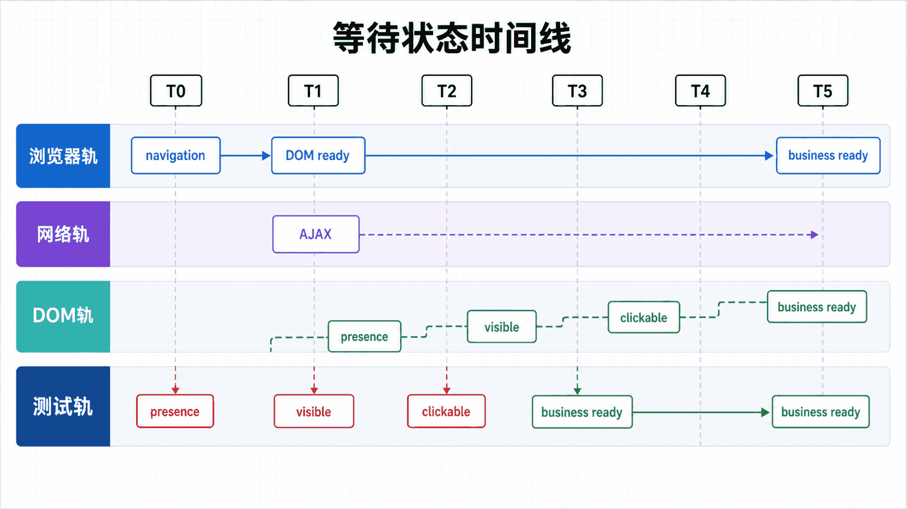
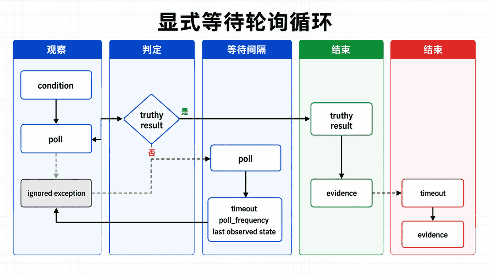

## 前置知识与学习目标

理解定位器和 WebElement，并见过异步请求、DOM 更新或动画导致的时序差异。

读完后，你应该能够：

- 区分导航完成、元素存在、可见、可点击和业务状态完成；
- 解释隐式等待与显式等待的作用范围和轮询过程；
- 为采购单搜索设计可诊断的状态等待；
- 处理超时与 stale element，而不靠固定 sleep 掩盖问题；

全系列沿用同一个案例：在测试环境自动化 Acme 采购门户。用户登录后搜索采购单 PO-2026-0715，在明细页导出 CSV；测试使用 data-testid 作为稳定定位契约，并把失败截图、日志和下载文件写入独立运行目录。

**本篇边界：**等待的对象是可观察状态，不是“再等几秒”。本篇不重复定位器语法，只使用第 3 篇定义的定位契约。

## 真实场景与核心问题

网页是动态的，元素的加载、网络请求等都是异步的。Selenium 提供了多种等待机制来处理这些异步操作。本教程将详细介绍各种等待策略及其使用场景。

<!-- figure-anchor:s04-a01 -->

<!-- figure-managed:s04-f01:start -->



<!-- figure-managed:s04-f01:end -->

### 为什么需要等待

```text
┌─────────────────────────────────────────────────────────────┐
│                        时间线                                │
├─────────────────────────────────────────────────────────────┤
│                                                              │
│  T0: driver.get() 执行                                       │
│  T1: HTML 解析完成                                           │
│  T2: JavaScript 执行完成                                     │
│  T3: AJAX 请求完成                                          │
│  T4: 动画效果完成                                            │
│  T5: 元素实际可见                                            │
│                                                              │
│  ❌ 过早操作 → ElementNotVisibleException                   │
│  ✅ 恰当等待 → 操作成功                                       │
│  ❌ 过晚等待 → 测试时间过长                                  │
│                                                              │
└─────────────────────────────────────────────────────────────┘
```

## 等待类型对比

| 类型         | 作用范围 | 优点     | 缺点             | 推荐场景 |
| ------------ | -------- | -------- | ---------------- | -------- |
| **硬等待**   | 全局     | 简单     | 浪费时间，不稳定 | 不推荐   |
| **隐式等待** | 全局     | 配置一次 | 不够灵活         | 简单场景 |
| **显式等待** | 局部     | 灵活精确 | 代码复杂         | 推荐使用 |
| **流畅等待** | 局部     | 最灵活   | 最复杂           | 特殊场景 |

## 硬等待（不推荐）

### time.sleep()

```python
import time
from selenium import webdriver

driver = webdriver.Chrome()
driver.get("https://example.com")

# ❌ 不推荐：固定等待 5 秒
time.sleep(5)

# ❌ 不推荐：无论元素是否加载都等待
element = driver.find_element(By.ID, "content")
time.sleep(3)  # 即使 1 秒就能加载也要等 3 秒
```

### 问题

- 无论元素是否加载完成都等待固定时间
- 浪费时间，降低测试效率
- 网络慢时仍可能失败，网络快时浪费时间

## 隐式等待

### 基本用法

```python
from selenium import webdriver

driver = webdriver.Chrome()

# 设置隐式等待（全局）
driver.implicitly_wait(10)  # 最多等待 10 秒

driver.get("https://example.com")

# 所有 find_element 调用都会等待
element = driver.find_element(By.ID, "dynamic-content")

driver.quit()
```

### 工作原理

```text
┌─────────────────────────────────────────────────────────────┐
│                   隐式等待工作原理                            │
├─────────────────────────────────────────────────────────────┤
│                                                              │
│  尝试查找元素                                                 │
│       │                                                      │
│       ├─ 找到 → 返回元素                                      │
│       │                                                      │
│       ├─ 未找到 → 等待 500ms                                  │
│       │         │                                           │
│       │         ├─ 找到 → 返回元素                           │
│       │         │                                           │
│       │         ├─ 未找到 → 重复直到超时                       │
│       │         │                                           │
│       │         └─ 超时 → 抛出 NoSuchElementException         │
│                                                              │
└─────────────────────────────────────────────────────────────┘
```

### 特点

- **全局配置**：只需设置一次，作用于整个 driver 生命周期
- **自动轮询**：不断尝试查找元素
- **简单易用**：适合简单场景

### 注意事项

```python
# 设置隐式等待
driver.implicitly_wait(10)

# ⚠️ 隐式等待会影响所有 find_element 调用
element = driver.find_element(By.ID, "content")  # 也会等待

# ⚠️ 与显式等待混合使用时可能产生意外行为
```

## 显式等待（推荐）

<!-- figure-anchor:s04-a02 -->

<!-- figure-managed:s04-f02:start -->



<!-- figure-managed:s04-f02:end -->### 基本用法

```python
from selenium import webdriver
from selenium.webdriver.support.ui import WebDriverWait
from selenium.webdriver.support import expected_conditions as EC
from selenium.webdriver.common.by import By

driver = webdriver.Chrome()
driver.get("https://example.com")

# 创建显式等待实例
wait = WebDriverWait(driver, 10)  # 最多等待 10 秒

# 等待条件
element = wait.until(
    EC.presence_of_element_located((By.ID, "content"))
)

print(element.text)

driver.quit()
```

### 常用预期条件

```python
from selenium.webdriver.support import expected_conditions as EC

# 元素存在
wait.until(EC.presence_of_element_located((By.ID, "element-id")))

# 元素可见
wait.until(EC.visibility_of_element_located((By.ID, "element-id")))

# 元素可点击
wait.until(EC.element_to_be_clickable((By.ID, "button-id")))

# 元素被选中
wait.until(EC.element_to_be_selected((By.ID, "checkbox-id")))

# 文本出现在元素中
wait.until(EC.text_to_be_present_in_element((By.ID, "element-id"), "Expected Text"))

# 元素消失
wait.until(EC.invisibility_of_element_located((By.ID, "loading-id")))

# 页面标题包含
wait.until(EC.title_contains("Expected Title"))

# URL 包含
wait.until(EC.url_contains("expected-url"))

# 框架可用并切换
wait.until(EC.frame_to_be_available_and_switch_to_it((By.ID, "frame-id")))
```

### WebDriverWait 方法

```python
# 基本等待
wait = WebDriverWait(driver, 10)

# 带轮询间隔的等待
wait = WebDriverWait(driver, 10, poll_frequency=0.5)

# 带忽略异常的等待
from selenium.common.exceptions import NoSuchElementException
wait = WebDriverWait(driver, 10, ignored_exceptions=[NoSuchElementException])

# 自定义消息
wait = WebDriverWait(driver, 10, message="元素未在超时前出现")

# 等待直到不抛出异常
wait.until_not(EC.title_is("Loading..."))
```

### 实际应用

```python
from selenium import webdriver
from selenium.webdriver.support.ui import WebDriverWait
from selenium.webdriver.support import expected_conditions as EC
from selenium.webdriver.common.by import By

def wait_examples():
    driver = webdriver.Chrome()
    driver.get("https://example.com")

    # 等待按钮可点击并点击
    button = WebDriverWait(driver, 10).until(
        EC.element_to_be_clickable((By.ID, "submit-btn"))
    )
    button.click()

    # 等待新窗口打开
    main_window = driver.window_handles[0]
    driver.find_element(By.ID, "open-window-btn").click()
    WebDriverWait(driver, 10).until(EC.new_window_is_opened(main_window))

    # 等待下拉选项可见
    from selenium.webdriver.support.ui import Select
    select = Select(driver.find_element(By.ID, "country-select"))
    WebDriverWait(driver, 10).until(
        EC.text_to_be_present_in_element(
            (By.CSS_SELECTOR, "#country-select option:nth-child(2)"),
            "China"
        )
    )

    driver.quit()
```

## 流畅等待

### 基本用法

```python
from selenium import webdriver
from selenium.webdriver.support.ui import WebDriverWait
from selenium.webdriver.support import expected_conditions as EC
from selenium.webdriver.common.by import By
from selenium.common.exceptions import StaleElementReferenceException

driver = webdriver.Chrome()
driver.get("https://example.com")

# 创建流畅等待
wait = WebDriverWait(
    driver,
    10,
    poll_frequency=0.5,
    ignored_exceptions=[StaleElementReferenceException]
)

# 自定义条件
element = wait.until(
    lambda x: x.find_element(By.ID, "dynamic-content").is_displayed()
)
```

### 实际应用

```python
from selenium.webdriver.support.ui import WebDriverWait
from selenium.common.exceptions import StaleElementReferenceException

def wait_for_text_change(driver, element, original_text):
    """等待元素文本变化"""
    def text_changed(driver):
        try:
            current_text = element.text
            return current_text != original_text
        except StaleElementReferenceException:
            return False

    WebDriverWait(driver, 10, ignored_exceptions=[StaleElementReferenceException]).until(
        text_changed
    )

def wait_for_ajax(driver):
    """等待 AJAX 请求完成"""
    def ajax_complete(driver):
        return driver.execute_script("return jQuery.active == 0")

    WebDriverWait(driver, 30).until(ajax_complete)
```

## 页面加载策略

### 页面加载策略类型

```python
from selenium.webdriver.chrome.options import Options

options = Options()

# normal：等待所有资源下载完成（默认）
options.page_load_strategy = 'normal'

# eager：DOM 访问就绪就停止，不等待图片等资源
options.page_load_strategy = 'eager'

# none：不等待，完全由脚本控制
options.page_load_strategy = 'none'
```

### 适用场景

| 策略       | 适用场景                       |
| ---------- | ------------------------------ |
| **normal** | 需要完整页面渲染               |
| **eager**  | 不需要图片等资源               |
| **none**   | 完全由 JavaScript 控制页面加载 |

## 常见等待场景

### 等待动态内容加载

```python
def wait_for_dynamic_content():
    driver.get("https://example.com")

    # 等待加载动画消失
    wait = WebDriverWait(driver, 10)
    wait.until(
        EC.invisibility_of_element_located((By.CLASS_NAME, "loading-spinner"))
    )

    # 等待内容出现
    content = wait.until(
        EC.visibility_of_element_located((By.ID, "dynamic-content"))
    )

    return content
```

### 等待下拉菜单加载

```python
from selenium.webdriver.support.ui import Select

def wait_for_dropdown():
    driver.get("https://example.com/form")

    # 等待下拉选项出现
    wait = WebDriverWait(driver, 10)
    wait.until(
        lambda x: len(x.find_elements(By.CSS_SELECTOR, "#country option")) > 1
    )

    # 使用下拉菜单
    select = Select(driver.find_element(By.ID, "country"))
    select.select_by_visible_text("China")
```

### 等待表格数据加载

```python
def wait_for_table():
    driver.get("https://example.com/table")

    # 等待表格行出现
    wait = WebDriverWait(driver, 10)
    rows = wait.until(
        lambda x: x.find_elements(By.CSS_SELECTOR, "#data-table tbody tr")
    )

    # 等待特定行
    wait.until(
        lambda x: any("Target" in row.text for row in x.find_elements(By.CSS_SELECTOR, "#data-table tbody tr"))
    )

    return rows
```

### 等待弹窗

```python
def wait_for_alert():
    driver.get("https://example.com")
    driver.find_element(By.ID, "show-alert-btn").click()

    # 等待警告框出现
    wait = WebDriverWait(driver, 5)
    alert = wait.until(EC.alert_is_present())

    # 获取警告框文本
    text = alert.text

    # 接受警告框
    alert.accept()

    return text
```

## 等待最佳实践

### 推荐模式

```python
# ✅ 推荐：使用显式等待
wait = WebDriverWait(driver, 10)
element = wait.until(EC.visibility_of_element_located((By.ID, "content")))

# ✅ 推荐：封装常用等待
def wait_for_element(driver, by, value, timeout=10):
    return WebDriverWait(driver, timeout).until(
        EC.presence_of_element_located((by, value))
    )

# ✅ 推荐：等待多个条件
from selenium.webdriver.support import expected_conditions as EC

def wait_for_any_element(driver, locators):
    """等待任意一个元素出现"""
    wait = WebDriverWait(driver, 10)
    return wait.until(
        lambda x: any(
            len(x.find_elements(by, value)) > 0
            for by, value in locators
        )
    )
```

### 避免模式

```python
# ❌ 避免：混用隐式和显式等待
driver.implicitly_wait(10)  # 全局设置
wait = WebDriverWait(driver, 10)  # 显式等待
# 这可能导致不可预测的行为

# ❌ 避免：过长的等待时间
wait = WebDriverWait(driver, 60)  # 太长了

# ✅ 建议：合理的等待时间
wait = WebDriverWait(driver, 10)  # 一般场景
wait = WebDriverWait(driver, 30)  # 复杂加载场景

# ❌ 避免：硬编码等待
import time
time.sleep(5)  # 不好
```

## 自定义等待条件

### 创建自定义条件

```python
from selenium.webdriver.support import expected_conditions as EC
from selenium.webdriver.common.by import By

class WaitConditions:
    """自定义等待条件"""

    @staticmethod
    def element_has_class(driver, locator, class_name):
        """等待元素包含特定类"""
        def _predicate(driver):
            element = driver.find_element(By.CSS_SELECTOR, locator)
            return class_name in element.get_attribute("class")
        return _predicate

    @staticmethod
    def element_attribute_contains(driver, locator, attribute, value):
        """等待元素属性包含特定值"""
        def _predicate(driver):
            element = driver.find_element(By.CSS_SELECTOR, locator)
            attr_value = element.get_attribute(attribute)
            return attr_value and value in attr_value
        return _predicate

    @staticmethod
    def number_of_windows(driver, num):
        """等待窗口数量"""
        def _predicate(driver):
            return len(driver.window_handles) == num
        return _predicate
```

### 使用自定义条件

```python
wait = WebDriverWait(driver, 10)

# 等待元素包含特定类
element = wait.until(
    WaitConditions.element_has_class(driver, "#button", "active")
)

# 等待窗口数量
wait.until(WaitConditions.number_of_windows(driver, 2))
```

## 常见问题解决

### 问题 1：TimeoutException

```python
from selenium.common.exceptions import TimeoutException

try:
    wait = WebDriverWait(driver, 5)
    element = wait.until(
        EC.presence_of_element_located((By.ID, "nonexistent"))
    )
except TimeoutException:
    print("等待超时，元素未出现")
    # 处理超时情况
```

### 问题 2：StaleElementReferenceException

```python
from selenium.common.exceptions import StaleElementReferenceException

def handle_stale_element(driver, locator, max_retries=3):
    """处理过期元素引用"""
    for _ in range(max_retries):
        try:
            element = driver.find_element(By.CSS_SELECTOR, locator)
            return element
        except StaleElementReferenceException:
            continue
    raise Exception(f"元素在 {max_retries} 次重试后仍不可用")
```

### 问题 3：等待条件不满足

```python
# 使用备用策略
try:
    wait = WebDriverWait(driver, 5)
    element = wait.until(
        EC.visibility_of_element_located((By.ID, "primary-element"))
    )
except TimeoutException:
    # 尝试备用元素
    element = driver.find_element(By.ID, "fallback-element")
```

## 常见误区与适用边界

- presence 不代表可见或可交互；条件必须匹配下一步动作。
- 不要混用非零隐式等待与显式等待，否则总时长可能难以预测。
- 超时不是简单的时间不够；它应报告最后观察到的 URL、元素状态和关键日志。

## 本篇自检

<details>
<summary>1. 搜索结果出现后为什么仍可能不能点击？</summary>

元素可能被遮挡、禁用、仍在动画中，或引用已在重绘后过期；presence 条件不足以表达可交互状态。

</details>

<details>
<summary>2. 轮询间隔越短越好吗？</summary>

不是。过短会增加浏览器命令和日志噪声；应根据状态变化速度选择，并保留合理超时。

</details>

<details>
<summary>3. 何时可以使用 sleep？</summary>

仅在演示节奏、已知外部冷却或诊断假设时使用；业务同步应等待可验证条件。

</details>

## 本篇总结

可靠等待把异步页面转换为明确的状态机：观察条件、轮询、成功继续、超时收集证据。

## 下一篇衔接

下一篇把定位和等待组合为真实表单事务：输入、选择、提交，并验证服务端可观察结果。

## 资料来源与版本基线

本文以 Selenium 4 与 Python 3.10+ 为基线；具体版本与浏览器支持应以发布时的官方说明为准。

- [Waiting Strategies](https://www.selenium.dev/documentation/webdriver/waits/)
- [Expected conditions](https://www.selenium.dev/documentation/webdriver/support_features/expected_conditions/)
- [Troubleshooting Selenium](https://www.selenium.dev/documentation/webdriver/troubleshooting/)
