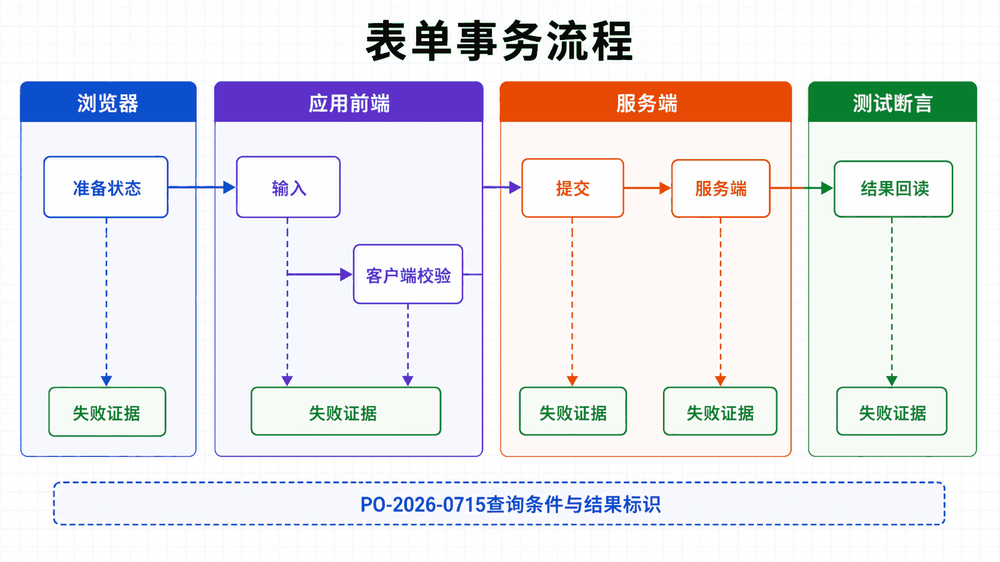
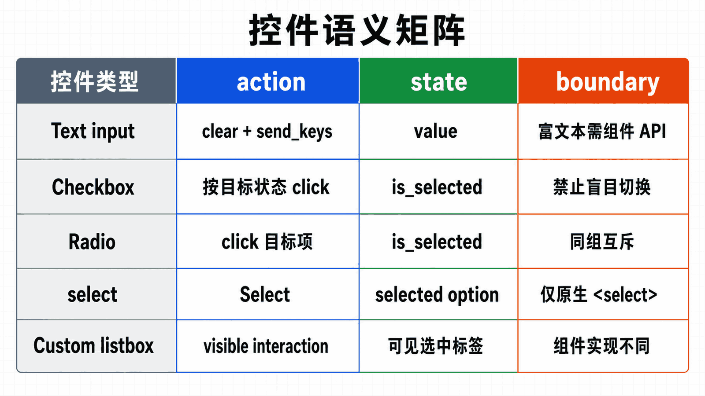

## 前置知识与学习目标

掌握定位器和显式等待，并了解 input、textarea、select、checkbox、radio 与 form 的基本语义。

读完后，你应该能够：

- 按控件语义选择 send_keys、click、Select 和状态读取；
- 把表单操作组织为输入—提交—服务端结果验证的事务；
- 区分原生控件与自定义组件的交互路径；
- 解释客户端校验、网络提交和页面反馈的失败边界；

全系列沿用同一个案例：在测试环境自动化 Acme 采购门户。用户登录后搜索采购单 PO-2026-0715，在明细页导出 CSV；测试使用 data-testid 作为稳定定位契约，并把失败截图、日志和下载文件写入独立运行目录。

**本篇边界：**本篇只处理页面内表单。文件上传与下载属于文件通道，统一在第 9 篇解释。

## 真实场景与核心问题

表单是网页交互的核心部分，包括登录、注册、搜索、购物车等场景。本教程将详细介绍 Selenium 中各种表单元素的操作方法。

<!-- figure-anchor:s05-a01 -->

<!-- figure-managed:s05-f01:start -->



<!-- figure-managed:s05-f01:end -->

### 表单元素类型

```text
┌─────────────────────────────────────────────────────────────┐
│                    表单元素类型                               │
├─────────────────────────────────────────────────────────────┤
│                                                              │
│  ┌─────────────┐  ┌─────────────┐  ┌─────────────┐          │
│  │  输入框     │  │  文本域     │  │  密码框     │          │
│  │ input[type]│  │  textarea   │  │ input[type]│          │
│  └─────────────┘  └─────────────┘  └─────────────┘          │
│                                                              │
│  ┌─────────────┐  ┌─────────────┐  ┌─────────────┐          │
│  │  复选框     │  │  单选框     │  │  下拉菜单   │          │
│  │  checkbox  │  │   radio     │  │  select    │          │
│  └─────────────┘  └─────────────┘  └─────────────┘          │
│                                                              │
│  ┌─────────────┐  ┌─────────────┐  ┌─────────────┐          │
│  │   按钮      │  │   链接      │  │   文件上传   │          │
│  │   button   │  │     a      │  │ input[type]│          │
│  └─────────────┘  └─────────────┘  └─────────────┘          │
│                                                              │
└─────────────────────────────────────────────────────────────┘
```

## 文本输入

### 基本输入

```python
from selenium import webdriver
from selenium.webdriver.common.by import By

driver = webdriver.Chrome()
driver.get("https://example.com/form")

# 输入文本
driver.find_element(By.NAME, "username").send_keys("testuser")

# 获取输入值
value = driver.find_element(By.NAME, "username").get_attribute("value")

# 清空输入
driver.find_element(By.NAME, "username").clear()

# 重新输入
driver.find_element(By.NAME, "username").send_keys("newuser")
```

### 特殊字符输入

```python
from selenium.webdriver.common.keys import Keys

# 输入特殊字符
driver.find_element(By.NAME, "comment").send_keys("Hello\nWorld!")

# 追加文本
element = driver.find_element(By.NAME, "description")
element.send_keys("First part ")
element.send_keys("Second part")

# 全选并替换
element.send_keys(Keys.CONTROL, "a")
element.send_keys("New content")

# 快捷键
element.send_keys(Keys.RETURN)     # 回车
element.send_keys(Keys.TAB)        # Tab
element.send_keys(Keys.ESCAPE)     # Esc
element.send_keys(Keys.BACKSPACE)  # 退格
```

### 验证输入

```python
# 验证输入框内容
def verify_input(driver, locator, expected):
    element = driver.find_element(*locator)
    actual = element.get_attribute("value")
    return actual == expected

# 验证文本框内容
def verify_textarea(driver, locator, expected):
    element = driver.find_element(*locator)
    actual = element.text
    return expected in actual
```

## 文本域（Textarea）

### 基本操作

```python
# 输入多行文本
driver.find_element(By.TAG_NAME, "textarea").send_keys("""第一行
第二行
第三行""")

# 清空并重新输入
textarea = driver.find_element(By.TAG_NAME, "textarea")
textarea.clear()
textarea.send_keys("New content")

# 获取文本
text = driver.find_element(By.TAG_NAME, "textarea").text
```

### 实际应用

```python
def fill_feedback_form():
    driver.get("https://example.com/feedback")

    # 填写反馈表单
    driver.find_element(By.NAME, "name").send_keys("张三")
    driver.find_element(By.NAME, "email").send_keys("zhangsan@example.com")

    # 填写多行文本
    textarea = driver.find_element(By.NAME, "message")
    textarea.send_keys("""
        尊敬的客服团队：

        我想对你们的服务提出一些反馈：

        1. 页面加载速度可以进一步优化
        2. 希望增加更多的支付方式

        谢谢！
    """)

    # 提交
    driver.find_element(By.CSS_SELECTOR, "button[type='submit']").click()
```

## 密码框

### 基本操作

```python
# 输入密码
driver.find_element(By.NAME, "password").send_keys("SecurePass123!")

# 验证密码框类型
password_field = driver.find_element(By.NAME, "password")
assert password_field.get_attribute("type") == "password"

# 显示/隐藏密码（如果支持）
try:
    toggle = driver.find_element(By.CLASS_NAME, "password-toggle")
    toggle.click()
except:
    pass
```

### 登录示例

```python
def login(username, password):
    driver.get("https://example.com/login")

    # 输入凭据
    driver.find_element(By.ID, "username").send_keys(username)
    driver.find_element(By.ID, "password").send_keys(password)

    # 点击登录
    driver.find_element(By.ID, "login-btn").click()

    # 等待登录成功
    wait = WebDriverWait(driver, 10)
    wait.until(EC.url_contains("/dashboard"))

    return True
```

## 复选框（Checkbox）

### 基本操作

```python
from selenium import webdriver
from selenium.webdriver.common.by import By

driver = webdriver.Chrome()
driver.get("https://example.com/form")

# 选中复选框
driver.find_element(By.ID, "agree-terms").click()

# 或者使用 JavaScript
driver.execute_script("document.getElementById('agree-terms').click();")

# 检查是否选中
is_checked = driver.find_element(By.ID, "agree-terms").is_selected()

# 取消选中
if is_checked:
    driver.find_element(By.ID, "agree-terms").click()
```

### 批量操作

```python
def select_multiple_checkboxes():
    driver.get("https://example.com/form")

    # 获取所有复选框
    checkboxes = driver.find_elements(By.CSS_SELECTOR, "input[type='checkbox']")

    # 选中所有
    for checkbox in checkboxes:
        if not checkbox.is_selected():
            checkbox.click()

    # 只选中特定的
    for checkbox in checkboxes:
        value = checkbox.get_attribute("value")
        if value in ["python", "java", "javascript"]:
            if not checkbox.is_selected():
                checkbox.click()
```

### 实际应用

```python
def fill_subscription_form():
    driver.get("https://example.com/subscribe")

    # 填写基本信息
    driver.find_element(By.NAME, "email").send_keys("user@example.com")

    # 选择订阅类型
    driver.find_element(By.CSS_SELECTOR, "input[value='weekly']").click()

    # 同意条款
    if not driver.find_element(By.ID, "agree-terms").is_selected():
        driver.find_element(By.ID, "agree-terms").click()

    # 提交
    driver.find_element(By.CSS_SELECTOR, "button[type='submit']").click()
```

## 单选框（Radio）

### 基本操作

```python
# 选择单选框
driver.find_element(By.CSS_SELECTOR, "input[value='male']").click()

# 检查是否选中
is_selected = driver.find_element(By.CSS_SELECTOR, "input[value='male']").is_selected()

# 通过名称获取已选中的
selected = driver.find_element(By.NAME, "gender")
value = selected.get_attribute("value")
```

### 实际应用

```python
def select_gender(gender):
    gender_map = {
        "male": "input[value='male']",
        "female": "input[value='female']",
        "other": "input[value='other']"
    }

    selector = gender_map.get(gender.lower())
    if selector:
        driver.find_element(By.CSS_SELECTOR, selector).click()

def fill_registration(data):
    driver.get("https://example.com/register")

    # 基本信息
    driver.find_element(By.NAME, "username").send_keys(data["username"])
    driver.find_element(By.NAME, "email").send_keys(data["email"])

    # 选择性别
    select_gender(data["gender"])

    # 选择订阅计划
    driver.find_element(By.CSS_SELECTOR, f"input[value='{data['plan']}']").click()
```

## 下拉菜单（Select）

### 基本操作

```python
from selenium.webdriver.support.ui import Select

driver.get("https://example.com/form")

# 找到下拉菜单
select = Select(driver.find_element(By.ID, "country"))

# 按选项文本选择
select.select_by_visible_text("China")

# 按选项值选择
select.select_by_value("CN")

# 按索引选择（从 0 开始）
select.select_by_index(1)
```

### Select 方法

```python
# 选择方法
select.select_by_visible_text("Option Text")
select.select_by_value("option_value")
select.select_by_index(0)

# 取消选择（仅多选）
select.deselect_by_visible_text("Option Text")
select.deselect_by_value("option_value")
select.deselect_by_index(0)
select.deselect_all()  # 取消所有选择

# 获取信息
options = select.options  # 获取所有选项
first_selected = select.first_selected_option  # 获取当前选中的
all_selected = select.all_selected_options  # 获取所有选中的（多选）
```

### 多选下拉菜单

```python
def select_multiple_options():
    driver.get("https://example.com/form")

    # 找到多选下拉菜单
    select = Select(driver.find_element(By.NAME, "languages"))

    # 选择多个选项
    select.select_by_visible_text("Python")
    select.select_by_visible_text("JavaScript")
    select.select_by_visible_text("Java")

    # 获取所有选中的
    selected = select.all_selected_options
    for option in selected:
        print(option.text)

    # 取消所有选择
    select.deselect_all()
```

### 实际应用

```python
def fill_address_form(data):
    driver.get("https://example.com/address")

    # 国家
    country_select = Select(driver.find_element(By.ID, "country"))
    country_select.select_by_visible_text(data["country"])

    # 省份
    province_select = Select(driver.find_element(By.ID, "province"))
    # 等待省份选项加载
    wait = WebDriverWait(driver, 10)
    wait.until(lambda x: len(province_select.options) > 1)
    province_select.select_by_visible_text(data["province"])

    # 城市
    city_select = Select(driver.find_element(By.ID, "city"))
    wait.until(lambda x: len(city_select.options) > 1)
    city_select.select_by_visible_text(data["city"])
```

## 日期选择器

### 普通日期输入

```python
# 直接输入日期
date_input = driver.find_element(By.NAME, "birthdate")
date_input.send_keys("1990-01-15")
```

### 日历控件

```python
def select_date(year, month, day):
    # 点击打开日历
    driver.find_element(By.ID, "date-picker").click()

    # 等待日历打开
    wait = WebDriverWait(driver, 10)
    wait.until(EC.visibility_of_element_located((By.CLASS_NAME, "calendar")))

    # 选择年份
    year_select = Select(driver.find_element(By.CLASS_NAME, "year-select"))
    year_select.select_by_visible_text(str(year))

    # 选择月份
    month_select = Select(driver.find_element(By.CLASS_NAME, "month-select"))
    month_select.select_by_visible_text(str(month))

    # 点击日期
    driver.find_element(
        By.XPATH,
        f"//td[@class='day' and text()='{day}']"
    ).click()
```

## 表单提交

<!-- figure-anchor:s05-a02 -->

<!-- figure-managed:s05-f02:start -->



<!-- figure-managed:s05-f02:end -->### 基本提交

```python
# 方法 1：点击提交按钮
driver.find_element(By.CSS_SELECTOR, "button[type='submit']").click()

# 方法 2：按回车键
driver.find_element(By.NAME, "search").send_keys(Keys.RETURN)

# 方法 3：调用 submit 方法
driver.find_element(By.ID, "login-form").submit()
```

### 实际应用：完整注册流程

```python
def complete_registration(data):
    driver.get("https://example.com/register")

    # 填写基本信息
    driver.find_element(By.NAME, "username").send_keys(data["username"])
    driver.find_element(By.NAME, "email").send_keys(data["email"])
    driver.find_element(By.NAME, "password").send_keys(data["password"])
    driver.find_element(By.NAME, "confirm_password").send_keys(data["password"])

    # 填写详细信息
    driver.find_element(By.NAME, "full_name").send_keys(data["full_name"])
    driver.find_element(By.NAME, "phone").send_keys(data["phone"])

    # 选择性别
    driver.find_element(
        By.CSS_SELECTOR,
        f"input[name='gender'][value='{data['gender']}']"
    ).click()

    # 选择国家
    select_country = Select(driver.find_element(By.NAME, "country"))
    select_country.select_by_visible_text(data["country"])

    # 上传头像
    if data.get("avatar_path"):
        driver.find_element(By.NAME, "avatar").send_keys(data["avatar_path"])

    # 同意条款
    driver.find_element(By.NAME, "agree_terms").click()

    # 提交
    driver.find_element(By.CSS_SELECTOR, "button[type='submit']").click()

    # 等待注册成功
    wait = WebDriverWait(driver, 10)
    wait.until(EC.url_contains("/welcome"))

    return True
```

## 表单验证

### 客户端验证

```python
def validate_form():
    driver.get("https://example.com/register")

    errors = []

    # 验证用户名
    username = driver.find_element(By.NAME, "username")
    if len(username.get_attribute("value")) < 3:
        errors.append("用户名至少3个字符")

    # 验证邮箱格式
    email = driver.find_element(By.NAME, "email")
    email_value = email.get_attribute("value")
    if "@" not in email_value or "." not in email_value:
        errors.append("请输入有效的邮箱地址")

    # 验证密码强度
    password = driver.find_element(By.NAME, "password")
    password_value = password.get_attribute("value")
    if len(password_value) < 8:
        errors.append("密码至少8个字符")

    return errors
```

### 检查验证消息

```python
def check_validation():
    driver.get("https://example.com/register")

    # 填写无效数据并提交
    driver.find_element(By.NAME, "email").send_keys("invalid-email")
    driver.find_element(By.CSS_SELECTOR, "button[type='submit']").click()

    # 检查验证错误消息
    error_messages = driver.find_elements(By.CLASS_NAME, "error-message")

    for error in error_messages:
        print(f"错误: {error.text}")
```

## 高级表单操作

### 自动填充

```python
from selenium.webdriver.common.action_chains import ActionChains

def auto_fill_form(data):
    """自动填充表单（模拟真实用户输入）"""
    actions = ActionChains(driver)

    for field, value in data.items():
        element = driver.find_element(By.NAME, field)

        # 聚焦元素
        actions.move_to_element(element)
        actions.click(element)

        # 清空并输入
        element.clear()
        element.send_keys(value)

    actions.perform()
```

### 动态表单处理

```python
def handle_dynamic_form():
    driver.get("https://example.com/form")

    # 等待表单加载
    wait = WebDriverWait(driver, 10)
    wait.until(EC.presence_of_element_located((By.TAG_NAME, "form")))

    # 动态添加字段
    add_button = driver.find_element(By.ID, "add-field-btn")

    for i in range(3):
        add_button.click()
        wait.until(
            EC.presence_of_element_located((By.NAME, f"field_{i}"))
        )

    # 填写动态字段
    for i in range(3):
        driver.find_element(By.NAME, f"field_{i}").send_keys(f"Value {i}")
```

### 条件表单字段

```python
def handle_conditional_fields():
    driver.get("https://example.com/register")

    # 选择订阅计划
    select_plan = Select(driver.find_element(By.NAME, "plan"))
    select_plan.select_by_visible_text("Premium")

    # 等待额外字段出现
    wait = WebDriverWait(driver, 10)
    wait.until(
        EC.visibility_of_element_located((By.NAME, "company_name"))
    )

    # 填写额外信息
    driver.find_element(By.NAME, "company_name").send_keys("My Company")
    driver.find_element(By.NAME, "company_size").send_keys("100-500")
```

## 常见误区与适用边界

- clear 后立即 send_keys 不保证框架状态已更新；必要时验证 value 和相关事件结果。
- Select 只适用于原生 select；自定义下拉框需要按真实可见交互路径操作。
- 看到成功提示不一定代表后端已提交；应验证 URL、业务标识或可回读结果。

## 本篇自检

<details>
<summary>1. 为什么不应无条件对 checkbox 调用 click？</summary>

click 会翻转状态。应先读取 is_selected，只在当前状态与目标状态不同时点击。

</details>

<details>
<summary>2. submit、回车和点击提交按钮是否总等价？</summary>

不总是。前端可能只监听某个事件路径；测试应复现用户入口并验证最终业务结果。

</details>

<details>
<summary>3. 自定义下拉框为什么不能用 Select？</summary>

Select 封装的是原生 select/option 语义，自定义组件通常由 div、listbox 等节点和事件实现。

</details>

## 本篇总结

表单自动化不是连续填字段，而是一个可验证事务：准备状态、按控件语义输入、触发真实提交路径并确认持久化结果。

## 下一篇衔接

下一篇引入窗口、iframe 和原生弹窗，解释为什么同一个定位器在错误上下文中一定失败。

## 资料来源与版本基线

本文以 Selenium 4 与 Python 3.10+ 为基线；具体版本与浏览器支持应以发布时的官方说明为准。

- [Interacting with web elements](https://www.selenium.dev/documentation/webdriver/elements/interactions/)
- [Information about web elements](https://www.selenium.dev/documentation/webdriver/elements/information/)
- [Keyboard actions](https://www.selenium.dev/documentation/webdriver/actions_api/keyboard/)
