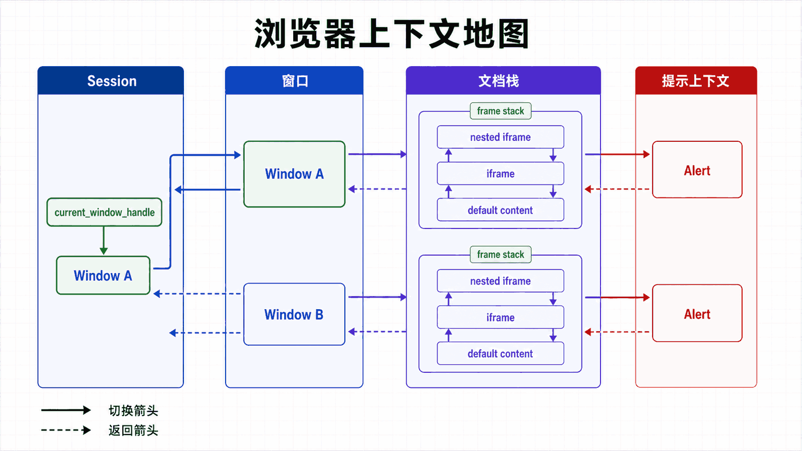
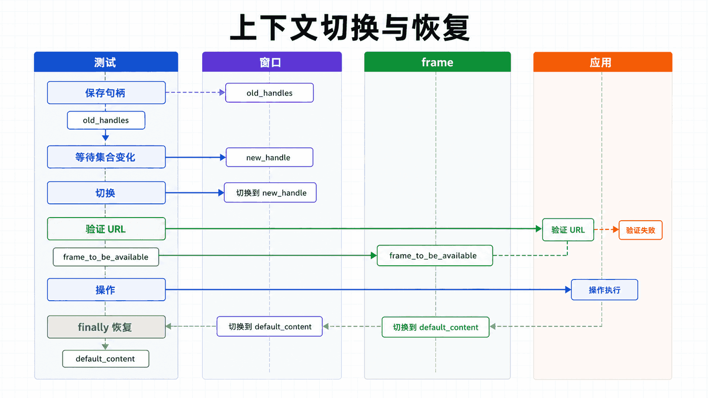

## 前置知识与学习目标

会定位和等待元素，并理解浏览器标签页、DOM 文档与 iframe 的基本区别。

读完后，你应该能够：

- 把窗口句柄、frame 栈和 alert 视为三类独立上下文；
- 在切换前等待目标上下文出现，并在 finally 中恢复；
- 解释关闭窗口后会话与当前句柄的状态变化；
- 为第三方授权弹窗设计不依赖窗口顺序的流程；

全系列沿用同一个案例：在测试环境自动化 Acme 采购门户。用户登录后搜索采购单 PO-2026-0715，在明细页导出 CSV；测试使用 data-testid 作为稳定定位契约，并把失败截图、日志和下载文件写入独立运行目录。

**本篇边界：**窗口与标签页在 WebDriver 中统一由 window handle 标识；iframe 改变当前文档；alert 会阻塞普通命令。

## 真实场景与核心问题

现代网页通常包含多窗口、嵌套 iframe 和各种弹窗。Selenium 提供了完整的方法来管理这些复杂的页面结构。本教程将详细介绍这些场景的处理方法。

<!-- figure-anchor:s06-a01 -->

<!-- figure-managed:s06-f01:start -->



<!-- figure-managed:s06-f01:end -->

### 场景概览

```text
┌─────────────────────────────────────────────────────────────┐
│                      复杂页面结构                             │
├─────────────────────────────────────────────────────────────┤
│                                                              │
│  ┌─────────────────────────────────────────────────────┐   │
│  │               主窗口                                  │   │
│  │  ┌──────────────────────────────────────────────┐   │   │
│  │  │              iframe (嵌套)                     │   │   │
│  │  │  ┌─────────────────────────────────────────┐ │   │   │
│  │  │  │  iframe 内部内容                        │ │   │   │
│  │  │  └─────────────────────────────────────────┘ │   │   │
│  │  └──────────────────────────────────────────────┘   │   │
│  │                                                       │   │
│  │  [打开新窗口] ──▶ 新窗口 ──▶ 切换                    │   │
│  │                                                       │   │
│  │  弹窗：⚠️ Alert / ✅ Confirm / 💬 Prompt            │   │
│  └─────────────────────────────────────────────────────┘   │
│                                                              │
└─────────────────────────────────────────────────────────────┘
```

## 多窗口管理

### 基础窗口操作

```python
from selenium import webdriver
from selenium.webdriver.common.by import By

driver = webdriver.Chrome()
driver.get("https://example.com")

# 获取当前窗口句柄
current_window = driver.current_window_handle
print(f"当前窗口: {current_window}")

# 获取所有窗口句柄
all_windows = driver.window_handles
print(f"所有窗口: {all_windows}")

# 获取窗口数量
window_count = len(driver.window_handles)
```

### 打开新窗口/标签页

```python
# 在新标签页打开链接
driver.find_element(By.TAG_NAME, "body").send_keys(Keys.CONTROL + "t")

# 使用 JavaScript 打开新窗口
driver.execute_script("window.open('https://example.com', '_blank');")

# 点击链接打开新窗口
driver.find_element(By.LINK_TEXT, "Open in new window").click()
```

### 切换窗口

```python
# 切换到新窗口
for window_handle in driver.window_handles:
    if window_handle != current_window:
        driver.switch_to.window(window_handle)
        break

# 等待新窗口出现
from selenium.webdriver.support.ui import WebDriverWait
from selenium.webdriver.support import expected_conditions as EC

main_window = driver.current_window_handle

# 点击打开新窗口
driver.find_element(By.ID, "open-new-window").click()

# 等待新窗口
wait = WebDriverWait(driver, 10)
wait.until(EC.number_of_windows_to_be(2))

# 切换到新窗口
new_window = [w for w in driver.window_handles if w != main_window][0]
driver.switch_to.window(new_window)

# 在新窗口操作
driver.get("https://example.org")

# 关闭新窗口
driver.close()

# 切换回主窗口
driver.switch_to.window(main_window)
```

### 完整示例：多窗口处理

```python
def handle_multiple_windows():
    driver = webdriver.Chrome()
    driver.get("https://example.com")

    # 保存主窗口
    main_window = driver.current_window_handle

    # 点击打开新窗口
    driver.find_element(By.ID, "open-window-btn").click()

    # 等待新窗口出现
    wait = WebDriverWait(driver, 10)
    wait.until(EC.number_of_windows_to_be(2))

    # 切换到新窗口
    new_window = [w for w in driver.window_handles if w != main_window][0]
    driver.switch_to.window(new_window)

    # 在新窗口执行操作
    driver.find_element(By.NAME, "search").send_keys("test")
    driver.find_element(By.NAME, "search").send_keys(Keys.RETURN)

    # 获取新窗口标题
    print(f"新窗口标题: {driver.title}")

    # 关闭新窗口
    driver.close()

    # 切换回主窗口
    driver.switch_to.window(main_window)

    # 验证回到主窗口
    assert driver.current_window_handle == main_window

    driver.quit()
```

### 在窗口间传递数据

```python
def share_data_between_windows():
    driver = webdriver.Chrome()
    driver.get("https://example.com")

    # 在主窗口设置数据
    driver.execute_script("window.sharedData = {user: 'testuser'};")

    # 打开新窗口
    main_window = driver.current_window_handle
    driver.execute_script("window.open('about:blank');")
    new_window = [w for w in driver.window_handles if w != main_window][0]
    driver.switch_to.window(new_window)

    # 在新窗口读取数据
    shared = driver.execute_script("return window.sharedData;")
    print(f"共享数据: {shared}")

    driver.close()
    driver.switch_to.window(main_window)
```

## iframe 管理

<!-- figure-anchor:s06-a02 -->

<!-- figure-managed:s06-f02:start -->



<!-- figure-managed:s06-f02:end -->### 切换到 iframe

```python
# 通过 ID 切换
driver.switch_to.frame("iframe-id")

# 通过 Name 切换
driver.switch_to.frame("frame-name")

# 通过 WebElement 切换
iframe = driver.find_element(By.CSS_SELECTOR, "iframe#content-frame")
driver.switch_to.frame(iframe)

# 通过索引切换（不推荐）
driver.switch_to.frame(0)
```

### 在 iframe 中操作

```python
def operate_within_iframe():
    driver.get("https://example.com/page-with-iframe")

    # 切换到 iframe
    driver.switch_to.frame("content-frame")

    # 在 iframe 中查找元素
    element = driver.find_element(By.ID, "iframe-element")
    element.send_keys("Hello from iframe!")

    # 获取 iframe 中的文本
    text = driver.find_element(By.TAG_NAME, "body").text
    print(f"iframe 内容: {text}")

    # 操作完成，切回主文档
    driver.switch_to.default_content()
```

### 嵌套 iframe

```python
def handle_nested_iframes():
    driver.get("https://example.com/nested-iframes")

    # 切换到第一个 iframe
    driver.switch_to.frame("outer-frame")

    # 在 outer-frame 中操作
    driver.find_element(By.ID, "outer-element").send_keys("outer")

    # 切换到嵌套的 iframe
    driver.switch_to.frame("inner-frame")

    # 在 inner-frame 中操作
    driver.find_element(By.ID, "inner-element").send_keys("inner")

    # 切回主文档
    driver.switch_to.default_content()
```

### 等待 iframe 加载

```python
def wait_for_iframe():
    driver.get("https://example.com/page-with-iframe")

    # 等待 iframe 存在
    wait = WebDriverWait(driver, 10)
    wait.until(EC.frame_to_be_available_and_switch_to_it((By.ID, "content-frame")))

    # iframe 已切换并加载
    element = driver.find_element(By.ID, "loaded-content")
    print(f"内容: {element.text}")

    # 切回主文档
    driver.switch_to.default_content()
```

### 动态 iframe 处理

```python
def handle_dynamic_iframe():
    driver.get("https://example.com/dynamic-iframe")

    # 动态等待 iframe 出现
    wait = WebDriverWait(driver, 10)

    # 方法 1：等待 iframe 元素
    wait.until(EC.presence_of_element_located((By.TAG_NAME, "iframe")))

    # 找到并切换到 iframe
    iframe = driver.find_element(By.TAG_NAME, "iframe")
    driver.switch_to.frame(iframe)

    # 操作
    driver.find_element(By.ID, "content").send_keys("text")

    # 切回主文档
    driver.switch_to.default_content()
```

## 弹窗（Alerts）

### Alert 警告框

```python
from selenium.webdriver.common.alert import Alert

# 等待并切换到警告框
wait = WebDriverWait(driver, 10)
wait.until(EC.alert_is_present())

alert = Alert(driver)

# 获取警告框文本
text = alert.text
print(f"警告内容: {text}")

# 接受警告框
alert.accept()

# 或 dismiss（拒绝）
alert.dismiss()
```

### 警告框实战

```python
def handle_javascript_alert():
    driver.get("https://example.com")

    # 触发 JavaScript 警告框
    driver.execute_script("alert('This is an alert!');")

    # 等待并接受
    wait = WebDriverWait(driver, 10)
    wait.until(EC.alert_is_present())

    alert = driver.switch_to.alert
    print(f"Alert: {alert.text}")
    alert.accept()

    # 继续操作
    print("Alert 已处理")
```

### Confirm 确认框

```python
def handle_confirm_dialog():
    driver.get("https://example.com")

    # 触发确认框
    driver.execute_script("confirm('Are you sure?');")

    wait = WebDriverWait(driver, 10)
    wait.until(EC.alert_is_present())

    alert = driver.switch_to.alert

    # 接受（点击确定）
    alert.accept()

    # 或拒绝（点击取消）
    # alert.dismiss()
```

### Prompt 提示框

```python
def handle_prompt():
    driver.get("https://example.com")

    # 触发提示框
    driver.execute_script("prompt('Enter your name:', 'Default Name');")

    wait = WebDriverWait(driver, 10)
    wait.until(EC.alert_is_present())

    prompt = driver.switch_to.alert

    # 获取提示文本
    print(f"Prompt message: {prompt.text}")

    # 输入文本
    prompt.send_keys("My Name")

    # 提交
    prompt.accept()
```

### 处理多种弹窗

```python
def handle_any_popup():
    """处理任意类型的弹窗"""
    try:
        # 尝试等待警告框
        wait = WebDriverWait(driver, 5)
        wait.until(EC.alert_is_present())

        popup = driver.switch_to.alert

        # 根据弹窗类型处理
        popup_text = popup.text

        if "confirm" in popup_text.lower():
            popup.dismiss()  # 或 accept()
        else:
            popup.accept()

    except TimeoutException:
        print("没有弹窗出现")
```

## 高级窗口操作

### 全屏和窗口管理

```python
# 全屏
driver.execute_script("document.body.requestFullscreen();")

# 最大化
driver.maximize_window()

# 最小化
driver.minimize_window()

# 设置窗口大小
driver.set_window_size(1920, 1080)

# 设置窗口位置
driver.set_window_position(0, 0)

# 获取窗口大小
size = driver.get_window_size()
print(f"Width: {size['width']}, Height: {size['height']}")

# 获取窗口位置
position = driver.get_window_position()
print(f"X: {position['x']}, Y: {position['y']}")
```

### 拖拽窗口

```python
from selenium.webdriver import ActionChains

# 拖拽窗口
actions = ActionChains(driver)
actions.drag_and_drop_by_offset(window_handle, 100, 200)
actions.perform()
```

### 屏幕截图（窗口）

```python
from datetime import datetime

def screenshot_window(name="window"):
    """保存窗口截图"""
    timestamp = datetime.now().strftime("%Y%m%d_%H%M%S")
    filename = f"{name}_{timestamp}.png"
    driver.save_screenshot(filename)
    print(f"截图保存: {filename}")
    return filename
```

## 实际应用案例

### 案例 1：处理第三方登录弹窗

```python
def handle_oauth_popup():
    driver.get("https://example.com/login")

    # 保存主窗口
    main_window = driver.current_window_handle

    # 点击第三方登录按钮
    driver.find_element(By.ID, "google-login").click()

    # 等待新窗口
    wait = WebDriverWait(driver, 10)
    wait.until(EC.number_of_windows_to_be(2))

    # 切换到登录弹窗
    auth_window = [w for w in driver.window_handles if w != main_window][0]
    driver.switch_to.window(auth_window)

    # 在弹窗中登录
    driver.find_element(By.NAME, "email").send_keys("user@gmail.com")
    driver.find_element(By.NAME, "password").send_keys("password")
    driver.find_element(By.ID, "submit").click()

    # 等待并关闭弹窗
    wait.until(EC.number_of_windows_to_be(1))

    # 切回主窗口
    driver.switch_to.window(main_window)

    # 验证登录成功
    assert "logged-in" in driver.current_url
```

### 案例 2：处理内容编辑 iframe

```python
def handle_content_editor():
    driver.get("https://example.com/editor")

    # 切换到富文本编辑器 iframe
    driver.switch_to.frame("editor-frame")

    # 在编辑器中输入内容
    editor = driver.find_element(By.CLASS_NAME, "editor-content")
    editor.send_keys("Hello World!")

    # 设置格式
    driver.find_element(By.CLASS_NAME, "bold-btn").click()

    # 切回主文档
    driver.switch_to.default_content()

    # 点击保存按钮
    driver.find_element(By.ID, "save-btn").click()
```

### 案例 3：处理确认删除弹窗

```python
def handle_delete_confirmation():
    driver.get("https://example.com/items")

    # 点击删除按钮
    driver.find_element(By.CLASS_NAME, "delete-btn").click()

    # 等待确认对话框
    wait = WebDriverWait(driver, 5)
    wait.until(EC.alert_is_present())

    # 接受删除
    alert = driver.switch_to.alert
    alert.accept()

    # 等待删除完成
    wait.until(EC.invisibility_of_element_located((By.CLASS_NAME, "deleted-item")))

    # 验证删除成功
    assert len(driver.find_elements(By.CLASS_NAME, "item")) == old_count - 1
```

## 最佳实践

### 推荐模式

```python
# ✅ 使用上下文管理器确保切回主文档
def safe_iframe_operations():
    driver.get("https://example.com")

    try:
        # 切换到 iframe
        driver.switch_to.frame("content-frame")

        # 执行操作
        driver.find_element(By.ID, "form").submit()

    finally:
        # 无论成功与否都切回主文档
        driver.switch_to.default_content()

# ✅ 使用显式等待处理弹窗
def safe_alert_handling():
    wait = WebDriverWait(driver, 10)
    wait.until(EC.alert_is_present())
    alert = driver.switch_to.alert
    alert.accept()
```

### 避免模式

```python
# ❌ 不推荐：不做检查直接切换
driver.switch_to.frame("iframe")  # 可能不存在

# ✅ 推荐：先等待
wait = WebDriverWait(driver, 10)
wait.until(EC.frame_to_be_available_and_switch_to_it((By.ID, "iframe")))

# ❌ 不推荐：忘记切回主文档
driver.switch_to.frame("iframe")
driver.find_element(By.ID, "form").submit()
# 后续操作可能在 iframe 上下文中执行，导致找不到元素
```

## 常见问题解决

### 问题 1：无法切换到 iframe

```python
# 可能原因：iframe 还未加载
wait = WebDriverWait(driver, 10)
wait.until(EC.frame_to_be_available_and_switch_to_it((By.ID, "frame-id")))
```

### 问题 2：切换 iframe 后找不到元素

```python
# 检查是否在正确的上下文中
def verify_iframe_context():
    try:
        # 尝试在当前上下文中查找
        element = driver.find_element(By.ID, "expected-element")
        return True
    except NoSuchElementException:
        # 可能不在正确的 iframe 中
        driver.switch_to.default_content()
        return False
```

### 问题 3：弹窗处理超时

```python
# 增加等待时间或使用不同策略
try:
    wait = WebDriverWait(driver, 15)  # 增加超时
    wait.until(EC.alert_is_present())
    driver.switch_to.alert.accept()
except TimeoutException:
    # 尝试其他方法
    print("弹窗未出现，检查页面状态")
```

## 常见误区与适用边界

- window_handles 的顺序不应当作长期业务契约；应比较集合或检查页面特征。
- 切回主窗口不等于退出 iframe，反之亦然；两种上下文要分别恢复。
- DOM 模态框不是原生 alert，应按普通元素定位而不是 switch_to.alert。

## 本篇自检

<details>
<summary>1. 如何可靠找到点击后新增的窗口？</summary>

保存旧句柄集合，等待窗口数量变化，再用集合差得到新句柄，并验证 URL 或标题。

</details>

<details>
<summary>2. 在 iframe 内查找成功后为什么主页面元素消失了？</summary>

当前搜索上下文已经切到 iframe 文档；需要 default_content 或 parent_frame 恢复。

</details>

<details>
<summary>3. alert 出现时普通 find_element 为什么可能失败？</summary>

原生弹窗占据用户提示上下文并阻塞页面命令，需要先切换、读取并 accept 或 dismiss。

</details>

## 本篇总结

上下文是所有查找和命令的隐含输入。可靠脚本显式记录、等待、切换和恢复窗口、frame 与 alert。

## 下一篇衔接

下一篇用 pytest 把会话创建、上下文清理和失败证据固化为可重复的测试生命周期。

## 资料来源与版本基线

本文以 Selenium 4 与 Python 3.10+ 为基线；具体版本与浏览器支持应以发布时的官方说明为准。

- [Working with windows and tabs](https://www.selenium.dev/documentation/webdriver/interactions/windows/)
- [Working with frames](https://www.selenium.dev/documentation/webdriver/interactions/frames/)
- [JavaScript alerts](https://www.selenium.dev/documentation/webdriver/interactions/alerts/)
