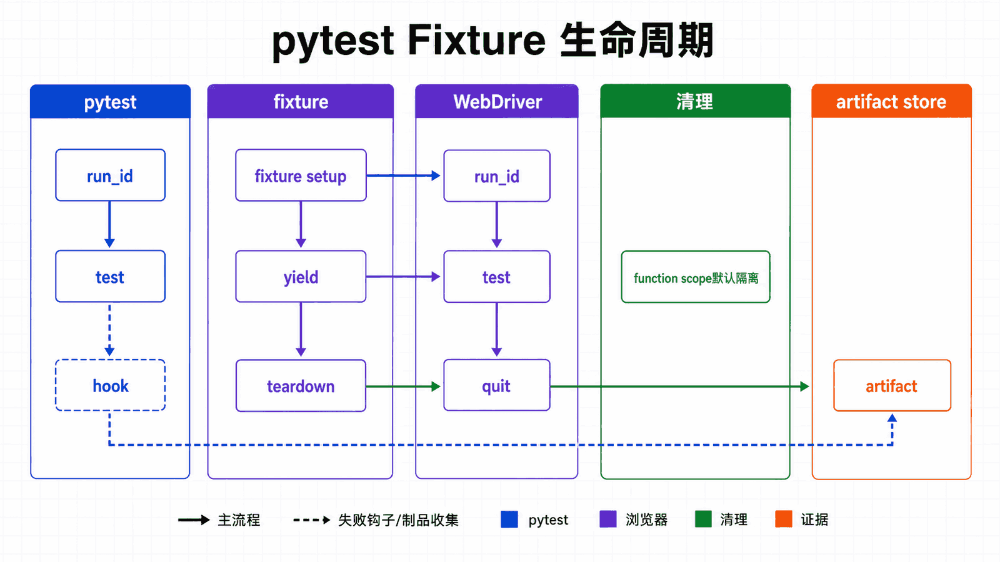
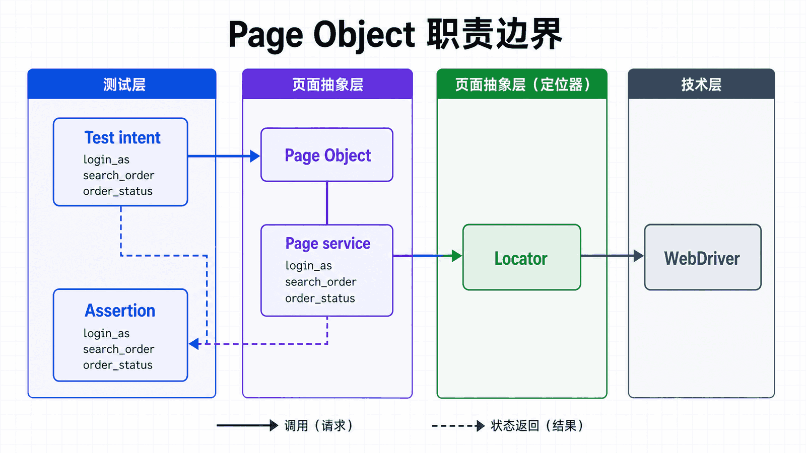

## 前置知识与学习目标

能编写函数和类，理解 setup/teardown，并已掌握定位、等待和上下文恢复。

读完后，你应该能够：

- 用 fixture 管理 WebDriver 的创建、隔离和销毁；
- 区分 function、module、session scope 的收益与状态污染风险；
- 用 Page Object 集中定位器与页面服务；
- 在失败钩子中保存截图、URL、页面源码和浏览器日志；

全系列沿用同一个案例：在测试环境自动化 Acme 采购门户。用户登录后搜索采购单 PO-2026-0715，在明细页导出 CSV；测试使用 data-testid 作为稳定定位契约，并把失败截图、日志和下载文件写入独立运行目录。

**本篇边界：**本篇聚焦测试组织与生命周期。断言的证据设计在第 8 篇完整展开，避免测试框架与验证策略混在一起。

## 真实场景与核心问题

pytest 是 Python 最流行的测试框架之一，与 Selenium 结合可以构建强大的自动化测试套件。本教程将详细介绍两者的集成方法。

<!-- figure-anchor:s07-a01 -->

<!-- figure-managed:s07-f01:start -->



<!-- figure-managed:s07-f01:end -->

### pytest 优势

| 特性              | 说明                             |
| ----------------- | -------------------------------- |
| **简单易用**      | 只需 `pytest test_*.py` 即可运行 |
| **强大 fixtures** | 灵活的资源管理                   |
| **参数化测试**    | 一组数据多次运行                 |
| **丰富插件**      | pytest-html、pytest-xdist 等     |
| **详细报告**      | 清晰的测试结果                   |

## 安装和配置

### 安装 pytest

```bash
pip install pytest pytest-selenium pytest-html pytest-xdist
```

### pytest.ini 配置

```ini
[pytest]
testpaths = tests
python_files = test_*.py
python_classes = Test*
python_functions = test_*
addopts = -v --tb=short --html=reports/report.html
markers =
    smoke: 冒烟测试
    integration: 集成测试
    slow: 慢速测试
```

## Fixtures 基础

### 基本 Fixtures

```python
import pytest
from selenium import webdriver
from selenium.webdriver.chrome.service import Service
from webdriver_manager.chrome import ChromeDriverManager

@pytest.fixture
def browser():
    """浏览器 fixture"""
    service = Service(ChromeDriverManager().install())
    driver = webdriver.Chrome(service=service)
    yield driver
    driver.quit()

@pytest.fixture
def home_page(browser):
    """访问首页的 fixture"""
    browser.get("https://example.com")
    return browser
```

### Session 级 Fixture

```python
@pytest.fixture(scope="session")
def browser_session():
    """整个测试会话只创建一次浏览器"""
    service = Service(ChromeDriverManager().install())
    driver = webdriver.Chrome(service=service)
    yield driver
    driver.quit()

@pytest.fixture(scope="session")
def logged_in_session(browser_session):
    """登录会话"""
    browser_session.get("https://example.com/login")
    browser_session.find_element(By.ID, "username").send_keys("testuser")
    browser_session.find_element(By.ID, "password").send_keys("password")
    browser_session.find_element(By.ID, "login-btn").click()
    return browser_session
```

### Function 级 Fixture

```python
@pytest.fixture
def fresh_page(browser):
    """每个测试创建新页面"""
    browser.get("about:blank")
    browser.get("https://example.com")
    return browser

@pytest.fixture
def filled_form(browser):
    """预填充表单"""
    browser.get("https://example.com/form")
    browser.find_element(By.NAME, "username").send_keys("testuser")
    browser.find_element(By.NAME, "email").send_keys("test@example.com")
    return browser
```

## 测试用例编写

<!-- figure-anchor:s07-a02 -->

<!-- figure-managed:s07-f02:start -->



<!-- figure-managed:s07-f02:end -->### 基础测试结构

```python
# tests/test_basic.py
import pytest
from selenium.webdriver.common.by import By
from selenium.webdriver.support.ui import WebDriverWait
from selenium.webdriver.support import expected_conditions as EC

def test_page_title(home_page):
    """测试页面标题"""
    assert "Example Domain" in home_page.title

def test_search_box_exists(home_page):
    """测试搜索框存在"""
    search_box = home_page.find_element(By.NAME, "q")
    assert search_box.is_displayed()

def test_login_success(browser):
    """测试登录成功"""
    browser.get("https://example.com/login")
    browser.find_element(By.ID, "username").send_keys("testuser")
    browser.find_element(By.ID, "password").send_keys("password")
    browser.find_element(By.ID, "login-btn").click()

    # 验证跳转
    wait = WebDriverWait(browser, 10)
    wait.until(EC.url_contains("/dashboard"))
    assert "/dashboard" in browser.current_url
```

### 页面对象模式

```python
# tests/pages/login_page.py
class LoginPage:
    def __init__(self, driver):
        self.driver = driver

    @property
    def username_input(self):
        return self.driver.find_element(By.ID, "username")

    @property
    def password_input(self):
        return self.driver.find_element(By.ID, "password")

    @property
    def submit_btn(self):
        return self.driver.find_element(By.ID, "login-btn")

    @property
    def error_message(self):
        return self.driver.find_element(By.CLASS_NAME, "error-message")

    def login(self, username, password):
        self.username_input.send_keys(username)
        self.password_input.send_keys(password)
        self.submit_btn.click()

    def get_error(self):
        return self.error_message.text if self.error_message.is_displayed() else None

# tests/pages/dashboard_page.py
class DashboardPage:
    def __init__(self, driver):
        self.driver = driver

    @property
    def welcome_message(self):
        return self.driver.find_element(By.CLASS_NAME, "welcome")

    def get_username(self):
        return self.welcome_message.text
```

### 使用页面对象

```python
# tests/test_login.py
from .pages.login_page import LoginPage
from .pages.dashboard_page import DashboardPage

def test_successful_login(browser):
    """测试成功登录"""
    browser.get("https://example.com/login")

    login_page = LoginPage(browser)
    login_page.login("testuser", "password123")

    # 等待跳转到仪表盘
    wait = WebDriverWait(browser, 10)
    wait.until(EC.url_contains("/dashboard"))

    dashboard = DashboardPage(browser)
    assert "testuser" in dashboard.get_username()

def test_login_with_invalid_credentials(browser):
    """测试无效凭据登录"""
    browser.get("https://example.com/login")

    login_page = LoginPage(browser)
    login_page.login("invalid", "wrong")

    # 验证错误消息
    assert "Invalid credentials" in login_page.get_error()
```

## 标记（Markers）

### 定义和使用标记

```python
import pytest

@pytest.mark.smoke
def test_quick_feature(browser):
    """快速冒烟测试"""
    assert True

@pytest.mark.integration
def test_full_workflow(browser):
    """完整集成测试"""
    pass

@pytest.mark.slow
def test_complex_operation(browser):
    """复杂操作测试"""
    pass
```

### 运行特定标记

```bash
# 只运行冒烟测试
pytest -m smoke

# 运行除了慢速测试的所有测试
pytest -m "not slow"

# 运行多个标记
pytest -m "smoke or integration"
```

## 参数化测试

### 基本参数化

```python
import pytest
from selenium.webdriver.common.by import By

@pytest.mark.parametrize("username,password,expected", [
    ("user1", "pass1", True),
    ("user2", "pass2", True),
    ("invalid", "wrong", False),
])
def test_login(browser, username, password, expected):
    """参数化登录测试"""
    browser.get("https://example.com/login")
    browser.find_element(By.ID, "username").send_keys(username)
    browser.find_element(By.ID, "password").send_keys(password)
    browser.find_element(By.ID, "login-btn").click()

    if expected:
        assert "/dashboard" in browser.current_url
    else:
        assert "error" in browser.current_url.lower()
```

### 多参数组合

```python
@pytest.mark.parametrize("country,language,expected", [
    ("US", "en", "Welcome"),
    ("CN", "zh", "欢迎"),
    ("JP", "ja", "ようこそ"),
])
def test_localization(browser, country, language, expected):
    """本地化测试"""
    browser.get(f"https://example.com?country={country}&lang={language}")
    welcome = browser.find_element(By.CLASS_NAME, "welcome-message")
    assert expected in welcome.text
```

## 跳过和条件执行

### 跳过测试

```python
@pytest.mark.skip(reason="功能未实现")
def test_future_feature(browser):
    pass

@pytest.mark.skipif(condition, reason="条件不满足")
def test_conditionally_skipped(browser):
    pass
```

### 浏览器特定测试

```python
import pytest
from selenium.webdriver.common.by import By

@pytest.mark.skipif(condition=lambda: False, reason="跨浏览器问题")
def test_chrome_only_feature(browser):
    # Chrome 特定功能
    pass
```

## 错误处理和截图

### 失败时截图

```python
import pytest
from datetime import datetime

@pytest.hookimpl(hookwrapper=True, tryfirst=True)
def pytest_runtest_makereport(item, call):
    """测试失败时自动截图"""
    outcome = yield
    report = outcome.get_result()

    if report.when == "call" and report.failed:
        driver = item.funcargs.get("browser")  # 获取 driver fixture
        if driver:
            screenshot_dir = "screenshots"
            import os
            os.makedirs(screenshot_dir, exist_ok=True)

            timestamp = datetime.now().strftime("%Y%m%d_%H%M%S")
            filename = f"{screenshot_dir}/{item.name}_{timestamp}.png"
            driver.save_screenshot(filename)
            print(f"\n截图已保存: {filename}")
```

### conftest.py 完整示例

```python
# tests/conftest.py
import pytest
from selenium import webdriver
from selenium.webdriver.chrome.service import Service
from webdriver_manager.chrome import ChromeDriverManager

@pytest.fixture(scope="session")
def browser():
    """会话级浏览器"""
    service = Service(ChromeDriverManager().install())
    driver = webdriver.Chrome(service=service)
    driver.implicitly_wait(10)
    yield driver
    driver.quit()

@pytest.fixture
def home_page(browser):
    """首页 fixture"""
    browser.get("https://example.com")
    return browser

@pytest.fixture
def logged_in_page(browser):
    """登录页面 fixture"""
    browser.get("https://example.com/login")
    browser.find_element(By.ID, "username").send_keys("testuser")
    browser.find_element(By.ID, "password").send_keys("password")
    browser.find_element(By.ID, "login-btn").click()
    return browser

@pytest.hookimpl(hookwrapper=True, tryfirst=True)
def pytest_runtest_makereport(item, call):
    """失败时截图"""
    outcome = yield
    report = outcome.get_result()

    if report.when == "call" and report.failed:
        driver = item.funcargs.get("browser")
        if driver:
            import os
            from datetime import datetime
            os.makedirs("screenshots", exist_ok=True)
            filename = f"screenshots/{item.name}_{datetime.now().strftime('%H%M%S')}.png"
            driver.save_screenshot(filename)
```

## 测试报告

### 生成 HTML 报告

```bash
pytest --html=reports/report.html --self-contained-html
```

### 自定义报告钩子

```python
# tests/reporting.py
def pytest_terminal_summary(terminalreporter, exitstatus, config):
    """自定义测试摘要"""
    print("\n" + "="*60)
    print("测试摘要")
    print("="*60)

    passed = len(terminalreporter.stats.get('passed', []))
    failed = len(terminalreporter.stats.get('failed', []))
    skipped = len(terminalreporter.stats.get('skipped', []))

    print(f"通过: {passed}")
    print(f"失败: {failed}")
    print(f"跳过: {skipped}")
```

## 运行测试

### 基本运行

```bash
# 运行所有测试
pytest

# 运行特定文件
pytest tests/test_login.py

# 运行特定测试
pytest tests/test_login.py::test_successful_login

# 详细输出
pytest -v

# 显示 print 输出
pytest -s
```

### 并行运行

```bash
# 使用 4 个进程并行运行
pytest -n 4

# 自动检测 CPU 核心数
pytest -n auto
```

### 运行特定标记

```bash
# 只运行冒烟测试
pytest -m smoke

# 排除慢速测试
pytest -m "not slow"

# 运行多个标记
pytest -m "smoke or integration"
```

## 最佳实践

### 项目结构

```text
tests/
├── __init__.py
├── conftest.py              # pytest 配置和 fixtures
├── pages/                   # 页面对象
│   ├── __init__.py
│   ├── base_page.py
│   ├── login_page.py
│   └── dashboard_page.py
├── components/             # 可复用组件
│   ├── __init__.py
│   └── form_components.py
├── test_login.py           # 登录测试
├── test_dashboard.py       # 仪表盘测试
└── screenshots/            # 失败截图
```

### Fixture 设计原则

```python
# ✅ 推荐：清晰的 fixture 命名
@pytest.fixture
def logged_in_user_browser(browser):
    """返回已登录用户的浏览器会话"""
    pass

# ✅ 推荐：适当的 scope
@pytest.fixture(scope="module")  # 模块级共享
def shared_database():
    pass

# ✅ 推荐：明确的依赖关系
@pytest.fixture
def dashboard_page(logged_in_browser):
    """依赖登录后的浏览器"""
    return DashboardPage(logged_in_browser)
```

### 测试编写原则

```python
# ✅ 推荐：每个测试一个断言（概念上）
def test_login_page_has_title(browser):
    assert "Login" in browser.title

def test_login_success(browser):
    # 登录并验证
    pass

# ✅ 推荐：使用页面对象
def test_with_page_object(browser):
    login_page = LoginPage(browser)
    login_page.login("user", "pass")
    assert "/dashboard" in browser.current_url

# ❌ 避免：过长的测试
def test_everything(browser):
    # 这个测试太长了...
    pass
```

## 常见误区与适用边界

- session 级浏览器虽然快，但会共享 cookie、窗口和应用状态；默认应优先测试隔离。
- Page Object 封装页面服务，不应把所有断言都藏进页面对象。
- 只保存截图不够诊断；URL、时间、测试 ID、日志和页面源码需要同一运行标识。

## 本篇自检

<details>
<summary>1. 为什么 function scope 通常更可靠？</summary>

每个测试获得干净会话，减少顺序依赖和状态泄漏；代价是启动浏览器更慢。

</details>

<details>
<summary>2. fixture yield 前后分别适合做什么？</summary>

yield 前创建依赖并准备状态，yield 后在 finally 语义下收集或清理资源。

</details>

<details>
<summary>3. Page Object 里应不应该 assert 业务结果？</summary>

通常不应。页面对象提供操作和可观察状态，测试负责业务断言；可在构造时验证页面已正确加载。

</details>

## 本篇总结

pytest 把一次浏览器脚本提升为可隔离、可选择、可并行和可诊断的测试系统；fixture 生命周期是资源边界。

## 下一篇衔接

下一篇专门设计断言：什么是业务事实、何时验证，以及失败时需要哪些证据。

## 资料来源与版本基线

本文以 Selenium 4 与 Python 3.10+ 为基线；具体版本与浏览器支持应以发布时的官方说明为准。

- [pytest fixtures](https://docs.pytest.org/en/stable/how-to/fixtures.html)
- [Page object models](https://www.selenium.dev/documentation/test_practices/encouraged/page_object_models/)
- [Fresh browser per test](https://www.selenium.dev/documentation/test_practices/encouraged/fresh_browser_per_test/)
