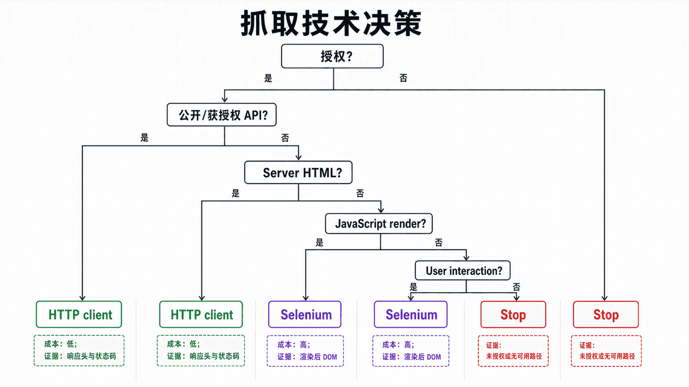
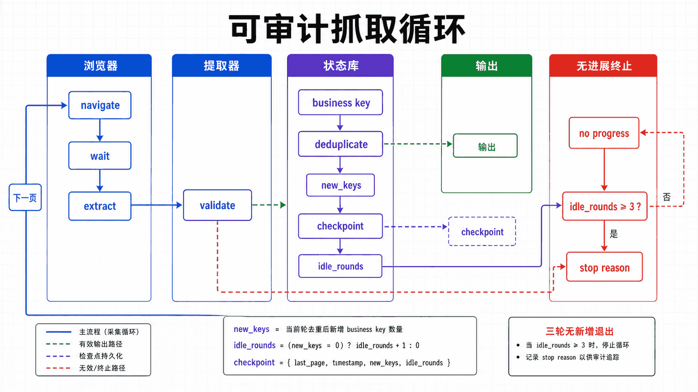

## 前置知识与学习目标

掌握动态页面的定位、等待、滚动和文件写入，并了解 HTTP API 与 robots.txt 的基本含义。

读完后，你应该能够：

- 判断何时需要浏览器渲染，何时 requests 或站点 API 更合适；
- 把采集流程拆成导航、同步、提取、校验、去重和持久化；
- 为无限滚动设置进展信号、终止条件和断点；
- 遵守授权、条款、频率、隐私和数据保留边界；

全系列沿用同一个案例：在测试环境自动化 Acme 采购门户。用户登录后搜索采购单 PO-2026-0715，在明细页导出 CSV；测试使用 data-testid 作为稳定定位契约，并把失败截图、日志和下载文件写入独立运行目录。

**本篇边界：**本篇的目标是获得授权环境中的可审计数据，不讨论伪装自动化特征、绕过访问控制或规避站点风控。

## 真实场景与核心问题

传统爬虫基于 HTTP 请求的方案在面对现代 SPA（单页应用）和动态渲染页面时显得力不从心。Selenium 能像真实浏览器一样执行 JavaScript，渲染页面，等待动态内容加载。本教程将带你从零构建一个强大的网页爬虫。

<!-- figure-anchor:s10-a01 -->

<!-- figure-managed:s10-f01:start -->



<!-- figure-managed:s10-f01:end -->

### 爬虫 vs 传统方法

```text
┌─────────────────────────────────────────────────────────────┐
│                    传统爬虫 vs Selenium 爬虫                 │
├─────────────────────────────────────────────────────────────┤
│                                                              │
│  ┌──────────────────────┐    ┌──────────────────────────┐   │
│  │    requests 爬虫     │    │    Selenium 爬虫        │   │
│  ├──────────────────────┤    ├──────────────────────────┤   │
│  │ ❌ 无法执行 JS      │    │ ✅ 完整执行 JS           │   │
│  │ ❌ 无法处理动态加载 │    │ ✅ 处理动态内容          │   │
│  │ ❌ 无法模拟登录    │    │ ✅ 支持登录会话         │   │
│  │ ✅ 速度快          │    │ ❌ 速度较慢              │   │
│  │ ✅ 资源占用少      │    │ ❌ 资源占用多            │   │
│  └──────────────────────┘    └──────────────────────────┘   │
│                                                              │
└─────────────────────────────────────────────────────────────┘
```

### 合规边界

浏览器自动化爬虫应优先用于自有系统、授权数据源或明确允许自动访问的页面。抓取前建议确认 `robots.txt`、服务条款和接口限流策略；涉及登录态、个人信息、订单、财务等敏感数据时，应只采集业务所需字段，并做好脱敏、加密和访问审计。对于第三方站点，避免绕过验证码、访问控制、付费墙或其他明确的反自动化机制。

工程上建议设置请求间隔、并发上限、失败退避和缓存机制，避免给目标服务造成额外负载。本文后面的代理、UA 和随机延迟示例仅用于测试稳定性、兼容性和授权场景下的访问控制验证，不应作为规避站点规则的手段。

## 基础爬虫架构

### 爬虫项目结构

```text
web-scraper/
├── scraper/
│   ├── __init__.py
│   ├── browser.py       # 浏览器管理
│   ├── spider.py        # 爬虫核心
│   ├── extractors.py    # 数据提取器
│   └── storage.py       # 数据存储
├── config/
│   └── settings.py
├── utils/
│   └── helpers.py
├── outputs/
└── run.py
```

### 浏览器管理

```python
# scraper/browser.py
from selenium import webdriver
from selenium.webdriver.chrome.options import Options
from selenium.webdriver.chrome.service import Service
from webdriver_manager.chrome import ChromeDriverManager

class BrowserManager:
    """浏览器管理器"""

    def __init__(self, headless=True):
        self.headless = headless
        self.driver = None

    def setup_driver(self):
        """配置浏览器驱动"""
        options = Options()

        if self.headless:
            options.add_argument("--headless")

        options.add_argument("--disable-gpu")
        options.add_argument("--no-sandbox")
        options.add_argument("--disable-dev-shm-usage")

        # 用户代理
        options.add_argument(
            "user-agent=Mozilla/5.0 (Windows NT 10.0; Win64; x64) AppleWebKit/537.36"
        )

        # 视口大小
        options.add_argument("--window-size=1920,1080")

        service = Service(ChromeDriverManager().install())
        self.driver = webdriver.Chrome(service=service, options=options)
        self.driver.implicitly_wait(10)

        return self.driver

    def quit(self):
        """关闭浏览器"""
        if self.driver:
            self.driver.quit()

    def __enter__(self):
        return self.setup_driver()

    def __exit__(self, exc_type, exc_val, exc_tb):
        self.quit()
```

## 数据提取器

### 基础提取器

```python
# scraper/extractors.py
from selenium.webdriver.common.by import By
from typing import List, Dict, Optional
import json

class DataExtractor:
    """数据提取器"""

    def __init__(self, driver):
        self.driver = driver

    def extract_text(self, selector: str) -> Optional[str]:
        """提取文本"""
        try:
            element = self.driver.find_element(By.CSS_SELECTOR, selector)
            return element.text.strip()
        except:
            return None

    def extract_attribute(self, selector: str, attribute: str) -> Optional[str]:
        """提取属性"""
        try:
            element = self.driver.find_element(By.CSS_SELECTOR, selector)
            return element.get_attribute(attribute)
        except:
            return None

    def extract_all(self, selector: str) -> List[str]:
        """提取所有匹配元素的文本"""
        try:
            elements = self.driver.find_elements(By.CSS_SELECTOR, selector)
            return [el.text.strip() for el in elements if el.text.strip()]
        except:
            return []
```

### 产品数据提取

```python
class ProductExtractor(DataExtractor):
    """产品数据提取器"""

    def extract_products(self, list_selector: str) -> List[Dict]:
        """提取产品列表"""
        products = []

        try:
            product_cards = self.driver.find_elements(By.CSS_SELECTOR, list_selector)

            for card in product_cards:
                try:
                    product = {
                        "name": self._safe_extract(card, ".product-name"),
                        "price": self._safe_extract(card, ".price"),
                        "rating": self._safe_extract(card, ".rating"),
                        "url": self._safe_extract_attr(card, "a", "href"),
                        "image": self._safe_extract_attr(card, "img", "src")
                    }
                    products.append(product)
                except Exception as e:
                    continue

        except Exception as e:
            print(f"提取产品列表失败: {e}")

        return products

    def _safe_extract(self, parent, selector):
        """安全提取文本"""
        try:
            return parent.find_element(By.CSS_SELECTOR, selector).text.strip()
        except:
            return None

    def _safe_extract_attr(self, parent, selector, attr):
        """安全提取属性"""
        try:
            return parent.find_element(By.CSS_SELECTOR, selector).get_attribute(attr)
        except:
            return None
```

## 实战案例

<!-- figure-anchor:s10-a02 -->

<!-- figure-managed:s10-f02:start -->



<!-- figure-managed:s10-f02:end -->### 电商网站爬虫

```python
# scraper/ecommerce_spider.py
from .browser import BrowserManager
from .extractors import ProductExtractor
from selenium.webdriver.support.ui import WebDriverWait
from selenium.webdriver.support import expected_conditions as EC
from selenium.common.exceptions import TimeoutException
import time

class EcommerceSpider:
    """电商网站爬虫"""

    def __init__(self, headless=True):
        self.browser_manager = BrowserManager(headless)
        self.extractor = None

    def scrape_category(self, category_url: str, max_pages: int = 5) -> list:
        """爬取分类页面"""
        all_products = []
        current_page = 1

        with self.browser_manager as driver:
            while current_page <= max_pages:
                print(f"正在爬取第 {current_page} 页...")

                # 构建 URL
                url = f"{category_url}?page={current_page}" if current_page > 1 else category_url
                driver.get(url)

                # 等待产品列表加载
                try:
                    wait = WebDriverWait(driver, 10)
                    wait.until(
                        EC.presence_of_element_located((By.CLASS_NAME, "product-item"))
                    )
                except TimeoutException:
                    print("产品列表加载超时")
                    break

                # 提取数据
                self.extractor = ProductExtractor(driver)
                products = self.extractor.extract_products(".product-card")
                all_products.extend(products)

                print(f"  提取 {len(products)} 个产品")

                # 检查是否有下一页
                try:
                    next_btn = driver.find_element(By.CSS_SELECTOR, ".pagination .next")
                    if "disabled" in next_btn.get_attribute("class"):
                        break
                    next_btn.click()
                    time.sleep(2)  # 等待页面跳转
                    current_page += 1
                except:
                    break

        return all_products

    def scrape_product_detail(self, product_url: str) -> dict:
        """爬取产品详情"""
        with self.browser_manager as driver:
            driver.get(product_url)

            self.extractor = ProductExtractor(driver)

            # 等待详情加载
            WebDriverWait(driver, 10).until(
                EC.presence_of_element_located((By.CLASS_NAME, "product-detail"))
            )

            detail = {
                "name": self.extractor.extract_text(".product-title h1"),
                "price": self.extractor.extract_text(".price-current"),
                "original_price": self.extractor.extract_text(".price-original"),
                "description": self.extractor.extract_text(".product-description"),
                "specifications": self._extract_specifications(driver),
                "images": self.extractor.extract_all(".gallery img"),
                "reviews": self._extract_reviews(driver)
            }

        return detail

    def _extract_specifications(self, driver) -> dict:
        """提取规格参数"""
        specs = {}
        try:
            rows = driver.find_elements(By.CSS_SELECTOR, ".specifications-table tr")
            for row in rows:
                cells = row.find_elements(By.TAG_NAME, "td")
                if len(cells) == 2:
                    specs[cells[0].text] = cells[1].text
        except:
            pass
        return specs

    def _extract_reviews(self, driver) -> list:
        """提取评论"""
        reviews = []
        try:
            review_elements = driver.find_elements(By.CLASS_NAME, "review-item")
            for review in review_elements:
                reviews.append({
                    "user": review.find_element(By.CLASS_NAME, "reviewer-name").text,
                    "rating": review.find_element(By.CLASS_NAME, "rating").text,
                    "content": review.find_element(By.CLASS_NAME, "review-content").text
                })
        except:
            pass
        return reviews
```

### 社交媒体爬虫

```python
# scraper/social_media_spider.py
from .browser import BrowserManager
from selenium.webdriver.support.ui import WebDriverWait
from selenium.webdriver.support import expected_conditions as EC
from selenium.common.exceptions import TimeoutException
import time

class SocialMediaSpider:
    """社交媒体爬虫"""

    def __init__(self, headless=True):
        self.browser_manager = BrowserManager(headless)

    def login(self, username: str, password: str) -> bool:
        """登录"""
        with self.browser_manager as driver:
            driver.get("https://social.example.com/login")

            try:
                WebDriverWait(driver, 10).until(
                    EC.presence_of_element_located((By.ID, "username"))
                )

                driver.find_element(By.ID, "username").send_keys(username)
                driver.find_element(By.ID, "password").send_keys(password)
                driver.find_element(By.CSS_SELECTOR, "button[type='submit']").click()

                # 等待登录成功
                WebDriverWait(driver, 10).until(
                    EC.url_contains("/home")
                )

                print("登录成功！")
                return True

            except TimeoutException:
                print("登录失败")
                return False

    def extract_posts(self, max_count: int = 20) -> list:
        """提取帖子"""
        posts = []

        with self.browser_manager as driver:
            driver.get("https://social.example.com/feed")

            # 滚动加载
            last_height = 0

            while len(posts) < max_count:
                # 获取当前可见帖子
                try:
                    post_elements = driver.find_elements(By.CLASS_NAME, "post")

                    for post in post_elements[len(posts):]:
                        try:
                            post_data = {
                                "author": post.find_element(By.CLASS_NAME, "author-name").text,
                                "content": post.find_element(By.CLASS_NAME, "post-content").text,
                                "timestamp": post.find_element(By.CLASS_NAME, "post-time").text,
                                "likes": post.find_element(By.CLASS_NAME, "like-count").text,
                            }
                            posts.append(post_data)

                            if len(posts) >= max_count:
                                break
                        except:
                            continue

                    # 滚动到页面底部
                    driver.execute_script("window.scrollTo(0, document.body.scrollHeight);")
                    time.sleep(2)

                    # 检查是否已加载全部
                    new_height = driver.execute_script("return document.body.scrollHeight")
                    if new_height == last_height:
                        break
                    last_height = new_height

                except Exception as e:
                    print(f"提取帖子出错: {e}")
                    break

        return posts
```

## 无限滚动处理

### 滚动加载爬虫

```python
# scraper/infinite_scroll.py
import time
from typing import Callable, List, Any

class InfiniteScrollHandler:
    """无限滚动处理器"""

    def __init__(self, driver):
        self.driver = driver

    def scroll_until_end(
        self,
        extract_func: Callable,
        max_scrolls: int = 10,
        scroll_delay: float = 2.0
    ) -> List[Any]:
        """
        滚动到页面底部

        Args:
            extract_func: 提取函数，返回当前页面的数据
            max_scrolls: 最大滚动次数
            scroll_delay: 滚动间隔（秒）
        """
        all_data = []
        last_height = 0
        scroll_count = 0

        while scroll_count < max_scrolls:
            # 执行滚动
            self.driver.execute_script("window.scrollTo(0, document.body.scrollHeight);")
            time.sleep(scroll_delay)

            # 提取数据
            current_data = extract_func()

            if not current_data:
                scroll_count += 1
                continue

            all_data.extend(current_data)
            print(f"已提取 {len(all_data)} 条数据")

            # 检查高度变化
            new_height = self.driver.execute_script("return document.body.scrollHeight")

            if new_height == last_height:
                # 连续两次高度不变则停止
                scroll_count += 1
                if scroll_count >= 2:
                    break
            else:
                scroll_count = 0
                last_height = new_height

        return all_data

    def scroll_to_element(self, element):
        """滚动到特定元素"""
        self.driver.execute_script("arguments[0].scrollIntoView();", element)
        time.sleep(1)
```

## 数据存储

### JSON 存储

```python
# scraper/storage.py
import json
from pathlib import Path
from datetime import datetime
from typing import List, Dict

class JSONStorage:
    """JSON 存储"""

    def __init__(self, output_dir: str = "outputs"):
        self.output_dir = Path(output_dir)
        self.output_dir.mkdir(exist_ok=True)

    def save(self, data: List[Dict], filename: str):
        """保存数据"""
        timestamp = datetime.now().strftime("%Y%m%d_%H%M%S")
        filepath = self.output_dir / f"{filename}_{timestamp}.json"

        with open(filepath, "w", encoding="utf-8") as f:
            json.dump(data, f, ensure_ascii=False, indent=2)

        print(f"数据已保存到: {filepath}")
        return filepath

    def append(self, data: Dict, filename: str):
        """追加数据"""
        filepath = self.output_dir / f"{filename}.json"

        # 读取现有数据
        existing_data = []
        if filepath.exists():
            with open(filepath, "r", encoding="utf-8") as f:
                existing_data = json.load(f)

        # 追加新数据
        existing_data.append(data)

        # 保存
        with open(filepath, "w", encoding="utf-8") as f:
            json.dump(existing_data, f, ensure_ascii=False, indent=2)

        print(f"数据已追加到: {filepath}")
```

### CSV 存储

```python
import csv
from pathlib import Path

class CSVStorage:
    """CSV 存储"""

    def __init__(self, output_dir: str = "outputs"):
        self.output_dir = Path(output_dir)
        self.output_dir.mkdir(exist_ok=True)

    def save(self, data: List[Dict], filename: str):
        """保存数据为 CSV"""
        if not data:
            print("没有数据可保存")
            return

        timestamp = datetime.now().strftime("%Y%m%d_%H%M%S")
        filepath = self.output_dir / f"{filename}_{timestamp}.csv"

        # 获取所有字段
        fieldnames = list(data[0].keys())

        with open(filepath, "w", newline="", encoding="utf-8-sig") as f:
            writer = csv.DictWriter(f, fieldnames=fieldnames)
            writer.writeheader()
            writer.writerows(data)

        print(f"CSV 已保存到: {filepath}")
        return filepath
```

## 运行爬虫

### 主程序

```python
# run.py
import argparse
from scraper.ecommerce_spider import EcommerceSpider
from scraper.social_media_spider import SocialMediaSpider
from scraper.storage import JSONStorage, CSVStorage

def main():
    parser = argparse.ArgumentParser(description="网页爬虫")
    parser.add_argument("--mode", choices=["category", "search", "detail", "social"],
                       default="category", help="爬取模式")
    parser.add_argument("--url", help="目标 URL")
    parser.add_argument("--keyword", help="搜索关键词")
    parser.add_argument("--output", choices=["json", "csv"], default="json")
    parser.add_argument("--headless", action="store_true", help="无头模式")
    args = parser.parse_args()

    storage = JSONStorage() if args.output == "json" else CSVStorage()

    if args.mode == "category":
        spider = EcommerceSpider(headless=args.headless)
        products = spider.scrape_category(args.url)
        storage.save(products, "products")

    elif args.mode == "detail":
        spider = EcommerceSpider(headless=args.headless)
        detail = spider.scrape_product_detail(args.url)
        storage.save([detail], "product_detail")

    elif args.mode == "social":
        spider = SocialMediaSpider(headless=args.headless)
        if spider.login("username", "password"):
            posts = spider.extract_posts()
            storage.save(posts, "posts")

    print("爬取完成！")

if __name__ == "__main__":
    main()
```

### 运行命令

```bash
# 爬取分类
python run.py --mode category --url "https://example.com/category/electronics"

# 爬取详情
python run.py --mode detail --url "https://example.com/product/123"

# 社交媒体爬虫
python run.py --mode social

# 带界面运行
python run.py --mode category --url "https://example.com" --headless
```

## 合规、限速与可恢复采集

在开始采集前记录授权范围、允许字段、频率上限、保留期和停止联系人。运行时以业务主键去重，为每一页保存检查点，并在连续三轮没有新增主键时停止。429、403、登录失效和条款变化都应立即停止并进入人工复核，而不是切换身份继续请求。

```python
def should_stop(new_keys: set[str], idle_rounds: int, limit: int) -> bool:
    if new_keys:
        return False
    return idle_rounds + 1 >= limit
```

输入是本轮新增业务键与连续无进展次数；输出是明确的停止决定。网络错误可在授权范围内退避重试，权限或合规错误不得自动重试。

## 常见误区与适用边界

- 动态页面不等于必须 Selenium；先检查公开 API、网络请求和服务端 HTML。
- 随机延迟、代理或修改自动化特征不是授权，也不能替代速率限制与合规评审。
- 无限滚动不能只看页面高度；应同时观察新增业务键并设置无进展上限。

## 本篇自检

<details>
<summary>1. 什么时候应从 Selenium 改用 HTTP 客户端？</summary>

当数据来自稳定、获授权的接口且不依赖浏览器执行时，HTTP 客户端更快、更易重试和测试。

</details>

<details>
<summary>2. 无限滚动的可靠终止条件是什么？</summary>

业务键连续若干轮无新增、出现明确末页标识或达到获授权上限，并记录停止原因。

</details>

<details>
<summary>3. 为什么必须保存采集时间和来源 URL？</summary>

它们用于追踪数据新鲜度、重复、变更与审计，也帮助重放失败批次。

</details>

## 本篇总结

可靠采集以授权和可审计为前提，用最轻的技术完成任务，并以业务键、终止条件、检查点和数据校验控制动态页面的不确定性。

## 下一篇衔接

下一篇把单次采集提升为 RPA 工作流，加入幂等性、检查点、重试、人工接管和运行指标。

## 资料来源与版本基线

本文以 Selenium 4 与 Python 3.10+ 为基线；具体版本与浏览器支持应以发布时的官方说明为准。

- [Organizing Selenium code: Web scraping](https://www.selenium.dev/documentation/webdriver/getting_started/using_selenium/)
- [Discouraged behaviors](https://www.selenium.dev/documentation/test_practices/discouraged/)
- [RFC 9309: Robots Exclusion Protocol](https://www.rfc-editor.org/rfc/rfc9309)
