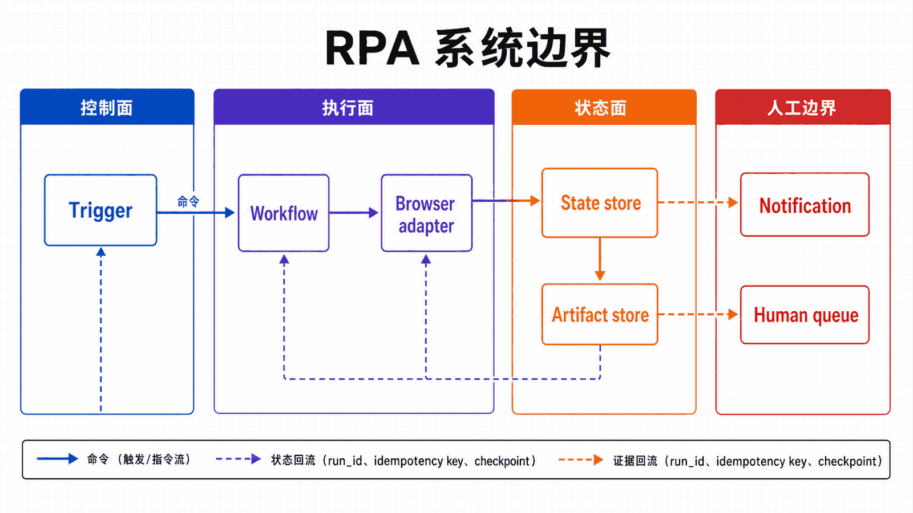
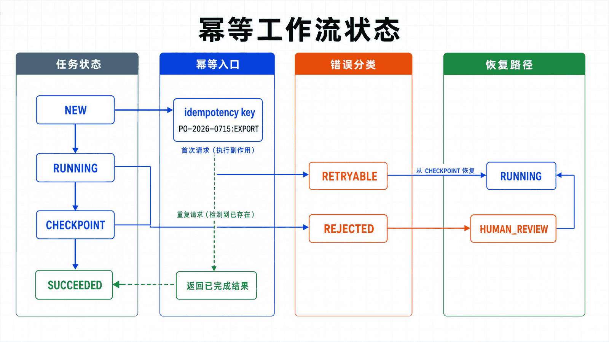

## 前置知识与学习目标

能写可复用的 Selenium 任务，理解异常、日志、配置、文件证据和基本任务调度。

读完后，你应该能够：

- 把机器人拆为触发器、工作流、浏览器适配、状态库和通知边界；
- 用业务键和检查点保证重试不会重复提交；
- 区分可重试错误、业务拒绝和需要人工处理的异常；
- 设计成功率、重试率、人工接管率和处理时长等运行指标；

全系列沿用同一个案例：在测试环境自动化 Acme 采购门户。用户登录后搜索采购单 PO-2026-0715，在明细页导出 CSV；测试使用 data-testid 作为稳定定位契约，并把失败截图、日志和下载文件写入独立运行目录。

**本篇边界：**本篇讨论生产工作流语义，不重复 Selenium 基础 API。示例以采购单 PO-2026-0715 的导出与回写为一条可恢复事务。

## 真实场景与核心问题

RPA（Robotic Process Automation，机器人流程自动化）是一种利用软件机器人自动执行重复性业务流程的技术。Selenium 作为网页自动化工具，非常适合构建网页端的 RPA 解决方案。

<!-- figure-anchor:s11-a01 -->

<!-- figure-managed:s11-f01:start -->



<!-- figure-managed:s11-f01:end -->

### RPA 系统架构

```text
┌─────────────────────────────────────────────────────────────┐
│                      RPA 系统架构                             │
├─────────────────────────────────────────────────────────────┤
│                                                              │
│  ┌────────────┐  ┌────────────┐  ┌────────────┐            │
│  │  任务调度 │  │  工作流   │  │  监控日志  │            │
│  │  Scheduler │  │  Engine  │  │  Logging  │            │
│  └────────────┘  └────────────┘  └────────────┘            │
│                                                              │
│  ┌────────────────────────────────────────────────────────┐  │
│  │                  RPA 机器人                             │  │
│  │  ┌─────────────────────────────────────────────────┐ │  │
│  │  │              Selenium WebDriver                   │ │  │
│  │  │  Browser ── Page ── Element ── Actions         │ │  │
│  │  └─────────────────────────────────────────────────┘ │  │
│  └────────────────────────────────────────────────────────┘  │
│                                                              │
└─────────────────────────────────────────────────────────────┘
```

## 基础 RPA 架构

### 配置管理

```python
# config/settings.py
from dataclasses import dataclass
import yaml
from pathlib import Path

@dataclass
class RPAConfig:
    """RPA 配置"""
    headless: bool = True
    timeout: int = 30
    screenshot_on_error: bool = True
    log_level: str = "INFO"
    retry_times: int = 3
    retry_delay: float = 2.0

class Settings:
    """全局设置"""

    BASE_DIR = Path(__file__).parent.parent
    LOG_DIR = BASE_DIR / "logs"
    OUTPUT_DIR = BASE_DIR / "outputs"

    def __init__(self):
        self.LOG_DIR.mkdir(exist_ok=True)
        self.OUTPUT_DIR.mkdir(exist_ok=True)

        self.rpa = RPAConfig()

    def load_config(self, config_file: str):
        """加载配置文件"""
        with open(config_file, "r", encoding="utf-8") as f:
            config = yaml.safe_load(f)
        self.rpa = RPAConfig(**config.get("rpa", {}))
```

### 日志系统

```python
# utils/logger.py
import logging
from pathlib import Path
from datetime import datetime

class RPALogger:
    """RPA 日志记录器"""

    def __init__(self, name: str, log_dir: Path):
        self.logger = logging.getLogger(name)
        self.logger.setLevel(logging.DEBUG)

        # 文件处理器
        log_file = log_dir / f"{name}_{datetime.now().strftime('%Y%m%d')}.log"
        fh = logging.FileHandler(log_file, encoding="utf-8")
        fh.setLevel(logging.DEBUG)
        fh.setFormatter(logging.Formatter(
            "%(asctime)s - %(name)s - %(levelname)s - %(message)s"
        ))

        # 控制台处理器
        ch = logging.StreamHandler()
        ch.setLevel(logging.INFO)
        ch.setFormatter(logging.Formatter(
            "%(asctime)s - %(levelname)s - %(message)s"
        ))

        self.logger.addHandler(fh)
        self.logger.addHandler(ch)

    def info(self, msg: str):
        self.logger.info(msg)

    def error(self, msg: str, exc_info=False):
        self.logger.error(msg, exc_info=exc_info)

    def warning(self, msg: str):
        self.logger.warning(msg)
```

### 基础机器人

```python
# robots/base_robot.py
from selenium import webdriver
from selenium.webdriver.chrome.service import Service
from selenium.webdriver.chrome.options import Options
from webdriver_manager.chrome import ChromeDriverManager
from pathlib import Path
from datetime import datetime
from functools import wraps

class BaseRobot:
    """RPA 机器人基类"""

    def __init__(self, name: str, config=None):
        self.name = name
        self.config = config
        self.driver = None

    def setup_driver(self):
        """初始化浏览器"""
        options = Options()

        if self.config and self.config.headless:
            options.add_argument("--headless")

        options.add_argument("--disable-gpu")
        options.add_argument("--no-sandbox")
        options.add_argument("--window-size=1920,1080")

        service = Service(ChromeDriverManager().install())
        self.driver = webdriver.Chrome(service=service, options=options)

        if self.config:
            self.driver.implicitly_wait(self.config.timeout)

        return self.driver

    def cleanup(self):
        """清理资源"""
        if self.driver:
            self.driver.quit()

    def screenshot(self, name=None):
        """截图"""
        if not name:
            name = f"{self.name}_{datetime.now().strftime('%H%M%S')}"

        filename = f"screenshots/{name}.png"
        Path("screenshots").mkdir(exist_ok=True)

        if self.driver:
            self.driver.save_screenshot(filename)
            self.logger.info(f"截图已保存: {filename}")

        return filename

    def retry(self, func, *args, max_attempts=None, **kwargs):
        """重试机制"""
        attempts = max_attempts or (self.config.retry_times if self.config else 3)
        delay = self.config.retry_delay if self.config else 2.0

        for i in range(attempts):
            try:
                return func(*args, **kwargs)
            except Exception as e:
                if i == attempts - 1:
                    raise
                self.logger.warning(f"尝试 {i+1} 失败: {e}，{delay}秒后重试...")
                import time
                time.sleep(delay)
```

## 工作流引擎

<!-- figure-anchor:s11-a02 -->

<!-- figure-managed:s11-f02:start -->



<!-- figure-managed:s11-f02:end -->### 工作流步骤

```python
# workflows/steps.py
from abc import ABC, abstractmethod
from dataclasses import dataclass
from typing import Any, Optional
import time

@dataclass
class StepResult:
    """步骤执行结果"""
    success: bool
    data: Any = None
    error: Optional[str] = None
    duration: float = 0.0

class WorkflowStep(ABC):
    """工作流步骤基类"""

    def __init__(self, name: str, description: str = ""):
        self.name = name
        self.description = description

    @abstractmethod
    def execute(self, context: dict) -> StepResult:
        """执行步骤"""
        pass

class NavigateStep(WorkflowStep):
    """导航步骤"""

    def __init__(self, url: str):
        super().__init__("navigate", f"导航到 {url}")
        self.url = url

    def execute(self, context: dict) -> StepResult:
        start = time.time()
        try:
            driver = context["driver"]
            driver.get(self.url)
            return StepResult(success=True, duration=time.time() - start)
        except Exception as e:
            return StepResult(success=False, error=str(e), duration=time.time() - start)

class ClickStep(WorkflowStep):
    """点击步骤"""

    def __init__(self, selector: str, by="css"):
        super().__init__("click", f"点击 {selector}")
        self.selector = selector
        self.by = by

    def execute(self, context: dict) -> StepResult:
        start = time.time()
        try:
            from selenium.webdriver.common.by import By

            by_map = {
                "id": By.ID,
                "css": By.CSS_SELECTOR,
                "xpath": By.XPATH,
                "name": By.NAME
            }

            driver = context["driver"]
            element = driver.find_element(by_map[self.by], self.selector)
            element.click()

            return StepResult(success=True, duration=time.time() - start)
        except Exception as e:
            return StepResult(success=False, error=str(e), duration=time.time() - start)

class FillStep(WorkflowStep):
    """填写步骤"""

    def __init__(self, selector: str, value: str, by="css"):
        super().__init__("fill", f"填写 {selector}")
        self.selector = selector
        self.value = value
        self.by = by

    def execute(self, context: dict) -> StepResult:
        start = time.time()
        try:
            from selenium.webdriver.common.by import By

            by_map = {
                "id": By.ID,
                "css": By.CSS_SELECTOR,
                "xpath": By.XPATH,
                "name": By.NAME
            }

            driver = context["driver"]
            element = driver.find_element(by_map[self.by], self.selector)
            element.clear()
            element.send_keys(self.value)

            return StepResult(success=True, duration=time.time() - start)
        except Exception as e:
            return StepResult(success=False, error=str(e), duration=time.time() - start)
```

### 工作流引擎

```python
# workflows/workflow_engine.py
from typing import List
from dataclasses import dataclass
import time

@dataclass
class WorkflowResult:
    """工作流执行结果"""
    workflow_name: str
    success: bool
    total_duration: float
    error: str = None

class WorkflowEngine:
    """工作流引擎"""

    def __init__(self, name: str, steps: List[WorkflowStep]):
        self.name = name
        self.steps = steps
        self.results = []

    def execute(self, driver) -> WorkflowResult:
        """执行工作流"""
        context = {"driver": driver}
        start_time = time.time()

        print(f"\n{'='*60}")
        print(f"开始执行工作流: {self.name}")
        print(f"{'='*60}\n")

        try:
            for i, step in enumerate(self.steps):
                print(f"[{i+1}/{len(self.steps)}] {step.description}")

                result = step.execute(context)
                self.results.append(result)

                if result.success:
                    print(f"    ✅ 成功 ({result.duration:.2f}s)")
                else:
                    print(f"    ❌ 失败: {result.error}")
                    raise Exception(result.error)

                print()

            success = True
            error = None

        except Exception as e:
            success = False
            error = str(e)

        total_duration = time.time() - start_time

        result = WorkflowResult(
            workflow_name=self.name,
            success=success,
            total_duration=total_duration,
            error=error
        )

        print(f"\n{'='*60}")
        if success:
            print(f"✅ 工作流执行成功! 总耗时: {total_duration:.2f}s")
        else:
            print(f"❌ 工作流执行失败: {error}")
        print(f"{'='*60}\n")

        return result
```

## 实战案例

### 订单处理机器人

```python
# robots/order_robot.py
from .base_robot import BaseRobot
from workflows.steps import *
from workflows.workflow_engine import WorkflowEngine
from datetime import datetime

class OrderProcessingRobot(BaseRobot):
    """订单处理机器人"""

    def __init__(self, order_id: str, config=None):
        super().__init__(f"order_robot_{order_id}", config)
        self.order_id = order_id
        self.logger = None

    def run(self):
        """运行订单处理"""
        try:
            self.setup_driver()

            # 创建工作流
            workflow = WorkflowEngine(
                name=f"处理订单 {self.order_id}",
                steps=[
                    NavigateStep("https://order.example.com/login"),
                    WaitStep(By.ID, "username"),
                    FillStep("#username", "admin", "css"),
                    FillStep("#password", "password123", "css"),
                    ClickStep("#login-btn", "css"),
                    WaitStep(By.CSS_SELECTOR, ".dashboard"),
                    NavigateStep(f"https://order.example.com/order/{self.order_id}"),
                    WaitStep(By.CLASS_NAME, "order-detail"),
                    ClickStep("button.confirm", "css"),
                    WaitStep(By.CLASS_NAME, "confirmation-modal"),
                    ClickStep("button.confirm-action", "css"),
                    WaitStep(By.CLASS_NAME, "success-message")
                ]
            )

            result = workflow.execute(self.driver)

            if result.success:
                self.logger.info(f"订单 {self.order_id} 处理成功")
            else:
                self.logger.error(f"订单 {self.order_id} 处理失败: {result.error}")
                self.screenshot(f"order_error_{self.order_id}")

            return result

        except Exception as e:
            self.logger.error(f"订单处理异常: {e}")
            self.screenshot(f"order_exception_{self.order_id}")
            raise
        finally:
            self.cleanup()
```

### 报表生成机器人

```python
# robots/report_robot.py
from .base_robot import BaseRobot
from workflows.steps import *
from workflows.workflow_engine import WorkflowEngine
from pathlib import Path

class ReportGenerationRobot(BaseRobot):
    """报表生成机器人"""

    def __init__(self, report_type: str, date_range: tuple, config=None):
        super().__init__(f"report_robot_{report_type}", config)
        self.report_type = report_type
        self.start_date, self.end_date = date_range

    def run(self):
        """运行报表生成"""
        try:
            self.setup_driver()

            # 创建工作流
            workflow = WorkflowEngine(
                name=f"生成 {self.report_type} 报表",
                steps=[
                    NavigateStep("https://report.example.com/login"),
                    FillStep("input[name='username']", "reporter", "css"),
                    FillStep("input[name='password']", "report123", "css"),
                    ClickStep("button[type='submit']", "css"),
                    WaitStep(By.CLASS_NAME, "dashboard"),
                    NavigateStep("https://report.example.com/reports"),
                    ClickStep(f".report-{self.report_type}", "css"),
                    FillStep("input[name='start_date']", self.start_date, "css"),
                    FillStep("input[name='end_date']", self.end_date, "css"),
                    ClickStep("button.apply-filter", "css"),
                    WaitStep(By.CLASS_NAME, "report-content"),
                    ClickStep("button.export", "css")
                ]
            )

            result = workflow.execute(self.driver)

            if result.success:
                self.logger.info(f"报表 {self.report_type} 生成成功")
                self._download_report()
            else:
                self.logger.error(f"报表生成失败: {result.error}")

            return result

        except Exception as e:
            self.logger.error(f"报表生成异常: {e}")
            self.screenshot(f"report_exception_{self.report_type}")
            raise
        finally:
            self.cleanup()

    def _download_report(self):
        """下载报表"""
        from pathlib import Path

        output_dir = Path("outputs")
        output_dir.mkdir(exist_ok=True)

        # 等待下载完成
        import time
        time.sleep(5)

        # 移动或处理下载的文件
        self.logger.info("报表已生成")
```

## 任务调度

### APScheduler 集成

```python
# scheduler.py
from apscheduler.schedulers.blocking import BlockingScheduler
from apscheduler.triggers.cron import CronTrigger
from apscheduler.triggers.interval import IntervalTrigger
from datetime import datetime

class RPAScheduler:
    """RPA 任务调度器"""

    def __init__(self):
        self.scheduler = BlockingScheduler()
        self.logger = None

    def add_job(self, func, trigger: str, **kwargs):
        """添加任务"""
        if trigger == "cron":
            cron_kwargs = {
                k: v for k, v in kwargs.items()
                if k in ["second", "minute", "hour", "day", "month", "weekday"]
            }
            job_id = kwargs.get("id", func.__name__)
            self.scheduler.add_job(
                func,
                CronTrigger(**cron_kwargs),
                id=job_id,
                replace_existing=True
            )
            self.logger.info(f"已添加 Cron 任务: {job_id}")

        elif trigger == "interval":
            interval_kwargs = {
                k: v for k, v in kwargs.items()
                if k in ["seconds", "minutes", "hours", "days"]
            }
            job_id = kwargs.get("id", func.__name__)
            self.scheduler.add_job(
                func,
                IntervalTrigger(**interval_kwargs),
                id=job_id,
                replace_existing=True
            )
            self.logger.info(f"已添加 Interval 任务: {job_id}")

    def start(self):
        """启动调度器"""
        self.logger.info("调度器启动...")
        self.scheduler.start()

    def stop(self):
        """停止调度器"""
        self.scheduler.shutdown()
        self.logger.info("调度器已停止")
```

### 使用示例

```python
# 任务定义
def daily_order_processing():
    """每日订单处理"""
    from robots.order_robot import OrderProcessingRobot
    from config.settings import Settings

    settings = Settings()
    robot = OrderProcessingRobot(order_id="daily", config=settings.rpa)
    robot.run()

def generate_daily_report():
    """生成日报"""
    from robots.report_robot import ReportGenerationRobot
    from config.settings import Settings
    from datetime import datetime, timedelta

    settings = Settings()
    yesterday = (datetime.now() - timedelta(days=1)).strftime("%Y-%m-%d")
    today = datetime.now().strftime("%Y-%m-%d")

    robot = ReportGenerationRobot(
        report_type="sales",
        date_range=(yesterday, today),
        config=settings.rpa
    )
    robot.run()

# 调度任务
scheduler = RPAScheduler()
scheduler.add_job(
    daily_order_processing,
    trigger="cron",
    hour=8,
    minute=0,
    id="daily_order_processing"
)
scheduler.start()
```

## 监控和通知

### 通知系统

```python
# utils/notifier.py
import requests

class EmailNotifier:
    """邮件通知"""

    def __init__(self, smtp_server, port, username, password, to_emails):
        self.smtp_server = smtp_server
        self.port = port
        self.username = username
        self.password = password
        self.to_emails = to_emails

    def send(self, title: str, message: str):
        """发送邮件"""
        import smtplib
        from email.mime.text import MIMEText
        from email.mime.multipart import MIMEMultipart

        msg = MIMEMultipart()
        msg["From"] = self.username
        msg["To"] = ", ".join(self.to_emails)
        msg["Subject"] = title
        msg.attach(MIMEText(message, "plain"))

        with smtplib.SMTP(self.smtp_server, self.port) as server:
            server.starttls()
            server.login(self.username, self.password)
            server.send_message(msg)

class WebhookNotifier:
    """Webhook 通知"""

    def __init__(self, webhook_url: str):
        self.webhook_url = webhook_url

    def send(self, title: str, message: str):
        """发送 Webhook 通知"""
        data = {
            "msgtype": "markdown",
            "markdown": {
                "title": title,
                "text": f"## {title}\n\n{message}"
            }
        }

        try:
            response = requests.post(self.webhook_url, json=data)
            response.raise_for_status()
        except Exception as e:
            print(f"Webhook 通知发送失败: {e}")
```

### 监控集成

```python
# utils/monitor.py
from dataclasses import dataclass
from datetime import datetime
import json
from pathlib import Path

@dataclass
class RobotMetrics:
    """机器人指标"""
    robot_name: str
    start_time: datetime
    end_time: datetime
    duration: float
    success: bool
    error: str = None

class MetricsCollector:
    """指标收集器"""

    def __init__(self, storage_path: str = "metrics.json"):
        self.storage_path = Path(storage_path)
        self.metrics = []

    def record(self, metrics: RobotMetrics):
        """记录指标"""
        self.metrics.append(metrics)
        self._persist()

    def _persist(self):
        """持久化"""
        data = [
            {
                "robot_name": m.robot_name,
                "start_time": m.start_time.isoformat(),
                "end_time": m.end_time.isoformat(),
                "duration": m.duration,
                "success": m.success,
                "error": m.error
            }
            for m in self.metrics
        ]

        with open(self.storage_path, "w", encoding="utf-8") as f:
            json.dump(data, f, ensure_ascii=False, indent=2)

    def get_summary(self) -> dict:
        """获取统计摘要"""
        total = len(self.metrics)
        success = sum(1 for m in self.metrics if m.success)

        return {
            "total_runs": total,
            "success_rate": success / total if total > 0 else 0,
            "avg_duration": sum(m.duration for m in self.metrics) / total if total > 0 else 0
        }
```

## 常见误区与适用边界

- 捕获所有 Exception 后重试会重复业务副作用；重试前必须知道上一步是否已提交。
- 定时任务触发成功不等于业务成功；状态应落到持久化运行记录。
- RPA 不是无人值守的同义词；高风险分支需要人工接管、审批和可追溯输入。

## 本篇自检

<details>
<summary>1. 什么是本案例的幂等键？</summary>

可使用采购单号与动作类型组成业务键，例如 PO-2026-0715:EXPORT，防止同一动作重复提交。

</details>

<details>
<summary>2. 哪些异常不应自动重试？</summary>

权限拒绝、业务校验失败、页面结构契约变化和需要审批的操作；它们应进入人工或开发处理队列。

</details>

<details>
<summary>3. 成功率为什么不能单独作为 RPA 健康指标？</summary>

机器人可能通过跳过任务提高成功率；还要看吞吐、积压、重试、人工接管、数据正确性和时效。

</details>

## 本篇总结

生产 RPA 的核心不是更长的 Selenium 脚本，而是可恢复工作流：幂等键、检查点、错误分类、人工边界、证据与指标。

## 下一篇衔接

下一篇介绍受控 JavaScript 执行，只在标准 WebDriver API 无法表达观察或诊断时跨越这一边界。

## 资料来源与版本基线

本文以 Selenium 4 与 Python 3.10+ 为基线；具体版本与浏览器支持应以发布时的官方说明为准。

- [Selenium test practices](https://www.selenium.dev/documentation/test_practices/)
- [Avoid sharing state](https://www.selenium.dev/documentation/test_practices/encouraged/avoid_sharing_state/)
- [APScheduler user guide](https://apscheduler.readthedocs.io/en/master/userguide.html)
