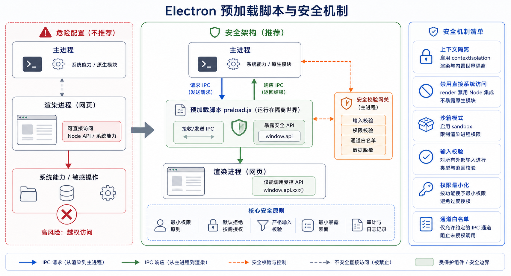

## 概述

预加载脚本（Preload Script）是 Electron 安全架构的核心组件，它在渲染进程加载之前执行，可以安全地暴露主进程 API 给渲染进程，同时保持**上下文隔离（Context Isolation）**。🔐



## 为什么需要预加载脚本

### 安全问题

如果直接在渲染进程中启用 Node.js 集成，会带来严重的安全风险：

```
┌─────────────────────────────────────────────────────────────┐
│                    危险的安全配置                              │
├─────────────────────────────────────────────────────────────┤
│                                                              │
│  ❌ webPreferences: {                                        │
│       nodeIntegration: true,      // 危险！                  │
│       contextIsolation: false     // 危险！                  │
│     }                                                        │
│                                                              │
│  在渲染进程中：                                               │
│  ├── require('fs').readFile('/etc/passwd')  // 可读取系统文件 │
│  ├── child_process.exec('rm -rf /')          // 可执行命令    │
│  └── 任何 Node.js 能力                                      │
│                                                              │
└─────────────────────────────────────────────────────────────┘
```

### 解决方案

预加载脚本提供了一种安全的方式来暴露 API：

```
┌─────────────────────────────────────────────────────────────┐
│                    安全的架构模式                              │
├─────────────────────────────────────────────────────────────┤
│                                                              │
│  ┌─────────────────────────────────────────────────────┐   │
│  │                    主进程                             │   │
│  │   └── 完整的 Node.js 和 Electron API 访问权限        │   │
│  └─────────────────────────────────────────────────────┘   │
│                            │                                │
│                     IPC 通信                                  │
│                            │                                │
│  ┌─────────────────────────────────────────────────────┐   │
│  │              preload.js（预加载脚本）                  │   │
│  │   └── 暴露受控的 API                                  │   │
│  └─────────────────────────────────────────────────────┘   │
│                            │                                │
│  ┌─────────────────────────────────────────────────────┐   │
│  │                    渲染进程                           │   │
│  │   └── 只能通过 window 对象访问预加载暴露的 API        │   │
│  └─────────────────────────────────────────────────────┘   │
│                                                              │
└─────────────────────────────────────────────────────────────┘
```

## 预加载脚本基础

### 基本配置

```javascript
// main.js
const { app, BrowserWindow } = require('electron');
const path = require('path');

app.whenReady().then(() => {
  const win = new BrowserWindow({
    width: 1200,
    height: 800,
    webPreferences: {
      preload: path.join(__dirname, 'preload.js'),
      contextIsolation: true,      // 启用上下文隔离（推荐）
      nodeIntegration: false,       // 禁用 Node.js 集成（推荐）
      sandbox: true                 // 启用沙箱（推荐）
    }
  });

  win.loadFile('index.html');
});
```

### 预加载脚本结构

```javascript
// preload.js
const { contextBridge, ipcRenderer } = require('electron');

// 安全地暴露 API
contextBridge.exposeInMainWorld('electronAPI', {
  // 暴露属性
  version: process.versions.electron,

  // 暴露方法
  readFile: (filePath) => ipcRenderer.invoke('read-file', filePath),

  // 暴露异步方法
  saveFile: async (filePath, content) => {
    return await ipcRenderer.invoke('save-file', filePath, content);
  }
});
```

### 渲染进程中使用

```html
<!DOCTYPE html>
<html>
<head>
  <meta charset="UTF-8">
  <title>预加载脚本示例</title>
</head>
<body>
  <h1>预加载脚本示例</h1>
  <p>版本: <span id="version"></span></p>
  <button id="readBtn">读取文件</button>

  <script src="renderer.js"></script>
</body>
</html>
```

```javascript
// renderer.js
// 使用预加载暴露的 API
document.getElementById('version').textContent = window.electronAPI.version;

document.getElementById('readBtn').addEventListener('click', async () => {
  const content = await window.electronAPI.readFile('/path/to/file.txt');
  console.log('文件内容:', content);
});
```

## contextBridge API

### 暴露多个 API

```javascript
// preload.js
const { contextBridge, ipcRenderer } = require('electron');

// 文件操作 API
contextBridge.exposeInMainWorld('fileAPI', {
  read: (filePath) => ipcRenderer.invoke('file:read', filePath),
  write: (filePath, content) => ipcRenderer.invoke('file:write', filePath, content),
  exists: (filePath) => ipcRenderer.invoke('file:exists', filePath)
});

// 对话框 API
contextBridge.exposeInMainWorld('dialogAPI', {
  openFile: () => ipcRenderer.invoke('dialog:open-file'),
  saveFile: () => ipcRenderer.invoke('dialog:save-file'),
  showMessage: (options) => ipcRenderer.invoke('dialog:show-message', options)
});

// 系统 API
contextBridge.exposeInMainWorld('systemAPI', {
  platform: process.platform,
  arch: process.arch,
  getAppPath: () => ipcRenderer.invoke('system:get-app-path'),
  getClipboard: () => ipcRenderer.invoke('system:get-clipboard')
});

// 窗口控制 API
contextBridge.exposeInMainWorld('windowAPI', {
  minimize: () => ipcRenderer.send('window:minimize'),
  maximize: () => ipcRenderer.send('window:maximize'),
  close: () => ipcRenderer.send('window:close'),
  isMaximized: () => ipcRenderer.invoke('window:is-maximized')
});
```

### 使用命名空间

```javascript
// preload.js - 推荐：使用命名空间避免命名冲突
contextBridge.exposeInMainWorld('electronAPI', {
  // 文件相关
  file: {
    read: (path) => ipcRenderer.invoke('file:read', path),
    write: (path, data) => ipcRenderer.invoke('file:write', path, data),
    select: () => ipcRenderer.invoke('dialog:select-file')
  },

  // 窗口相关
  window: {
    minimize: () => ipcRenderer.send('window:minimize'),
    maximize: () => ipcRenderer.send('window:maximize'),
    close: () => ipcRenderer.send('window:close')
  },

  // 应用相关
  app: {
    getName: () => ipcRenderer.invoke('app:get-name'),
    getVersion: () => ipcRenderer.invoke('app:get-version'),
    quit: () => ipcRenderer.send('app:quit')
  }
});
```

```javascript
// renderer.js - 使用命名空间的 API
const fileContent = await window.electronAPI.file.read('/path/to/file.txt');
await window.electronAPI.file.write('/path/to/output.txt', 'Hello');

window.electronAPI.window.minimize();
window.electronAPI.app.quit();
```

### 暴露函数式 API

```javascript
// preload.js - 暴露完整的函数式 API
contextBridge.exposeInMainWorld('electronAPI', {
  // 带参数验证的方法
  readFile: (filePath) => {
    if (typeof filePath !== 'string') {
      throw new Error('filePath must be a string');
    }
    return ipcRenderer.invoke('file:read', filePath);
  },

  // 带回调的方法（不推荐，但仍支持）
  readFileWithCallback: (filePath, callback) => {
    ipcRenderer.invoke('file:read', filePath)
      .then(result => callback(null, result))
      .catch(error => callback(error));
  },

  // 返回 Promise 的方法
  async readFileAsync(filePath) {
    return await ipcRenderer.invoke('file:read', filePath);
  }
});
```

## IPC 通信处理

### 主进程处理 IPC

```javascript
// main.js
const { ipcMain, dialog, clipboard, app } = require('electron');
const fs = require('fs').promises;

// 文件读取
ipcMain.handle('file:read', async (event, filePath) => {
  try {
    const content = await fs.readFile(filePath, 'utf-8');
    return { success: true, data: content };
  } catch (error) {
    return { success: false, error: error.message };
  }
});

// 文件写入
ipcMain.handle('file:write', async (event, filePath, content) => {
  try {
    await fs.writeFile(filePath, content, 'utf-8');
    return { success: true };
  } catch (error) {
    return { success: false, error: error.message };
  }
});

// 对话框
ipcMain.handle('dialog:select-file', async (event) => {
  const result = await dialog.showOpenDialog({
    properties: ['openFile'],
    filters: [
      { name: '文本文件', extensions: ['txt', 'md', 'json'] },
      { name: '所有文件', extensions: ['*'] }
    ]
  });
  return result;
});

// 应用信息
ipcMain.handle('app:get-name', () => app.getName());
ipcMain.handle('app:get-version', () => app.getVersion());
ipcMain.handle('app:get-path', () => app.getPath('userData'));

// 窗口控制
ipcMain.on('window:minimize', (event) => {
  const win = BrowserWindow.fromWebContents(event.sender);
  win.minimize();
});

ipcMain.on('window:maximize', (event) => {
  const win = BrowserWindow.fromWebContents(event.sender);
  if (win.isMaximized()) {
    win.unmaximize();
  } else {
    win.maximize();
  }
});

ipcMain.on('window:close', (event) => {
  const win = BrowserWindow.fromWebContents(event.sender);
  win.close();
});

ipcMain.handle('window:is-maximized', (event) => {
  const win = BrowserWindow.fromWebContents(event.sender);
  return win.isMaximized();
});
```

### 一对一和一对多通信

```javascript
// preload.js

// 一对一通信（返回到发送方）
contextBridge.exposeInMainWorld('api', {
  // invoke/handle 方式 - 可以返回结果
  getData: (...args) => ipcRenderer.invoke('get-data', ...args),

  // send/on 方式 - 单向发送
  notifyServer: (data) => ipcRenderer.send('notify-server', data)
});

// 一对多通信（广播给所有窗口）
ipcRenderer.on('refresh-data', (event, data) => {
  // 所有监听者都会收到
});

ipcMain.handle('broadcast-update', (event, data) => {
  BrowserWindow.getAllWindows().forEach(win => {
    win.webContents.send('refresh-data', data);
  });
});
```

## 安全配置详解

### 配置项说明

| 配置项 | 说明 | 推荐值 |
|--------|------|--------|
| `contextIsolation` | 隔离渲染进程和预加载脚本的上下文 | `true` |
| `nodeIntegration` | 是否在渲染进程中启用 Node.js | `false` |
| `sandbox` | 是否启用沙箱模式 | `true` |
| `webSecurity` | 启用同源策略等安全策略 | `true` |
| `allowRunningInsecureContent` | 允许加载 HTTP 内容 | `false` |

### 推荐的安全配置

```javascript
const { app, BrowserWindow } = require('electron');

function createWindow() {
  const win = new BrowserWindow({
    width: 1200,
    height: 800,
    webPreferences: {
      // 预加载脚本路径
      preload: path.join(__dirname, 'preload.js'),

      // 隔离上下文 - 必须开启
      contextIsolation: true,

      // 禁用 Node.js 集成 - 必须禁用
      nodeIntegration: false,

      // 启用沙箱 - 推荐开启
      sandbox: true,

      // 同源策略 - 保持开启
      webSecurity: true,

      // 禁用远程模块
      enableRemoteModule: false
    }
  });

  win.loadFile('index.html');
}

app.whenReady().then(createWindow);
```

### 沙箱模式注意事项

启用沙箱后，预加载脚本会运行在受限环境中：

```javascript
// preload.js
const { contextBridge, ipcRenderer } = require('electron');

// 沙箱模式下仍然可以使用 contextBridge
// 但某些 Node.js 模块可能受限
contextBridge.exposeInMainWorld('api', {
  // 所有系统操作都通过 IPC 调用主进程
  systemAction: () => ipcRenderer.invoke('system-action')
});
```

## 高级用法

### 双向通信

```javascript
// preload.js - 双向通信
const { contextBridge, ipcRenderer } = require('electron');

let callbackId = 0;
const callbacks = new Map();

contextBridge.exposeInMainWorld('api', {
  // 调用并获取结果
  invoke: (channel, ...args) => ipcRenderer.invoke(channel, ...args),

  // 发送事件
  send: (channel, ...args) => ipcRenderer.send(channel, ...args),

  // 接收事件
  on: (channel, callback) => {
    const subscription = (event, ...args) => callback(...args);
    ipcRenderer.on(channel, subscription);
    return () => ipcRenderer.removeListener(channel, subscription);
  },

  // 一次性事件
  once: (channel, callback) => {
    ipcRenderer.once(channel, (event, ...args) => callback(...args));
  }
});
```

```javascript
// renderer.js
// 安全的双向通信
window.api.on('server-update', (data) => {
  console.log('收到服务器更新:', data);
});

const result = await window.api.invoke('get-data', { id: 1 });
```

### TypeScript 类型定义

```typescript
// preload.d.ts
interface FileAPI {
  read(path: string): Promise<string>;
  write(path: string, content: string): Promise<void>;
  select(): Promise<{ canceled: boolean; filePaths: string[] }>;
}

interface WindowAPI {
  minimize(): void;
  maximize(): void;
  close(): void;
  isMaximized(): Promise<boolean>;
}

interface ElectronAPI {
  file: FileAPI;
  window: WindowAPI;
  platform: string;
}

declare global {
  interface Window {
    electronAPI: ElectronAPI;
  }
}
```

```html
<!-- index.html -->
<script src="renderer.js"></script>
<!-- 加载类型定义文件 -->
<script src="../preload.d.ts"></script>
```

### 安全过滤

```javascript
// preload.js - 添加安全过滤
const ALLOWED_CHANNELS = [
  'file:read',
  'file:write',
  'dialog:open',
  'app:get-info'
];

const DISALLOWED_PATTERNS = [
  /^\.\./,  // 禁止父目录访问
  /\/etc\//, // 禁止系统目录
  /\/root\//
];

contextBridge.exposeInMainWorld('api', {
  invoke: (channel, ...args) => {
    if (!ALLOWED_CHANNELS.includes(channel)) {
      throw new Error(`Channel ${channel} is not allowed`);
    }
    return ipcRenderer.invoke(channel, ...args);
  }
});
```

## 常见错误处理

### 错误处理模式

```javascript
// preload.js
contextBridge.exposeInMainWorld('api', {
  safeOperation: async (...args) => {
    try {
      const result = await ipcRenderer.invoke('operation', ...args);
      return { success: true, data: result };
    } catch (error) {
      return { success: false, error: error.message };
    }
  }
});
```

```javascript
// renderer.js
const result = await window.api.safeOperation();

if (result.success) {
  console.log('操作成功:', result.data);
} else {
  console.error('操作失败:', result.error);
}
```

## 总结

预加载脚本是 Electron 安全架构的关键：

| 概念 | 说明 |
|------|------|
| **contextBridge** | 在渲染进程中暴露安全的 API |
| **contextIsolation** | 隔离预加载脚本和渲染进程的上下文 |
| **nodeIntegration** | 应该禁用，避免暴露 Node.js 能力 |
| **sandbox** | 启用沙箱模式增强安全性 |
| **IPC 通信** | 所有系统操作都通过 IPC 调用主进程 |

正确使用预加载脚本可以让你的应用在保持功能的同时，确保安全性。🔒

下一篇文章我们将学习 **IPC 通信机制详解**，敬请期待！💪
