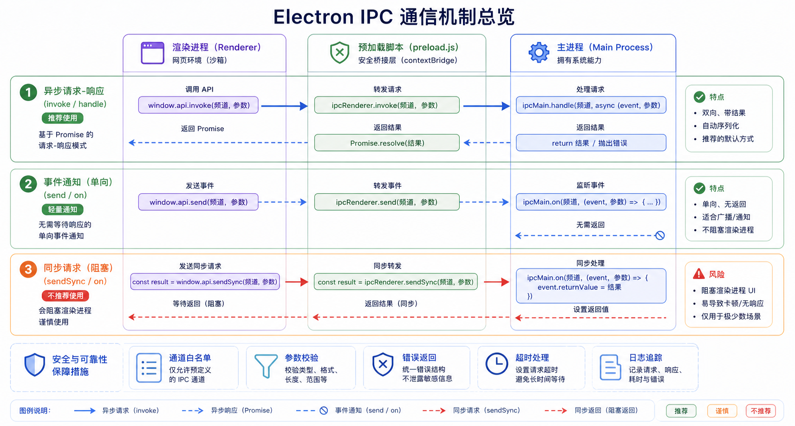

## 概述

IPC（Inter-Process Communication，进程间通信）是 Electron 中主进程和渲染进程之间通信的桥梁。由于渲染进程无法直接访问 Node.js 和系统资源，所有跨进程的操作都需要通过 IPC 完成。🔄



## IPC 通信方式

Electron 提供了三种主要的 IPC 通信方式：

```
┌─────────────────────────────────────────────────────────────┐
│                    IPC 通信方式对比                           │
├─────────────────────────────────────────────────────────────┤
│                                                              │
│  ┌─────────────────┐  ┌─────────────────┐  ┌─────────────┐  │
│  │  invoke/handle   │  │    send/on     │  │ sendSync/on │  │
│  ├─────────────────┤  ├─────────────────┤  ├─────────────┤  │
│  │   异步双向通信   │  │   单向异步通信  │  │  同步通信   │  │
│  ├─────────────────┤  ├─────────────────┤  ├─────────────┤  │
│  │   ✅ 推荐使用   │  │   推荐使用     │  │ ❌ 不推荐   │  │
│  └─────────────────┘  └─────────────────┘  └─────────────┘  │
│                                                              │
└─────────────────────────────────────────────────────────────┘
```

| 方式 | 特点 | 使用场景 |
|------|------|----------|
| **invoke/handle** | 异步请求-响应，可返回结果 | 大部分场景，推荐 |
| **send/on** | 单向发送，无需等待响应 | 事件通知 |
| **sendSync/on** | 同步阻塞，不推荐 | 仅紧急同步操作 |

## invoke/handle 模式

### 基础用法

invoke/handle 是 Electron 推荐的通信方式，支持异步请求和响应：

```javascript
// main.js - 处理方
const { ipcMain } = require('electron');

ipcMain.handle('get-user-info', async (event, userId) => {
  // 模拟获取用户信息
  return {
    id: userId,
    name: '张三',
    email: 'zhangsan@example.com'
  };
});

ipcMain.handle('save-data', async (event, data) => {
  const fs = require('fs').promises;
  await fs.writeFile('data.json', JSON.stringify(data));
  return { success: true };
});
```

```javascript
// preload.js - 暴露 API
const { contextBridge, ipcRenderer } = require('electron');

contextBridge.exposeInMainWorld('api', {
  getUserInfo: (userId) => ipcRenderer.invoke('get-user-info', userId),
  saveData: (data) => ipcRenderer.invoke('save-data', data)
});
```

```javascript
// renderer.js - 调用方
async function loadUser() {
  const user = await window.api.getUserInfo(123);
  console.log('用户信息:', user);
}

async function saveUserData() {
  const result = await window.api.saveData({ name: '测试' });
  console.log('保存结果:', result);
}
```

### 错误处理

```javascript
// main.js
ipcMain.handle('risky-operation', async (event) => {
  try {
    // 可能失败的操作
    throw new Error('操作失败');
  } catch (error) {
    // 可以抛出错误让调用方处理
    throw error;
  }
});
```

```javascript
// renderer.js
try {
  const result = await window.api.riskyOperation();
} catch (error) {
  console.error('错误:', error.message);
}
```

### Promise.all 并行调用

```javascript
// renderer.js - 并行获取多个数据
const [user, posts, comments] = await Promise.all([
  window.api.getUserInfo(1),
  window.api.getPosts(1),
  window.api.getComments(1)
]);
```

## send/on 模式

### 单向通知

send/on 用于单向消息发送，发送方不等待响应：

```javascript
// main.js - 监听方
const { ipcMain } = require('electron');

ipcMain.on('log-message', (event, message) => {
  console.log('收到日志:', message);
});

ipcMain.on('window-minimize', (event) => {
  const win = BrowserWindow.fromWebContents(event.sender);
  win.minimize();
});
```

```javascript
// preload.js
contextBridge.exposeInMainWorld('api', {
  logMessage: (message) => ipcRenderer.send('log-message', message),
  minimizeWindow: () => ipcRenderer.send('window-minimize')
});
```

```javascript
// renderer.js
window.api.logMessage('用户点击了按钮');
window.api.minimizeWindow();
```

### 接收渲染进程事件

```javascript
// renderer.js - 发送事件
window.api.sendEvent('file-dropped', { files: ['a.txt', 'b.txt'] });
```

```javascript
// main.js - 接收事件
ipcMain.on('file-dropped', (event, data) => {
  console.log('拖拽的文件:', data.files);
});
```

## sendSync/on 模式

### 同步通信（不推荐）

sendSync/on 是同步的，会阻塞主进程，应尽量避免使用：

```javascript
// main.js
ipcMain.on('sync-get-value', (event) => {
  // 同步返回
  event.returnValue = '同步返回值';
});
```

```javascript
// renderer.js - 同步调用（阻塞）
const value = window.api.syncGetValue();
console.log('同步值:', value);
```

### 同步 vs 异步对比

```javascript
// ❌ 同步 - 不推荐
const result = ipcRenderer.sendSync('sync-operation');
console.log(result);

// ✅ 异步 - 推荐
const result = await ipcRenderer.invoke('async-operation');
console.log(result);
```

## 主进程发送消息到渲染进程

### 向指定窗口发送

```javascript
// main.js - 主动推送消息到渲染进程
function sendUpdateToWindow(win, data) {
  win.webContents.send('data-update', data);
}

// 定时发送更新
setInterval(() => {
  const allWindows = BrowserWindow.getAllWindows();
  allWindows.forEach(win => {
    win.webContents.send('time-update', Date.now());
  });
}, 1000);
```

```javascript
// renderer.js - 接收主进程推送的消息
window.api.on('data-update', (data) => {
  console.log('收到数据更新:', data);
  updateUI(data);
});

window.api.on('time-update', (timestamp) => {
  console.log('当前时间:', new Date(timestamp));
});
```

### 双向通信示例

```javascript
// main.js - 处理请求并获取发送者窗口
ipcMain.handle('process-data', async (event, data) => {
  const win = BrowserWindow.fromWebContents(event.sender);
  console.log('发送者窗口:', win.getTitle());

  // 处理数据
  const result = await processData(data);

  // 发送进度更新
  win.webContents.send('process-progress', 50);
  win.webContents.send('process-progress', 100);

  return result;
});
```

## IPC 通信模式

### 请求-响应模式

```javascript
// main.js
ipcMain.handle('request', async (event, params) => {
  // 验证请求
  if (!params) {
    throw new Error('参数错误');
  }

  // 处理请求
  const result = await handleRequest(params);

  return result;
});
```

```javascript
// renderer.js
const result = await window.api.request({ id: 1, action: 'query' });
```

### 发布-订阅模式

```javascript
// main.js - 广播消息到所有窗口
ipcMain.handle('broadcast-announcement', async (event, announcement) => {
  BrowserWindow.getAllWindows().forEach(win => {
    win.webContents.send('announcement', announcement);
  });
  return { sent: true };
});
```

```javascript
// renderer.js - 订阅消息
window.api.on('announcement', (data) => {
  showNotification(data.title, data.message);
});
```

### 事件流模式

```javascript
// main.js - 发送多个事件
ipcMain.handle('start-task', async (event, taskId) => {
  const win = BrowserWindow.fromWebContents(event.sender);

  for (let i = 1; i <= 100; i += 10) {
    win.webContents.send('task-progress', { taskId, progress: i });
    await delay(100); // 模拟耗时操作
  }

  win.webContents.send('task-complete', { taskId });
  return { success: true };
});
```

```javascript
// renderer.js - 处理事件流
async function startTask(taskId) {
  window.api.on('task-progress', ({ taskId, progress }) => {
    updateProgressBar(progress);
  });

  window.api.on('task-complete', ({ taskId }) => {
    showMessage('任务完成！');
  });

  await window.api.startTask(taskId);
}
```

## 完整示例

### 聊天应用

```javascript
// main.js - 聊天消息处理
const { ipcMain, BrowserWindow } = require('electron');

const chatMessages = [];

ipcMain.handle('send-message', async (event, message) => {
  const chatMessage = {
    id: Date.now(),
    content: message.content,
    sender: message.sender,
    timestamp: new Date().toISOString()
  };

  chatMessages.push(chatMessage);

  // 广播消息到所有窗口
  BrowserWindow.getAllWindows().forEach(win => {
    win.webContents.send('new-message', chatMessage);
  });

  return chatMessage;
});

ipcMain.handle('get-messages', async (event, options = {}) => {
  const { limit = 50, offset = 0 } = options;
  return chatMessages.slice(offset, offset + limit);
});
```

```javascript
// preload.js
contextBridge.exposeInMainWorld('chatAPI', {
  sendMessage: (message) => ipcRenderer.invoke('send-message', message),
  getMessages: (options) => ipcRenderer.invoke('get-messages', options),
  onNewMessage: (callback) => {
    const subscription = (event, message) => callback(message);
    ipcRenderer.on('new-message', subscription);
    return () => ipcRenderer.removeListener('new-message', subscription);
  }
});
```

```javascript
// renderer.js - 聊天界面
let unsubscribe = null;

async function initChat() {
  // 获取历史消息
  const messages = await window.chatAPI.getMessages({ limit: 20 });
  renderMessages(messages);

  // 订阅新消息
  unsubscribe = window.chatAPI.onNewMessage((message) => {
    addMessageToUI(message);
  });
}

async function sendMessage() {
  const input = document.getElementById('message-input');
  await window.chatAPI.sendMessage({
    content: input.value,
    sender: '当前用户'
  });
  input.value = '';
}

function cleanup() {
  if (unsubscribe) {
    unsubscribe();
  }
}
```

### 文件操作应用

```javascript
// main.js
const { ipcMain, dialog, app } = require('electron');
const fs = require('fs').promises;
const path = require('path');

ipcMain.handle('file:read', async (event, filePath) => {
  try {
    const content = await fs.readFile(filePath, 'utf-8');
    return { success: true, data: content };
  } catch (error) {
    return { success: false, error: error.message };
  }
});

ipcMain.handle('file:write', async (event, filePath, content) => {
  try {
    await fs.writeFile(filePath, content, 'utf-8');
    return { success: true };
  } catch (error) {
    return { success: false, error: error.message };
  }
});

ipcMain.handle('file:select', async (event) => {
  const result = await dialog.showOpenDialog({
    properties: ['openFile'],
    filters: [
      { name: '文本文件', extensions: ['txt', 'md', 'json', 'js'] },
      { name: '所有文件', extensions: ['*'] }
    ]
  });

  if (result.canceled) {
    return { canceled: true };
  }

  return { canceled: false, filePath: result.filePaths[0] };
});

ipcMain.handle('file:get-app-path', () => {
  return app.getPath('userData');
});
```

```javascript
// preload.js
contextBridge.exposeInMainWorld('fileAPI', {
  read: (filePath) => ipcRenderer.invoke('file:read', filePath),
  write: (filePath, content) => ipcRenderer.invoke('file:write', filePath, content),
  select: () => ipcRenderer.invoke('file:select'),
  getAppPath: () => ipcRenderer.invoke('file:get-app-path'),

  // 文件监听（通过 IPC 推送）
  onFileChanged: (callback) => {
    const subscription = (event, path) => callback(path);
    ipcRenderer.on('file-changed', subscription);
    return () => ipcRenderer.removeListener('file-changed', subscription);
  }
});
```

```javascript
// renderer.js - 文件操作界面
async function openFile() {
  const result = await window.fileAPI.select();
  if (result.canceled) return;

  const fileResult = await window.fileAPI.read(result.filePath);
  if (fileResult.success) {
    editor.setValue(fileResult.data);
  } else {
    showError('读取失败: ' + fileResult.error);
  }
}

async function saveFile() {
  const appPath = await window.fileAPI.getAppPath();
  const content = editor.getValue();
  const result = await window.fileAPI.write(
    path.join(appPath, 'document.txt'),
    content
  );

  if (result.success) {
    showSuccess('保存成功');
  } else {
    showError('保存失败: ' + result.error);
  }
}
```

## 最佳实践

### 命名规范

```javascript
// 使用命名空间避免冲突
const CHANNELS = {
  FILE: {
    READ: 'file:read',
    WRITE: 'file:write',
    DELETE: 'file:delete'
  },
  DIALOG: {
    OPEN: 'dialog:open',
    SAVE: 'dialog:save'
  },
  APP: {
    INFO: 'app:info',
    PATH: 'app:path'
  }
};

// main.js
ipcMain.handle(CHANNELS.FILE.READ, async (event, path) => {
  // 处理文件读取
});

// renderer.js
const content = await ipcRenderer.invoke(CHANNELS.FILE.READ, path);
```

### 错误处理

```javascript
// main.js - 统一错误处理
ipcMain.handle('operation', async (event, ...args) => {
  try {
    // 验证参数
    if (!validateArgs(args)) {
      throw new Error('Invalid arguments');
    }

    // 执行操作
    const result = await performOperation(args);
    return { success: true, data: result };

  } catch (error) {
    console.error('Operation failed:', error);
    return { success: false, error: error.message };
  }
});
```

```javascript
// renderer.js - 统一错误处理
async function safeCall(operation, ...args) {
  try {
    const result = await operation(...args);
    if (!result.success) {
      throw new Error(result.error);
    }
    return result.data;
  } catch (error) {
    console.error('Call failed:', error);
    throw error;
  }
}

const data = await safeCall(window.api.operation, param1, param2);
```

### 安全考虑

```javascript
// main.js - 通道白名单
const ALLOWED_CHANNELS = new Set([
  'file:read', 'file:write',
  'dialog:open', 'dialog:save',
  'app:get-info'
]);

ipcMain.handle = (channel, handler) => {
  if (!ALLOWED_CHANNELS.has(channel)) {
    throw new Error(`Channel ${channel} is not allowed`);
  }
  // ...
};
```

## 总结

IPC 通信是 Electron 的核心机制：

| 模式 | 方法 | 特点 |
|------|------|------|
| **invoke/handle** | ipcRenderer.invoke / ipcMain.handle | 异步双向，推荐使用 |
| **send/on** | ipcRenderer.send / ipcMain.on | 单向异步，事件通知 |
| **sendSync/on** | ipcRenderer.sendSync / ipcMain.on | 同步阻塞，不推荐 |

合理使用 IPC 通信可以让你的应用架构更加清晰和安全。下一篇文章我们将学习 **窗口管理 API 详解**，敬请期待！🎯
