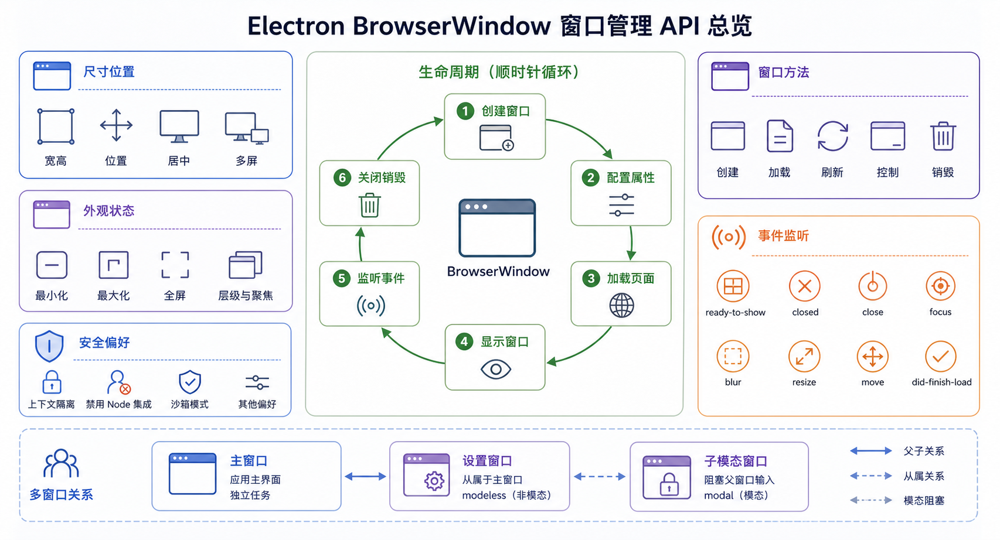

## 概述

BrowserWindow 是 Electron 中最核心的 API，用于创建和管理应用窗口。本篇文章将详细介绍 BrowserWindow 的配置选项、操作方法和最佳实践。🪟



## BrowserWindow 基础

### 创建窗口

```javascript
const { app, BrowserWindow } = require('electron');

app.whenReady().then(() => {
  const win = new BrowserWindow({
    width: 1200,
    height: 800
  });

  win.loadFile('index.html');
});
```

### 配置选项

```javascript
const win = new BrowserWindow({
  // 尺寸
  width: 1200,              // 窗口宽度（像素）
  height: 800,              // 窗口高度（像素）
  minWidth: 800,            // 最小宽度
  minHeight: 600,           // 最小高度
  maxWidth: 1920,           // 最大宽度
  maxHeight: 1080,          // 最大高度

  // 位置
  x: undefined,             // 窗口 x 坐标（未定义则居中）
  y: undefined,             // 窗口 y 坐标
  center: true,             // 是否居中显示

  // 外观
  title: '我的应用',         // 窗口标题
  backgroundColor: '#ffffff', // 背景色
  show: false,              // 创建后不立即显示
  frame: true,              // 是否有窗口边框
  titleBarStyle: 'default',  // macOS 标题栏样式

  // 功能
  resizable: true,           // 是否可调整大小
  movable: true,            // 是否可移动
  minimizable: true,        // 是否可最小化
  maximizable: true,        // 是否可最大化
  closable: true,           // 是否可关闭

  // Web 偏好设置
  webPreferences: {
    preload: path.join(__dirname, 'preload.js'),
    contextIsolation: true,
    nodeIntegration: false,
    sandbox: true
  }
});
```

## 尺寸与位置

### 设置窗口尺寸

```javascript
// 设置窗口大小
win.setSize(1920, 1080);

// 获取窗口大小
const [width, height] = win.getSize();
console.log(`窗口尺寸: ${width}x${height}`);

// 设置最小尺寸
win.setMinimumSize(800, 600);

// 设置最大尺寸
win.setMaximumSize(1920, 1080);

// 确保尺寸在范围内
win.setMinimumSize(800, 600);
win.setMaximumSize(1920, 1080);
```

### 设置窗口位置

```javascript
// 设置窗口位置
win.setPosition(100, 100);

// 获取窗口位置
const [x, y] = win.getPosition();
console.log(`窗口位置: (${x}, ${y})`);

// 居中显示
win.center();

// 居中显示（带偏移）
win.center();
win.setPosition(win.getPosition()[0] + 100, win.getPosition()[1] + 100);
```

### 窗口边界

```javascript
// 获取窗口边界
const bounds = win.getBounds();
// { x: 100, y: 100, width: 1200, height: 800 }

// 设置窗口边界
win.setBounds({
  x: 100,
  y: 100,
  width: 1200,
  height: 800
});

// 获取内容边界
const contentBounds = win.getContentBounds();
// 不包括窗口边框和标题栏
```

### 窗口状态

```javascript
// 是否最大化
if (win.isMaximized()) {
  console.log('窗口已最大化');
}

// 是否最小化
if (win.isMinimized()) {
  console.log('窗口已最小化');
}

// 是否获得焦点
if (win.isFocused()) {
  console.log('窗口获得焦点');
}

// 是否全屏
if (win.isFullScreen()) {
  console.log('全屏模式');
}

// 是否始终在最上层
if (win.isAlwaysOnTop()) {
  console.log('窗口始终在最上层');
}

// 是否可见
if (win.isVisible()) {
  console.log('窗口可见');
}
```

## 窗口操作

### 显示与隐藏

```javascript
// 显示窗口（获得焦点）
win.show();

// 显示窗口（不获得焦点）
win.showInactive();

// 隐藏窗口
win.hide();

// 闪烁任务栏图标（Windows）
win.flashFrame(true);
```

### 最大化与最小化

```javascript
// 最大化窗口
win.maximize();

// 取消最大化
win.unmaximize();

// 最小化窗口
win.minimize();

// 恢复窗口（从最小化状态）
win.restore();
```

### 全屏操作

```javascript
// 进入全屏
win.setFullScreen(true);

// 退出全屏
win.setFullScreen(false);

// 切换全屏
if (win.isFullScreen()) {
  win.setFullScreen(false);
} else {
  win.setFullScreen(true);
}
```

### 置顶操作

```javascript
// 设置始终在最上层
win.setAlwaysOnTop(true, 'screen-saver');

// 取消置顶
win.setAlwaysOnTop(false);

// level 可选值：
// - 'normal' - 普通窗口
// - 'floating' - 浮动窗口
// - 'torn-off-menu' - 菜单分离
// - 'modal-panel' - 模态面板
// - 'screen-saver' - 屏幕保护
// - 'status' - 状态栏窗口
// - 'pop-up-menu' - 弹出菜单
// - 'dock' - macOS Dock
```

### 焦点与激活

```javascript
// 聚焦窗口
win.focus();

// 失去焦点
win.blur();

// 取消聚焦（但窗口仍可见）
win.focusOnWebView();
```

### 关闭操作

```javascript
// 关闭窗口
win.close();

// 强制关闭（跳过 before-quit 事件）
win.destroy();

// 阻止关闭（用于确认对话框）
win.on('close', (event) => {
  if (hasUnsavedChanges) {
    event.preventDefault();
    showConfirmDialog();
  }
});
```

## 窗口外观

### 无边框窗口

```javascript
const win = new BrowserWindow({
  width: 1200,
  height: 800,
  frame: false,           // 隐藏窗口边框
  titleBarStyle: 'hidden', // macOS 隐藏标题栏
  // 但仍可通过代码控制窗口移动
});

// 拖动区域（在自定义标题栏中）
// CSS: -webkit-app-region: drag;
// 阻止拖动: -webkit-app-region: no-drag;
```

### 自定义标题栏

```html
<!-- index.html -->
<div class="titlebar">
  <div class="drag-region">拖动区域</div>
  <div class="window-controls">
    <button class="minimize-btn" onclick="window.controls.minimize()">─</button>
    <button class="maximize-btn" onclick="window.controls.maximize()">□</button>
    <button class="close-btn" onclick="window.controls.close()">✕</button>
  </div>
</div>

<style>
  .titlebar {
    height: 32px;
    display: flex;
    background: #333;
  }
  .drag-region {
    flex: 1;
    -webkit-app-region: drag;
    cursor: move;
  }
  .window-controls {
    display: flex;
    -webkit-app-region: no-drag;
  }
  .window-controls button {
    width: 46px;
    height: 32px;
    border: none;
    background: transparent;
    color: white;
    cursor: pointer;
  }
  .window-controls button:hover {
    background: #555;
  }
  .close-btn:hover {
    background: #e81123;
  }
</style>
```

```javascript
// preload.js
contextBridge.exposeInMainWorld('controls', {
  minimize: () => ipcRenderer.send('window:minimize'),
  maximize: () => ipcRenderer.send('window:maximize'),
  close: () => ipcRenderer.send('window:close'),
  isMaximized: () => ipcRenderer.invoke('window:is-maximized')
});

// main.js
ipcMain.on('window:minimize', (event) => {
  const win = BrowserWindow.fromWebContents(event.sender);
  win.minimize();
});

ipcMain.on('window:maximize', (event) => {
  const win = BrowserWindow.fromWebContents(event.sender);
  if (win.isMaximized()) {
    win.unmaximize();
  } else {
    win.maximize();
  }
});

ipcMain.on('window:close', (event) => {
  const win = BrowserWindow.fromWebContents(event.sender);
  win.close();
});

ipcMain.handle('window:is-maximized', (event) => {
  const win = BrowserWindow.fromWebContents(event.sender);
  return win.isMaximized();
});
```

### 透明窗口

```javascript
const win = new BrowserWindow({
  width: 1200,
  height: 800,
  transparent: true,  // 透明背景
  frame: false
});

// 需要设置 ARGB 颜色
document.body.style.background = 'rgba(0,0,0,0)';
```

### 窗口阴影

```javascript
// 设置窗口阴影
win.setShadow(true);

// 获取阴影是否启用
console.log(win.getShadow()); // true/false
```

## 窗口事件

### 常用事件

```javascript
// 窗口即将显示（首次绘制前触发）
win.on('ready-to-show', () => {
  win.show();
  console.log('窗口准备好显示了');
});

// 窗口显示
win.on('show', () => {
  console.log('窗口已显示');
});

// 窗口隐藏
win.on('hide', () => {
  console.log('窗口已隐藏');
});

// 窗口关闭前
win.on('close', (event) => {
  console.log('窗口即将关闭');
  // event.preventDefault() 可以阻止关闭
});

// 窗口关闭后
win.on('closed', () => {
  console.log('窗口已关闭');
  win = null;
});

// 窗口获得焦点
win.on('focus', () => {
  console.log('窗口获得焦点');
});

// 窗口失去焦点
win.on('blur', () => {
  console.log('窗口失去焦点');
});
```

### 尺寸相关事件

```javascript
// 窗口大小改变
win.on('resize', () => {
  const [width, height] = win.getSize();
  console.log(`新尺寸: ${width}x${height}`);
});

// 窗口位置改变
win.on('move', () => {
  const [x, y] = win.getPosition();
  console.log(`新位置: (${x}, ${y})`);
});

// 窗口最大化/恢复
win.on('maximize', () => {
  console.log('窗口已最大化');
});

win.on('unmaximize', () => {
  console.log('窗口已恢复');
});

// 窗口最小化
win.on('minimize', () => {
  console.log('窗口已最小化');
});

win.on('restore', () => {
  console.log('窗口已恢复');
});

// 全屏状态改变
win.on('enter-full-screen', () => {
  console.log('进入全屏');
});

win.on('leave-full-screen', () => {
  console.log('退出全屏');
});
```

### 内容相关事件

```javascript
// 页面开始加载
win.webContents.on('did-start-loading', () => {
  console.log('开始加载');
});

// 页面加载完成
win.webContents.on('did-finish-load', () => {
  console.log('加载完成');
});

// 页面加载失败
win.webContents.on('did-fail-load', (event, errorCode, errorDescription) => {
  console.log(`加载失败: ${errorDescription}`);
});

// DOM 就绪
win.webContents.on('dom-ready', () => {
  console.log('DOM 就绪');
});

// 页面标题改变
win.webContents.on('page-title-updated', (event, title) => {
  console.log(`标题更新: ${title}`);
});

// 页面图标改变
win.webContents.on('page-favicon-updated', (event, favicon) => {
  console.log(`图标更新: ${favicon}`);
});
```

## 多窗口管理

### 创建多个窗口

```javascript
const { app, BrowserWindow } = require('electron');

let mainWindow = null;
let settingsWindow = null;

app.whenReady().then(() => {
  mainWindow = new BrowserWindow({
    width: 1200,
    height: 800,
    title: '主窗口'
  });
  mainWindow.loadFile('index.html');

  mainWindow.on('closed', () => {
    mainWindow = null;
    // 可以选择关闭所有子窗口
    if (settingsWindow) {
      settingsWindow.close();
    }
  });
});

function openSettings() {
  if (settingsWindow) {
    settingsWindow.focus();
    return;
  }

  settingsWindow = new BrowserWindow({
    width: 600,
    height: 400,
    title: '设置',
    parent: mainWindow
  });
  settingsWindow.loadFile('settings.html');

  settingsWindow.on('closed', () => {
    settingsWindow = null;
  });
}
```

### 父子窗口

```javascript
// 子窗口会始终显示在父窗口上层
const childWindow = new BrowserWindow({
  width: 400,
  height: 300,
  parent: mainWindow
});
```

### 模态窗口

```javascript
// 模态窗口会阻止与父窗口的交互
const modal = new BrowserWindow({
  width: 400,
  height: 300,
  parent: mainWindow,
  modal: true
});
```

### 获取所有窗口

```javascript
// 获取所有窗口
const allWindows = BrowserWindow.getAllWindows();
console.log(`共有 ${allWindows.length} 个窗口`);

// 获取聚焦窗口
const focusedWindow = BrowserWindow.getFocusedWindow();

// 通过 ID 获取窗口
const win = BrowserWindow.fromId(1);

// 通过 webContents 获取窗口
const win = BrowserWindow.fromWebContents(webContents);
```

## BrowserView

### 基本用法

BrowserView 允许在窗口中嵌入网页内容：

```javascript
const { BrowserView, BrowserWindow } = require('electron');

app.whenReady().then(() => {
  const mainWindow = new BrowserWindow({
    width: 1200,
    height: 800
  });

  const view = new BrowserView({
    webPreferences: {
      preload: path.join(__dirname, 'preload.js')
    }
  });

  mainWindow.setBrowserView(view);
  view.setBounds({ x: 0, y: 0, width: 600, height: 800 });
  view.loadURL('https://example.com');
});
```

### 多 BrowserView 分屏

```javascript
const { BrowserView, BrowserWindow } = require('electron');

app.whenReady().then(() => {
  const mainWindow = new BrowserWindow({
    width: 1200,
    height: 800
  });

  const view1 = new BrowserView({
    webPreferences: { preload: path.join(__dirname, 'preload.js') }
  });
  const view2 = new BrowserView({
    webPreferences: { preload: path.join(__dirname, 'preload.js') }
  });

  mainWindow.setBrowserView(view1);
  mainWindow.setBrowserView(view2);

  // 左半屏
  view1.setBounds({ x: 0, y: 0, width: 600, height: 800 });
  view1.loadURL('https://left.example.com');

  // 右半屏
  view2.setBounds({ x: 600, y: 0, width: 600, height: 800 });
  view2.loadURL('https://right.example.com');
});
```

## 最佳实践

### 避免白屏

```javascript
const win = new BrowserWindow({
  show: false  // 先不显示
});

win.once('ready-to-show', () => {
  win.show();  // 加载完成后再显示
});

win.loadFile('index.html');
```

### 窗口状态持久化

```javascript
const { app, BrowserWindow } = require('electron');
const fs = require('fs');
const path = require('path');

// 保存窗口状态
function saveWindowState(win) {
  const bounds = win.getBounds();
  fs.writeFileSync(
    path.join(app.getPath('userData'), 'window-state.json'),
    JSON.stringify(bounds)
  );
}

// 加载窗口状态
function loadWindowState() {
  try {
    return JSON.parse(
      fs.readFileSync(
        path.join(app.getPath('userData'), 'window-state.json'),
        'utf-8'
      )
    );
  } catch {
    return null;
  }
}

app.whenReady().then(() => {
  const savedState = loadWindowState();

  const win = new BrowserWindow({
    width: savedState?.width || 1200,
    height: savedState?.height || 800,
    x: savedState?.x,
    y: savedState?.y
  });

  // 保存状态
  ['resize', 'move'].forEach(event => {
    win.on(event, () => saveWindowState(win));
  });
});
```

### 安全关闭

```javascript
win.on('close', (event) => {
  if (!canClose) {
    event.preventDefault();
    showConfirmDialog((confirmed) => {
      if (confirmed) {
        canClose = true;
        win.close();
      }
    });
  }
});
```

## 总结

BrowserWindow API 提供了丰富的窗口管理能力：

| 类别 | 方法 | 说明 |
|------|------|------|
| **尺寸** | setSize, getSize, setMinimumSize | 设置窗口大小 |
| **位置** | setPosition, getPosition, center | 窗口位置控制 |
| **状态** | maximize, minimize, restore, setFullScreen | 窗口状态操作 |
| **外观** | setAlwaysOnTop, setTitle, setBackgroundColor | 窗口外观设置 |
| **事件** | on('close'), on('focus'), on('resize') | 窗口事件监听 |
| **多窗口** | parent, modal, setBrowserView | 多窗口管理 |

灵活运用这些 API 可以创建各种复杂的桌面应用界面。下一篇文章我们将学习 **应用菜单与系统集成**，敬请期待！🚀
