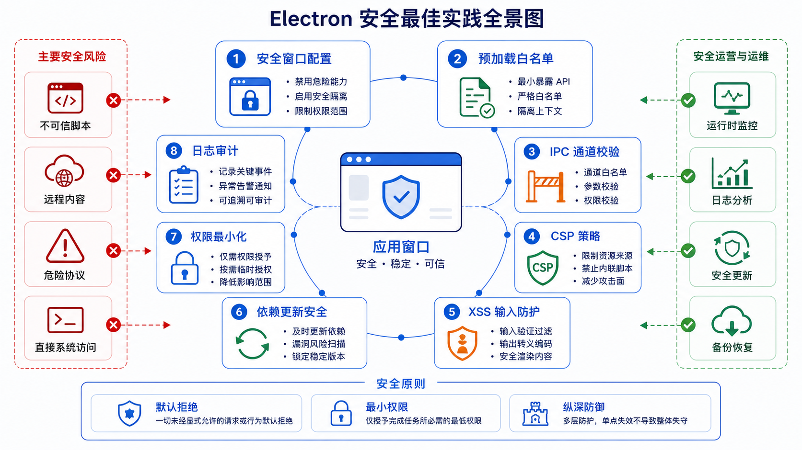

## 概述

Electron 应用的安全性至关重要，本文将详细介绍如何配置安全选项、实现内容安全策略、防止 XSS 攻击，以及其他安全最佳实践。🔒



## 安全配置

### 推荐的 WebPreferences 配置

```javascript
// ❌ 危险配置
const win = new BrowserWindow({
  webPreferences: {
    nodeIntegration: true,           // 危险！
    contextIsolation: false,         // 危险！
    enableRemoteModule: true,        // 已废弃，危险！
    sandbox: false                   // 不推荐
  }
});

// ✅ 安全配置
const win = new BrowserWindow({
  webPreferences: {
    preload: path.join(__dirname, 'preload.js'),
    contextIsolation: true,           // 必须开启
    nodeIntegration: false,           // 必须关闭
    sandbox: true,                    // 推荐开启
    webSecurity: true,                // 必须开启
    allowRunningInsecureContent: false
  }
});
```

### 配置项说明

| 配置项 | 默认值 | 推荐 | 说明 |
|--------|--------|------|------|
| `nodeIntegration` | `false` | `false` | 禁用 Node.js 访问 |
| `contextIsolation` | `true` | `true` | 隔离预加载脚本 |
| `sandbox` | `false` | `true` | 启用沙箱模式 |
| `webSecurity` | `true` | `true` | 启用同源策略 |
| `allowRunningInsecureContent` | `false` | `false` | 不允许 HTTP 内容 |

### 完整安全配置示例

```javascript
const { app, BrowserWindow } = require('electron');
const path = require('path');

function createWindow() {
  const win = new BrowserWindow({
    width: 1200,
    height: 800,
    webPreferences: {
      preload: path.join(__dirname, 'preload.js'),
      contextIsolation: true,
      nodeIntegration: false,
      sandbox: true,
      webSecurity: true,
      allowRunningInsecureContent: false,
      experimentalFeatures: false,
      allowpopups: false
    }
  });

  win.loadFile('index.html');
}

app.whenReady().then(createWindow);
```

## 内容安全策略 (CSP)

### CSP 配置

```html
<!-- index.html -->
<meta http-equiv="Content-Security-Policy" content="
  default-src 'self';
  script-src 'self';
  style-src 'self' 'unsafe-inline';
  img-src 'self' data: https:;
  font-src 'self';
  connect-src 'self' https://api.example.com;
  frame-src 'none';
  object-src 'none';
  base-uri 'self';
  form-action 'self';
">
```

### CSP 指令说明

| 指令 | 说明 | 示例 |
|------|------|------|
| `default-src` | 默认源 | `'self'` |
| `script-src` | JS 脚本源 | `'self' 'unsafe-inline'` |
| `style-src` | 样式源 | `'self' 'unsafe-inline'` |
| `img-src` | 图片源 | `'self' data: https:` |
| `font-src` | 字体源 | `'self'` |
| `connect-src` | 连接的源 | `'self' https://api.example.com` |
| `frame-src` | iframe 源 | `'none'` |
| `object-src` | 对象源 | `'none'` |
| `base-uri` | base 标签 | `'self'` |

### CSP 配置示例

```javascript
// main.js - 动态设置 CSP
const csp = [
  "default-src 'self'",
  "script-src 'self'",
  "style-src 'self' 'unsafe-inline'",
  "img-src 'self' data: https:",
  "connect-src 'self' https://api.example.com",
  "frame-ancestors 'none'"
].join('; ');

win.webContents.session.webRequest.onHeadersReceived((details, callback) => {
  callback({
    responseHeaders: {
      ...details.responseHeaders,
      'Content-Security-Policy': [csp]
    }
  });
});
```

## IPC 安全

### 通道白名单

```javascript
// main.js
const ALLOWED_CHANNELS = new Set([
  'file:read',
  'file:write',
  'app:get-info'
]);

ipcMain.handle = (function(originalHandle) {
  return function(channel, handler) {
    if (!ALLOWED_CHANNELS.has(channel)) {
      console.error(`IPC 通道 ${channel} 未授权`);
      throw new Error(`Channel ${channel} is not allowed`);
    }
    return originalHandle.call(this, channel, handler);
  };
})(ipcMain.handle);
```

### 参数验证

```javascript
// main.js - 验证参数
ipcMain.handle('file:read', async (event, filePath) => {
  // 1. 检查文件路径类型
  if (typeof filePath !== 'string') {
    throw new Error('filePath must be a string');
  }

  // 2. 防止路径遍历
  const normalizedPath = path.normalize(filePath);
  if (normalizedPath.includes('..')) {
    throw new Error('Invalid path');
  }

  // 3. 检查文件是否在允许目录内
  const allowedDirs = [app.getPath('documents'), app.getPath('downloads')];
  const isAllowed = allowedDirs.some(dir => normalizedPath.startsWith(dir));

  if (!isAllowed) {
    throw new Error('Access denied');
  }

  // 执行操作
  return fs.readFile(filePath, 'utf-8');
});
```

### 限制 IPC 返回的数据

```javascript
// main.js - 只返回必要数据
ipcMain.handle('get-user', async (event, userId) => {
  const user = await database.getUser(userId);

  // 只返回必要字段
  return {
    id: user.id,
    name: user.name,
    email: user.email
    // 不返回敏感字段如 password, apiKey 等
  };
});
```

## XSS 防护

### 避免使用 eval

```javascript
// ❌ 危险
eval('console.log("hello")');
new Function('return "hello"')();
setTimeout('alert("xss")', 100);
setInterval('alert("xss")', 100);

// ✅ 安全
setTimeout(() => console.log('hello'), 100);
setTimeout(function() { alert('safe'); }, 100);
```

### 安全的 HTML 渲染

```javascript
// ❌ 危险
element.innerHTML = userInput;
document.write(userInput);

// ✅ 安全
element.textContent = userInput;

// ✅ 使用 DOMPurify 清理 HTML
const clean = DOMPurify.sanitize(userInput, {
  ALLOWED_TAGS: ['b', 'i', 'em', 'strong', 'a'],
  ALLOWED_ATTR: ['href']
});
element.innerHTML = clean;
```

### 使用 textContent 而非 innerHTML

```javascript
// ❌ 危险
document.getElementById('output').innerHTML = userInput;

// ✅ 安全
document.getElementById('output').textContent = userInput;

// ✅ 安全地显示富文本
import DOMPurify from 'dompurify';

function displayRichContent(html) {
  const clean = DOMPurify.sanitize(html, {
    ALLOWED_TAGS: ['p', 'br', 'b', 'i', 'em', 'strong', 'ul', 'ol', 'li'],
    ALLOWED_ATTR: []
  });
  document.getElementById('output').innerHTML = clean;
}
```

### URL 验证

```javascript
// ❌ 危险
<a href="${userUrl}">链接</a>

// ✅ 安全
function isSafeUrl(url) {
  try {
    const parsed = new URL(url);
    return ['https:', 'http:'].includes(parsed.protocol);
  } catch {
    return false;
  }
}

if (isSafeUrl(userUrl)) {
  link.href = userUrl;
}
```

### 事件处理器验证

```javascript
// ❌ 危险
element.setAttribute('onclick', userInput);

// ✅ 安全
element.addEventListener('click', () => {
  // 安全的处理逻辑
});
```

## 外部链接

### 安全处理外部链接

```javascript
// main.js
ipcMain.handle('open-external', async (event, url) => {
  // 验证 URL
  try {
    const parsed = new URL(url);

    // 只允许 http/https
    if (!['http:', 'https:'].includes(parsed.protocol)) {
      throw new Error('Invalid protocol');
    }

    // 使用 shell 打开外部链接
    const { shell } = require('electron');
    await shell.openExternal(url);

    return { success: true };
  } catch (error) {
    return { success: false, error: error.message };
  }
});
```

```javascript
// preload.js
contextBridge.exposeInMainWorld('api', {
  openExternal: (url) => ipcRenderer.invoke('open-external', url)
});
```

```javascript
// renderer.js
// ✅ 安全打开外部链接
document.querySelectorAll('a[target="_blank"]').forEach(link => {
  link.addEventListener('click', async (e) => {
    e.preventDefault();
    await window.api.openExternal(link.href);
  });
});
```

### 防止窗口操作

```javascript
// main.js - 禁用窗口操作 API
win.webContents.on('will-navigate', (event, url) => {
  // 只允许本地文件或指定域名
  const allowedPatterns = [
    /^file:/,
    /^https:\/\/example\.com/
  ];

  const isAllowed = allowedPatterns.some(pattern => pattern.test(url));

  if (!isAllowed) {
    event.preventDefault();
    console.log('导航被阻止:', url);
  }
});

// 禁用 window.open
win.webContents.on('did-create-window', (window) => {
  window.close();
});
```

## 禁用危险功能

### 禁用 Node.js 集成

```javascript
// main.js
const win = new BrowserWindow({
  webPreferences: {
    nodeIntegration: false,
    contextIsolation: true,
    sandbox: true
  }
});
```

### 禁用远程模块

```javascript
// main.js - 禁用远程模块
app.on('remote-update-unsupported', () => {
  console.warn('Remote module is deprecated');
});

// 确保远程模块禁用
if (process.enableRemoteModule) {
  process.enableRemoteModule = false;
}
```

### 禁用危险协议

```javascript
// main.js
protocol.registerHttpProtocol('unsafe', (request) => {
  // 拒绝不安全的协议
});
```

### 禁用开发者工具

```javascript
// main.js - 生产环境禁用 DevTools
if (app.isPackaged) {
  win.webContents.on('devtools-opened', () => {
    win.webContents.closeDevTools();
  });

  // 阻止快捷键
  win.webContents.on('before-input-event', (event, input) => {
    if (input.key === 'F12') {
      event.preventDefault();
    }
  });
}
```

## 数据安全

### 安全存储敏感数据

```javascript
// ❌ 不安全
localStorage.setItem('token', 'secret-token');

// ✅ 使用 safeStorage
const { safeStorage } = require('electron');

// 加密存储
function storeSecret(data) {
  if (safeStorage.isEncryptionAvailable()) {
    const encrypted = safeStorage.encryptString(data);
    fs.writeFileSync('secret.enc', encrypted);
  }
}

// 解密读取
function getSecret() {
  if (safeStorage.isEncryptionAvailable()) {
    const encrypted = fs.readFileSync('secret.enc');
    return safeStorage.decryptString(encrypted);
  }
}
```

### 清理敏感数据

```javascript
// renderer.js
// 页面关闭时清理敏感数据
window.addEventListener('beforeunload', () => {
  sessionStorage.clear();
  localStorage.removeItem('sensitive-token');
});

// 内存中敏感数据使用后清理
let sensitiveData = processSensitive();
try {
  // 使用数据
} finally {
  sensitiveData = null;
}
```

## 会话安全

### 安全 Cookie

```javascript
// main.js
win.webContents.session.cookies.set({
  url: 'https://example.com',
  name: 'session',
  value: sessionToken,
  httpOnly: true,     // 禁止 JS 访问
  secure: true,       // 仅 HTTPS
  sameSite: 'strict'  // CSRF 防护
});
```

### 安全 WebStorage

```javascript
// renderer.js
// 使用加密的 localStorage 替代品
class SecureStorage {
  constructor(key) {
    this.key = key;
    this.cipher = new Cipher('aes-256-gcm');
  }

  set(value) {
    const encrypted = this.cipher.encrypt(value);
    localStorage.setItem(this.key, encrypted);
  }

  get() {
    const encrypted = localStorage.getItem(this.key);
    return this.cipher.decrypt(encrypted);
  }

  remove() {
    localStorage.removeItem(this.key);
  }
}
```

## 网络安全

### 证书验证

```javascript
// main.js - 验证 SSL 证书
win.webContents.session.setCertificateVerifyProc((request, callback) => {
  const { hostname, certificate, verificationResult } = request;

  // 自定义证书验证逻辑
  if (hostname === 'trusted.example.com') {
    callback(0); // 信任
  } else if (verificationResult === 0) {
    callback(0); // 系统信任
  } else {
    callback(-3); // 拒绝
  }
});
```

### 代理配置

```javascript
// main.js
win.webContents.session.setProxy({
  proxyRules: 'http://proxy.example.com:8080',
  proxyBypassRules: 'localhost'
});
```

## 安全检查清单

### 开发阶段检查

```
□ 禁用 nodeIntegration
□ 启用 contextIsolation
□ 启用 sandbox
□ 启用 webSecurity
□ 配置 CSP
□ 验证所有 IPC 参数
□ 使用 textContent 而非 innerHTML
□ 禁用 eval 和 Function
□ 验证外部链接
□ 使用 safeStorage 存储敏感数据
□ 禁用危险协议
□ 配置安全 Cookie
```

### 发布前检查

```
□ 启用生产环境安全配置
□ 禁用开发者工具（可选）
□ 添加安全响应头
□ 清理调试代码
□ 移除测试账户
□ 更新依赖版本
□ 配置代码签名
□ 测试安全功能
```

## 常用安全库

### 依赖安全检查

```bash
# 使用 npm audit
npm audit

# 使用 nsp
npx nsp check

# 使用 snyk
npx snyk test
```

### 推荐的库

```javascript
// 安全的 HTML 清理
import DOMPurify from 'dompurify';

// 安全的数据验证
import Joi from 'joi';

// 安全的数据序列化
import serialize from 'serialize-javascript';
```

## 总结

本文介绍了 Electron 应用的各项安全措施：

| 安全领域 | 措施 |
|----------|------|
| **基础配置** | nodeIntegration: false, contextIsolation: true |
| **CSP** | 内容安全策略限制脚本和资源 |
| **IPC 安全** | 通道白名单、参数验证 |
| **XSS 防护** | textContent、DOMPurify、URL 验证 |
| **外部链接** | shell.openExternal 验证 |
| **数据安全** | safeStorage、敏感数据清理 |
| **网络安全** | SSL 验证、安全 Cookie |

遵循这些安全最佳实践，可以让你的 Electron 应用更加安全可靠。🎯

---

## Electron 系列总结

恭喜你完成了 Electron 系列的学习！🎉 我们涵盖了：

1. **核心概念** - 主进程、渲染进程、IPC 通信
2. **开发环境** - 项目初始化、快速入门
3. **进程详解** - BrowserWindow、webContents
4. **预加载脚本** - contextBridge、安全机制
5. **IPC 通信** - invoke/handle、send/on 模式
6. **窗口管理** - 窗口操作、多窗口管理
7. **系统集成** - 菜单、托盘、快捷键
8. **文件系统** - fs 模块、系统通知
9. **打包分发** - electron-builder、自动更新
10. **调试优化** - DevTools、性能分析
11. **安全实践** - CSP、XSS 防护、安全配置

希望这些内容能帮助你构建出色的 Electron 桌面应用！💪
