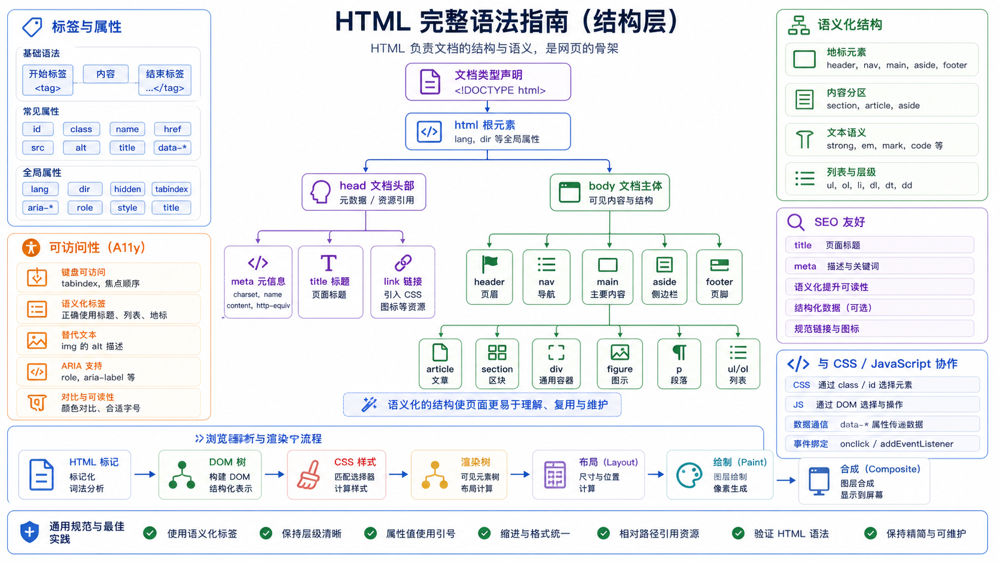

## 一、HTML 简介

**HTML**（HyperText Markup Language）即超文本标记语言，是用于描述网页结构和内容的标准标记语言。

| 概念 | 说明 |
|------|------|
| **超文本** | 页面内可包含图片、链接、音乐等非文字元素 |
| **标记语言** | 由标签（Tag）构成的计算机语言，通过标签来定义内容的结构和语义 |



### HTML 与 CSS、JavaScript 的关系

- **HTML** — 内容结构（"这座房子有什么？"）
- **CSS** — 样式外观（"房子长什么样？"）
- **JavaScript** — 交互行为（"房子能做什么？"）

> **提示**：HTML 负责内容结构，CSS 负责样式，JavaScript 负责交互，三者配合使用。

## 二、HTML 文档结构

### 完整示例

```html
<!DOCTYPE html>
<html lang="zh-CN">
<head>
    <meta charset="UTF-8">
    <meta name="viewport" content="width=device-width, initial-scale=1.0">
    <title>页面标题</title>
    <meta name="description" content="页面描述">
    <link rel="stylesheet" href="styles.css">
</head>
<body>
    <header>
        <h1>我的第一个网页</h1>
        <nav>
            <a href="/">首页</a>
            <a href="/about">关于</a>
        </nav>
    </header>
    
    <main>
        <article>
            <h2>欢迎学习 HTML</h2>
            <p>这是我的第一个网页内容段落。</p>
        </article>
    </main>
    
    <footer>
        <p>&copy; 2024 我的网站</p>
    </footer>
    
    <script src="script.js"></script>
</body>
</html>
```

### 核心结构说明

#### 1. `<!DOCTYPE html>` 声明

```html
<!DOCTYPE html>
```

- 告诉浏览器这是 **HTML5** 文档
- 必须写在文档第一行
- 启用浏览器的**标准渲染模式**
- 现代网页的标准声明方式

#### 2. `<html>` 根元素

```html
<html lang="zh-CN">
```

- HTML 文档的根（顶级元素）
- 所有其它元素必须是它的后代
- `lang` 属性声明文档的语言，对搜索引擎和无障碍访问很重要

#### 3. `<head>` 文档元数据

```html
<head>
    <meta charset="UTF-8">
    <meta name="viewport" content="width=device-width, initial-scale=1.0">
    <title>页面标题</title>
</head>
```

包含机器可读的文档相关信息（元数据）：

| 元素 | 用途 |
|------|------|
| `<meta>` | 提供元数据信息 |
| `<title>` | 定义文档标题，显示在浏览器标签页 |
| `<link>` | 链接外部资源（如 CSS） |
| `<style>` | 内嵌样式 |
| `<script>` | 嵌入脚本 |
| `<base>` | 设置相对 URL 的基础 URL |

#### 4. `<body>` 文档内容

```html
<body>
    <!-- 页面所有可见内容 -->
</body>
```

表示文档的正文内容，文档中只能有一个 `<body>` 元素。

## 三、HTML 标签基础

### 标签语法规则

| 规则 | 示例 | 说明 |
|------|------|------|
| **大小写不敏感** | `<div>` 和 `<DIV>` 都可以 | 推荐使用小写（更规范） |
| **成对标签** | `<p>内容</p>` | 有开始标签和结束标签 |
| **自闭合标签** | `<br/>`、`` | 无需结束标签 |
| **标签嵌套** | `<div><p>嵌套</p></div>` | 可以嵌套但不能交叉 |

### 正确与错误的嵌套示例

```html
<!-- 正确：嵌套闭合 -->
<div>
    <p>段落<em>内容</em></p>
</div>

<!-- 错误：交叉嵌套 -->
<div>
    <p>段落<em>内容</div></p>
</div>
```

## 四、HTML 元素分类

根据 [MDN 元素参考](https://developer.mozilla.org/zh-CN/docs/Web/HTML/Reference/Elements)，HTML 元素按功能分为以下几类：

### 1. 主根元素

| 元素 | 描述 |
|------|------|
| `<html>` | HTML 文档的根元素，所有其它元素的祖先 |

### 2. 文档元数据（Head 相关）

| 元素 | 描述 |
|------|------|
| `<head>` | 包含文档的元数据信息 |
| `<meta>` | 表示不能由其它元相关元素表示的元数据 |
| `<title>` | 定义文档标题 |
| `<link>` | 指定文档与外部资源的关系 |
| `<style>` | 包含 CSS 样式 |
| `<base>` | 设置相对 URL 的基础 URL |

### 3. 内容分区（语义化标签）

使用内容分区元素将文档内容从逻辑上进行组织划分：

```html
<!-- 页面结构示例 -->
<header>网站头部</header>
<nav>导航栏</nav>
<main>
    <article>
        <h1>文章标题</h1>
        <section>
            <h2>章节标题</h2>
            <p>章节内容...</p>
        </section>
    </article>
    <aside>侧边栏</aside>
</main>
<footer>网站底部</footer>
```

| 元素 | 描述 |
|------|------|
| `<header>` | 介绍性内容，通常包含导航或标题 |
| `<nav>` | 提供导航链接的部分 |
| `<main>` | 文档的主要内容区域 |
| `<article>` | 独立可分发的内容（如文章） |
| `<section>` | 文档中的通用独立部分 |
| `<aside>` | 与主要内容间接相关的内容 |
| `<footer>` | 最近父元素的页脚 |
| `<h1>`-`<h6>` | 六级标题 |
| `<address>` | 联系信息 |
| `<search>` | 搜索相关的内容 |

### 4. 文本内容（块级元素）

用于组织 `<body>` 内的块或章节内容：

#### 段落与区块

```html
<p>这是一个段落，表示文本的一个段落。</p>
<pre>预定义格式文本，保留空白符</pre>
<div>通用型流式内容容器，无语义</div>
<hr>主题分割线
<blockquote>引用内容，通常有缩进</blockquote>
```

#### 列表

```html
<!-- 无序列表 -->
<ul>
    <li>项目一</li>
    <li>项目二</li>
</ul>

<!-- 有序列表 -->
<ol>
    <li>第一项</li>
    <li>第二项</li>
</ol>

<!-- 定义列表 -->
<dl>
    <dt>术语</dt>
    <dd>术语的定义或描述</dd>
</dl>

<!-- 菜单（ul 的语义替换） -->
<menu>
    <li>菜单项一</li>
    <li>菜单项二</li>
</menu>
```

#### 插图与引用

```html
<figure>
    
    <figcaption>图片标题或图例</figcaption>
</figure>
```

| 元素 | 描述 |
|------|------|
| `<p>` | 段落 |
| `<ul>` | 无序列表 |
| `<ol>` | 有序列表 |
| `<li>` | 列表条目 |
| `<dl>` | 定义列表 |
| `<dt>` | 定义术语 |
| `<dd>` | 术语描述 |
| `<div>` | 通用容器 |
| `<pre>` | 预格式化文本 |
| `<blockquote>` | 块级引用 |
| `<figure>` | 独立内容单元 |
| `<figcaption>` | figure 的标题 |
| `<hr>` | 主题分割 |
| `<menu>` | 菜单列表 |

### 5. 行内文本语义

用于定义单词或任意文字的语义和结构：

```html
<p>这是一个包含 <a href="https://example.com">超链接</a> 的段落。</p>

<p><strong>重要文本</strong> 和 <em>强调文本</em></p>

<p><code>console.log()</code> 用于输出日志</p>

<p>变量 <var>x</var> 的值是 <var>y</var></p>

<p>快捷键：<kbd>Ctrl</kbd> + <kbd>C</kbd></p>

<p>水分子：H<sub>2</sub>O，平方：2<sup>3</sup>=8</p>

<p><mark>高亮文本</mark> 和 <s>删除线文本</s></p>

<p><abbr title="超文本标记语言">HTML</abbr> 是网页基础</p>

<p><cite>引用作品标题</cite></p>

<p>价格：<data value="99">99元</data></p>

<p>时间：<time datetime="2024-08-13">2024年8月13日</time></p>

<p>键盘输入：<kbd>Enter</kbd> 键</p>

<p>程序输出：<samp>Error: 404</samp></p>

<p><ruby>汉<rt>han</rt>字<rt>zi</rt></ruby></p>

<p><bdo dir="rtl">从右到左文本</bdo></p>

<p><bdi>隔离文本</bdi> 正常文本</p>

<p>在地址中使用换行：<br>北京市<br>朝阳区</p>

<p><u>带下划线注释的文本</u></p>

<p>换行机会：这是一个很长的单词<wbr>可以被分割的位置</p>

<p><span>通用行内容器，无特殊语义</span></p>
```

| 元素 | 描述 | 典型用途 |
|------|------|---------|
| `<a>` | 超链接 | 创建可点击链接 |
| `<em>` | 强调 | 斜体表示（可嵌套） |
| `<strong>` | 重要 | 粗体表示 |
| `<small>` | 旁注 | 小字体（如版权） |
| `<s>` | 不相关 | 删除线 |
| `<mark>` | 标记 | 高亮背景 |
| `<cite>` | 引用标题 | 斜体显示 |
| `<q>` | 简短引用 | 行内引号 |
| `<abbr>` | 缩写 | `title` 显示全称 |
| `<data>` | 机器可读数据 | 与 `value` 属性配合 |
| `<time>` | 时间/日期 | 机器可读时间格式 |
| `<code>` | 代码 | 等宽字体 |
| `<samp>` | 程序输出 | 等宽字体 |
| `<kbd>` | 用户输入 | 等宽字体 |
| `<var>` | 变量 | 斜体显示 |
| `<sub>` | 下标 | 化学公式等 |
| `<sup>` | 上标 | 数学幂等 |
| `<ruby>` | ruby 注解 | 注音假名 |
| `<rt>` | ruby 文本 | 发音注释 |
| `<rp>` | ruby 括号 | 不支持时的回退 |
| `<bdo>` | 文本方向覆盖 | 指定 `dir` 属性 |
| `<bdi>` | 双向隔离 | 隔离插入文本方向 |
| `<br>` | 换行 | 诗歌、地址 |
| `<span>` | 通用行容器 | 无语义 |
| `<u>` | 非文本注释 | 下划线 |
| `<wbr>` | 换行机会 | 长单词分割 |

### 6. 图片和多媒体

```html
<!-- 图片 -->


<!-- 带响应的图片 -->
<picture>
    <source srcset="image-xl.avif" media="(min-width: 800px)">
    <source srcset="image-lg.avif" media="(min-width: 400px)">
    
</picture>

<!-- 视频 -->
<video src="movie.mp4" controls width="640" poster="poster.jpg">
    <track kind="subtitles" src="subtitles.vtt" srclang="zh">
</video>

<!-- 音频 -->
<audio src="music.mp3" controls>
    <source src="music.ogg" type="audio/ogg">
</audio>

<!-- 图像映射（可点击区域） -->

<map name="solar-system">
    <area shape="circle" coords="100,100,50" href="sun.html" alt="太阳">
    <area shape="rect" coords="200,200,300,300" href="earth.html" alt="地球">
</map>
```

| 元素 | 描述 |
|------|------|
| `` | 嵌入图像 |
| `<video>` | 嵌入视频播放器 |
| `<audio>` | 嵌入音频内容 |
| `<picture>` | 多个图像源 |
| `<source>` | 为媒体指定资源 |
| `<track>` | 视频/音频轨道（字幕） |
| `<area>` | 图像映射的可点击区域 |
| `<map>` | 定义图像映射 |

### 7. 内嵌内容

```html
<!-- iframe：嵌入另一个 HTML 页面 -->
<iframe src="https://example.com" width="600" height="400" title="示例网站"></iframe>

<!-- embed：外部内容 -->
<embed src="video.swf" type="application/x-shockwave-flash">

<!-- object：外部资源 -->
<object data="document.pdf" type="application/pdf" width="100%" height="500"></object>

<!-- fencedframe：新型嵌套浏览上下文 -->
<fencedframe src="https://example.com"></fencedframe>
```

| 元素 | 描述 |
|------|------|
| `<iframe>` | 嵌套浏览上下文 |
| `<embed>` | 外部应用/插件内容 |
| `<object>` | 外部资源 |
| `<picture>` | 响应式图像 |
| `<source>` | 媒体资源 |
| `<fencedframe>` | 带隐私功能的嵌套上下文 |

### 8. SVG 和 MathML

```html
<!-- SVG 矢量图形 -->
<svg width="200" height="200" viewBox="0 0 200 200">
    <circle cx="100" cy="100" r="80" fill="blue"/>
</svg>

<!-- MathML 数学公式 -->
<math>
    <mi>x</mi>
    <mo>+</mo>
    <mi>y</mi>
    <mo>=</mo>
    <mi>z</mi>
</math>
```

| 元素 | 描述 |
|------|------|
| `<svg>` | SVG 文档的外层元素 |
| `<math>` | MathML 的顶级元素 |

### 9. 脚本

```html
<!-- JavaScript -->
<script src="app.js"></script>
<script>
    console.log('内联脚本');
</script>

<!-- Canvas 绘图区域 -->
<canvas id="myCanvas" width="400" height="300"></canvas>

<!-- 无脚本提示 -->
<noscript>
    <p>您的浏览器不支持 JavaScript 或已禁用</p>
</noscript>
```

| 元素 | 描述 |
|------|------|
| `<script>` | 嵌入可执行脚本 |
| `<canvas>` | 图形绘制容器 |
| `<noscript>` | 脚本不支持时的备用内容 |

### 10. 表格内容

```html
<table border="1">
    <caption>学生成绩表</caption>
    <colgroup>
        <col span="2" style="background-color:#f0f0f0">
        <col style="background-color:#e0e0e0">
    </colgroup>
    <thead>
        <tr>
            <th>姓名</th>
            <th>语文</th>
            <th>数学</th>
        </tr>
    </thead>
    <tbody>
        <tr>
            <td>张三</td>
            <td>90</td>
            <td>95</td>
        </tr>
        <tr>
            <td>李四</td>
            <td>85</td>
            <td>88</td>
        </tr>
    </tbody>
    <tfoot>
        <tr>
            <td>平均分</td>
            <td>87.5</td>
            <td>91.5</td>
        </tr>
    </tfoot>
</table>
```

| 元素 | 描述 |
|------|------|
| `<table>` | 表格容器 |
| `<caption>` | 表格标题 |
| `<thead>` | 表头行组 |
| `<tbody>` | 表格主体行组 |
| `<tfoot>` | 表格尾部行组 |
| `<tr>` | 表格行 |
| `<th>` | 表头单元格 |
| `<td>` | 数据单元格 |
| `<colgroup>` | 列组 |
| `<col>` | 列定义 |

### 11. 表单

```html
<form action="/submit" method="POST">
    <fieldset>
        <legend>基本信息</legend>
        
        <label for="username">用户名：</label>
        <input type="text" id="username" name="username" required placeholder="请输入用户名">
        
        <label for="email">邮箱：</label>
        <input type="email" id="email" name="email" placeholder="example@mail.com">
        
        <label for="password">密码：</label>
        <input type="password" id="password" name="password" minlength="6">
        
        <label for="birthday">生日：</label>
        <input type="date" id="birthday" name="birthday">
        
        <label for="avatar">头像：</label>
        <input type="file" id="avatar" name="avatar" accept="image/*">
    </fieldset>
    
    <fieldset>
        <legend>偏好设置</legend>
        
        <label>性别：</label>
        <input type="radio" id="male" name="gender" value="male">
        <label for="male">男</label>
        <input type="radio" id="female" name="gender" value="female">
        <label for="female">女</label>
        
        <label>爱好：</label>
        <input type="checkbox" id="reading" name="hobbies" value="reading">
        <label for="reading">阅读</label>
        <input type="checkbox" id="sports" name="hobbies" value="sports">
        <label for="sports">运动</label>
        
        <label for="country">国家：</label>
        <select id="country" name="country">
            <optgroup label="亚洲">
                <option value="cn">中国</option>
                <option value="jp">日本</option>
            </optgroup>
            <optgroup label="欧洲">
                <option value="uk">英国</option>
                <option value="fr">法国</option>
            </optgroup>
        </select>
        
        <label for="intro">简介：</label>
        <textarea id="intro" name="intro" rows="4" placeholder="请介绍一下自己"></textarea>
    </fieldset>
    
    <datalist id="languages">
        <option value="JavaScript">
        <option value="Python">
        <option value="Java">
    </datalist>
    <label for="lang">熟悉的语言：</label>
    <input type="text" id="lang" name="lang" list="languages">
    
    <label for="volume">音量：</label>
    <meter id="volume" name="volume" min="0" max="100" value="75" low="20" high="80" optimum="50"></meter>
    
    <label for="progress">下载进度：</label>
    <progress id="progress" name="progress" value="60" max="100">60%</progress>
    
    <output name="result" for="num1 num2">计算结果</output>
    
    <button type="submit">提交</button>
    <button type="reset">重置</button>
    <button type="button">普通按钮</button>
</form>
```

| 元素 | 描述 |
|------|------|
| `<form>` | 表单容器 |
| `<input>` | 输入控件（最强大的元素之一） |
| `<textarea>` | 多行文本输入 |
| `<select>` | 下拉选择框 |
| `<option>` | 选择选项 |
| `<optgroup>` | 选项分组 |
| `<datalist>` | 自动建议列表 |
| `<label>` | 标签说明 |
| `<button>` | 按钮 |
| `<fieldset>` | 表单控件分组 |
| `<legend>` | 分组标题 |
| `<output>` | 计算结果容器 |
| `<progress>` | 进度条 |
| `<meter>` | 标量值显示 |

#### 常用 input 类型一览

```html
<input type="text">           <!-- 文本输入 -->
<input type="password">       <!-- 密码输入 -->
<input type="email">          <!-- 邮箱输入（带验证） -->
<input type="number">         <!-- 数字输入 -->
<input type="tel">            <!-- 电话号码 -->
<input type="url">            <!-- URL 输入（带验证） -->
<input type="search">         <!-- 搜索框 -->
<input type="date">           <!-- 日期选择 -->
<input type="time">           <!-- 时间选择 -->
<input type="datetime-local"> <!-- 本地日期时间 -->
<input type="month">          <!-- 月份选择 -->
<input type="week">           <!-- 周选择 -->
<input type="color">         <!-- 颜色选择器 -->
<input type="range">          <!-- 范围滑块 -->
<input type="checkbox">       <!-- 复选框 -->
<input type="radio">          <!-- 单选按钮 -->
<input type="file">           <!-- 文件上传 -->
<input type="hidden">         <!-- 隐藏字段 -->
<input type="image">          <!-- 图片提交按钮 -->
<input type="submit">         <!-- 提交按钮 -->
<input type="reset">          <!-- 重置按钮 -->
<input type="button">         <!-- 普通按钮 -->
```

### 12. 交互元素

```html
<!-- 对话框 -->
<dialog open>
    <p>这是一个对话框</p>
    <button onclick="this.closest('dialog').close()">关闭</button>
</dialog>

<!-- 详情折叠 -->
<details>
    <summary>点击展开更多</summary>
    <p>这里是隐藏的内容...</p>
</details>
```

| 元素 | 描述 |
|------|------|
| `<dialog>` | 对话框窗口 |
| `<details>` | 可折叠的详情部件 |
| `<summary>` | details 的可见标题 |
| `<slot>` | Web 组件插槽 |

### 13. 划定编辑范围

```html
<p>原文本，<del datetime="2024-08-13" cite="edit-reason.md">被删除的内容</del>，
<ins datetime="2024-08-13" cite="edit-reason.md">新增的内容</ins>。</p>
```

| 元素 | 描述 |
|------|------|
| `<del>` | 删除的文本 |
| `<ins>` | 插入的文本 |

## 五、HTML 属性

### 基本语法

```html
<tag attribute="value">内容</tag>
<tag attribute='value'>内容</tag>
<input type="text" name="username" value="默认值">
<div id="main" class="container" data-user-id="12345">内容</div>
```

### 布尔属性

某些属性只需存在即可生效（称为布尔属性）：

```html
<input type="text" required>           <!-- required="required" -->
<input type="checkbox" checked>        <!-- checked="checked" -->
<input type="text" disabled>          <!-- disabled="disabled" -->
<video controls>                      <!-- controls="controls" -->
<input type="text" autofocus>         <!-- autofocus="autofocus" -->
<video muted>                         <!-- muted="muted" -->
```

### 常用属性分类

| 属性类别 | 常见属性 | 说明 |
|---------|---------|------|
| **通用标识** | `id` | 元素唯一标识 |
| **通用标识** | `class` | 元素类名（可多个） |
| **样式** | `style` | 内联样式 |
| **可访问性** | `title` | 鼠标悬停提示 |
| **语言** | `lang` | 语言声明 |
| **方向** | `dir` | 文本方向（ltr/rtl/auto） |
| **编辑** | `contenteditable` | 是否可编辑 |
| **焦点** | `tabindex` | 键盘导航顺序 |
| **焦点** | `autofocus` | 自动聚焦 |
| **数据** | `data-*` | 自定义数据属性 |

## 六、全局属性详解

**全局属性** 是所有 HTML 元素共有的属性，可用于所有元素。

### 核心全局属性

```html
<!-- id：唯一标识 -->
<div id="header">唯一标识的头部</div>

<!-- class：类名列表 -->
<div class="container main-content highlight">多个类名</div>

<!-- style：内联样式 -->
<div style="color: red; font-size: 16px;">内联样式</div>

<!-- title：提示文本 -->
<abbr title="World Wide Web">WWW</abbr>

<!-- lang：语言 -->
<p lang="zh-CN">中文内容</p>

<!-- dir：文本方向 -->
<p dir="rtl">从右到左的文本（阿拉伯语）</p>

<!-- tabindex：键盘导航 -->
<button tabindex="0">第一个</button>
<button tabindex="2">第三个</button>
<button tabindex="1">第二个</button>

<!-- autofocus：自动聚焦 -->
<input type="text" autofocus>

<!-- hidden：隐藏元素 -->
<div hidden>被隐藏的内容</div>

<!-- contenteditable：可编辑 -->
<p contenteditable="true">这段文字可以编辑</p>
```

### 数据属性（data-*）

```html
<div data-user-id="12345" data-role="admin">
    用户信息
</div>

<script>
    const div = document.querySelector('div');
    console.log(div.dataset.userId);    // "12345"
    console.log(div.dataset.role);       // "admin"
</script>
```

### 无障碍相关属性

```html
<!-- ARIA 角色 -->
<div role="button">按钮角色</div>
<nav role="navigation">导航区域</nav>

<!-- aria 属性 -->
<button aria-label="关闭" aria-expanded="true">
    ✕
</button>

<input type="text" aria-describedby="hint" aria-invalid="false">

<!-- spellcheck：拼写检查 -->
<p contenteditable="true" spellcheck="true">可以编辑并检查拼写</p>
```

### 拖拽相关属性

```html
<div draggable="true">
    可以拖拽的内容
</div>

<div draggable="true">
    <span draggable="false">内部不可拖拽</span>
</div>
```

### 虚拟键盘相关属性

```html
<!-- inputmode：在移动设备上显示合适的键盘 -->
<input type="text" inputmode="numeric" placeholder="输入数字">
<input type="text" inputmode="email" placeholder="输入邮箱">
<input type="text" inputmode="url" placeholder="输入网址">
<input type="text" inputmode="tel" placeholder="输入电话">

<!-- virtualkeyboardpolicy：虚拟键盘行为 -->
<div contenteditable="true" virtualkeyboardpolicy="manual">
    手动控制键盘显示
</div>
```

### 自定义元素相关属性

```html
<!-- is：自定义内置元素 -->
<script>
    class MyButton extends HTMLButtonElement {
        constructor() {
            super();
            this.attachShadow({ mode: 'open' });
        }
    }
    customElements.define('my-button', MyButton, { extends: 'button' });
</script>
<button is="my-button">自定义按钮</button>

<!-- slot：影子 DOM 插槽 -->
<my-component>
    <span slot="header">这是头部插槽</span>
</my-component>
```

### 完整全局属性速查表

| 属性 | 说明 |
|------|------|
| `accesskey` | 生成键盘快捷键 |
| `autocapitalize` | 控制自动大写 |
| `autofocus` | 页面加载时自动聚焦 |
| `class` | 类名列表 |
| `contenteditable` | 是否可编辑 |
| `data-*` | 自定义数据属性 |
| `dir` | 文本方向 |
| `draggable` | 是否可拖拽 |
| `enterkeyhint` | 虚拟键盘回车键提示 |
| `exportparts` | 影子 DOM 部分导出 |
| `hidden` | 隐藏元素 |
| `id` | 唯一标识符 |
| `inert` | 忽略用户输入事件 |
| `inputmode` | 虚拟键盘配置类型 |
| `is` | 自定义内置元素 |
| `itemid`、`itemprop`、`itemref`、`itemscope`、`itemtype` | 微数据属性 |
| `lang` | 语言 |
| `nonce` | CSP 一次性数字 |
| `part` | CSS 部分名称 |
| `popover` | 弹出式元素 |
| `role` | ARIA 角色 |
| `slot` | 影子 DOM 插槽 |
| `spellcheck` | 拼写检查 |
| `style` | 内联样式 |
| `tabindex` | 键盘导航顺序 |
| `title` | 提示文本 |
| `translate` | 本地化翻译控制 |
| `virtualkeyboardpolicy` | 虚拟键盘策略 |

## 七、事件属性（事件处理器）

```html
<!-- 鼠标事件 -->
<div onclick="alert('点击了')">点击我</div>
<div ondblclick="console.log('双击')">双击我</div>
<div onmouseenter="this.style.color='red'">鼠标移入变红</div>

<!-- 焦点事件 -->
<input type="text" onfocus="this.style.borderColor='blue'" onblur="this.style.borderColor=''">

<!-- 表单事件 -->
<input type="text" oninput="console.log('输入中')" onchange="console.log('已改变')">
<form onsubmit="return confirm('确认提交？')">
    <button type="submit">提交表单</button>
</form>

<!-- 键盘事件 -->
<input type="text" onkeydown="console.log('按键按下')" onkeyup="console.log('按键松开')">

<!-- 其他常用事件 -->
<body onload="console.log('页面加载完成')">
<window onscroll="console.log('正在滚动')">
<div ondragstart="console.log('开始拖拽')">可拖拽</div>
```

> **建议**：现代 Web 开发推荐使用 `addEventListener()` 方法绑定事件，而非内联事件属性。

## 八、SEO 与语义化

### 语义化标签的重要性

1. **搜索引擎优化（SEO）**：搜索引擎能更好地理解页面结构
2. **无障碍访问（a11y）**：屏幕阅读器能正确识别内容区域
3. **代码可维护性**：开发者更容易理解页面结构

### Meta 标签

```html
<head>
    <!-- 字符编码 -->
    <meta charset="UTF-8">
    
    <!-- 视口设置（响应式必需） -->
    <meta name="viewport" content="width=device-width, initial-scale=1.0">
    
    <!-- 页面描述（SEO 重要） -->
    <meta name="description" content="这是页面的描述，搜索引擎会显示">
    
    <!-- 关键词（已被多数搜索引擎忽略） -->
    <meta name="keywords" content="HTML, CSS, JavaScript">
    
    <!-- 作者 -->
    <meta name="author" content="作者名">
    
    <!-- 搜索引擎设置 -->
    <meta name="robots" content="index, follow">
    
    <!-- 页面刷新/重定向 -->
    <meta http-equiv="refresh" content="30;url=https://example.com">
    
    <!-- 主题色（移动设备浏览器地址栏） -->
    <meta name="theme-color" content="#4CAF50">
    
    <!-- 颜色方案 -->
    <meta name="color-scheme" content="light dark">
</head>
```

### 结构化示例

```html
<!DOCTYPE html>
<html lang="zh-CN">
<head>
    <meta charset="UTF-8">
    <meta name="viewport" content="width=device-width, initial-scale=1.0">
    <title>文章标题 - 网站名称</title>
    <meta name="description" content="文章简要描述，控制在150-160字符">
</head>
<body>
    <header>
        <nav aria-label="主导航">
            <!-- 导航链接 -->
        </nav>
    </header>
    
    <main>
        <article>
            <header>
                <h1>文章主标题</h1>
                <time datetime="2024-08-13">2024年8月13日</time>
            </header>
            
            <section>
                <h2>章节一</h2>
                <p>内容...</p>
            </section>
            
            <section>
                <h2>章节二</h2>
                <p>内容...</p>
            </section>
            
            <footer>
                <address>联系信息</address>
            </footer>
        </article>
    </main>
    
    <footer>
        <p>&copy; 2024 网站名称</p>
    </footer>
</body>
</html>
```

## 九、注释与代码规范

### HTML 注释

```html
<!-- 这是单行注释 -->

<!--
  这是
  多行注释
  用于大段代码说明
-->
```

### 快捷键

- **Windows**: `Ctrl + /`
- **Mac**: `Cmd + /`

### 编码规范建议

```html
<!-- 推荐：使用小写标签 -->
<div class="container"></div>

<!-- 推荐：使用语义化标签 -->
<nav>导航内容</nav>

<!-- 推荐：属性值加引号 -->
<input type="text" value="测试">

<!-- 推荐：提供 alt 文本 -->


<!-- 推荐：声明语言 -->
<html lang="zh-CN">

<!-- 避免：无语义的 div -->
<div class="nav">导航</div>

<!-- 避免：缺少 alt -->


<!-- 避免：不声明语言 -->
<html>
```

## 十、内容分类参考

根据 [MDN 内容分类](https://developer.mozilla.org/zh-CN/docs/Web/HTML/Guides/Content_categories)，HTML 元素按内容特性分为：

- **元数据内容**（Metadata content）
- **流式内容**（Flow content）
- **分段内容**（Sectioning content）
- **标题内容**（Heading content）
- **措辞内容**（Phrasing content）
- **嵌入内容**（Embedded content）
- **交互内容**（Interactive content）
- **透明内容**（Transparent content）

> 理解内容分类有助于正确使用和嵌套元素。

## 小结

### 核心要点

- **HTML** 是网页的结构基础，通过标签定义内容
- **DOCTYPE** 声明启用标准模式
- **`<html>`** 是根元素，`<head>` 定义元数据，`<body>` 定义内容
- **标签** 分成对标签和自闭合标签
- **元素** 按功能分为多个类别：元数据、分区、文本、表单、表格等
- **属性** 提供额外信息，分全局属性和特定属性
- **语义化** 标签有助于 SEO 和无障碍访问

### 学习建议

1. 多看 [MDN 官方文档](https://developer.mozilla.org/zh-CN/docs/Web/HTML/Reference)
2. 多动手实践，写自己的第一个网页
3. 关注语义化，从一开始就养成好习惯
4. 善用浏览器开发者工具查看元素结构

> 掌握 HTML 基础后，继续学习 CSS 和 JavaScript，你就能构建完整的网页应用了！

---

**参考来源**：[MDN Web Docs - HTML 参考](https://developer.mozilla.org/zh-CN/docs/Web/HTML/Reference)
