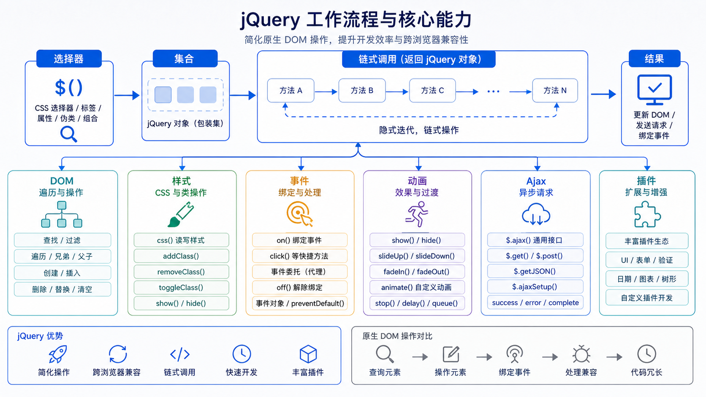

> jQuery 是一个快速、简洁的 JavaScript 库，简化了 HTML 文档遍历、事件处理和动画等操作。



## jQuery 简介

### 特点

| 特点 | 说明 |
|------|------|
| **简洁** | 链式调用，代码简洁 |
| **兼容** | 兼容主流浏览器 |
| **易学** | API 简单直观 |
| **插件丰富** | 大量可扩展插件 |

### 引入 jQuery

```html
<script src="https://cdn.bootcdn.net/ajax/libs/jquery/3.6.0/jquery.min.js"></script>
```

## jQuery 选择器

### 基本选择器

```javascript
$('#id')           // ID 选择器
$('.class')        // 类选择器
$('div')           // 标签选择器
$('*')             // 通配符选择器
$('div,p,span')    // 多选择器
```

### 层级选择器

```javascript
$('div span')      // 后代选择器
$('div > span')     // 子选择器
$('div + span')     // 相邻兄弟
$('div ~ span')     // 通用兄弟
```

### 过滤选择器

```javascript
$('li:first')           // 第一个
$('li:last')            // 最后一个
$('li:even')            // 偶数索引
$('li:odd')             // 奇数索引
$('li:eq(2)')          // 指定索引
$('li:gt(2)')          // 大于索引
$('li:lt(2)')          // 小于索引
$('li:not(:first)')     // 排除
```

### 属性选择器

```javascript
$('[href]')                    // 有href属性
$('[href="#"]')                // href等于#
$('[href!="#"]')               // href不等于#
$('[href^="#"]')               // href以#开头
$('[href$=".pdf"]')            // href以.pdf结尾
$('[href*="test"]')            // href包含test
```

## DOM 操作

### 获取/设置内容

```javascript
// 获取文本
$('#test').text()

// 设置文本
$('#test').text('新文本')

// 获取 HTML
$('#test').html()

// 设置 HTML
$('#test').html('<b>新内容</b>')

// 获取表单值
$('#test').val()

// 设置表单值
$('#test').val('新值')
```

### 获取/设置属性

```javascript
// 获取属性
$('#test').attr('href')

// 设置属性
$('#test').attr('href', 'http://example.com')

// 移除属性
$('#test').removeAttr('href')

// 获取 data 属性
$('#test').data('name')

// 设置 data 属性
$('#test').data('name', 'value')
```

### CSS 操作

```javascript
// 获取/设置 CSS
$('#test').css('color')
$('#test').css('color', 'red')
$('#test').css({'color': 'red', 'font-size': '14px'})

// 添加/移除类
$('#test').addClass('active')
$('#test').removeClass('active')
$('#test').toggleClass('active')
$('#test').hasClass('active')

// 尺寸
$('#test').width()          // 内容宽度
$('#test').innerWidth()    // + padding
$('#test').outerWidth()    // + border
$('#test').outerWidth(true) // + margin
```

### DOM 遍历

```javascript
// 父元素
$('#test').parent()
$('#test').parents()
$('#test').parentsUntil('body')

// 子元素
$('#test').children()
$('#test').find('span')

// 兄弟元素
$('#test').siblings()
$('#test').next()
$('#test').prev()
$('#test').nextAll()
$('#test').prevAll()
```

### DOM 创建/添加/删除

```javascript
// 创建元素
const $div = $('<div>', {class: 'new', text: '新内容'})

// 添加元素
$('#container').append($div)     // 内部末尾
$('#container').prepend($div)    // 内部开头
$('#container').after($div)      // 外部之后
$('#container').before($div)     // 外部之前

// 删除元素
$('#test').remove()              // 删除自身
$('#test').detach()              // 删除但保留数据和事件
$('#test').empty()               // 清空内部内容
```

## 事件处理

### 绑定事件

```javascript
// 方式一
$('#btn').click(function() {
    alert('点击')
})

// 方式二
$('#btn').on('click', function() {
    alert('点击')
})

// 方式三：委托
$('#container').on('click', '.btn', function() {
    alert('点击')
})
```

### 常用事件

```javascript
$('#btn').click()
$('#btn').dblclick()
$('#input').focus()
$('#input').blur()
$('#input').change()
$('#form').submit()
$('#window').resize()
$('#window').scroll()
$(document).ready()
```

### 事件对象

```javascript
$('#btn').on('click', function(e) {
    e.target           // 触发元素
    e.currentTarget    // 当前处理元素
    e.type             // 事件类型
    e.preventDefault() // 阻止默认行为
    e.stopPropagation() // 阻止冒泡
})
```

## 动画效果

### 显示/隐藏

```javascript
$('#test').show()
$('#test').hide()
$('#test').toggle()

// 带动画
$('#test').show(300)
$('#test').hide('slow')
$('#test').toggle(1000)
```

### 滑动

```javascript
$('#test').slideDown()    // 向下滑动
$('#test').slideUp()      // 向上滑动
$('#test').slideToggle()  // 切换滑动
```

### 淡入淡出

```javascript
$('#test').fadeIn()       // 淡入
$('#test').fadeOut()      // 淡出
$('#test').fadeToggle()   // 切换
$('#test').fadeTo(1000, 0.5)  // 透明度
```

### 自定义动画

```javascript
$('#test').animate({
    width: '200px',
    height: '200px',
    opacity: 0.5
}, 1000, function() {
    alert('动画完成')
})

// 停止动画
$('#test').stop()
$('#test').stop(true)     // 停止所有动画
$('#test').stop(true, true) // 立即完成当前动画
```

## AJAX

### GET 请求

```javascript
$.get('/api/data', function(data) {
    console.log(data)
})
```

### POST 请求

```javascript
$.post('/api/submit', {
    name: '张三',
    age: 25
}, function(data) {
    console.log(data)
})
```

### AJAX

```javascript
$.ajax({
    url: '/api/data',
    method: 'POST',
    data: {name: '张三'},
    dataType: 'json',
    success: function(data) {
        console.log(data)
    },
    error: function(xhr, status, error) {
        console.error(error)
    }
})
```

## 小结

- **选择器**：ID、类、标签、层级、过滤
- **DOM 操作**：内容、属性、CSS、遍历
- **事件处理**：`on()`、`click()`、事件委托
- **动画**：显示/隐藏、滑动、淡入淡出、自定义动画
- **AJAX**：`$.ajax()`、`$.get()`、`$.post()`
