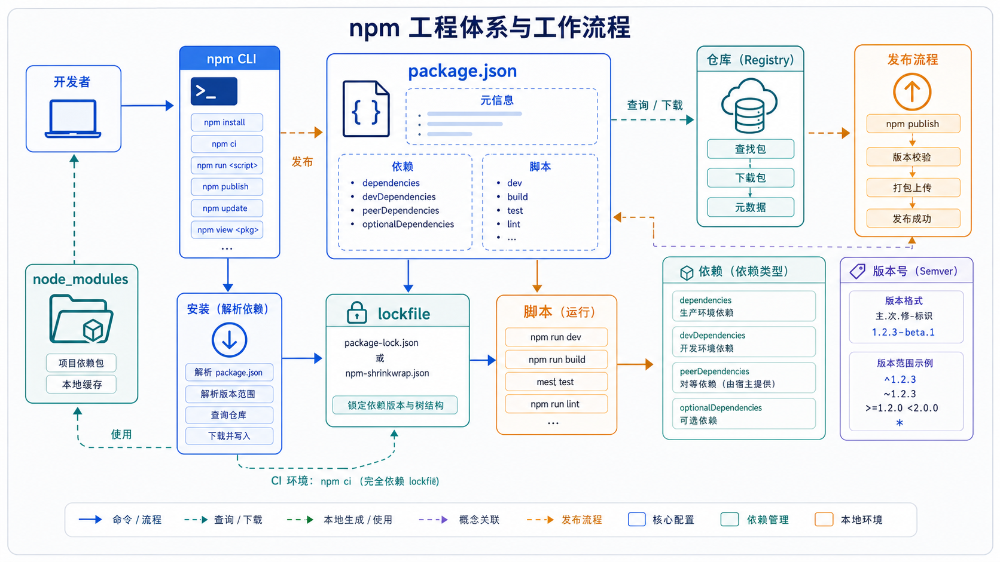

## 一、这篇文章要解决什么问题

写完第一篇的 `hello.js`、`server.js` 后，下一步你大概率会遇到这些事：

1. 想用 [chalk](https://www.npmjs.com/package/chalk) 给命令行加颜色、用 [axios](https://www.npmjs.com/package/axios) 调接口，**怎么装、怎么用**？
2. 每次启动都要敲 `node server.js`，能不能像前端项目一样用 `npm run dev` 启动？
3. 同事 clone 你的代码，跑 `npm install` 后为什么能装出**和你本地完全一致**的依赖？
4. 项目做大后 `package.json` 越来越长，里面的 `dependencies`、`devDependencies`、`peerDependencies` 到底有啥区别？
5. 想把自己写的小工具发布到 npm，让全世界都用——**怎么发**？

这一篇就系统解决"Node.js 项目的工程化"问题：包管理、版本号、脚本、lockfile、发布。



## 二、先用一句话讲清楚

**npm = Node.js 自带的"包管理工具 + 全球最大开源包仓库"。它让你的项目能装别人写的库、能用 `npm run` 跑脚本、能通过 `package.json` + `package-lock.json` 锁定依赖版本。**

## 三、官方文档是怎么说的

[npm 官方文档](https://docs.npmjs.com/) 的核心定义：

> npm is the world's largest software registry. Open source developers from every continent use npm to share and borrow packages, and many organizations use npm to manage private development as well.

[Node.js 中文文档 - 包管理](https://nodejs.cn/learn/package-manager) 进一步说明：

> npm 是 Node.js 的默认包管理器，自 Node.js 0.6.3 起集成在安装包中。**它由两个主要部分组成**：
> 1. 一个 **CLI 工具**（通过命令行调用）
> 2. 一个 **在线仓库**（registry），存放公开和私有的包

## 四、换成人话怎么理解

把 npm 想象成**手机应用商店**：

- **仓库（registry）** = 应用商店，里面有几百万个"应用"（包）可以下载。
- **CLI 工具** = 你手机上的"应用商店 App"，用来搜索、下载、更新、卸载应用。
- **package.json** = 你的"应用清单"——你装了哪些 App、版本是多少、有哪些脚本按钮。
- **node_modules** = 你的"已下载文件夹"——实际安装在本地的代码。
- **package-lock.json** = "**精确**下载记录"——记着每个 App 的精确版本号，保证团队里每个人都装得一模一样。

写项目 = 用 `npm install` 把"应用"装到本地的 `node_modules`；
做工具 = 用 `npm publish` 把自己的"应用"发布到 npm 商店；
启动项目 = 用 `npm run xxx` 执行 `package.json` 里定义好的"快捷按钮"。

## 五、最小可运行示例

### 5.1 初始化一个项目

```bash
mkdir my-cli && cd my-cli
npm init -y
```

`npm init -y` 会生成一个最简 `package.json`：

```json
{
  "name": "my-cli",
  "version": "1.0.0",
  "description": "",
  "main": "index.js",
  "scripts": {
    "test": "echo \"Error: no test specified\" && exit 1"
  },
  "keywords": [],
  "author": "",
  "license": "ISC"
}
```

### 5.2 安装第一个依赖

```bash
npm install chalk
```

安装成功后：

1. `node_modules/` 文件夹被创建，里面是 `chalk` 的代码。
2. `package.json` 自动增加：
   ```json
   "dependencies": {
     "chalk": "^4.1.2"
   }
   ```
3. `package-lock.json` 被生成，**精确锁定** chalk 的版本及其所有间接依赖。

新建 `index.js`：

```js
const chalk = require('chalk');

console.log(chalk.green('✓ 依赖安装成功！'));
console.log(chalk.red.bold('这是红色加粗文字'));
console.log(chalk.bgYellow.black('黄底黑字'));
```

```bash
node index.js
```

### 5.3 加一个 npm script

修改 `package.json`：

```json
{
  "scripts": {
    "start": "node index.js",
    "dev": "node --watch index.js"
  }
}
```

> `--watch` 是 **Node.js 18+** 的内置特性：保存文件后自动重启进程，等价于 nodemon。

现在可以这样用：

```bash
npm start       # 跑 node index.js
npm run dev     # 跑 node --watch index.js，保存即重启
```

### 5.4 区分开发依赖和生产依赖

```bash
npm install --save-dev eslint       # 开发用，不参与生产
npm install express                 # 运行时也用
```

`package.json` 会变成：

```json
{
  "dependencies": {
    "express": "^4.19.2"
  },
  "devDependencies": {
    "eslint": "^9.0.0"
  }
}
```

### 5.5 解读版本号 `^4.19.2`

npm 用 [semver（语义化版本）](https://semver.org/) 规则，格式是 `主版本.次版本.补丁版本`：

| 符号 | 含义 | 例子 `^4.19.2` |
| ---- | ---- | --------------- |
| `^4.19.2` | 兼容 4.x.x 的最新（不升级 5.0.0） | 装 4.19.2、4.20.0、4.99.99，**不装** 5.0.0 |
| `~4.19.2` | 只升级补丁号 | 装 4.19.2、4.19.5，**不装** 4.20.0 |
| `4.19.2`  | 精确锁死 | 只能装 4.19.2 |
| `*` 或 `latest` | 任意版本 | 不推荐用于生产 |

**`package-lock.json` 里会把所有依赖的精确版本号（包括间接依赖）锁死**，所以团队协作时一定要把 lockfile 提交到 git。

## 六、实际项目中怎么用

### 6.1 常用命令速查

| 类别 | 命令 | 作用 |
| ---- | ---- | ---- |
| 初始化 | `npm init` / `npm init -y` | 交互式 / 快速生成 package.json |
| 安装 | `npm install` | 安装 `package.json` 中所有依赖 |
| 安装 | `npm install <pkg>` | 装到 dependencies |
| 安装 | `npm install -D <pkg>` | 装到 devDependencies |
| 安装 | `npm install -g <pkg>` | 全局安装（CLI 工具常用） |
| 卸载 | `npm uninstall <pkg>` | 卸载包 |
| 更新 | `npm update` | 按 semver 范围更新 |
| 查看 | `npm list` | 看已安装的依赖树 |
| 查看 | `npm view <pkg> versions` | 看远程所有版本 |
| 脚本 | `npm run <script>` | 执行 scripts 里的命令 |
| 脚本 | `npm test` | 简写，等价于 `npm run test` |
| 脚本 | `npm start` | 简写，等价于 `npm run start` |
| 发布 | `npm login` | 登录 npm 账号 |
| 发布 | `npm publish` | 发布当前包到 npm |
| 卸载全局 | `npm uninstall -g <pkg>` | 卸载全局包 |

### 6.2 真实项目里 `package.json` 长这样

```json
{
  "name": "my-api",
  "version": "1.0.0",
  "type": "module",
  "main": "src/index.js",
  "engines": {
    "node": ">=18.0.0"
  },
  "scripts": {
    "start": "node src/index.js",
    "dev": "node --watch src/index.js",
    "test": "node --test test/",
    "lint": "eslint src/",
    "build": "tsc -p tsconfig.json"
  },
  "dependencies": {
    "express": "^4.19.2",
    "chalk": "^5.3.0"
  },
  "devDependencies": {
    "eslint": "^9.0.0",
    "typescript": "^5.4.0"
  },
  "keywords": ["node", "cli", "demo"],
  "author": "Joekma",
  "license": "MIT"
}
```

### 6.3 三类依赖的区别

| 字段 | 何时安装 | 例子 |
| ---- | -------- | ---- |
| `dependencies` | 生产 + 开发都装 | express、axios、react |
| `devDependencies` | 仅开发时装 | eslint、typescript、jest |
| `peerDependencies` | **期望使用者已经装了** | 插件库（如 `vite-plugin-xxx` 期望用户已装 vite） |
| `optionalDependencies` | 装不上不报错 | 平台特定的 native 模块 |
| `bundledDependencies` | 打包一起发布 | 几乎不用 |

### 6.4 完整发布一个 npm 包

```bash
# 1. 注册 npm 账号（去 https://www.npmjs.com/signup 注册）
npm login

# 2. 给 package.json 加上 "bin" 字段
```

```json
{
  "name": "my-cool-cli",
  "version": "1.0.0",
  "bin": {
    "mycli": "./bin/mycli.js"
  },
  "files": ["bin", "lib"]
}
```

```js
// bin/mycli.js —— 文件首行必须是 shebang
#!/usr/bin/env node
console.log('Hello from my cool CLI!');
```

```bash
chmod +x bin/mycli.js   # macOS/Linux 需要可执行权限
npm publish             # 推送到 npm 仓库
npm install -g my-cool-cli  # 验证：装到自己机器
mycli                    # 输出 Hello from my cool CLI!
```

> **命名规则**：包名必须小写、不能有空格、不能以 `.` 或 `_` 开头；想发到自己的作用域下（如 `@yourname/mycli`）需要 `npm init --scope=@yourname`。

## 七、常见误区

### 误区 1：把测试 / 构建工具装到 `dependencies`

- **错在哪里**：`npm install --save-dev eslint` 写成了 `npm install eslint`。
- **为什么会错**：这样会让生产部署的 `node_modules` 装上一堆无用的工具，体积变大、还可能触发安全告警。
- **正确写法**：开发/构建用的工具统一 `--save-dev`（或 `-D`）。

### 误区 2：把 `node_modules` 提交到 git

- **错在哪里**：`git add .` 顺手把 `node_modules/` 也加进去。
- **为什么会错**：`node_modules` 体积巨大（一个中型项目可能几百 MB），且和 lockfile 是冗余的。
- **正确写法**：在 `.gitignore` 中加：
  ```
  node_modules/
  .npm/
  ```

### 误区 3：不提交 `package-lock.json`

- **错在哪里**：`.gitignore` 里写了 `package-lock.json`。
- **为什么会错**：团队里不同人装出来的依赖版本会**不一样**，出现"我电脑能跑、你电脑报错"。
- **正确写法**：lockfile **必须提交**；`.npmrc` 里设置 `package-lock=true`。

### 误区 4：手改 `package.json` 的版本号

- **错在哪里**：直接编辑 `package.json` 把 `^4.19.2` 改成 `^5.0.0`。
- **为什么会错**：`node_modules` 里装的可能还是旧版本，需要重新安装。
- **正确写法**：用 `npm install <pkg>@<version>` 让 npm 自己改；或者 `npm update <pkg>`。

### 误区 5：误以为 `npm i -g` 装的包是项目级的

- **错在哪里**：在项目里 `npm install -g express` 然后 `require('express')` 找不到。
- **为什么会错**：全局包装到全局 `node_modules`（如 `~/.nvm/versions/node/.../lib/node_modules`），不进入当前项目的 `node_modules`。
- **正确写法**：本地开发用 `npm install <pkg>`（不带 `-g`）；只有 CLI 工具（`yarn`、`pnpm`、`tsc`）才适合全局装。

## 八、和相似概念的区别

| 工具 | 出现时间 | 安装速度 | 工作区（monorepo） | 锁文件 | 特点 |
| ---- | -------- | -------- | ----------------- | ------ | ---- |
| **npm** | 2010，Node.js 自带 | 较慢（v7+ 已大幅优化） | v7+ 支持 | package-lock.json | 默认就有、生态最广 |
| **yarn** | 2016（v1 classic） / 2020（v3+ berry） | 很快 | 内置 workspaces | yarn.lock | 早期解决 npm 慢的问题 |
| **pnpm** | 2017 | 极快 | 内置 workspaces | pnpm-lock.yaml | 硬链接 + 软链接，**省磁盘** |
| **bun** | 2022 | 最快 | 内置 workspaces | bun.lockb（二进制） | 新一代、还能当 runtime/runtime+bundler |

简单记忆：

- **小项目 / 学习**：直接用 `npm`，开箱即用。
- **多包仓库（monorepo）**：用 `pnpm` 或 `yarn`。
- **追求极致速度 / 新项目**：可以试 `bun`。

## 九、小结

1. **npm = 包管理 CLI + 远程仓库**，是 Node.js 工程化的基础设施。
2. **三件套**：`package.json`（声明依赖和脚本）、`node_modules/`（实际代码，本地不提交）、`package-lock.json`（精确锁定，必须提交）。
3. **scripts** 是项目自动化的入口；`npm start`/`npm test` 是 `npm run xxx` 的简写。
4. **版本号**遵循 semver；`^` 兼容大版本、`~` 兼容次版本、不写符号则精确锁定。
5. **发布流程**：`npm login` → 配 `"bin"` → `npm publish`，全世界就能 `npm install` 你的工具了。

---

下一篇我们将学习 **04-文件系统 fs：读写文件、目录与流式处理**——这是 Node.js 写脚本、写工具、做后端都绕不开的核心能力。
