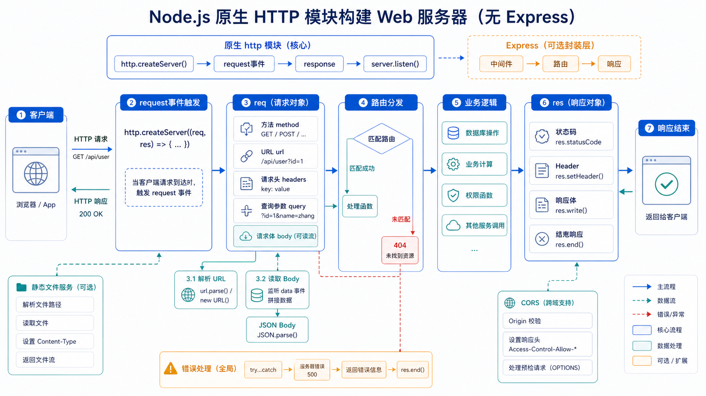

## 一、这篇文章要解决什么问题

第一篇里我们写过一个 30 行的 `server.js`，它**只能对所有请求返回"你好，Node.js！"**。真实业务里我们要：

- 根据 URL 返回不同页面（`/`、`/users`、`/users/123`）；
- 区分 GET、POST、PUT、DELETE；
- 接收前端发来的 JSON body；
- 设置正确的状态码、Header；
- 静态资源托管（图片、CSS、JS）；
- 处理跨域（CORS）；
- 返回 JSON 数据给前端做 ajax。

这篇文章就带你用 Node.js 内置的 [`http`](https://nodejs.cn/api/http.html) 模块，从零实现一个**简易但完整**的 Web 服务器，写完你就理解了"Express 到底帮我省了什么"。



## 二、先用一句话讲清楚

**Node.js 内置的 `http` 模块是实现 Web 服务器的"地基"，它提供 `createServer` 监听请求、构造响应；Express/Koa/Nest 都是在它之上做的封装。**

## 三、官方文档是怎么说的

[Node.js 中文文档 - HTTP](https://nodejs.cn/api/http.html) 开篇：

> 要使用 HTTP 服务器和客户端，必须 `require('node:http')`。
>
> 不同于 `require('node:http')` 的 `http.request`，它传入的 options 参数可以包含 `path`、`method`、`headers` 等。
>
> `http.createServer([options][, requestListener])`：返回一个新的 `http.Server` 实例。`requestListener` 是一个函数，会被自动添加到 `'request'` 事件。

补充理解（不在原文）：

- Node.js 的 HTTP 模块是**事件驱动**的：每来一个请求，触发 `'request'` 事件，回调被调用。
- `req`（`IncomingMessage`）和 `res`（`ServerResponse`）都是**Stream**（可读/可写流），下一篇 Stream 会详细讲。
- 生产环境一般会用 [Express](https://expressjs.com/)、[Koa](https://koajs.com/)、[Fastify](https://fastify.dev/)、[Nest](https://nestjs.com/) 等框架，但**理解原生 HTTP 是用好框架的前提**。

## 四、换成人话怎么理解

想象 HTTP 服务器是一个**24 小时营业的餐厅**：

- **服务员**（`createServer` 注册的回调）站在门口。
- 每个**客人**（HTTP 请求）进门，服务员接过来，**听**（`req`）他要点什么菜（URL、Method、Header、Body）。
- 服务员**做完菜**后，把菜端出去（`res`）——菜是文本/JSON，菜牌上写"200 成功"（状态码）、"Content-Type: text/html"（Header）。
- 服务员把菜递给客人（`res.end()`），一次服务完成。

整个餐厅的逻辑就三步：**接单（解析 req）→ 做菜（业务逻辑）→ 出餐（构造 res）**。Express 这类框架就是给"接单 → 做菜 → 出餐"加了一套**统一、规范的流程**。

## 五、最小可运行示例

> 本节用 ESM（`.mjs`）写法，兼容 Node.js 18+。

### 5.1 第一个多路由服务器

```js
// server.mjs
import http from 'node:http';

const server = http.createServer((req, res) => {
  // 1. 解析请求方法和 URL
  const { method, url } = req;
  console.log(`${method} ${url}`);

  // 2. 设置默认 Header
  res.setHeader('Content-Type', 'application/json; charset=utf-8');

  // 3. 路由分发
  if (method === 'GET' && url === '/') {
    res.statusCode = 200;
    res.end(JSON.stringify({ msg: '欢迎访问首页' }));
  } else if (method === 'GET' && url === '/api/users') {
    res.statusCode = 200;
    res.end(JSON.stringify({ users: [{ id: 1, name: 'Joekma' }] }));
  } else if (method === 'GET' && url === '/health') {
    res.statusCode = 200;
    res.end(JSON.stringify({ status: 'ok', uptime: process.uptime() }));
  } else {
    res.statusCode = 404;
    res.end(JSON.stringify({ error: 'Not Found' }));
  }
});

server.listen(3000, () => {
  console.log('服务已启动：http://localhost:3000');
});
```

**逐行解释：**

| 代码 | 含义 |
| ---- | ---- |
| `createServer((req, res) => {...})` | 创建 HTTP 服务器，注册 request 事件回调 |
| `req.method` / `req.url` | HTTP 方法 + 路径（不含域名、不含 query string） |
| `res.setHeader(...)` | 设置响应头。`Content-Type` 告诉客户端返回什么格式 |
| `res.statusCode = 200` | HTTP 状态码。默认 200，可显式赋值 |
| `res.end(body)` | **必须调用** `end()` 响应才会真正发出去（end 后流被关闭） |
| `JSON.stringify(...)` | 把 JS 对象转成 JSON 字符串 |
| `server.listen(port, cb)` | 监听端口，cb 在绑定成功后调用 |

测试：

```bash
curl http://localhost:3000/
curl http://localhost:3000/api/users
curl http://localhost:3000/health
curl -i http://localhost:3000/not-exist   # 404
```

### 5.2 解析 URL 和 Query String

```js
// 带 query 的请求：http://localhost:3000/search?q=node&page=2
import { URL } from 'node:url';

const server = http.createServer((req, res) => {
  const url = new URL(req.url, `http://${req.headers.host}`);

  if (req.method === 'GET' && url.pathname === '/search') {
    const q    = url.searchParams.get('q');
    const page = Number(url.searchParams.get('page') || '1');
    res.setHeader('Content-Type', 'application/json; charset=utf-8');
    res.end(JSON.stringify({ q, page, results: [] }));
  } else {
    res.statusCode = 404;
    res.end('Not Found');
  }
});
```

> `new URL(req.url, base)` 把 `'/search?q=node&page=2'` 解析成结构化对象，可以拿到 `pathname`、`searchParams`。

### 5.3 接收 POST 的 JSON Body

```js
// POST /api/login  Body: {"user":"joekma","pwd":"123"}
import http from 'node:http';

const server = http.createServer(async (req, res) => {
  res.setHeader('Content-Type', 'application/json; charset=utf-8');

  if (req.method === 'POST' && req.url === '/api/login') {
    // 1. 收集 data 事件（多次）
    const chunks = [];
    for await (const chunk of req) {
      chunks.push(chunk);
    }
    // 2. 拼成 Buffer
    const body = Buffer.concat(chunks).toString('utf8');

    try {
      const data = JSON.parse(body);
      // 假设的校验逻辑
      if (data.user === 'joekma' && data.pwd === '123') {
        res.statusCode = 200;
        res.end(JSON.stringify({ ok: true, token: 'fake-jwt-token' }));
      } else {
        res.statusCode = 401;
        res.end(JSON.stringify({ ok: false, msg: '账号或密码错误' }));
      }
    } catch (e) {
      res.statusCode = 400;
      res.end(JSON.stringify({ ok: false, msg: 'Body 不是合法 JSON' }));
    }
  } else {
    res.statusCode = 404;
    res.end('Not Found');
  }
});
```

**关键点：**

- `req` 本身是**可读流**，要"流式"地拼接 body。
- `for await (const chunk of req)` 是最简洁的写法（Node.js 10+），比写 `req.on('data', ...)` + `req.on('end', ...)` 干净。
- 没指定 `Content-Type` 时客户端可能没传 body 解析；服务端可以加：
  ```js
  if (req.headers['content-type']?.startsWith('application/json') === false) {
    res.statusCode = 415; // Unsupported Media Type
    return res.end(JSON.stringify({ error: '需要 application/json' }));
  }
  ```

### 5.4 静态文件托管

```js
import { createReadStream } from 'node:fs';
import { stat } from 'node:fs/promises';
import path from 'node:path';

const ROOT = path.resolve('./public');

const server = http.createServer(async (req, res) => {
  try {
    // 安全：防止 path traversal（如 /../etc/passwd）
    const safe = path.normalize(req.url).replace(/^(\.\.[\/\\])+/, '');
    const filePath = path.join(ROOT, safe);

    const info = await stat(filePath);
    if (!info.isFile()) {
      res.statusCode = 404;
      return res.end('Not Found');
    }

    // 设置 Content-Type（按扩展名）
    const ext = path.extname(filePath);
    const type = {
      '.html': 'text/html; charset=utf-8',
      '.js':   'application/javascript; charset=utf-8',
      '.css':  'text/css; charset=utf-8',
      '.json': 'application/json; charset=utf-8',
      '.png':  'image/png',
      '.jpg':  'image/jpeg',
    }[ext] || 'application/octet-stream';
    res.setHeader('Content-Type', type);
    res.setHeader('Content-Length', info.size);

    createReadStream(filePath).pipe(res);
  } catch (err) {
    res.statusCode = 404;
    res.end('Not Found');
  }
});
```

> 真实项目里静态托管建议用 [serve-static](https://www.npmjs.com/package/serve-static)、[Nginx](https://nginx.org/)、[CDN](https://en.wikipedia.org/wiki/Content_delivery_network)，自己写很容易漏 MIME、漏缓存、漏安全。

### 5.5 CORS（跨域）

```js
function setCors(res) {
  res.setHeader('Access-Control-Allow-Origin', '*');
  res.setHeader('Access-Control-Allow-Methods', 'GET,POST,PUT,DELETE,OPTIONS');
  res.setHeader('Access-Control-Allow-Headers', 'Content-Type, Authorization');
}

const server = http.createServer((req, res) => {
  setCors(res);

  // 预检请求
  if (req.method === 'OPTIONS') {
    res.statusCode = 204;
    return res.end();
  }

  // ... 业务逻辑
});
```

> 生产环境**不要**用 `*` 配合 `Authorization`，会被任意源拿走凭据。

## 六、实际项目中怎么用

| 场景 | 推荐 | 原因 |
| ---- | ---- | ---- |
| **生产 Web API** | Express / Koa / Fastify | 路由、中间件、错误处理、生态丰富 |
| **BFF / 网关层** | Fastify / Nest | 性能好 + 插件机制 + TS 友好 |
| **纯文件代理 / 反向代理** | Node.js 原生 / Nginx | 直接用 http 模块做流转发 |
| **本地 mock 服务器** | 原生 http / express | 几行就能起一个 |
| **WebSocket 服务** | `ws` 库（基于 http.Server） | 实时聊天、协同编辑 |
| **Server-Sent Events (SSE)** | 原生 http | 长连接推送 |

补充理解（不在原文）——"中间件"模式：

```js
// 模拟 express 的中间件链
const middlewares = [
  async (req, res, next) => { console.log('m1'); next(); },
  async (req, res, next) => { console.log('m2'); next(); },
  async (req, res)     => { res.end('hello from m3'); },
];

const server = http.createServer(async (req, res) => {
  let i = 0;
  const next = () => middlewares[++i]?.(req, res, next);
  await middlewares[0](req, res, next);
});
```

这就是 Express / Koa 的核心模型。理解了这一点，再看任何框架都不会懵。

## 七、常见误区

### 误区 1：忘记调用 `res.end()`

- **错在哪里**：写了 `res.write(...)` 但没 `res.end()`。
- **为什么会错**：响应没"结束"，客户端会一直等到超时。
- **正确写法**：每个分支**都必须**有 `res.end()` 收尾。可以写成辅助函数 `respond(res, code, body)`。

### 误区 2：在 `res.end()` 之后还写逻辑

- **错在哪里**：
  ```js
  res.end('OK');
  res.setHeader('X-Foo', '1'); // 已晚，Header 随 end 一起发出
  ```
- **为什么会错**：HTTP 响应一旦 `end()`，Header 已经发出去了，再设置会抛 `ERR_STREAM_WRITE_AFTER_END`。
- **正确写法**：先 `setHeader` / `writeHead` / `write`，**最后** `end()`。

### 误区 3：没设置 `Content-Type` 导致中文乱码

- **错在哪里**：`res.end('你好')` 直接返回。
- **为什么会错**：浏览器不知道编码，会按默认（可能是 ISO-8859-1）解码，中文变乱码。
- **正确写法**：
  ```js
  res.setHeader('Content-Type', 'text/plain; charset=utf-8');
  res.end('你好');
  ```

### 误区 4：状态码用 200 返错

- **错在哪里**：业务处理失败也返回 `res.statusCode = 200`。
- **为什么会错**：前端分不清成功/失败，监控也抓不到错误。
- **正确写法**：
  - 客户端错误：4xx（400 通用、401 未鉴权、403 无权限、404 不存在、422 参数校验失败）
  - 服务端错误：5xx（500 通用、502 上游错误、503 暂时不可用）

### 误区 5：在请求处理函数里用 `try/catch` 包不住异步错误

- **错在哪里**：
  ```js
  try {
    fs.readFile('x', () => { throw new Error('boom'); }); // 异步回调里抛
  } catch (e) {
    console.log(e); // 抓不到
  }
  ```
- **为什么会错**：异步回调里抛的异常会被 Node.js 推到 `process.on('uncaughtException')`。
- **正确写法**：异步操作**用 `await`**，或 `try/catch` 写进回调内部。

## 八、和相似概念的区别

| 概念 | 是什么 | 关键差异 |
| ---- | ------ | -------- |
| **`http`（Node.js 内置）** | 原生 HTTP 服务器 / 客户端 | 灵活、零依赖，但样板代码多 |
| **Express** | 基于 `http` 的最流行框架 | 中间件 + 路由 + 工具丰富 |
| **Koa** | Express 团队打造的"下一代" | 用 `async/await` 取代回调式中间件，更轻量 |
| **Fastify** | 高性能 HTTP 框架 | 性能接近 Go/HTTP 框架，Schema 校验 |
| **Nest** | Angular 风格的服务端框架 | 适合大型项目，IoC 容器 + 模块化 |
| **http.Agent** | 客户端长连接池 | 用 `http.request` 时复用 TCP 连接 |

## 九、小结

1. Node.js 用 `http.createServer(cb)` 监听请求，`req`/`res` 是**流对象**。
2. **必须 `res.end()`** 才会发送响应；状态码用 `res.statusCode` 设置。
3. **POST body** 是流，用 `for await (const chunk of req)` 收集后 `JSON.parse`。
4. 中文 / JSON 必须设置 **`Content-Type` + `charset=utf-8`**，否则可能乱码。
5. 原生 `http` 是地基，生产项目**用框架**（Express/Koa/Fastify/Nest）更省事；理解原生是看懂框架的前提。

---

下一篇我们将学习 **07-事件与 EventEmitter：观察者模式核心**——它是 Node.js 几乎所有模块（http、fs、stream、process）的底层机制，也是异步编程的基石。
