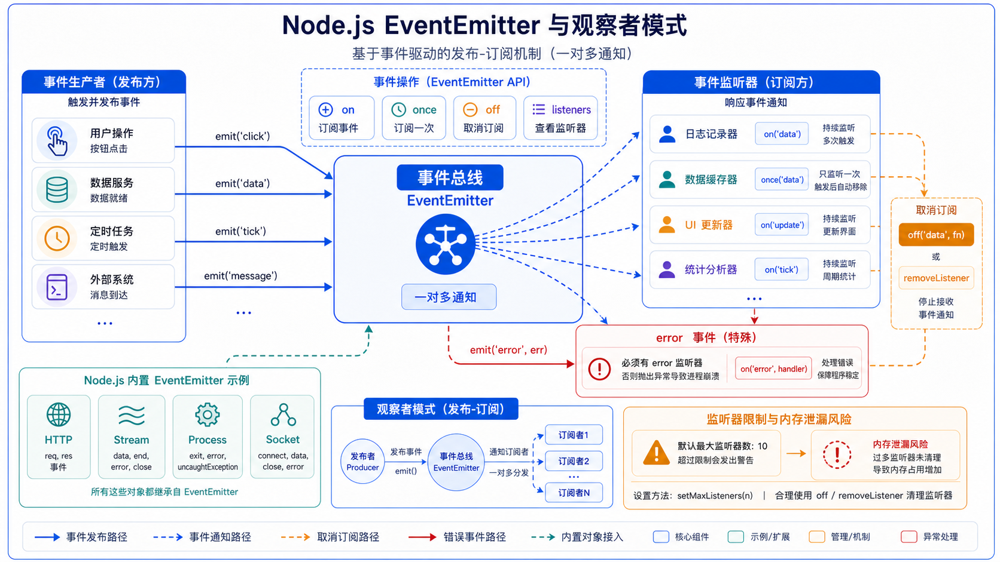

## 一、这篇文章要解决什么问题

上一篇写 HTTP 服务器时，你大概会疑惑：

```js
http.createServer((req, res) => {...})
// 看起来是回调，但底层发生了什么？
```

再比如 `fs.createReadStream`、`process.on('exit', ...)`、`socket.on('data', ...)`——这些"看到 xxx 触发时执行 yyy"的写法，背后都是**同一种模式**：**事件（Event）+ 触发（emit）**。

Node.js 几乎所有"会随时间变化"的对象（HTTP、Stream、Process、Socket、ChildProcess……）都继承自 [`EventEmitter`](https://nodejs.cn/api/events.html)。这一篇就是搞懂它：怎么订阅事件、怎么触发事件、怎么避免内存泄漏、错误怎么处理。



## 二、先用一句话讲清楚

**`EventEmitter` 是 Node.js 内置的"事件总线"基类：你可以 `on()` 监听事件，`emit()` 触发事件，`once()` 只监听一次，`off()` 移除监听——这就是 Node.js 异步协作的统一模式。**

## 三、官方文档是怎么说的

[Node.js 中文文档 - Events](https://nodejs.cn/api/events.html) 开篇：

> Node.js 核心 API 全部采用**异步事件驱动架构**。某些类型的对象（称为"触发器"）会**周期性地**触发命名事件来调用函数对象（"监听器"）。
>
> 例如：`net.Server` 对象会在每次有连接到来时触发事件；`fs.ReadStream` 会在文件被打开时触发事件；`stream` 会在数据可读时触发事件。
>
> 所有能触发事件的对象都是 `EventEmitter` 类的实例。这些对象暴露了一个 `eventEmitter.on()` 函数，允许将一个或多个函数附加到由对象触发的命名事件上。

## 四、换成人话怎么理解

`EventEmitter` 就像**一个微信群**：

- **群主**（`EventEmitter` 实例）可以在群里**发消息**（`emit('eventName', data)`）。
- **群成员**（监听器）`on('eventName', handler)` 订阅了某个话题，群主发相关消息时，**所有订阅者都会收到通知**。
- **`once('eventName', handler)`** 表示"我只想听一次，下次别再 @ 我"。
- **`off('eventName', handler)`** 表示"我退订了，别再发给我"。
- 群里发**特别消息**（`emit('error', err)`）没人监听时，**整个群炸了**（进程崩溃）。

Node.js 把这种"一对多通知"机制做成了基类，**所有异步模块都靠它**。理解了这个模型，HTTP、Stream、Process 等模块的 API 你都能秒懂。

## 五、最小可运行示例

### 5.1 入门示例

```js
// ee.mjs
import { EventEmitter } from 'node:events';

const bus = new EventEmitter();

// 订阅事件
bus.on('greet', (name) => {
  console.log(`Hello, ${name}!`);
});

// 触发事件
bus.emit('greet', 'Joekma');
// 输出：Hello, Joekma!
```

**逐行解释：**

- `new EventEmitter()`：创建一个事件总线实例。
- `bus.on('greet', handler)`：**订阅** `greet` 事件，回调函数叫**监听器（listener）**。
- `bus.emit('greet', 'Joekma')`：**触发** `greet` 事件，把 `'Joekma'` 作为参数传给所有监听器。

### 5.2 一次性的事件：once

```js
const bus = new EventEmitter();

bus.once('init', () => {
  console.log('只会执行一次');
});

bus.emit('init'); // 输出：只会执行一次
bus.emit('init'); // 不会输出
```

### 5.3 移除监听：off / removeListener

```js
const bus = new EventEmitter();

function onTick() { console.log('tick'); }

bus.on('tick', onTick);
bus.emit('tick'); // tick

bus.off('tick', onTick);     // 移除指定监听器
bus.emit('tick'); // 不再输出
```

### 5.4 错误事件：必须监听 `error`

```js
const bus = new EventEmitter();

bus.emit('error', new Error('出错了！'));
// 没监听 error → 进程崩溃并打印 stack
```

**正确写法：**

```js
const bus = new EventEmitter();
bus.on('error', (err) => {
  console.error('捕获到错误：', err.message);
});
bus.emit('error', new Error('出错了！')); // 不会崩溃
```

> **核心规则**：**`error` 事件是 EventEmitter 的"保留事件"**，没人监听就会让 Node 进程崩溃。

### 5.5 监听多个事件

```js
const bus = new EventEmitter();

bus.on('start', () => console.log('开始'));
bus.on('end',   () => console.log('结束'));

// on 接受字符串数组，批量订阅
bus.on(['data', 'close'], (payload) => {
  console.log('收到 data 或 close:', payload);
});

bus.emit('start');                // 开始
bus.emit('data', { id: 1 });      // 收到 data 或 close: { id: 1 }
bus.emit('close', 'bye');         // 收到 data 或 close: bye
```

### 5.6 自定义类继承 EventEmitter

```js
import { EventEmitter } from 'node:events';

class TaskQueue extends EventEmitter {
  constructor() {
    super();
    this.queue = [];
  }

  push(task) {
    this.queue.push(task);
    this.emit('pushed', task);  // 通知订阅者
  }

  next() {
    const task = this.queue.shift();
    if (task) this.emit('processed', task);
    return task;
  }
}

const q = new TaskQueue();
q.on('pushed',    (t) => console.log('入队：', t));
q.on('processed', (t) => console.log('出队：', t));

q.push({ id: 1, name: 'send email' });
q.next();
```

### 5.7 同步还是异步？

`emit` **默认同步**触发所有监听器：

```js
const bus = new EventEmitter();
bus.on('ping', () => console.log('1'));
bus.on('ping', () => console.log('2'));
bus.on('ping', () => console.log('3'));

bus.emit('ping');
// 同步顺序输出 1 2 3
console.log('done');
// 输出：done
```

**想异步？** 用 `setImmediate` 或 `process.nextTick` 包一下：

```js
bus.emit('ping', setImmediate); // 监听器里 await setImmediate / nextTick
```

## 六、实际项目中怎么用

### 6.1 真实项目里 EventEmitter 的"身影"

| API | 常见事件 |
| --- | -------- |
| `http.Server` | `'request'`、`'connection'`、`'close'` |
| `net.Socket`   | `'data'`、`'connect'`、`'end'`、`'close'`、`'error'` |
| `fs.ReadStream` | `'open'`、`'data'`、`'end'`、`'close'`、`'error'` |
| `process`      | `'exit'`、`'beforeExit'`、`'uncaughtException'`、`'unhandledRejection'`、`'SIGINT'` |
| `child_process`| `'message'`、`'exit'`、`'error'`、`'close'` |
| `cluster.Worker` | `'message'`、`'exit'`、`'online'` |
| `Express` 的 `req`/`res` | 也是 EventEmitter，可以 `req.on('data', ...)` |

> 这些"会触发事件"的对象，**几乎都是 EventEmitter 子类**。所以"看到 `.on(xxx, ...)`"基本等同于"这是个事件 API"。

### 6.2 内存泄漏与最大监听警告

如果不断 `on` 但忘记 `off`，监听器会**只增不减**，造成内存泄漏。Node.js 自带保护：

```js
const bus = new EventEmitter();
bus.setMaxListeners(50);          // 默认 10，可调大
console.log(bus.listenerCount('data'));
console.log(bus.listeners('data')); // 拿到所有监听器
```

> 当 `bus.on('data', fn)` 注册超过 10 个时，Node.js 会打印 `MaxListenersExceededWarning`。**这是 Node 在提醒你："可能内存泄漏了"**。

### 6.3 AsyncIterator 模式（用事件实现异步迭代）

Node.js 10+ 给 EventEmitter 加了 async iterator 支持，可以 `for await (const x of ee)`：

```js
import { EventEmitter, once } from 'node:events';

const bus = new EventEmitter();

setTimeout(() => bus.emit('data', 1), 100);
setTimeout(() => bus.emit('data', 2), 200);
setTimeout(() => bus.emit('end'), 300);

// 等到 'end' 事件为止，逐个拿到 data
for await (const x of bus) {
  if (x === undefined) break;       // 触发 end 时 x 是 undefined
  console.log('data:', x);
}
```

更优雅的写法是 `events.once(emitter, eventName)`：

```js
const bus = new EventEmitter();
setTimeout(() => bus.emit('ready'), 100);

const [payload] = await once(bus, 'ready');
console.log('准备就绪：', payload);
```

### 6.4 实战：实现一个简单的日志总线

```js
// logger-bus.mjs
import { EventEmitter } from 'node:events';
import { createWriteStream } from 'node:fs';
import { mkdir } from 'node:fs/promises';
import { dirname } from 'node:path';

class Logger extends EventEmitter {
  constructor(filePath) {
    super();
    this.stream = createWriteStream(filePath, { flags: 'a' });
  }

  log(level, msg) {
    const line = `[${new Date().toISOString()}] [${level}] ${msg}\n`;
    this.stream.write(line);
    this.emit('log', { level, msg, line });   // 通知外部订阅者
  }
}

const logger = new Logger('logs/app.log');

// 订阅：告警级别发到钉钉
logger.on('log', ({ level, msg }) => {
  if (level === 'ERROR') {
    // sendToDingTalk(msg);
    console.error('🔔 告警：', msg);
  }
});

logger.log('INFO',  '服务启动');
logger.log('ERROR', '数据库连不上');
```

## 七、常见误区

### 误区 1：没监听 `error` 事件导致进程崩溃

- **错在哪里**：拿到一个 `EventEmitter`（如 `fs.createReadStream('x')`），不监听 `error`。
- **为什么会错**：文件不存在、连接断开等都会触发 `error`，没人监听就崩。
- **正确写法**：**几乎所有 EventEmitter 都要先 `on('error', ...)`**。

### 误区 2：不断 `on` 同一个监听器，内存爆炸

- **错在哪里**：循环里 `bus.on('data', handler)`，handler 闭包不释放。
- **为什么会错**：监听器数量只增不减，触发时遍历也变慢。
- **正确写法**：
  - 循环外注册一次，循环内**只 emit**。
  - 或在不需要时 `bus.off('data', handler)`。
  - 大对象用 `setMaxListeners(0)` 关闭警告（先想清楚）。

### 误区 3：在 `emit('error')` 时把 Error 序列化

- **错在哪里**：`bus.emit('error', '出错了')`（传字符串）。
- **为什么会错**：约定上 `error` 事件应该传 `Error` 实例，stack、code 字段才能用。
- **正确写法**：
  ```js
  bus.emit('error', new Error('出错了'));
  ```

### 误区 4：用 `addListener` 而不是 `on`

- **错在哪里**：以为 `addListener` 更高深。
- **为什么会错**：两者**完全等价**，`on` 是 `addListener` 的别名。
- **正确写法**：用 `on` / `off`，更现代、更短。

### 误区 5：监听器里抛错没人接

- **错在哪里**：
  ```js
  bus.on('tick', () => { throw new Error('boom'); });
  bus.emit('tick'); // 进程崩溃
  ```
- **为什么会错**：监听器抛错会冒泡到 `process.on('uncaughtException')`，没人接就崩。
- **正确写法**：监听器内部 `try/catch`，或者在 'error' 事件上做兜底。

## 八、和相似概念的区别

| 概念 | 是什么 | 关键差异 |
| ---- | ------ | -------- |
| **EventEmitter** | Node.js 原生事件总线 | **同步**触发，适合进程内通信 |
| **`on('xxx', fn)` 监听 vs `await once(ee, 'xxx')`** | 同一事件的两种消费方式 | `on` 持续监听；`once` 等一次结果（Promise） |
| **观察者模式 vs 发布订阅** | 设计模式 | 严格地说 EventEmitter 是**发布订阅**：总线解耦生产者和订阅者 |
| **Promise** | 处理一次性异步结果 | 不适合"多次触发"的事件 |
| **Web EventTarget** | 浏览器的 `addEventListener` | 思路一致，API 不同 |
| **RxJS / EventEmitter2** | 第三方事件库 | 支持通配符、命名空间、async pipe；EventEmitter 没有 |

## 九、小结

1. **`EventEmitter` 是 Node.js 异步 API 的"地基"**，HTTP、Stream、Process、Socket 都是它的子类。
2. 三个核心 API：`on`（订阅）、`emit`（触发）、`off`（退订）；再加 `once`（一次性）。
3. **`error` 事件必须监听**，否则会引发进程崩溃。
4. 警惕"**监听器泄漏**"：用 `listenerCount`、`setMaxListeners` 监控；不需要时 `off` 掉。
5. 现代 Node.js 还能用 `events.once(ee, name)` 把事件转成 Promise，**配合 async/await 写起来更顺**。

---

下一篇我们将学习 **08-异步编程：回调、Promise、async/await**——三套写法对比，Promise 链式调用、错误穿透、并发控制全讲清楚。
