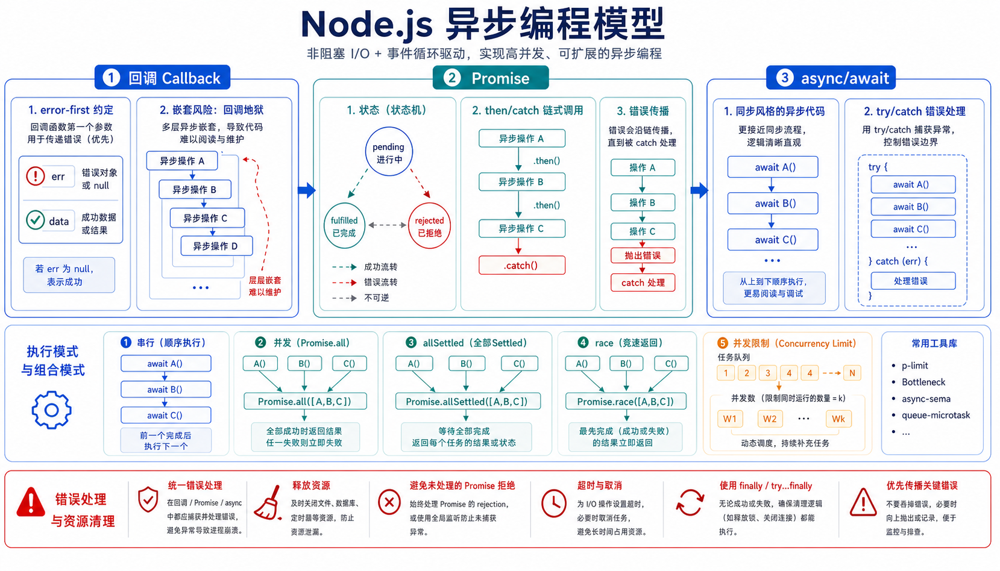

## 一、这篇文章要解决什么问题

Node.js 是**异步 I/O** 的运行时——几乎所有"慢操作"（读文件、发请求、查数据库、等定时器）都是**异步**的。Node.js 历史上用三种写法处理异步：

1. **回调函数**（Callback）：`fs.readFile(path, (err, data) => {...})`
2. **Promise**（承诺）：`fs.promises.readFile(path).then(...).catch(...)`
3. **`async/await`**：用同步写法做异步，`const data = await fs.promises.readFile(path)`

新人最常踩的坑：

- 嵌套回调（**回调地狱**）
- 多个异步操作怎么并发 / 串行
- 错误怎么穿透
- 多个 Promise 怎么 `await Promise.all`
- 第三方库只暴露回调，怎么"变成" Promise

这一篇系统讲清楚这三种写法 + 实战套路。



## 二、先用一句话讲清楚

**Node.js 的异步编程从「回调」演进到「Promise」再演进到「async/await」。新代码统一用 `async/await`，底层是 Promise；老库用 `util.promisify` 包装；并发用 `Promise.all` / `Promise.allSettled`，串行用 `for...of` + `await`。**

## 三、官方文档是怎么说的

[Node.js 中文文档 - 异步上下文跟踪](https://nodejs.cn/api/async_context.html) 与 [JavaScript MDN - Promise](https://developer.mozilla.org/zh-CN/docs/Web/JavaScript/Reference/Global_Objects/Promise) 共同给出了 Node.js 异步的"宪法"：

> Node.js 的 API 设计倾向于**异步非阻塞**风格。大部分核心 API 都提供**回调**、**Promise** 两套风格。新代码建议优先使用 **async/await**。

补充理解（不在原文）：

- `async/await` 是 ES2017 引入的语法糖，本质是 **Promise + 自动执行器**。一个 `async` 函数**永远返回 Promise**。
- 错误处理：`async/await` 用 `try/catch`；`Promise` 用 `.catch()`；回调用 `(err, data) => {}` 第一个参数传错误（**Error-first 回调**约定）。
- `util.promisify` 是 Node.js 提供的"把回调函数转成 Promise"的工具，**专门用来兼容老 API**。

## 四、换成人话怎么理解

把"异步操作"想象成**"叫外卖"**：

- **同步（阻塞）**：你站在外卖店门口等，直到饭做好才离开——**期间啥都干不了**。
- **回调**：你点完外卖留下手机号（回调函数），等餐到了店家给你打电话（触发回调）。一次两次没事，**点五份**就五个电话，乱成一团。
- **Promise**：店家给你一张**小票**（Promise 对象），上面写着"我稍后送过来"，你可以选择**等电话**（`.then`）、**不要了**（`.catch` 拒收）。
- **`async/await`**：你**假装**这家店就在隔壁，`const food = await order(...)`——代码看起来像同步，但实际是异步等。**写法最自然，调试最友好**。

所以：

- 回调：**老风格，复杂业务别用**。
- Promise：**通用基础设施**。
- `async/await`：**新代码首选**（建立在 Promise 之上）。

## 五、最小可运行示例

> 本节全部用 **Promise + async/await**（现代推荐写法）。

### 5.1 读取一个文件

**回调版（老）：**

```js
import { readFile } from 'node:fs';

readFile('hello.txt', 'utf8', (err, data) => {
  if (err) return console.error(err);
  console.log(data);
});
```

**Promise 版：**

```js
import { readFile } from 'node:fs/promises';

readFile('hello.txt', 'utf8')
  .then((data) => console.log(data))
  .catch((err) => console.error(err));
```

**async/await 版：**

```js
import { readFile } from 'node:fs/promises';

try {
  const data = await readFile('hello.txt', 'utf8');
  console.log(data);
} catch (err) {
  console.error(err);
}
```

### 5.2 串行 vs 并发

**串行**：先读 A，再读 B，再读 C。

```js
import { readFile } from 'node:fs/promises';

async function readAll(files) {
  const results = [];
  for (const f of files) {                   // 串行：等上一个完成才开始下一个
    const data = await readFile(f, 'utf8');
    results.push(data);
  }
  return results;
}
```

**并发**：所有文件**同时**开始读。

```js
async function readAllParallel(files) {
  const promises = files.map((f) => readFile(f, 'utf8'));
  return Promise.all(promises);              // 全部成功才 resolve
}
```

**控制并发数**（一次最多 3 个）：

```js
async function pMap(arr, mapper, concurrency = 3) {
  const results = new Array(arr.length);
  let i = 0;
  const workers = Array.from({ length: concurrency }, async () => {
    while (i < arr.length) {
      const idx = i++;
      results[idx] = await mapper(arr[idx], idx);
    }
  });
  await Promise.all(workers);
  return results;
}

const files = ['a.txt', 'b.txt', 'c.txt', 'd.txt', 'e.txt'];
const data  = await pMap(files, (f) => readFile(f, 'utf8'), 3);
```

### 5.3 错误处理与"快速失败"

```js
import { readFile } from 'node:fs/promises';

async function safeRead(path) {
  try {
    return await readFile(path, 'utf8');
  } catch (err) {
    if (err.code === 'ENOENT') return null;     // 文件不存在时返回 null
    throw err;                                  // 其它错误继续抛
  }
}
```

### 5.4 把老回调 API 变成 Promise

```js
import { promisify } from 'node:util';
import { readFile } from 'node:fs';

// promisify 把 (err, data) => {} 风格的函数转成返回 Promise 的版本
const readFileP = promisify(readFile);

const data = await readFileP('hello.txt', 'utf8');
```

> Node.js 14+ 起几乎所有内置 API 都有原生 Promise 版本（`fs/promises`、`dns/promises`、`stream/promises`），**`util.promisify` 主要用于第三方老库**。

### 5.5 Promise 组合子

```js
import { setTimeout as sleep } from 'node:timers/promises';

// Promise.all —— 全部成功才成功，一个失败就失败
const [a, b] = await Promise.all([task1(), task2()]);

// Promise.allSettled —— 全部完成后给出每项的 { status, value | reason }
const results = await Promise.allSettled([task1(), task2(), task3()]);
results.forEach((r) => {
  if (r.status === 'fulfilled') console.log('成功：', r.value);
  else                           console.log('失败：', r.reason);
});

// Promise.race —— 谁先完成用谁
const fastest = await Promise.race([fetchA(), fetchB(), fetchC()]);

// Promise.any —— 第一个成功用谁，全失败才 reject
const first = await Promise.any([fetchA(), fetchB(), fetchC()]);

// 简单超时
const data = await Promise.race([
  fetchSlow(),
  sleep(3000).then(() => Promise.reject(new Error('timeout'))),
]);
```

### 5.6 `node:timers/promises` —— 替代 setTimeout

```js
import { setTimeout as sleep } from 'node:timers/promises';

await sleep(1000);             // 等 1 秒，不阻塞事件循环
console.log('1 秒后醒来');

// abort 友好的超时
const ctrl = new AbortController();
setTimeout(() => ctrl.abort(), 5000);
try {
  await fetch('https://slow-api.com', { signal: ctrl.signal });
} catch (err) {
  if (err.name === 'AbortError') console.log('请求被取消');
}
```

### 5.7 unhandledRejection

如果一个 Promise 失败没人 `.catch()` 也没 `await`，Node.js 会报警甚至崩溃。

```js
import { readFile } from 'node:fs/promises';

// 危险：没人接的失败
readFile('not-exist.txt', 'utf8').then(console.log);
// 输出：UnhandledPromiseRejection

// 全局兜底
process.on('unhandledRejection', (err, promise) => {
  console.error('未处理的 Promise 拒绝：', err);
});
```

> Node.js 15+ 默认对 unhandledRejection 抛出错误（`--unhandled-rejections=throw`）。

## 六、实际项目中怎么用

### 6.1 异步编程"实战套路"

| 场景 | 推荐写法 | 原因 |
| ---- | -------- | ---- |
| **多个独立 HTTP 请求** | `Promise.all(urls.map(fetch))` | 并发快，一个失败要重试就用 `allSettled` |
| **多个依赖的串行** | `for...of` + `await` | 每步依赖上一步结果 |
| **多个任务限制并发** | 第三方库 `p-limit`、`p-map` | 防止 OOM 或触发限流 |
| **老回调 API** | `util.promisify` 一次性包装 | 保持代码风格统一 |
| **延迟 / 超时** | `node:timers/promises` | 配合 `AbortController` 干净 |
| **统一错误处理** | 外层 `try/catch` + 自定义 `AppError` | 配合 Express 中间件 |

### 6.2 实战：批量下载并限制并发

```js
import { setTimeout as sleep } from 'node:timers/promises';

async function download(url) {
  const res = await fetch(url);
  if (!res.ok) throw new Error(`HTTP ${res.status}`);
  return res.text();
}

async function pMap(items, mapper, concurrency = 3) {
  const results = new Array(items.length);
  let i = 0;
  const workers = Array.from({ length: concurrency }, async () => {
    while (i < items.length) {
      const idx = i++;
      results[idx] = await mapper(items[idx], idx);
    }
  });
  await Promise.all(workers);
  return results;
}

const urls = [
  'https://api.example.com/a',
  'https://api.example.com/b',
  'https://api.example.com/c',
  'https://api.example.com/d',
  'https://api.example.com/e',
];

try {
  const data = await pMap(urls, download, 2);
  console.log('全部下载完成：', data);
} catch (err) {
  console.error('某个下载失败：', err);
}
```

### 6.3 实战：可取消的超时请求

```js
import { setTimeout as sleep } from 'node:timers/promises';

async function fetchWithTimeout(url, ms) {
  const ctrl = new AbortController();
  const timer = setTimeout(() => ctrl.abort(), ms);
  try {
    const res = await fetch(url, { signal: ctrl.signal });
    return await res.text();
  } finally {
    clearTimeout(timer);
  }
}

try {
  const html = await fetchWithTimeout('https://slow-site.com', 3000);
  console.log(html.length);
} catch (err) {
  if (err.name === 'AbortError') console.log('超时啦');
  else                          console.error(err);
}
```

## 七、常见误区

### 误区 1：在 `forEach` 里 `await`

- **错在哪里**：
  ```js
  urls.forEach(async (u) => { await download(u); });   // 并发且无法 await 全部完成
  ```
- **为什么会错**：`forEach` 不会等回调返回，外层函数会立刻继续。`async` 回调变成"放飞自我"的小协程，**总时间变长且无法统一捕获错误**。
- **正确写法**：
  ```js
  // 串行
  for (const u of urls) await download(u);
  
  // 并发
  await Promise.all(urls.map(download));
  ```

### 误区 2：忘记 `await`，得到的是 Promise 对象

- **错在哪里**：
  ```js
  const data = readFile('a.txt', 'utf8');   // 没 await
  console.log(data);                        // Promise { <pending> }
  ```
- **为什么会错**：`readFile` 返回 Promise，不 `await` 拿不到值。
- **正确写法**：加 `await`，并确保在 `async` 函数中。

### 误区 3：把 try/catch 放在 Promise.all 外层"接不住"

- **错在哪里**：
  ```js
  try {
    const r = await Promise.all([task1(), task2()]); // task2 失败
  } catch (e) { /* 进得来 */ }
  ```
- **为什么会错**：可以接住，没毛病。但**`Promise.all` 一旦 reject，剩下的 Promise 仍会继续执行**（不会取消），可能造成资源浪费。
- **正确写法**：要"任一失败就取消其它" → 用 `AbortController` + 单独处理。

### 误区 4：吞掉 Promise 错误

- **错在哪里**：
  ```js
  readFile('a.txt', 'utf8').catch(() => {});    // 静默吞错
  ```
- **为什么会错**：错误被吞，调试时找不原因。
- **正确写法**：哪怕是"无所谓"的错误，也至少 `console.error` 或上报到日志。

### 误区 5：`async` 函数 return 一个数字，外面拿不到数字

- **错在哪里**：
  ```js
  async function f() { return 1; }
  const r = f();
  console.log(r);            // Promise { 1 }
  ```
- **为什么会错**：`async` 函数**永远返回 Promise**。
- **正确写法**：
  ```js
  const r = await f();
  console.log(r);            // 1
  ```

## 八、和相似概念的区别

| 概念 | 是什么 | 关键差异 |
| ---- | ------ | -------- |
| **回调** | 老 Node.js 异步风格 | 嵌套深（回调地狱），但库最多 |
| **Promise** | ES2015 标准，**状态机** | 链式 `.then/.catch`，**不可取消** |
| **async/await** | ES2017 语法糖 | 写法最像同步，可读性最好 |
| **Generator** | ES2015 老异步方案 | 已被 async/await 取代，**不推荐** |
| **事件** | EventEmitter，**多次触发** | 适合"持续监听"而非"一次性" |
| **Worker Threads** | 多线程并行 | 处理 **CPU 密集**，不是 I/O |

## 九、小结

1. **新代码统一用 `async/await`**，底层是 Promise；老回调用 `util.promisify` 包装。
2. **并发用 `Promise.all`/`allSettled`**，**串行用 `for...of + await`**，**限制并发用 `p-limit` 风格的 worker 池**。
3. **`async` 函数永远返回 Promise**，必须 `await` 才能拿到值。
4. **别在 `forEach` 里 `await`**；也别在 `Promise.all` 里混用串行/并发逻辑。
5. **别让 Promise 静默失败**：每个 Promise 链都有 `.catch` 或外层 `try/catch`，全局监听 `unhandledRejection` 做兜底。

---

下一篇我们将深入原理——**09-事件循环：理解 Node.js 异步的底层原理**，搞懂 `setTimeout`、`Promise`、`I/O` 究竟谁先执行，面试常问的"宏任务/微任务"全讲清楚。
