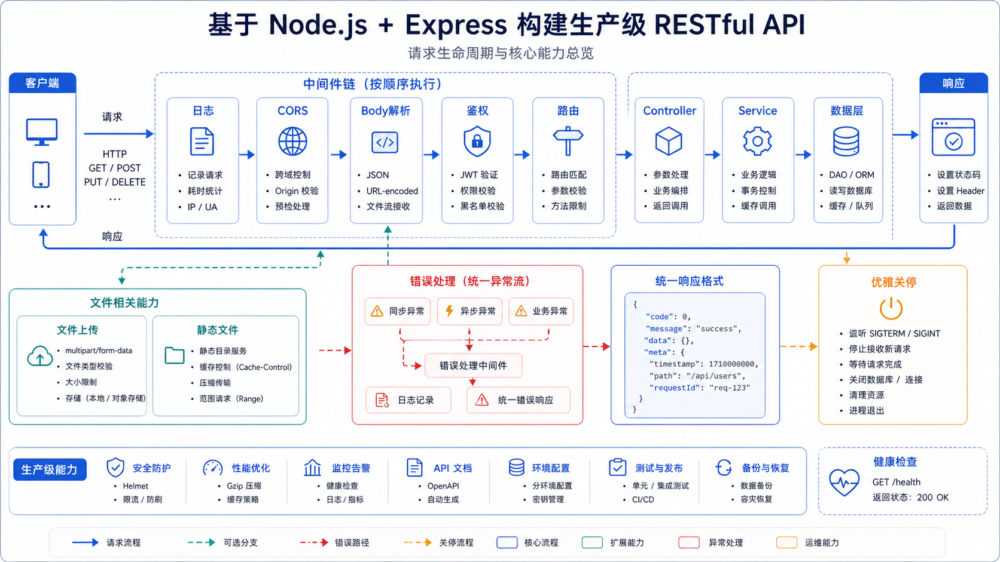

## 一、这篇文章要解决什么问题

前面 12 篇把 Node.js 的"零件"全过了一遍：

- HTTP 模块、原生路由
- fs / path / Buffer / Stream
- 异步编程、事件循环
- 进程与子进程

但你大概率会有个疑问：**"我都学过了，但为什么还要用 Express？"**

答案是：**Express 帮你把"路由解析 + 中间件链 + 错误处理 + Body 解析 + 静态托管 + 鉴权"这些重复劳动封装了**。它不创造新能力，只把原生 `http` 的样板代码抽出来。

这一篇我们就**从零搭一个生产级的 RESTful API**，把前 12 篇知识全用上——登录注册、JWT 鉴权、CRUD、文件上传、错误处理、日志、优雅关停。**学完这篇，你就能写一个能上线的 Node.js 后端了。**



## 二、先用一句话讲清楚

**生产级 Node.js API = Express/Koa/Fastify 框架（路由 + 中间件）+ 鉴权（JWT/Cookie）+ 数据存储（DB/ORM）+ 错误处理（统一响应格式）+ 文件上传（multer）+ 优雅关停（SIGTERM 处理）。**

## 三、官方文档是怎么说的

[Express 中文文档](https://expressjs.com/zh-cn/) 开篇：

> Express 是一个**快速、极简的** Node.js Web 应用框架。它提供一系列强大的特性，帮助你快速搭建 Web 和移动应用。
>
> - 路由系统
> - 中间件机制
> - 模板引擎
> - 错误处理

补充理解（不在原文）：

- Express **只是 `http` 模块的封装**——本质还是 `http.createServer` + 一套路由/中间件机制。
- **Koa** 是 Express 团队打造的"下一代"，更轻量、更 async。**Fastify** 性能更好、Schema 校验内置。**Nest** 适合大型项目。
- 选哪个不重要，**理解"中间件链 + 路由 + 错误处理"模型**才重要。

## 四、换成人话怎么理解

把 Express 服务器想象成**一个餐厅的"流水线厨房"**：

- **请求** = 一张点菜单（`req`）。
- **响应** = 端出去的菜（`res`）。
- **中间件** = 流水线上的一个工位，比如"切菜"、"调味"、"摆盘"。
- **路由** = 根据点菜单上的"菜名"决定走哪条流水线。

一个请求进来，会**按顺序**经过一个个工位（中间件）：

```text
[请求] →  logger  →  cors  →  body 解析  →  鉴权  →  业务  →  响应
```

每个工位都可以：

- **改菜谱**（修改 `req` / `res`）
- **继续往下传**（调 `next()`）
- **直接出菜**（直接 `res.end()` 不传下去）
- **报错**（传给错误处理工位）

**Express 的核心就是"中间件链 + 路由 + 错误处理"**。懂了这条流水线，你看任何 Node 框架都秒懂。

## 五、最小可运行示例

> 下面是一个**完整、能跑**的 API 项目。所有代码可直接复制。

### 5.1 项目结构

```
my-api/
├── src/
│   ├── app.js          # Express 应用
│   ├── server.js       # 启动入口（监听端口 + 优雅关停）
│   ├── config.js       # 配置加载
│   ├── db.js           # 内存"数据库"（演示）
│   ├── auth.js         # JWT 签发/校验
│   ├── logger.js       # 日志中间件
│   ├── error.js        # 统一错误处理
│   └── routes/
│       ├── auth.js     # 登录注册
│       └── todos.js    # CRUD
├── data/               # JSON 持久化（演示用）
├── uploads/            # 上传目录
├── package.json
└── .env
```

### 5.2 初始化项目

```bash
mkdir my-api && cd my-api
npm init -y

# 设置 type: module
npm pkg set type=module

# 装依赖
npm install express jsonwebtoken bcryptjs multer dotenv
npm install --save-dev nodemon
```

```json
// package.json scripts
{
  "scripts": {
    "start": "node src/server.js",
    "dev": "node --watch src/server.js"
  }
}
```

### 5.3 加载配置

```js
// src/config.js
import 'dotenv/config';

export const config = {
  port:        Number(process.env.PORT) || 3000,
  jwtSecret:   process.env.JWT_SECRET || 'dev-secret-please-change',
  jwtExpires:  process.env.JWT_EXPIRES || '7d',
  uploadDir:   process.env.UPLOAD_DIR  || 'uploads',
  dataDir:     process.env.DATA_DIR    || 'data',
  logFile:     process.env.LOG_FILE    || 'logs/app.log',
  nodeEnv:     process.env.NODE_ENV    || 'development',
};
```

```bash
# .env
PORT=3000
JWT_SECRET=please-change-in-production
NODE_ENV=development
```

### 5.4 简易"数据库"（JSON 文件）

```js
// src/db.js
import { readFile, writeFile, mkdir } from 'node:fs/promises';
import { dirname } from 'node:path';
import { config } from './config.js';

async function ensureFile(file, defaultVal) {
  try {
    await readFile(file, 'utf8');
  } catch (err) {
    if (err.code === 'ENOENT') {
      await mkdir(dirname(file), { recursive: true });
      await writeFile(file, JSON.stringify(defaultVal, null, 2), 'utf8');
    } else throw err;
  }
}

async function readJson(file, defaultVal) {
  await ensureFile(file, defaultVal);
  return JSON.parse(await readFile(file, 'utf8'));
}

async function writeJson(file, data) {
  await mkdir(dirname(file), { recursive: true });
  await writeFile(file, JSON.stringify(data, null, 2), 'utf8');
}

// 内存版（不持久化）
const memory = { users: [], todos: [] };
await ensureFile(`${config.dataDir}/users.json`, []);
await ensureFile(`${config.dataDir}/todos.json`, []);

// 文件版（演示用）
export const db = {
  users: {
    async all() { return readJson(`${config.dataDir}/users.json`, []); },
    async save(users) { return writeJson(`${config.dataDir}/users.json`, users); },
  },
  todos: {
    async all() { return readJson(`${config.dataDir}/todos.json`, []); },
    async save(todos) { return writeJson(`${config.dataDir}/todos.json`, todos); },
  },
};

export { memory };
```

### 5.5 鉴权：JWT 签发和校验

```js
// src/auth.js
import jwt from 'jsonwebtoken';
import bcrypt from 'bcryptjs';
import { config } from './config.js';

export function signToken(payload) {
  return jwt.sign(payload, config.jwtSecret, { expiresIn: config.jwtExpires });
}

export function verifyToken(token) {
  return jwt.verify(token, config.jwtSecret);
}

export async function hashPassword(pwd) {
  return bcrypt.hash(pwd, 10);
}

export async function comparePassword(pwd, hash) {
  return bcrypt.compare(pwd, hash);
}

// 鉴权中间件
export function requireAuth(req, res, next) {
  const auth = req.headers.authorization;
  if (!auth?.startsWith('Bearer ')) {
    return res.status(401).json({ error: '未登录' });
  }
  try {
    const payload = verifyToken(auth.slice(7));
    req.user = payload;
    next();
  } catch (err) {
    res.status(401).json({ error: 'token 无效或过期' });
  }
}
```

### 5.6 日志中间件

```js
// src/logger.js
import { createWriteStream, mkdirSync } from 'node:fs';
import { dirname } from 'node:path';
import { config } from './config.js';

mkdirSync(dirname(config.logFile), { recursive: true });
const logStream = createWriteStream(config.logFile, { flags: 'a' });

export function logger(req, res, next) {
  const start = Date.now();
  res.on('finish', () => {
    const line = `[${new Date().toISOString()}] ${req.method} ${req.url} ${res.statusCode} ${Date.now() - start}ms\n`;
    process.stdout.write(line);
    logStream.write(line);
  });
  next();
}
```

### 5.7 错误处理工具

```js
// src/error.js
export class AppError extends Error {
  constructor(message, statusCode = 500, code = 'INTERNAL_ERROR') {
    super(message);
    this.statusCode = statusCode;
    this.code = code;
  }
}

export function notFound(req, res, next) {
  res.status(404).json({ error: 'Not Found', path: req.url });
}

// 统一错误处理中间件（4 参数是错误处理中间件的标志）
export function errorHandler(err, req, res, next) {   // eslint-disable-line no-unused-vars
  console.error('[ERROR]', err);
  if (err instanceof AppError) {
    return res.status(err.statusCode).json({ error: err.message, code: err.code });
  }
  res.status(500).json({ error: '服务器错误' });
}
```

### 5.8 路由：登录注册

```js
// src/routes/auth.js
import { Router } from 'express';
import { db } from '../db.js';
import { signToken, hashPassword, comparePassword } from '../auth.js';
import { AppError } from '../error.js';

const router = Router();

router.post('/register', async (req, res, next) => {
  try {
    const { username, password } = req.body ?? {};
    if (!username || !password) throw new AppError('需要 username 和 password', 400);
    if (password.length < 6)   throw new AppError('密码至少 6 位', 400);

    const users = await db.users.all();
    if (users.find((u) => u.username === username)) {
      throw new AppError('用户名已存在', 409);
    }

    const user = {
      id: users.length + 1,
      username,
      passwordHash: await hashPassword(password),
      createdAt: new Date().toISOString(),
    };
    users.push(user);
    await db.users.save(users);

    const token = signToken({ id: user.id, username: user.username });
    res.status(201).json({ token, user: { id: user.id, username: user.username } });
  } catch (err) { next(err); }
});

router.post('/login', async (req, res, next) => {
  try {
    const { username, password } = req.body ?? {};
    if (!username || !password) throw new AppError('需要 username 和 password', 400);

    const users = await db.users.all();
    const user = users.find((u) => u.username === username);
    if (!user) throw new AppError('账号或密码错误', 401);

    const ok = await comparePassword(password, user.passwordHash);
    if (!ok) throw new AppError('账号或密码错误', 401);

    const token = signToken({ id: user.id, username: user.username });
    res.json({ token, user: { id: user.id, username: user.username } });
  } catch (err) { next(err); }
});

export default router;
```

### 5.9 路由：Todos CRUD

```js
// src/routes/todos.js
import { Router } from 'express';
import { db } from '../db.js';
import { requireAuth } from '../auth.js';
import { AppError } from '../error.js';

const router = Router();
router.use(requireAuth);                      // 整个模块都要登录

router.get('/', async (req, res, next) => {
  try {
    const todos = await db.todos.all();
    const mine = todos.filter((t) => t.userId === req.user.id);
    res.json({ todos: mine });
  } catch (err) { next(err); }
});

router.post('/', async (req, res, next) => {
  try {
    const { title } = req.body ?? {};
    if (!title) throw new AppError('需要 title', 400);

    const todos = await db.todos.all();
    const todo = {
      id: todos.length + 1,
      userId: req.user.id,
      title,
      done: false,
      createdAt: new Date().toISOString(),
    };
    todos.push(todo);
    await db.todos.save(todos);

    res.status(201).json({ todo });
  } catch (err) { next(err); }
});

router.put('/:id', async (req, res, next) => {
  try {
    const id = Number(req.params.id);
    const todos = await db.todos.all();
    const idx = todos.findIndex((t) => t.id === id && t.userId === req.user.id);
    if (idx < 0) throw new AppError('Todo 不存在', 404);

    todos[idx] = { ...todos[idx], ...req.body, id, userId: req.user.id };
    await db.todos.save(todos);
    res.json({ todo: todos[idx] });
  } catch (err) { next(err); }
});

router.delete('/:id', async (req, res, next) => {
  try {
    const id = Number(req.params.id);
    const todos = await db.todos.all();
    const idx = todos.findIndex((t) => t.id === id && t.userId === req.user.id);
    if (idx < 0) throw new AppError('Todo 不存在', 404);

    const [removed] = todos.splice(idx, 1);
    await db.todos.save(todos);
    res.json({ removed });
  } catch (err) { next(err); }
});

export default router;
```

### 5.10 文件上传（multer）

```js
// src/routes/upload.js
import { Router } from 'express';
import multer from 'multer';
import path from 'node:path';
import { mkdir } from 'node:fs/promises';
import { requireAuth } from '../auth.js';
import { config } from '../config.js';
import { AppError } from '../error.js';

const router = Router();
await mkdir(config.uploadDir, { recursive: true });

const storage = multer.diskStorage({
  destination: (req, file, cb) => cb(null, config.uploadDir),
  filename:    (req, file, cb) => {
    const ext = path.extname(file.originalname);
    cb(null, `${Date.now()}-${Math.random().toString(36).slice(2, 8)}${ext}`);
  },
});

const upload = multer({
  storage,
  limits: { fileSize: 5 * 1024 * 1024 },             // 5MB
  fileFilter: (req, file, cb) => {
    if (!/^image\//.test(file.mimetype)) {
      return cb(new AppError('只允许图片', 400));
    }
    cb(null, true);
  },
});

router.post('/image', requireAuth, upload.single('file'), (req, res) => {
  res.json({
    url: `/uploads/${req.file.filename}`,
    size: req.file.size,
    mimetype: req.file.mimetype,
  });
});

export default router;
```

### 5.11 应用入口（app.js）

```js
// src/app.js
import express from 'express';
import cors from 'cors';
import { config } from './config.js';
import { logger } from './logger.js';
import { notFound, errorHandler } from './error.js';
import authRoutes from './routes/auth.js';
import todoRoutes from './routes/todos.js';
import uploadRoutes from './routes/upload.js';

const app = express();

// 1. 全局中间件
app.use(cors());
app.use(express.json({ limit: '1mb' }));
app.use(logger);

// 2. 静态资源（上传的图片）
app.use('/uploads', express.static(config.uploadDir));

// 3. 健康检查
app.get('/health', (req, res) => res.json({ status: 'ok', uptime: process.uptime() }));

// 4. 业务路由
app.use('/api/auth',   authRoutes);
app.use('/api/todos',  todoRoutes);
app.use('/api/upload', uploadRoutes);

// 5. 404 和错误处理（必须放最后）
app.use(notFound);
app.use(errorHandler);

export default app;
```

### 5.12 启动入口（server.js）

```js
// src/server.js
import app from './app.js';
import { config } from './config.js';

const server = app.listen(config.port, () => {
  console.log(`服务已启动：http://localhost:${config.port}`);
});

// 优雅关停
let shuttingDown = false;
async function shutdown(signal) {
  if (shuttingDown) return;
  shuttingDown = true;
  console.log(`\n收到 ${signal}，开始优雅关停...`);

  // 1. 停止接收新连接
  server.close((err) => {
    if (err) console.error('关停出错：', err);
    else     console.log('HTTP 服务已关闭');
    process.exit(err ? 1 : 0);
  });

  // 2. 兜底：10 秒强制退出
  setTimeout(() => {
    console.error('强制退出');
    process.exit(1);
  }, 10_000).unref();
}

process.on('SIGTERM', () => shutdown('SIGTERM'));
process.on('SIGINT',  () => shutdown('SIGINT'));

// 全局兜底
process.on('unhandledRejection', (err) => {
  console.error('未处理的 Promise 拒绝：', err);
});
process.on('uncaughtException', (err) => {
  console.error('未捕获的异常：', err);
  shutdown('uncaughtException');
});
```

### 5.13 测试 API

```bash
# 启动
npm run dev

# 注册
curl -X POST http://localhost:3000/api/auth/register \
  -H 'Content-Type: application/json' \
  -d '{"username":"joekma","password":"123456"}'

# 登录
curl -X POST http://localhost:3000/api/auth/login \
  -H 'Content-Type: application/json' \
  -d '{"username":"joekma","password":"123456"}'

# 创建 todo（替换 $TOKEN 为登录返回的 token）
curl -X POST http://localhost:3000/api/todos \
  -H "Authorization: Bearer $TOKEN" \
  -H 'Content-Type: application/json' \
  -d '{"title":"学完 Node.js"}'

# 获取 todo 列表
curl http://localhost:3000/api/todos -H "Authorization: Bearer $TOKEN"
```

## 六、实际项目中怎么用

| 场景 | 推荐方案 | 原因 |
| ---- | -------- | ---- |
| **路由 / 中间件** | Express / Koa / Fastify | Express 生态最广，Fastify 性能最好 |
| **数据库** | Prisma / TypeORM / Drizzle | ORM 统一 SQL 语法，类型安全 |
| **数据校验** | Zod / Joi / class-validator | 拒绝非法输入 |
| **鉴权** | JWT (jsonwebtoken) / Session (express-session) | JWT 适合无状态 API |
| **密码** | bcrypt / argon2 | 永远不要存明文 |
| **文件上传** | multer / busboy | 自动解析 multipart/form-data |
| **日志** | pino / winston | 高性能结构化日志 |
| **环境变量** | dotenv / env-var | 12-factor 配置 |
| **CORS** | cors 中间件 | 处理跨域 |
| **限流** | express-rate-limit | 防止暴力 |
| **部署** | PM2 / Docker / K8s | 多进程 / 容器化 |
| **测试** | node:test / Vitest / Jest | 内置或社区方案 |
| **API 文档** | Swagger / OpenAPI | 自动生成文档 |

补充理解（不在原文）—— 生产环境的"加分项"：

- **HTTPS**：用 `https` 模块或前置 Nginx/Caddy。
- **压缩**：`compression` 中间件开启 gzip。
- **Helmet**：`helmet()` 设置安全 Header。
- **优雅关停**：上面 demo 已经演示（`SIGTERM` + `server.close`）。
- **健康检查**：`/health` 接口给 K8s/负载均衡探活。
- **结构化日志**：用 `pino` 替代 `console.log`，方便 ELK 收集。

## 七、常见误区

### 误区 1：把 try/catch 写得到处都是

- **错在哪里**：每个路由里都 `try { ... } catch (err) { res.status(500)... }`。
- **为什么会错**：重复样板代码，错误处理逻辑不统一。
- **正确写法**：
  - 业务里只 `throw new AppError(msg, code)`。
  - **统一错误处理中间件**集中处理（前面 `errorHandler`）。
  - 路由用 `next(err)` 把错误传过去。

### 误区 2：把密码明文存数据库

- **错在哪里**：`users.push({ username, password })`。
- **为什么会错**：数据库被脱库 = 全部密码泄露。
- **正确写法**：用 **bcrypt** 或 **argon2** 哈希后再存（前面 demo 用了 bcrypt）。

### 误区 3：JWT 永不失效

- **错在哪里**：JWT 设了 10 年有效期。
- **为什么会错**：用户改密码后旧 token 还能用，**无法撤销**。
- **正确写法**：短有效期（如 1 小时）+ 刷新 token；或用 Redis 黑名单。

### 误区 4：进程崩溃没有兜底

- **错在哪里**：代码里有未处理的 `Promise` 拒绝或 `throw`，进程默默死掉。
- **为什么会错**：用户看到 502，但没有任何日志。
- **正确写法**：
  ```js
  process.on('unhandledRejection', (err) => logger.error(err));
  process.on('uncaughtException',   (err) => { logger.error(err); shutdown(); });
  ```
  + 进程管理工具（PM2 / K8s）自动重启。

### 误区 5：把 `process.env` 直接用而不校验

- **错在哪里**：`const port = process.env.PORT || 3000`，但忘了 `JWT_SECRET`。
- **为什么会错**：生产环境没设 `JWT_SECRET` → 用默认 secret 签 token → 安全漏洞。
- **正确写法**：用 `envalid` / `zod` 校验 env，**启动时**就报错。

## 八、和相似概念的区别

| 概念 | 是什么 | 关键差异 |
| ---- | ------ | -------- |
| **Express** | 老牌 Web 框架，**最流行** | 简单，生态最大，**性能一般** |
| **Koa** | Express 团队的新框架 | 极简，async/await 原生，**需要更多手动** |
| **Fastify** | 高性能 Web 框架 | **快 2-3 倍**，Schema 校验内置 |
| **Nest** | Angular 风格企业级框架 | DI + 模块化，**适合大型项目** |
| **Hono** | 超轻量现代 Web 框架 | **Web 标准**，跨 runtime |
| **原生 http 模块** | Node.js 内置 | 灵活但**样板代码多** |

## 九、小结

1. **生产级 API = 框架 + 中间件链 + 鉴权 + 校验 + 错误处理 + 日志 + 优雅关停**。
2. **中间件** = 按顺序执行的"工位"，可以改 `req`/`res`、调 `next`、或直接响应。
3. **错误处理** = `throw AppError` + `next(err)` + 统一错误中间件，**避免到处 try/catch**。
4. **鉴权** = 永远 `bcrypt` 存密码 + JWT 短有效期 + 中间件统一校验。
5. **优雅关停** = `SIGTERM` → `server.close()` + 兜底超时；**全局监听** `unhandledRejection` 和 `uncaughtException`。
6. **永远别用 JSON 文件当数据库**——这只是 demo，真实项目用 PostgreSQL/MySQL/MongoDB + ORM。

---

下一篇是本系列收官——**14-Node.js 运行时全貌与性能优化**：V8 + libuv + 事件循环全景图，内存/CPU 排查、火焰图、生产环境最佳实践，把你从"能用"带到"能讲清楚原理"。
