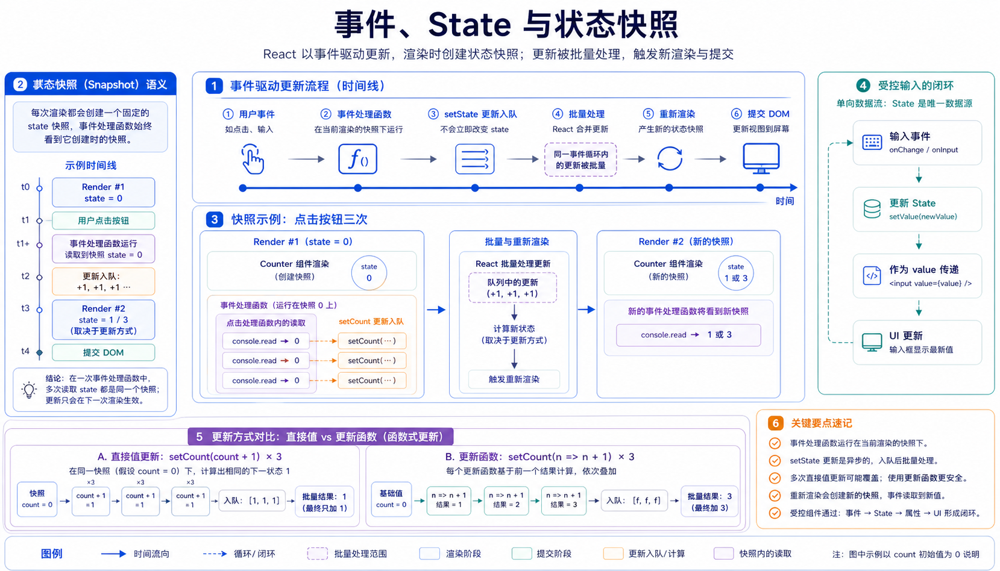

## 概述

React 的交互建立在事件和状态之上。用户触发事件，事件处理函数更新 state，React 再根据新 state 重新渲染 UI。

官方文档参考：

- https://react.dev/learn/adding-interactivity
- https://react.dev/learn/responding-to-events
- https://react.dev/learn/state-a-components-memory
- https://react.dev/learn/state-as-a-snapshot
- https://react.dev/learn/queueing-a-series-of-state-updates



## 事件处理

```jsx
// 示例：事件处理
function Toolbar() {
  function handleClick() {
    alert("开始播放");
  }

  return <button onClick={handleClick}>播放</button>;
}
```

`onClick={handleClick}` 表示把函数传给 React。不要写成 `onClick={handleClick()}`，否则会在渲染时立即执行。

## 事件对象

```jsx
// 示例：事件对象
function SearchBox() {
  function handleChange(event) {
    console.log(event.target.value);
  }

  return <input onChange={handleChange} />;
}
```

React 事件命名使用驼峰形式，如 `onClick`、`onChange`、`onSubmit`。

## 阻止默认行为

```jsx
// 示例：阻止默认行为
function LoginForm() {
  function handleSubmit(event) {
    event.preventDefault();
    alert("提交表单");
  }

  return (
    <form onSubmit={handleSubmit}>
      <input name="username" />
      <button type="submit">登录</button>
    </form>
  );
}
```

表单默认提交会刷新页面，React 中通常使用 `preventDefault()` 自己处理提交逻辑。

## State 是组件的记忆

```jsx
// 示例：State 是组件的记忆
import { useState } from "react";

function Counter() {
  const [count, setCount] = useState(0);

  function handleClick() {
    setCount(count + 1);
  }

  return <button onClick={handleClick}>{count}</button>;
}
```

`useState` 返回当前状态和更新函数。调用更新函数会触发重新渲染。

## 渲染与提交

React 更新 UI 可以理解为三个阶段：

```text
触发渲染
  ↓
执行组件函数
  ↓
提交变化到 DOM
```

组件函数不是只执行一次。每次 state 更新后，组件都会重新执行。

## State 是快照

官方文档强调 state 像一次渲染中的快照。

```jsx
// 示例：State 是快照
function Counter() {
  const [count, setCount] = useState(0);

  function handleClick() {
    console.log(count);
    setCount(count + 1);
    console.log(count);
  }

  return <button onClick={handleClick}>{count}</button>;
}
```

第二次 `console.log(count)` 仍然是旧值，因为当前事件处理函数中的 `count` 属于当前渲染快照。

## 多次更新

```jsx
// 示例：多次更新
function Counter() {
  const [score, setScore] = useState(0);

  function handleClick() {
    setScore(score + 1);
    setScore(score + 1);
    setScore(score + 1);
  }

  return <button onClick={handleClick}>{score}</button>;
}
```

如果 `score` 是 `0`，三次调用都是 `setScore(0 + 1)`，结果通常只加一次。

## 更新函数

当下一次状态依赖上一次状态时，推荐使用更新函数。

```jsx
// 示例：更新函数
function Counter() {
  const [score, setScore] = useState(0);

  function handleClick() {
    setScore(s => s + 1);
    setScore(s => s + 1);
    setScore(s => s + 1);
  }

  return <button onClick={handleClick}>{score}</button>;
}
```

React 会把更新函数放入队列，按顺序计算最终状态。

## 受控组件

当输入框值由 React state 控制时，它就是受控组件。

```jsx
// 示例：受控组件
function NameInput() {
  const [name, setName] = useState("");

  return <input value={name} onChange={event => setName(event.target.value)} />;
}
```

## 小结

React 交互主线：

- 用户触发事件。
- 事件处理函数更新 state。
- React 安排重新渲染。
- 组件函数重新执行。
- UI 根据新 state 展示。

理解“state 是快照”，可以解释很多 React 初学时看似奇怪的行为。
