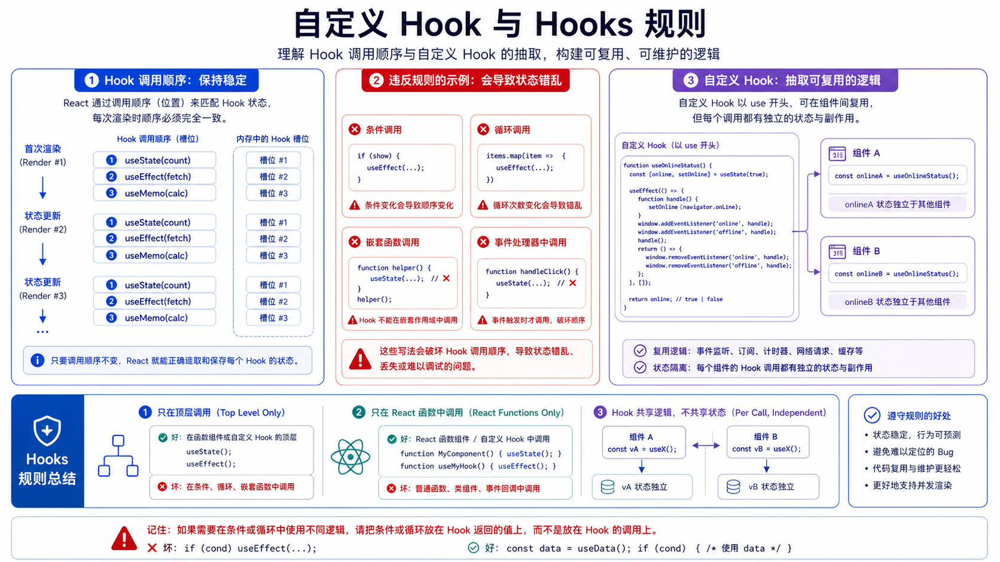

## 概述

Hooks 是 React 函数组件使用 React 能力的入口。`useState`、`useEffect`、`useRef`、`useReducer`、`useContext` 都是内置 Hook。

官方文档参考：

- https://react.dev/reference/react/hooks
- https://react.dev/reference/rules/rules-of-hooks
- https://react.dev/learn/reusing-logic-with-custom-hooks



## Hook 是什么

Hook 是以 `use` 开头的函数，它可以让组件使用 React 特性。

```jsx
// 示例：Hook 是什么
import { useState } from "react";

function Counter() {
  const [count, setCount] = useState(0);
  return <button onClick={() => setCount(count + 1)}>{count}</button>;
}
```

## 常用内置 Hook

| Hook          | 作用                          |
| ------------- | ----------------------------- |
| `useState`    | 声明组件状态                  |
| `useReducer`  | 管理复杂状态更新逻辑          |
| `useContext`  | 读取 Context 数据             |
| `useRef`      | 保存不触发渲染的值或 DOM 引用 |
| `useEffect`   | 同步外部系统                  |
| `useMemo`     | 缓存计算结果                  |
| `useCallback` | 缓存函数引用                  |
| `useId`       | 生成稳定 ID                   |

## Hooks 规则

### 只在顶层调用 Hook

不要在循环、条件、嵌套函数中调用 Hook。

错误示例：

```jsx
// 示例：只在顶层调用 Hook
function Form({ enabled }) {
  if (enabled) {
    const [name, setName] = useState("");
  }

  return <div />;
}
```

正确示例：

```jsx
// 示例：只在顶层调用 Hook
function Form({ enabled }) {
  const [name, setName] = useState("");

  if (!enabled) {
    return <p>表单不可用</p>;
  }

  return <input value={name} onChange={event => setName(event.target.value)} />;
}
```

React 依赖 Hook 调用顺序来关联状态。

### 只在 React 函数中调用 Hook

Hook 只能在函数组件或自定义 Hook 中调用，不能在普通工具函数中调用。

## 自定义 Hook

自定义 Hook 是以 `use` 开头的函数，用来封装可复用状态逻辑。

```jsx
// 示例：自定义 Hook
function useToggle(initialValue = false) {
  const [value, setValue] = useState(initialValue);

  function toggle() {
    setValue(current => !current);
  }

  return [value, toggle];
}
```

使用：

```jsx
// 示例：自定义 Hook
function Panel() {
  const [open, toggleOpen] = useToggle(false);

  return (
    <section>
      <button onClick={toggleOpen}>{open ? "收起" : "展开"}</button>
      {open && <p>面板内容</p>}
    </section>
  );
}
```

## 自定义 Hook 共享逻辑，不共享状态

每次调用自定义 Hook 都拥有独立状态。

```jsx
// 示例：自定义 Hook 共享逻辑，不共享状态
function App() {
  return (
    <>
      <Panel />
      <Panel />
    </>
  );
}
```

两个 `Panel` 的 `open` 状态互不影响。

## 提取时机

适合提取自定义 Hook：

- 多个组件有相似状态逻辑。
- 一个组件内部逻辑太长。
- Effect 和清理逻辑可以复用。
- 某段逻辑描述一个独立能力。

## 示例：在线状态

```jsx
// 示例：示例：在线状态
function useOnlineStatus() {
  const [isOnline, setIsOnline] = useState(navigator.onLine);

  useEffect(() => {
    function handleOnline() {
      setIsOnline(true);
    }

    function handleOffline() {
      setIsOnline(false);
    }

    window.addEventListener("online", handleOnline);
    window.addEventListener("offline", handleOffline);

    return () => {
      window.removeEventListener("online", handleOnline);
      window.removeEventListener("offline", handleOffline);
    };
  }, []);

  return isOnline;
}
```

组件使用：

```jsx
// 示例：示例：在线状态
function StatusBar() {
  const isOnline = useOnlineStatus();
  return <p>{isOnline ? "在线" : "离线"}</p>;
}
```

## 小结

Hooks 的重点：

- Hook 必须以 `use` 开头。
- Hook 只能在组件或自定义 Hook 顶层调用。
- 自定义 Hook 复用逻辑，不复用状态。
- 自定义 Hook 不返回 JSX，通常返回数据和操作函数。
- ESLint 规则可以帮助检查 Hook 使用是否正确。
