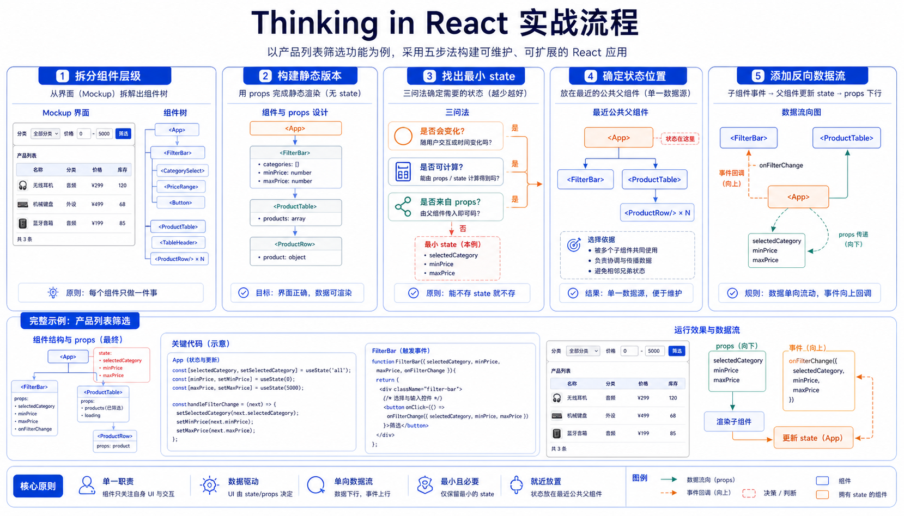

## 概述

Thinking in React 是 React 官方文档中非常经典的一篇教程。它讲的不是某个 API，而是如何用 React 的方式思考界面开发。

官方文档参考：

- https://react.dev/learn/thinking-in-react

官方总结的五个步骤：

1. 把 UI 拆成组件层级。
2. 用 React 构建静态版本。
3. 找出 UI 状态的最小完整表示。
4. 确定状态应该放在哪里。
5. 添加反向数据流。



## 示例需求

实现一个商品搜索表格：

- 顶部有搜索输入框。
- 有一个复选框，只显示有库存商品。
- 下方表格按分类展示商品。
- 商品数据来自数组。

```js
// 示例：示例需求
const products = [
  { category: "水果", price: "¥6", stocked: true, name: "苹果" },
  { category: "水果", price: "¥8", stocked: true, name: "火龙果" },
  { category: "水果", price: "¥12", stocked: false, name: "百香果" },
  { category: "蔬菜", price: "¥4", stocked: true, name: "菠菜" },
];
```

## 第一步：拆分组件层级

```text
FilterableProductTable
  ├─ SearchBar
  └─ ProductTable
      ├─ ProductCategoryRow
      └─ ProductRow
```

| 组件                     | 职责                   |
| ------------------------ | ---------------------- |
| `FilterableProductTable` | 页面容器，管理搜索条件 |
| `SearchBar`              | 搜索输入和库存筛选     |
| `ProductTable`           | 展示商品表格           |
| `ProductCategoryRow`     | 分类标题行             |
| `ProductRow`             | 单个商品行             |

## 第二步：构建静态版本

先不要加交互，也不要加 state，只用 props 渲染数据。

```jsx
// 示例：第二步：构建静态版本
function ProductCategoryRow({ category }) {
  return (
    <tr>
      <th colSpan="2">{category}</th>
    </tr>
  );
}

function ProductRow({ product }) {
  const name = product.stocked ? (
    product.name
  ) : (
    <span style={{ color: "red" }}>{product.name}</span>
  );

  return (
    <tr>
      <td>{name}</td>
      <td>{product.price}</td>
    </tr>
  );
}
```

表格组件：

```jsx
// 示例：第二步：构建静态版本
function ProductTable({ products }) {
  const rows = [];
  let lastCategory = null;

  products.forEach(product => {
    if (product.category !== lastCategory) {
      rows.push(
        <ProductCategoryRow
          category={product.category}
          key={product.category}
        />
      );
    }

    rows.push(<ProductRow product={product} key={product.name} />);
    lastCategory = product.category;
  });

  return (
    <table>
      <thead>
        <tr>
          <th>名称</th>
          <th>价格</th>
        </tr>
      </thead>
      <tbody>{rows}</tbody>
    </table>
  );
}
```

## 第三步：找出最小 state

候选数据：

| 数据         | 是否 state | 原因                             |
| ------------ | ---------- | -------------------------------- |
| 原始商品列表 | 否         | 从父组件传入                     |
| 搜索文本     | 是         | 用户输入会变化                   |
| 只显示库存   | 是         | 用户勾选会变化                   |
| 筛选后列表   | 否         | 可由商品、搜索文本、库存条件计算 |

最小 state：

```jsx
// 示例：第三步：找出最小 state
const [filterText, setFilterText] = useState("");
const [inStockOnly, setInStockOnly] = useState(false);
```

## 第四步：确定状态位置

搜索文本和库存筛选同时被 `SearchBar` 和 `ProductTable` 使用。它们最近的共同父组件是 `FilterableProductTable`，所以状态放在那里。

```jsx
// 示例：第四步：确定状态位置
function FilterableProductTable({ products }) {
  const [filterText, setFilterText] = useState("");
  const [inStockOnly, setInStockOnly] = useState(false);

  return (
    <div>
      <SearchBar filterText={filterText} inStockOnly={inStockOnly} />
      <ProductTable
        products={products}
        filterText={filterText}
        inStockOnly={inStockOnly}
      />
    </div>
  );
}
```

## 第五步：添加反向数据流

父组件把状态和修改函数传给子组件。

```jsx
// 示例：第五步：添加反向数据流
function FilterableProductTable({ products }) {
  const [filterText, setFilterText] = useState("");
  const [inStockOnly, setInStockOnly] = useState(false);

  return (
    <div>
      <SearchBar
        filterText={filterText}
        inStockOnly={inStockOnly}
        onFilterTextChange={setFilterText}
        onInStockOnlyChange={setInStockOnly}
      />
      <ProductTable
        products={products}
        filterText={filterText}
        inStockOnly={inStockOnly}
      />
    </div>
  );
}
```

`SearchBar` 使用受控组件：

```jsx
// 示例：第五步：添加反向数据流
function SearchBar({
  filterText,
  inStockOnly,
  onFilterTextChange,
  onInStockOnlyChange,
}) {
  return (
    <form>
      <input
        type="text"
        value={filterText}
        placeholder="搜索商品"
        onChange={event => onFilterTextChange(event.target.value)}
      />
      <label>
        <input
          type="checkbox"
          checked={inStockOnly}
          onChange={event => onInStockOnlyChange(event.target.checked)}
        />
        只显示有库存商品
      </label>
    </form>
  );
}
```

## 数据流总结

```text
FilterableProductTable 保存 state
  ↓ props
SearchBar 显示输入值
  ↓ onChange 回调
FilterableProductTable 更新 state
  ↓ props
ProductTable 根据条件重新计算列表
```

这就是 React 单向数据流：数据向下传递，事件向上传递。

## 小结

Thinking in React 是写好 React 的思维模板：

- 先拆组件。
- 先做静态版本。
- state 必须最小且完整。
- 状态放在最近共同父组件。
- 子组件通过回调通知父组件。

这套思路越熟，React 项目越不容易乱。
