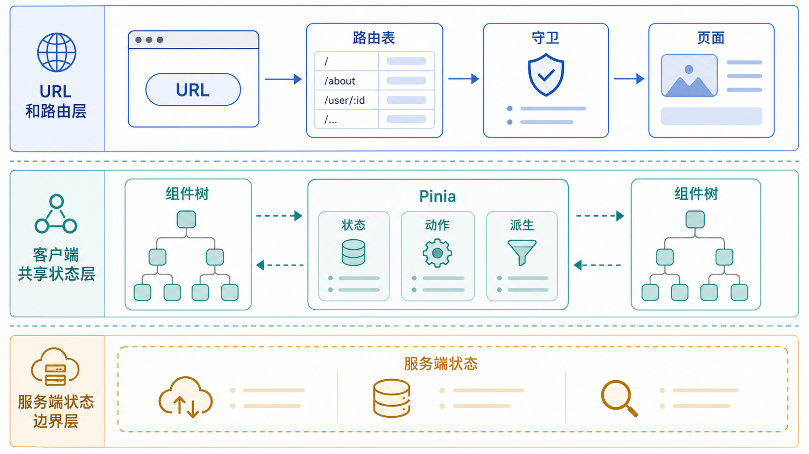

Vue 3 项目中，页面切换通常交给 Vue Router 4，全局客户端状态通常交给 Pinia。二者解决的问题不同：路由描述 URL 和页面关系，Pinia 描述跨组件共享状态。



## 安装

```bash
npm install vue-router pinia
```

## 路由配置

```javascript
// router/index.js
import { createRouter, createWebHistory } from 'vue-router'
import HomeView from '@/views/HomeView.vue'
import PostDetailView from '@/views/PostDetailView.vue'

const routes = [
  { path: '/', component: HomeView },
  { path: '/posts/:id', component: PostDetailView, props: true },
]

export const router = createRouter({
  history: createWebHistory(),
  routes,
})
```

```javascript
// main.js：注册路由和状态管理。
import { createApp } from 'vue'
import { createPinia } from 'pinia'
import App from './App.vue'
import { router } from './router'

createApp(App).use(createPinia()).use(router).mount('#app')
```

## 页面中读取参数

```vue
<script setup>
import { useRoute } from 'vue-router'

const route = useRoute()

// 路由参数来自 URL，必要时要转换和校验类型。
const postId = Number(route.params.id)
</script>

<template>
  <h1>文章 {{ postId }}</h1>
</template>
```

## 路由守卫

```javascript
router.beforeEach((to) => {
  const token = localStorage.getItem('token')

  // 需要登录的页面统一拦截。
  if (to.meta.requiresAuth && !token) {
    return { path: '/login', query: { redirect: to.fullPath } }
  }
})
```

## Pinia Store

```javascript
// stores/user.js
import { defineStore } from 'pinia'
import { computed, ref } from 'vue'

export const useUserStore = defineStore('user', () => {
  const profile = ref(null)

  const isLogin = computed(() => Boolean(profile.value))

  function setProfile(nextProfile) {
    profile.value = nextProfile
  }

  function logout() {
    profile.value = null
  }

  return { profile, isLogin, setProfile, logout }
})
```

```vue
<script setup>
import { useUserStore } from '@/stores/user'

const userStore = useUserStore()
</script>

<template>
  <button v-if="userStore.isLogin" @click="userStore.logout">退出</button>
</template>
```

## 状态边界

Pinia 适合保存客户端共享状态，例如登录用户、主题、购物车草稿。接口列表、分页、搜索结果这类服务端状态，更适合放在请求层或使用 TanStack Query for Vue 管理缓存。

## 小结

Vue Router 管 URL 和页面，Pinia 管跨组件共享状态。不要把所有接口结果都塞进全局 Store；先区分客户端状态和服务端状态，项目后期会轻松很多。
