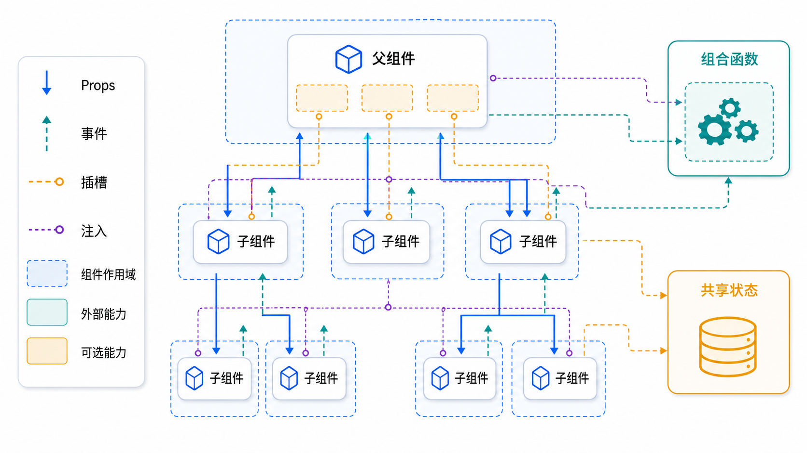

> Vue 3 的组件系统以单文件组件和 Composition API 为核心。组件负责拆分界面，组合式函数负责复用逻辑，Pinia 或依赖注入负责跨层状态协作。



## 组件基础

一个典型组件由 `<script setup>`、`<template>` 和 `<style scoped>` 组成：

```vue
<script setup>
const title = '用户资料'
</script>

<template>
  <section class="profile-card">
    <h2>{{ title }}</h2>
  </section>
</template>

<style scoped>
.profile-card {
  padding: 16px;
  border: 1px solid #e5e7eb;
}
</style>
```

## 组件导入与使用

在 `<script setup>` 中导入组件后，模板可以直接使用。

```vue
<script setup>
import UserCard from '@/components/UserCard.vue'

const user = {
  id: 1,
  name: 'Ada',
  role: 'admin',
}
</script>

<template>
  <UserCard :user="user" />
</template>
```

## Props

`defineProps` 用来声明父组件传入的数据。建议明确类型、默认值和必要校验。

```vue
<script setup>
const props = defineProps({
  user: {
    type: Object,
    required: true,
  },
  size: {
    type: String,
    default: 'medium',
    validator(value) {
      return ['small', 'medium', 'large'].includes(value)
    },
  },
})
</script>

<template>
  <article :class="['user-card', `user-card--${props.size}`]">
    <h3>{{ props.user.name }}</h3>
    <p>{{ props.user.role }}</p>
  </article>
</template>
```

Props 应保持只读。组件内部需要编辑时，应复制为本地状态，或通过事件通知父组件更新。

## 事件

`defineEmits` 用来声明组件对外触发的事件。

```vue
<script setup>
const emit = defineEmits({
  save(payload) {
    return typeof payload.title === 'string' && payload.title.length > 0
  },
  cancel: null,
})

function savePost() {
  emit('save', {
    title: 'Vue 3 组件系统',
  })
}
</script>

<template>
  <button @click="savePost">保存</button>
  <button @click="emit('cancel')">取消</button>
</template>
```

父组件监听事件：

```vue
<script setup>
import PostEditor from '@/components/PostEditor.vue'

function handleSave(payload) {
  console.log('保存文章：', payload.title)
}
</script>

<template>
  <PostEditor @save="handleSave" />
</template>
```

## 组件 v-model

Vue 3 推荐使用 `defineModel` 实现组件双向绑定。

```vue
<script setup>
const model = defineModel({
  type: String,
  default: '',
})
</script>

<template>
  <input v-model="model" placeholder="请输入标题" />
</template>
```

父组件使用：

```vue
<script setup>
import { ref } from 'vue'
import TitleInput from '@/components/TitleInput.vue'

const title = ref('')
</script>

<template>
  <TitleInput v-model="title" />
  <p>{{ title }}</p>
</template>
```

## 插槽

插槽让组件保留结构，同时把局部内容交给调用方决定。

```vue
<script setup>
defineProps({
  title: {
    type: String,
    required: true,
  },
})
</script>

<template>
  <section class="panel">
    <header>
      <slot name="header" :title="title">
        <h2>{{ title }}</h2>
      </slot>
    </header>

    <main>
      <slot />
    </main>

    <footer>
      <slot name="footer" />
    </footer>
  </section>
</template>
```

使用具名插槽和作用域插槽：

```vue
<script setup>
import CardPanel from '@/components/CardPanel.vue'
</script>

<template>
  <CardPanel title="订单详情">
    <template #header="{ title }">
      <h1>{{ title }}</h1>
    </template>

    <p>这里放订单内容。</p>

    <template #footer>
      <button>确认</button>
    </template>
  </CardPanel>
</template>
```

## 依赖注入

`provide` 和 `inject` 适合主题、配置、表单上下文等跨层级共享。

```vue
<script setup>
import { provide, ref } from 'vue'

const theme = ref('light')

provide('theme', theme)
</script>

<template>
  <slot />
</template>
```

子孙组件读取：

```vue
<script setup>
import { inject } from 'vue'

const theme = inject('theme', 'light')
</script>

<template>
  <p>当前主题：{{ theme }}</p>
</template>
```

## 组合式函数

组件间复用逻辑时，优先抽成组合式函数，而不是把逻辑堆进组件或依赖全局事件。

```javascript
import { computed, ref } from 'vue'

export function useCounter(initialValue = 0) {
  const count = ref(initialValue)
  const doubleCount = computed(() => count.value * 2)

  function increment() {
    count.value += 1
  }

  function reset() {
    count.value = initialValue
  }

  return {
    count,
    doubleCount,
    increment,
    reset,
  }
}
```

在组件中使用：

```vue
<script setup>
import { useCounter } from '@/composables/useCounter'

const { count, doubleCount, increment, reset } = useCounter(1)
</script>

<template>
  <button @click="increment">{{ count }} / {{ doubleCount }}</button>
  <button @click="reset">重置</button>
</template>
```

## 生命周期

Vue 3 在 Composition API 中使用生命周期函数。

```vue
<script setup>
import { onBeforeUnmount, onMounted, ref } from 'vue'

const width = ref(window.innerWidth)

function updateWidth() {
  width.value = window.innerWidth
}

onMounted(() => {
  window.addEventListener('resize', updateWidth)
})

onBeforeUnmount(() => {
  window.removeEventListener('resize', updateWidth)
})
</script>

<template>
  <p>窗口宽度：{{ width }}</p>
</template>
```

## Pinia 与组件协作

跨页面、跨模块共享状态时，使用 Pinia 比层层传参更清晰。

```javascript
import { computed, ref } from 'vue'
import { defineStore } from 'pinia'

export const useCartStore = defineStore('cart', () => {
  const items = ref([])
  const total = computed(() =>
    items.value.reduce((sum, item) => sum + item.price * item.quantity, 0)
  )

  function addItem(product) {
    const existed = items.value.find(item => item.id === product.id)

    if (existed) {
      existed.quantity += 1
      return
    }

    items.value.push({
      ...product,
      quantity: 1,
    })
  }

  return {
    items,
    total,
    addItem,
  }
})
```

组件中直接调用状态模块：

```vue
<script setup>
import { useCartStore } from '@/stores/cart'

const cart = useCartStore()

function addDemoProduct() {
  cart.addItem({
    id: 1,
    name: 'Vue 课程',
    price: 99,
  })
}
</script>

<template>
  <button @click="addDemoProduct">加入购物车</button>
  <p>总价：{{ cart.total }}</p>
</template>
```

## 组件设计建议

- Props 向下传递数据，事件向上传递意图。
- 插槽用于开放局部结构，不要把所有布局都做成 Props。
- 组件逻辑复杂时，优先抽成组合式函数。
- 跨页面共享状态使用 Pinia，局部上下文共享使用 `provide` 和 `inject`。
- 组件内部负责自己的交互状态，业务数据尽量由页面或状态模块统一管理。

## 小结

Vue 3 组件系统的关键是职责清晰：组件呈现界面，Props 和事件定义边界，插槽开放扩展点，组合式函数复用逻辑，Pinia 管理跨模块状态。掌握这些模式后，组件会更容易测试、复用和维护。
