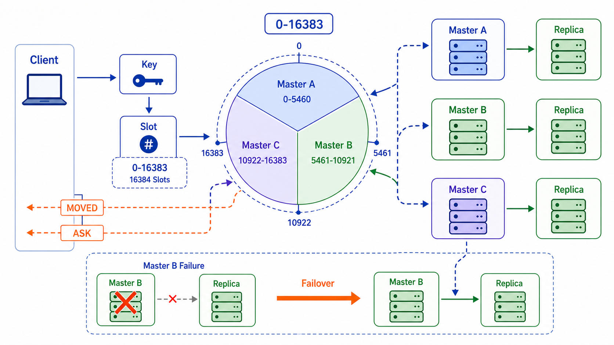

## 概述

Redis Cluster 是 Redis 官方提供的分布式集群解决方案，支持数据分片和高可用，能够在部分节点故障时继续提供服务。



## 集群架构

```
┌─────────────────────────────────────────────┐
│              Redis Cluster                   │
│                                             │
│  ┌─────────┐  ┌─────────┐  ┌─────────┐    │
│  │ Node 1  │  │ Node 2  │  │ Node 3  │    │
│  │ M:0-5460│  │M:5461- │  │M:10923- │    │
│  │ S:0-5460│  │  10922  │  │  16383  │    │
│  │         │  │ S:5461- │  │ S:10923-│    │
│  │         │  │  10922  │  │  16383  │    │
│  └─────────┘  └─────────┘  └─────────┘    │
│                                             │
│  ┌─────────┐  ┌─────────┐  ┌─────────┐    │
│  │ Node 4  │  │ Node 5  │  │ Node 6  │    │
│  │ M:0-5460│  │M:5461- │  │M:10923- │    │
│  │ S:0-5460│  │  10922  │  │  16383  │    │
│  │         │  │ S:5461- │  │ S:10923-│    │
│  │         │  │  10922  │  │  16383  │    │
│  └─────────┘  └─────────┘  └─────────┘    │
└─────────────────────────────────────────────┘

M = Master 节点  S = Slave 节点
```

## 槽位分配

### 16384 个槽位

| 槽位范围      | 节点            |
| ------------- | --------------- |
| 0 - 5460      | 节点 1 (Master) |
| 5461 - 10922  | 节点 2 (Master) |
| 10923 - 16383 | 节点 3 (Master) |

### 槽位计算

```python
# CRC16 算法计算 key 对应的槽位
import crcmod

crc16 = crcmod.predefined.mkCrcFun('crc-ccitt-false')

def slot(key):
    return crc16(key) % 16384

# 示例
print(slot('user:1001'))  # 5283
print(slot('user:1002'))  # 12045
```

## 集群配置

### 配置文件

```bash
# redis.conf
port 6379
cluster-enabled yes
cluster-config-file nodes.conf
cluster-node-timeout 15000
cluster-replica-validity-factor 10
cluster-migration-barrier 1
cluster-require-full-coverage yes
```

### 参数说明

| 参数                                | 说明             | 默认值     |
| ----------------------------------- | ---------------- | ---------- |
| **cluster-enabled**                 | 开启集群模式     | no         |
| **cluster-config-file**             | 集群节点配置文件 | nodes.conf |
| **cluster-node-timeout**            | 节点超时时间(ms) | 15000      |
| **cluster-replica-validity-factor** | 从节点有效因子   | 10         |
| **cluster-migration-barrier**       | 迁移障碍         | 1          |
| **cluster-require-full-coverage**   | 槽位全覆盖要求   | yes        |

## 集群创建

### 方式一：手动创建

```bash
# 1. 创建节点目录
mkdir -p /opt/redis-cluster/{7000,7001,7002,7003,7004,7005}

# 2. 创建各节点配置文件
for port in 7000 7001 7002 7003 7004 7005; do
cat > /opt/redis-cluster/$port/redis.conf <<EOF
port $port
cluster-enabled yes
cluster-config-file nodes.conf
cluster-node-timeout 15000
appendonly yes
EOF
done

# 3. 启动节点
for port in 7000 7001 7002 7003 7004 7005; do
  redis-server /opt/redis-cluster/$port/redis.conf &
done

# 4. 创建集群
redis-cli --cluster create \
  127.0.0.1:7000 \
  127.0.0.1:7001 \
  127.0.0.1:7002 \
  127.0.0.1:7003 \
  127.0.0.1:7004 \
  127.0.0.1:7005 \
  --cluster-replicas 1
```

### 方式二：Docker Compose

```yaml
version: "3"
services:
  redis-node1:
    image: redis:7
    container_name: redis-node1
    ports:
      - "7000:7000"
    command: redis-server --cluster-enabled yes --cluster-config-file nodes.conf --port 7000

  redis-node2:
    image: redis:7
    container_name: redis-node2
    ports:
      - "7001:7001"
    command: redis-server --cluster-enabled yes --cluster-config-file nodes.conf --port 7001

  redis-node3:
    image: redis:7
    container_name: redis-node3
    ports:
      - "7002:7002"
    command: redis-server --cluster-enabled yes --cluster-config-file nodes.conf --port 7002

  redis-node4:
    image: redis:7
    container_name: redis-node4
    ports:
      - "7003:7003"
    command: redis-server --cluster-enabled yes --cluster-config-file nodes.conf --port 7003

  redis-node5:
    image: redis:7
    container_name: redis-node5
    ports:
      - "7004:7004"
    command: redis-server --cluster-enabled yes --cluster-config-file nodes.conf --port 7004

  redis-node6:
    image: redis:7
    container_name: redis-node6
    ports:
      - "7005:7005"
    command: redis-server --cluster-enabled yes --cluster-config-file nodes.conf --port 7005
```

## 集群命令

### 管理命令

```bash
# 连接集群
redis-cli -c -p 7000

# 查看集群信息
CLUSTER INFO

# 查看节点列表
CLUSTER NODES

# 查看槽位分配
CLUSTER SLOTS

# 检查集群状态
redis-cli --cluster check 127.0.0.1:7000
```

### 槽位管理

```bash
# 重新分配槽位
redis-cli --cluster reshard 127.0.0.1:7000

# 移动槽位
CLUSTER SETSLOT 0 MIGRATING node_id
CLUSTER SETSLOT 0 IMPORTING node_id
CLUSTER SETSLOT 0 node_id
```

### 节点管理

```bash
# 添加主节点
redis-cli --cluster add-node 127.0.0.1:7006 127.0.0.1:7000

# 添加从节点
redis-cli --cluster add-node 127.0.0.1:7007 127.0.0.1:7000 --cluster-slave

# 删除节点
redis-cli --cluster del-node 127.0.0.1:7000 node_id

# 分配从节点
CLUSTER REPLICATE node_id
```

## Python 客户端

### redis-py-cluster

```python
from rediscluster import RedisCluster

# 创建集群客户端
startup_nodes = [
    {'host': '127.0.0.1', 'port': 7000},
    {'host': '127.0.0.1', 'port': 7001},
    {'host': '127.0.0.1', 'port': 7002},
]

rc = RedisCluster(
    startup_nodes=startup_nodes,
    decode_responses=True
)

# 基本操作
rc.set('key1', 'value1')
rc.get('key1')

# 批量操作
rc.mset({'key2': 'value2', 'key3': 'value3'})
rc.mget(['key2', 'key3'])

# 哈希操作
rc.hset('user:1', mapping={'name': '张三', 'age': 25})
rc.hgetall('user:1')
```

### 槽位计算

```python
import redis

def get_slot(key):
    """计算 key 所在的槽位"""
    return hex(hash(key) % 16384)

def get_node(key, cluster_nodes):
    """计算 key 所在的节点"""
    slot = hash(key) % 16384

    for node in cluster_nodes:
        if slot in node['slots']:
            return node

    return None

# 示例
key = 'user:1001'
slot = get_slot(key)
print(f"Key: {key}, Slot: {slot}")
```

## 高可用原理

### 故障检测

```bash
# 节点超时配置
cluster-node-timeout 15000

# 主观下线
# 一个节点认为另一个节点超时

# 客观下线
# 多个节点都认为某个节点下线
```

### 故障转移

```bash
# 从节点升级为主节点
# 1. 从节点发现主节点下线
# 2. 从节点申请成为主节点
# 3. 其他主节点投票
# 4. 超过半数同意
# 5. 从节点升级为主节点
```

### 集群选主

```bash
# 使用 Raft 协议进行选主
# 节点状态：
# - NULL：未分配槽位
# - FAIL：已下线
# - OK：正常
# - LOADING：正在加载数据
```

## 运维管理

### 日常维护

```bash
# 检查集群健康
redis-cli -c -p 7000 CLUSTER INFO

# 检查所有节点
redis-cli -c -p 7000 CLUSTER NODES

# 验证数据完整性
redis-cli --cluster check 127.0.0.1:7000

# 平衡槽位
redis-cli --cluster rebalance 127.0.0.1:7000
```

### 扩缩容

```bash
# 添加新主节点
redis-cli --cluster add-node 127.0.0.1:7008 127.0.0.1:7000

# 迁移槽位
redis-cli --cluster reshard 127.0.0.1:7000

# 删除主节点（需先迁移槽位）
redis-cli --cluster del-node 127.0.0.1:7000 node_id
```

### 数据迁移

```bash
# 使用 MIGRATE 命令
MIGRATE target_host target_port "" 0 5000 KEYS key1 key2

# 使用 redis-cli --cluster import
redis-cli --cluster import 127.0.0.1:7008 \
  --cluster-from 127.0.0.1:7000 \
  --cluster-copy
```

## 常见问题

### MOVED 重定向

```bash
# 客户端收到 MOVED 错误
GET user:1001
# MOVED 5200 127.0.0.1:7001

# 自动重定向模式
redis-cli -c -p 7000

# 手动处理
if response.startswith('MOVED'):
    _, slot, node = response.split()
    host, port = node.split(':')
    connect_to(host, port)
```

### ASK 重定向

```bash
# 槽位迁移中可能出现 ASK 重定向
GET user:1001
# ASK 5200 127.0.0.1:7001

# 客户端先发送 ASKING 命令
ASKING
GET user:1001
```

### 集群不可用

```bash
# 槽位未全覆盖导致集群不可用
# cluster-require-full-coverage yes

# 设置为 no 可允许部分槽位不可用
CONFIG SET cluster-require-full-coverage no
```

## 小结

| 特性         | 说明                    |
| ------------ | ----------------------- |
| **数据分片** | 16384 个槽位自动分配    |
| **高可用**   | 主从复制 + 自动故障转移 |
| **节点通信** | Gossip 协议             |
| **一致性**   | 最终一致性              |

| 部署要求     | 说明                |
| ------------ | ------------------- |
| **最少节点** | 3 主 3 从（6 节点） |
| **槽位覆盖** | 所有槽位需有主节点  |
| **选主条件** | 超过半数主节点在线  |

| 命令                 | 说明         |
| -------------------- | ------------ |
| **CLUSTER INFO**     | 查看集群信息 |
| **CLUSTER NODES**    | 查看节点列表 |
| **CLUSTER SLOTS**    | 查看槽位分配 |
| **CLUSTER FAILOVER** | 手动故障转移 |
