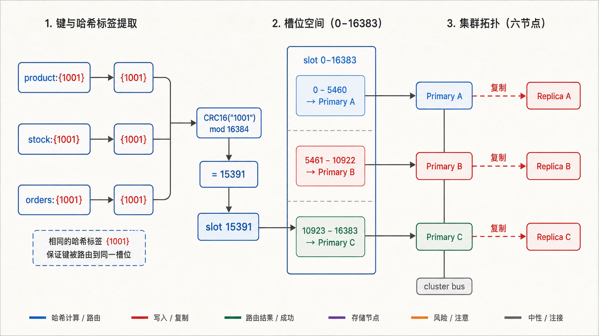
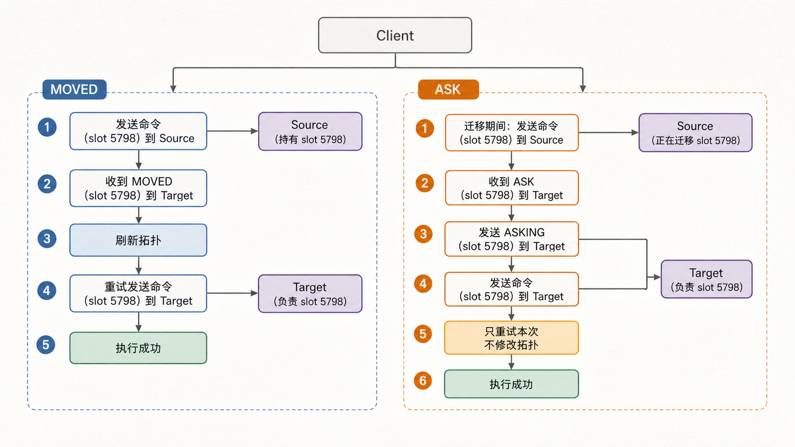
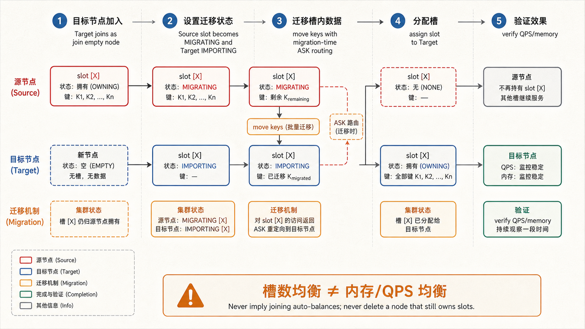
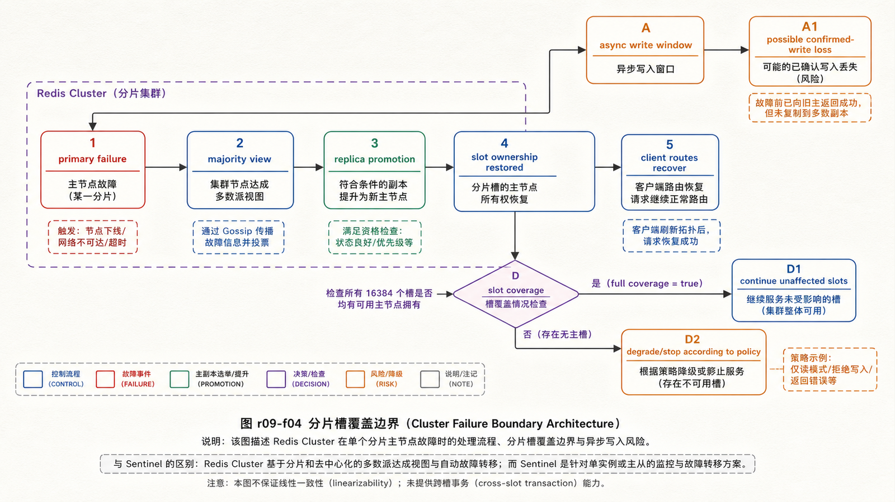

## 前置知识与学习目标

你应理解 Redis 键、异步复制、Sentinel 故障窗口和客户端连接池。本文假设客户端原生支持 Redis Cluster 协议。

读完后，你应该能够：

- 解释 key、hash tag、16384 个槽和主节点之间的映射；
- 区分 MOVED 与 ASK，并说明客户端如何刷新拓扑和临时重试；
- 设计同槽多键操作，同时识别过度使用 hash tag 的热点风险；
- 观察扩缩容和故障转移，并识别 Cluster 不提供的强一致与跨槽能力。

## 真实场景：单节点放不下，也不能只加副本

`shop-api` 的数据与流量超过单个主节点容量。增加副本只能复制相同数据，不能分摊主节点写入和内存。Redis Cluster 把键空间分为 16384 个槽，再把槽分配给多个主节点；每个主节点可配置副本用于故障转移。

应用不是先选机器再算键，而是先由键算槽，再由拓扑找到当前负责该槽的节点。

## 槽位与 hash tag

<!-- figure-anchor:r09-a01 -->

<!-- figure-managed:r09-f01:start -->



<!-- figure-managed:r09-f01:end -->

普通键的槽位近似表示为：

```text
slot = CRC16(key) mod 16384
```

若键包含非空的第一对 `{...}`，只对花括号内内容计算。例如 `product:{1001}`、`stock:{1001}` 和 `orders:{1001}` 都使用 `1001`，因此同槽。

```bash
redis-cli CLUSTER KEYSLOT product:{1001}
redis-cli CLUSTER KEYSLOT stock:{1001}
redis-cli CLUSTER KEYSLOT product:{1002}
```

同槽允许 `MGET`、事务或 Lua 同时访问相关键；不同槽的多键命令会返回 `CROSSSLOT`。但把大量键都写成 `{shop}:...` 会把它们压到一个槽，抵消分片并形成热点。hash tag 应围绕确实需要原子协作的最小业务实体。

## 拓扑与请求路由

典型最小高可用拓扑有 3 个主节点，各自负责一部分槽，并各有至少 1 个副本。节点通过 cluster bus 交换槽映射、存活状态和故障信息；客户端维护拓扑缓存并直接访问目标节点。

Cluster 不是代理层。客户端必须理解拓扑、重定向、节点故障和连接池更新。只用普通单节点客户端连接一个地址，遇到其他槽就无法正确工作。

## MOVED 与 ASK

<!-- figure-anchor:r09-a02 -->

<!-- figure-managed:r09-f02:start -->



<!-- figure-managed:r09-f02:end -->

- **MOVED**：槽的稳定负责人是另一个节点。客户端应重试目标地址，并刷新槽位映射。
- **ASK**：槽正在迁移，本次键可能在目标节点。客户端先向目标发送 `ASKING`，再只重试当前命令；不能把 ASK 当永久拓扑更新。

迁移期间，源节点对不存在的迁移槽键返回 ASK；已有键仍可能由源节点处理。客户端若忽略这一区别，会在扩缩容时出现周期性错误或错误缓存拓扑。

## 最小实验配置

每个节点至少启用：

```conf
port 7000
cluster-enabled yes
cluster-config-file nodes-7000.conf
cluster-node-timeout 5000
appendonly yes
```

`nodes-7000.conf` 由 Redis 自动维护，不能让多个实例共享。实验环境启动 7000–7005 六个节点后，可创建三主三副本集群：

```bash
redis-cli --cluster create \
  127.0.0.1:7000 127.0.0.1:7001 127.0.0.1:7002 \
  127.0.0.1:7003 127.0.0.1:7004 127.0.0.1:7005 \
  --cluster-replicas 1
```

这不是生产拓扑：同一主机无法提供独立故障域，端口、announce 地址、TLS、ACL、持久化和内核参数也需要单独设计。

## Cluster 客户端

```python
from redis.cluster import RedisCluster

client = RedisCluster(
    host="127.0.0.1",
    port=7000,
    decode_responses=True,
    socket_connect_timeout=1.0,
    socket_timeout=0.5,
)

client.set("stock:{1001}", 50)
client.set("price:{1001}", 69900)
print(client.mget("stock:{1001}", "price:{1001}"))
```

输入是任一可达启动节点；客户端获取完整槽拓扑。预期输出为 `['50', '69900']`。若第二个键改为 `{1002}`，`MGET` 跨槽失败；这不是网络错误，盲重试不会修复数据模型。

## 在线扩缩容的状态变化

<!-- figure-anchor:r09-a03 -->

<!-- figure-managed:r09-f03:start -->



<!-- figure-managed:r09-f03:end -->

扩容不是“加入节点后自动平均”：新主节点加入时没有槽，需要把部分槽从旧节点迁移过去。流程包括加入节点、分配/迁移槽、传输键、更新拓扑和验证负载。

```bash
redis-cli --cluster check 127.0.0.1:7000
redis-cli --cluster add-node 127.0.0.1:7006 127.0.0.1:7000
redis-cli --cluster reshard 127.0.0.1:7000
```

迁移前记录每个槽/节点的键数、内存、QPS 和大键。平均迁移槽数不一定能平均负载：槽内键大小和访问频率可能极不均匀。迁移后还要观察 ASK、MOVED、超时、网络流量和主从复制积压。

缩容先迁空目标主节点的全部槽，再删除节点；不能直接停掉仍负责槽的节点。

## 故障转移与一致性边界

<!-- figure-anchor:r09-a04 -->

<!-- figure-managed:r09-f04:start -->



<!-- figure-managed:r09-f04:end -->

Cluster 节点通过多数主节点视角判定主节点失败，并从其副本中选举晋升者。若某个槽没有可用负责人，且要求 full coverage，集群会停止接受大部分请求以避免部分键空间静默不可用。

复制仍是异步的：刚确认但未复制的写可能在晋升中丢失；网络分区中的旧主也可能在有限窗口接收写。Cluster 以可用性和性能为目标，不提供线性一致性或跨槽分布式事务。

## 运维观察与故障演练

```bash
redis-cli -c -p 7000 CLUSTER INFO
redis-cli -c -p 7000 CLUSTER NODES
redis-cli --cluster check 127.0.0.1:7000
redis-cli --cluster rebalance 127.0.0.1:7000 --cluster-use-empty-masters
```

演练至少验证：客户端收到重定向后能恢复；一个主节点故障时对应副本晋升；写丢失窗口被业务接受或检测；恢复节点不会带着错误角色继续服务；槽覆盖、复制积压和 p99 延迟回到基线。

## 常见误区与适用边界

- 16384 是槽数量，不是节点或分片数量。
- hash tag 解决同槽，不应把整个业务固定到一个槽。
- ASK 是迁移期单次引导，MOVED 才表示稳定负责人变化。
- Cluster 提供分片与高可用，不提供跨槽事务和强一致。
- 单个超大键或热键仍只落在一个槽/主节点，不能被自动拆分。

## 本篇自检

<details>
<summary>1. 为什么 `stock:{1001}` 与 `price:{1001}` 能做 MGET？</summary>

两者的 hash tag 都是 `1001`，因此映射到同一槽；Cluster 的多键命令要求所有键同槽。

</details>

<details>
<summary>2. 客户端收到 ASK 后为什么不应永久更新槽负责人？</summary>

ASK 表示迁移中的一次临时路由，槽的稳定所有权尚未完成切换。客户端只应 `ASKING` 后重试当前命令。

</details>

<details>
<summary>3. 新增一个空主节点后，容量为什么没有立刻增加？</summary>

空节点尚未负责任何槽，请求不会路由给它。必须迁移槽并根据键大小与热度验证负载变化。

</details>

## 本篇总结

Redis Cluster 用槽把键路由到多个主节点，hash tag 只为必要的同槽操作服务。客户端通过 MOVED/ASK 适应稳定拓扑和迁移状态；扩缩容要迁槽并按真实负载验收。异步复制、热键和跨槽限制仍是业务必须承担的边界。

## 下一篇衔接

至此数据模型、客户端、缓存、持久化、原子操作、锁、消息、复制和分片已经连通。最后一篇把它们收进生产控制面：SLO、内存、延迟、ACL、备份恢复、变更和故障运行手册。

## 资料来源

- [Redis Cluster specification](https://redis.io/docs/latest/operate/oss_and_stack/reference/cluster-spec/)
- [Scale with Redis Cluster](https://redis.io/docs/latest/operate/oss_and_stack/management/scaling/)
- [redis-py clustering](https://redis.readthedocs.io/en/stable/clustering.html)
