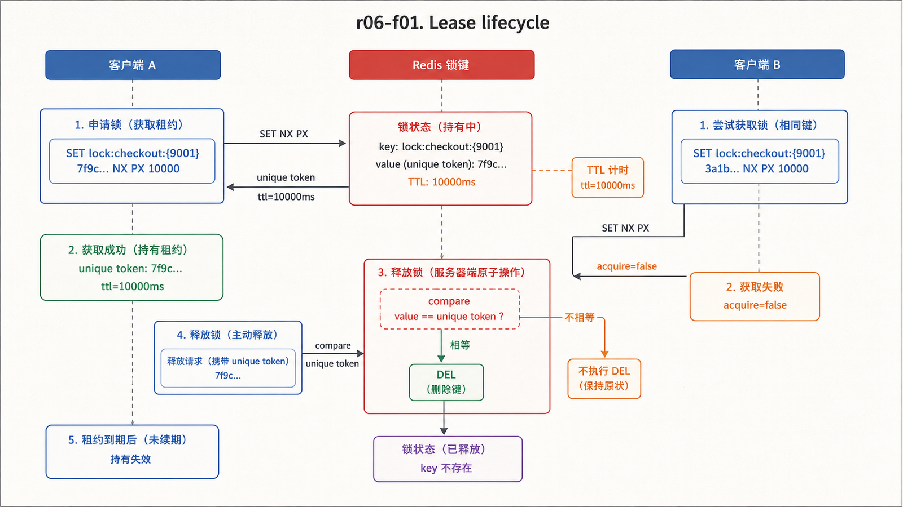
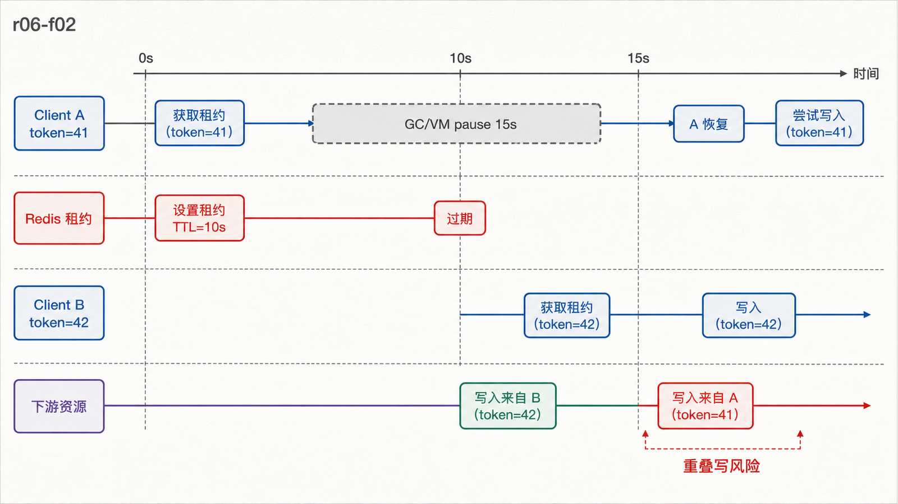
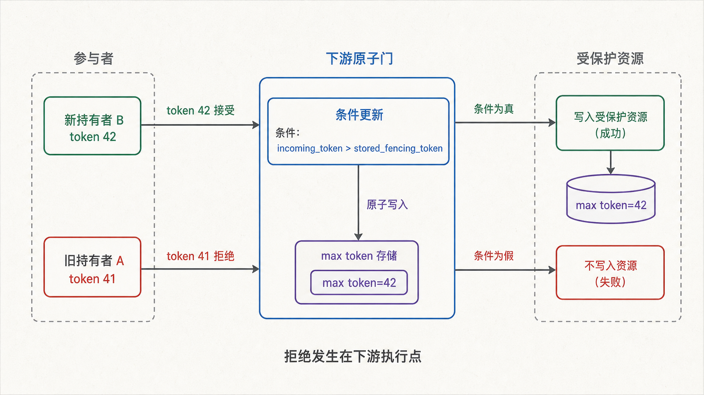

## 前置知识与学习目标

你应理解 TTL、Lua 原子脚本、客户端超时的“结果未知”状态，以及库存扣减为何优先用单条命令或脚本。

读完后，你应该能够：

- 用 `SET key token NX PX ttl` 获取单实例锁，并用比较删除证明释放者所有权；
- 把锁理解为有截止时间的租约，分析续期、暂停和网络分区窗口；
- 解释为什么 Redis 故障转移不能天然保证锁互斥，以及 fencing token 如何保护下游资源；
- 判断何时不该用分布式锁，并优先选择幂等、唯一约束、队列或条件写。

## 真实场景：锁过期后，旧持有者还在工作

`shop-api` 用锁 `lock:checkout:{9001}` 防止订单 9001 被重复结算。客户端 A 获得 10 秒锁，随后因 GC 或虚拟机暂停 15 秒；锁已过期，客户端 B 获得新锁。A 恢复后仍可能向支付或数据库写入。

TTL 能避免永久死锁，却不能主动停止过期持有者。分布式锁的核心不是“谁先 SET 成功”，而是如何在时钟、暂停、断线和故障转移下约束旧持有者的副作用。

## 单实例锁的最小安全协议

<!-- figure-anchor:r06-a01 -->

<!-- figure-managed:r06-f01:start -->



<!-- figure-managed:r06-f01:end -->

获取锁必须在一条命令中同时满足不存在条件和过期时间：

```bash
SET lock:checkout:{9001} 7f9c... NX PX 10000
```

值是每次获取生成的高熵唯一 token。成功返回 `OK`；已被占用返回 nil。不要用 `SETNX` 后再 `EXPIRE`，因为客户端可能在两条命令之间崩溃，留下无 TTL 的锁。

释放必须比较 token：

```lua
-- KEYS[1]: lock key; ARGV[1]: owner token
if redis.call('GET', KEYS[1]) == ARGV[1] then
  return redis.call('DEL', KEYS[1])
end
return 0
```

直接 `DEL` 可能删除 B 在 A 过期后获得的新锁。比较和删除必须在同一个 Lua 脚本中原子执行。

## Python 租约骨架

```python
from __future__ import annotations

import secrets
import time

RELEASE = """
if redis.call('GET', KEYS[1]) == ARGV[1] then
  return redis.call('DEL', KEYS[1])
end
return 0
"""

RENEW = """
if redis.call('GET', KEYS[1]) == ARGV[1] then
  return redis.call('PEXPIRE', KEYS[1], ARGV[2])
end
return 0
"""

class Lease:
    def __init__(self, redis_client, key: str, ttl_ms: int = 10_000):
        if ttl_ms <= 0:
            raise ValueError("ttl_ms must be positive")
        self.r = redis_client
        self.key = key
        self.ttl_ms = ttl_ms
        self.token = secrets.token_hex(16)
        self.deadline = 0.0

    def acquire(self) -> bool:
        ok = self.r.set(self.key, self.token, nx=True, px=self.ttl_ms)
        if ok:
            self.deadline = time.monotonic() + self.ttl_ms / 1000
        return bool(ok)

    def renew(self) -> bool:
        renewed = self.r.eval(RENEW, 1, self.key, self.token, self.ttl_ms)
        if renewed:
            self.deadline = time.monotonic() + self.ttl_ms / 1000
        return bool(renewed)

    def release(self) -> bool:
        return bool(self.r.eval(RELEASE, 1, self.key, self.token))
```

输入是锁键和租期；`acquire` 成功只表示在当时获得租约。业务完成前要保证剩余时间充足；`renew` 返回 0 表示已经失去所有权，必须停止后续可停止的工作。客户端用单调时钟估算本地截止时间，避免系统时间回拨影响等待预算。

这只是教学骨架，不应替代经过故障测试的客户端库。完整实现还要处理获取超时、随机退避、取消、续期线程生命周期、连接中断和指标。

## 续期与暂停窗口

<!-- figure-anchor:r06-a02 -->

<!-- figure-managed:r06-f02:start -->



<!-- figure-managed:r06-f02:end -->

续期脚本同样先比较 token 再延长 TTL。通常在租期剩余一部分时续期，并设置总持有上限。续期不是无限保活：

- 进程暂停时间可能超过 TTL，恢复时已经不是持有者；
- 网络分区时客户端无法确认续期是否成功；
- Redis 故障转移可能丢失尚未复制的锁写；
- 锁持有期间执行不可取消的外部请求，失锁后仍可能生效。

业务必须把“我曾获得锁”和“我现在仍有权写”分开。只在进入临界区前检查一次 TTL 不足以覆盖后续暂停。

## Fencing Token：让下游拒绝旧持有者

<!-- figure-anchor:r06-a03 -->

<!-- figure-managed:r06-f03:start -->



<!-- figure-managed:r06-f03:end -->

fencing token 是每次成功获取租约时递增的序号，例如 41、42、43。持有者把它随写请求发送给受保护资源；资源保存已接受的最大 token，并拒绝更小的序号。

在前面的场景中，A 携带 41，B 携带 42。即使 A 暂停后恢复，数据库、对象存储代理或业务服务看到 41 小于已接受的 42，就拒绝旧写。真正的保护发生在下游条件写处，而不是 Redis TTL 本身。

这要求下游支持原子比较并更新，例如：

```sql
UPDATE checkout_job
SET status = 'paid', fencing_token = 42
WHERE order_id = 9001 AND fencing_token < 42;
```

应用必须检查受影响行数。若下游无法验证 token，fencing 只是一条日志字段，不能提供安全性。token 的生成也必须单调且与锁获取协议协调，实际项目优先使用成熟库或具备会话/租约语义的协调系统。

## 故障转移与 Redlock 边界

Redis 复制是异步的。若主节点确认锁后、该写复制到副本前故障，副本晋升后另一个客户端可能再次获取同一锁，因此“单主节点 + 自动故障转移”不天然保留互斥。

Redlock 尝试在多个独立主节点上取得多数锁，并从租期扣除获取耗时。它有明确的时钟、延迟和独立故障假设，也存在长期公开讨论。若错误的并发写会造成资金、所有权或不可逆外部副作用，不应只依赖一个无法由下游验证的租约；应使用 fencing token、权威数据库条件写，或选择基于共识且提供所需会话语义的协调系统。

## 先问是否真的需要锁

| 目标              | 更直接的选择                 |
| ----------------- | ---------------------------- |
| 防重复创建订单    | 数据库唯一约束 + 幂等请求 ID |
| 原子扣 Redis 库存 | 单条命令或 Lua               |
| 同一订单串行处理  | 按实体分区的队列/工作流      |
| 防并发覆盖记录    | 版本号/条件更新/乐观锁       |
| 选举长期 leader   | 专用协调系统及租约 API       |

锁会引入等待、超时和恢复状态。能把冲突转成幂等或条件写时，通常更容易证明正确性。

## 最小行为测试

至少验证：

1. A 获取后 B 不能获取。
2. A token 不匹配时不能释放 B 的锁。
3. 锁过期后 B 能获取，A 的续期和释放都返回失败。
4. 进程暂停超过 TTL 后，下游拒绝 A 的旧 fencing token。
5. 获取响应超时、续期超时和释放超时都被记录为“结果未知”，不会无限重试。

## 常见误区与适用边界

- `SETNX` 加 `EXPIRE` 两条命令存在无过期锁窗口。
- 锁值不能用固定服务名；每次获取必须生成唯一 token。
- 成功获取过锁不代表整个任务期间一直持有。
- 自动续期不能消除长暂停、分区或不可取消外部副作用。
- Redis 锁不是数据库事务，也不能让第三方支付回滚。

## 本篇自检

<details>
<summary>1. 为什么释放锁必须比较 token？</summary>

旧持有者可能在锁过期后恢复。直接删除会误删新持有者的锁；比较删除只允许当前所有者释放。

</details>

<details>
<summary>2. TTL 为什么不能阻止过期客户端继续写？</summary>

TTL 只删除 Redis 中的租约记录，无法暂停客户端进程或撤销已发出的外部请求。客户端可能在暂停后继续执行。

</details>

<details>
<summary>3. fencing token 在哪里生效？</summary>

在受保护的下游资源。资源必须原子保存最大 token 并拒绝更旧的写；仅生成或记录 token 没有保护作用。

</details>

## 本篇总结

Redis 锁是限时租约：获取要原子设置 NX 与 TTL，释放和续期要验证唯一 token。暂停、分区和异步故障转移仍可能产生重叠持有者；高风险资源需要 fencing token 或更强的条件写/协调机制。

## 下一篇衔接

许多长任务不应在锁内完成，而应转成可重试、可追踪的消息。下一篇比较 List、Pub/Sub 与 Streams 的投递语义，并用消费组、PEL 和 ACK 建立可靠处理闭环。

## 资料来源

- [Distributed Locks with Redis](https://redis.io/docs/latest/develop/clients/patterns/distributed-locks/)
- [SET command](https://redis.io/docs/latest/commands/set/)
- [Redis replication](https://redis.io/docs/latest/operate/oss_and_stack/management/replication/)
