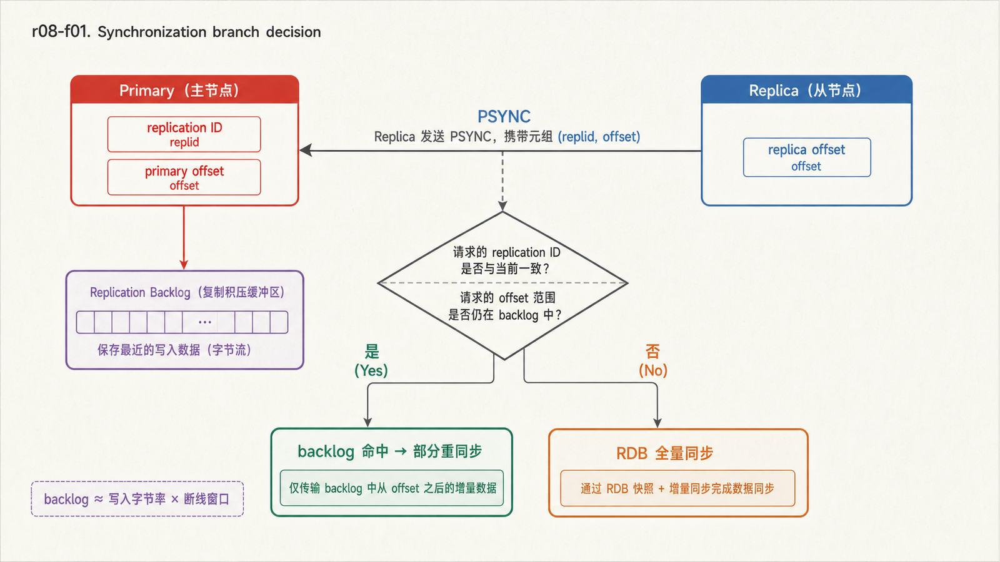
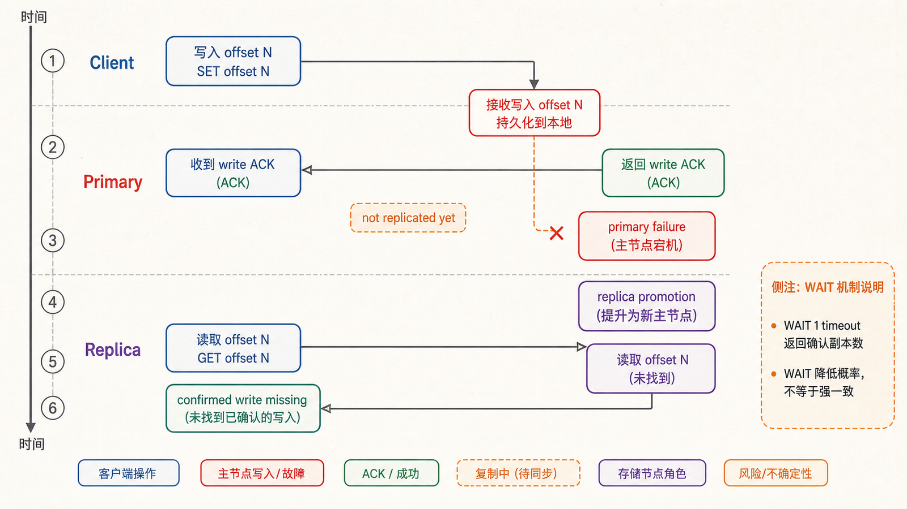
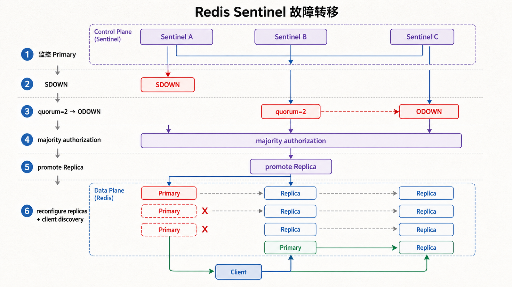

## 前置知识与学习目标

你应理解 RDB/AOF、网络超时和“写成功响应不等于已复制”。统一术语使用主节点（primary）和副本（replica）；配置命令仍沿用 `replicaof`。

读完后，你应该能够：

- 解释全量同步、增量命令传播与部分重同步的触发条件；
- 用 replication ID、offset 和 backlog 判断副本能否追赶；
- 识别异步复制中的陈旧读、写丢失和空数据传播风险；
- 解释 Sentinel 的 SDOWN、ODOWN、quorum、选举、晋升和客户端发现。

## 真实场景：副本在线，为什么仍可能读旧值

`shop-api` 向主节点写入 `stock:{1001}=49`，紧接着从副本读取，却仍看到 50。副本显示 `role:slave` 且连接正常，这不是神秘缓存，而是异步复制的自然窗口。

复制解决可用性和读扩展的一部分问题，不自动提供线性一致读，也不承诺已确认写在所有故障中都保留。

## 复制状态：ID、offset 与 backlog

<!-- figure-anchor:r08-a01 -->

<!-- figure-managed:r08-f01:start -->



<!-- figure-managed:r08-f01:end -->

主节点为当前数据历史维护 replication ID，并为复制字节流维护递增 offset。`(replication ID, offset)` 标识数据集历史中的位置。副本记录自己已处理的 offset。

正常连接时，主节点把写命令、过期和淘汰造成的数据变化持续传播给副本。网络中断后，副本用 `PSYNC` 携带旧 ID 和 offset 请求重同步：

- 若历史仍匹配且缺失字节还在 replication backlog 中，主节点只发送缺失部分；
- 若 ID 不匹配或 backlog 已覆盖缺口，则进行全量同步，传输 RDB 并补发期间写入。

backlog 太小会让短暂断线频繁退化成昂贵的全量同步。应按峰值写入字节速率乘以希望覆盖的断线窗口估算，并留余量，而不是使用脱离负载的固定值。

## 最小配置与观察

副本配置：

```ini
replicaof 10.0.0.10 6379
replica-read-only yes
masteruser replica-user
masterauth ${REPLICA_PASSWORD}
```

主节点使用 ACL 只授予复制账户必要命令。不要把明文凭据提交到仓库；实际注入方式取决于部署平台。

```bash
redis-cli INFO replication
redis-cli ROLE
redis-cli --latency
```

重点字段包括主节点 `master_replid`、`master_repl_offset`、各副本 offset/lag，以及副本的 `master_link_status`、`master_sync_in_progress`。用主 offset 减副本 offset 能观察字节差，但不能直接换算为业务时间；还需结合写入速率和关键键验证。

## 异步复制的安全边界

<!-- figure-anchor:r08-a02 -->

<!-- figure-managed:r08-f02:start -->



<!-- figure-managed:r08-f02:end -->

主节点通常在本地执行后就响应客户端，不等待副本。若响应后、复制前主节点永久故障并由落后副本晋升，刚确认的写可能丢失。

`WAIT numreplicas timeout` 可让客户端等待指定数量副本确认已处理到当前 offset，降低某些故障中的丢失概率，但它不把 Redis 变成强一致系统，也不等同于磁盘已耐久。超时返回的副本数必须由应用检查。

若主节点关闭持久化却配置自动重启，崩溃后可能以空数据集启动，副本为了保持一致也会被清空。重要数据要启用持久化，或禁用这种自动重启路径，并通过演练验证。

## 读写分离：先定义允许多旧

副本读取适合允许陈旧的商品详情、统计或报表，不适合刚写后必须读到新值的库存确认。常见策略：

- 写后的一段会话窗口固定读主节点；
- 携带版本号，副本版本不足时回主节点；
- 只把明确允许陈旧的查询路由到副本；
- 故障转移期间接受短暂错误，而不是静默返回更旧值。

副本默认只读，但“只读”不是安全边界：管理员或配置错误仍可改变角色。应用 ACL 也应限制写命令。

## Sentinel 故障转移链

<!-- figure-anchor:r08-a03 -->

<!-- figure-managed:r08-f03:start -->



<!-- figure-managed:r08-f03:end -->

Sentinel 为非 Cluster Redis 提供监控、通知、配置发现和自动故障转移。稳健部署通常至少 3 个 Sentinel，并放在相互独立的故障域。

```ini
sentinel monitor shop-primary 10.0.0.10 6379 2
sentinel down-after-milliseconds shop-primary 5000
sentinel failover-timeout shop-primary 180000
sentinel parallel-syncs shop-primary 1
```

状态链：

1. 单个 Sentinel 在超时后判定 SDOWN（主观下线）。
2. 足够 Sentinel 同意达到 quorum 后形成 ODOWN（客观下线）。
3. Sentinel 通过选举获得故障转移授权。
4. 按优先级、复制进度等选择副本并晋升。
5. 其他副本改为复制新主节点。
6. Sentinel 更新配置；客户端查询并重连新主节点。

quorum 用于 ODOWN 判断，执行故障转移还需要多数 Sentinel 的授权。值过低容易误判，过高则在 Sentinel 不可用时无法转移。

## 客户端必须参与发现

```python
from redis.sentinel import Sentinel

sentinel = Sentinel(
    [("10.0.0.21", 26379), ("10.0.0.22", 26379), ("10.0.0.23", 26379)],
    socket_timeout=0.5,
)

primary = sentinel.master_for(
    "shop-primary",
    socket_connect_timeout=1.0,
    socket_timeout=0.5,
    decode_responses=True,
)
primary.set("health:{shop}", "ok", ex=30)
```

硬编码旧主节点地址会绕过 Sentinel 的配置提供能力。客户端要支持发现、连接池失效、重连和短暂错误；故障转移不是无缝瞬移，期间请求可能超时或拿到结果未知。

## 最小故障演练

在隔离环境记录：故障注入时刻、SDOWN/ODOWN 时刻、新主晋升时刻、客户端首次成功写时刻，以及写入 ID 的缺口/重复。验收不仅是“新主出现”，还包括：

- RTO 是否达标；
- 已确认写是否有丢失；
- 客户端是否自动发现并清理旧连接；
- 旧主恢复后是否成为副本；
- 告警是否包含主节点、选举和复制积压证据。

## 常见误区与适用边界

- `lag=0` 不表示零字节差，也不承诺刚写后副本读取一致。
- 复制不是备份，错误删除会传播。
- Sentinel 提供高可用但不分片；容量仍受单个主数据集约束。
- Docker/NAT 下必须正确设置 announce 地址和端口，否则发现到不可达地址。
- 不要用重建复制作为日常“修复不一致”的第一步；先确认历史、offset、网络和磁盘原因。

## 本篇自检

<details>
<summary>1. 什么时候部分重同步会退化成全量同步？</summary>

副本的历史 ID 不再匹配，或缺失的复制字节已经被 backlog 覆盖时，主节点无法只补缺口，需要发送完整快照。

</details>

<details>
<summary>2. `WAIT 1 1000` 成功为什么仍不等于零数据丢失？</summary>

它确认副本处理到某个复制 offset，不能覆盖所有分区、晋升和持久化故障，也不保证数据已刷到耐久介质。

</details>

<details>
<summary>3. quorum=2 与“至少三个 Sentinel”分别解决什么？</summary>

quorum=2 要求两个 Sentinel 同意主节点 ODOWN；三个独立 Sentinel 提供多数选举和单点故障容忍。执行故障转移还需要多数授权。

</details>

## 本篇总结

Redis 复制以 replication ID、offset 和 backlog 维护异步数据历史；全量与部分同步取决于历史是否仍可追赶。Sentinel 在此基础上完成故障判定、选举、晋升和客户端发现，但陈旧读、确认写丢失窗口和切换错误仍需业务协议处理。

## 下一篇衔接

Sentinel 解决单数据集的高可用，不解决水平容量。下一篇进入 Redis Cluster：16384 个槽如何路由、hash tag 如何约束多键操作，MOVED/ASK 如何引导客户端完成迁移。

## 资料来源

- [Redis replication](https://redis.io/docs/latest/operate/oss_and_stack/management/replication/)
- [High availability with Redis Sentinel](https://redis.io/docs/latest/operate/oss_and_stack/management/sentinel/)
- [WAIT command](https://redis.io/docs/latest/commands/wait/)
- [Redis ACL](https://redis.io/docs/latest/operate/oss_and_stack/management/security/acl/)
