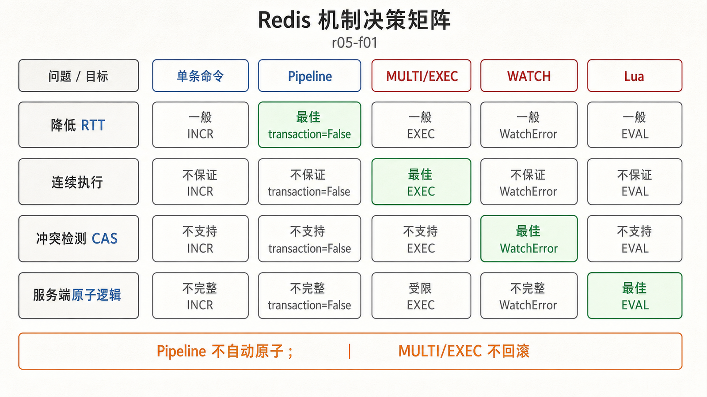
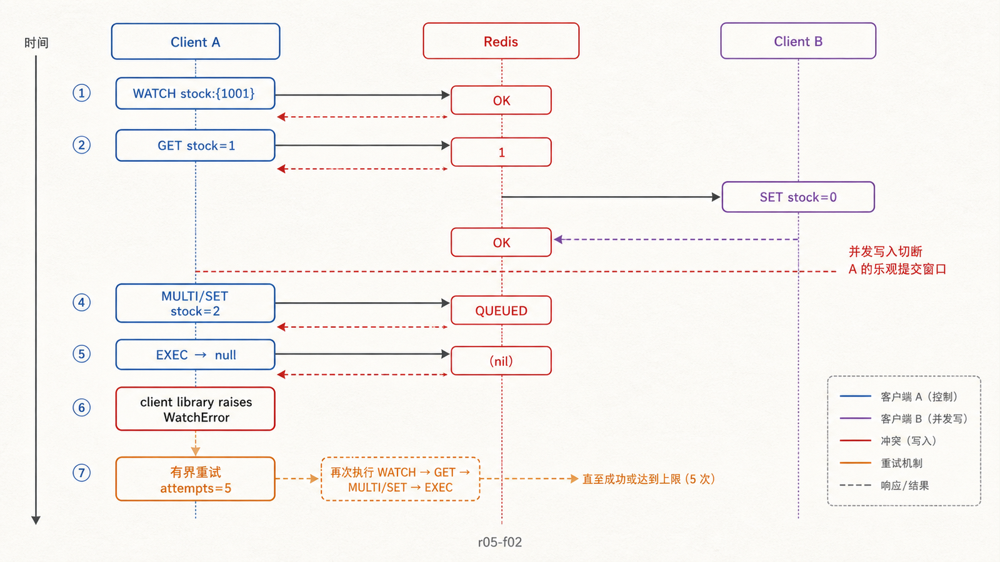
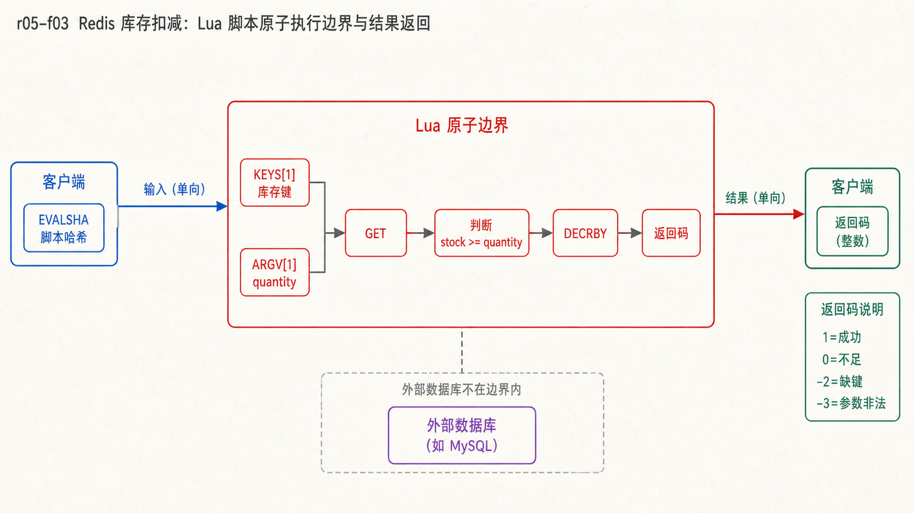

## 前置知识与学习目标

你应理解 redis-py、Pipeline、库存键 `stock:{1001}`，并知道单条 Redis 命令具有原子执行边界。

读完后，你应该能够：

- 根据问题选择普通命令、非事务 Pipeline、MULTI/EXEC、WATCH 或 Lua；
- 解释 Redis 事务为什么保证顺序执行，却不提供关系数据库式回滚；
- 用 WATCH 实现有界重试的 CAS，用 Lua 完成短小的服务端原子状态变化；
- 识别脚本阻塞、结果未知、跨槽和外部副作用等失败边界。

## 真实场景：读取后再写入会丢更新

两个请求同时购买商品 `1001`。若都先 `GET stock:{1001}` 读到 1，再各自 `SET 0`，两次购买都可能成功。单条 `GET` 和 `SET` 各自原子，却没有把“检查库存大于 0”和“扣减 1”绑定为一个状态变化。

解决前先区分四个问题：减少网络往返、让命令连续执行、检测并发修改、把判断与写入放进一个服务端原子操作。

## 选择矩阵

<!-- figure-anchor:r05-a01 -->

<!-- figure-managed:r05-f01:start -->



<!-- figure-managed:r05-f01:end -->

| 机制                | 主要目标         | 是否阻止命令间插入 | 冲突处理           | 典型场景                       |
| ------------------- | ---------------- | ------------------ | ------------------ | ------------------------------ |
| 单条命令            | 最小原子操作     | 该命令内部是       | 无                 | `INCR`、`HSET`、带条件的 `SET` |
| Pipeline 非事务模式 | 减少 RTT         | 否                 | 无                 | 批量独立读写                   |
| MULTI/EXEC          | 队列整体连续执行 | EXEC 执行阶段是    | 不自动检测读写冲突 | 多条不含客户端判断的写         |
| WATCH + MULTI/EXEC  | 乐观 CAS         | 冲突时整批不执行   | 客户端重试         | 读取后条件更新                 |
| Lua/Functions       | 服务端原子逻辑   | 脚本执行期间是     | 由脚本返回码表达   | 短小的检查并写入               |

优先寻找已有单条命令。`DECR` 已能原子减 1，但若要拒绝负库存，还需要额外条件逻辑。

## MULTI/EXEC：顺序执行，但没有回滚

```bash
MULTI
SET order:{9001}:status pending
DECR stock:{1001}
EXEC
```

`MULTI` 后命令先进入队列，`EXEC` 才连续执行。其他客户端不会在这批命令的执行中间插入命令；若连接在 `EXEC` 前断开，队列不会执行。

Redis 不提供关系数据库式回滚。命令入队时可发现的语法错误会使事务拒绝执行；执行期错误则可能只让某条命令失败，前后其他命令仍已生效。例如对错误类型执行 `INCR` 不会撤销之前成功的 `SET`。应用必须检查 `EXEC` 返回数组中的每个结果。

## WATCH：把 EXEC 变成条件提交

<!-- figure-anchor:r05-a02 -->

<!-- figure-managed:r05-f02:start -->



<!-- figure-managed:r05-f02:end -->

```python
import redis

def reserve_with_watch(r: redis.Redis, product_id: int, attempts: int = 5) -> int:
    key = f"stock:{{{product_id}}}"
    for _ in range(attempts):
        try:
            with r.pipeline() as pipe:
                pipe.watch(key)
                current_raw = pipe.get(key)
                if current_raw is None:
                    raise LookupError("stock key is missing")
                current = int(current_raw)
                if current <= 0:
                    return 0

                pipe.multi()
                pipe.set(key, current - 1)
                pipe.execute()
                return current - 1
        except redis.WatchError:
            continue
    raise TimeoutError("stock changed too frequently")
```

输入是商品 ID 和最多重试次数；成功返回扣减后的库存，`0` 表示售罄。若从 `WATCH` 到 `EXEC` 之间键被修改、过期或淘汰，`EXEC` 中止并触发 `WatchError`。

重试必须有次数和总时间预算。高冲突热点会让大量客户端重复读取与重试，此时 Lua 或重新分片业务状态通常更合适。

## Lua：在服务端完成检查与写入

```lua
-- KEYS[1]: stock key
-- ARGV[1]: positive quantity
local current = redis.call('GET', KEYS[1])
if not current then
  return {-2, 0}
end

local quantity = tonumber(ARGV[1])
local stock = tonumber(current)
if not quantity or quantity <= 0 then
  return {-3, stock}
end
if stock < quantity then
  return {0, stock}
end

local remaining = redis.call('DECRBY', KEYS[1], quantity)
return {1, remaining}
```

```python
RESERVE_LUA = """-- 上方 Lua 内容原样放在这里"""

def reserve_with_lua(r, product_id: int, quantity: int) -> tuple[int, int]:
    if quantity <= 0:
        raise ValueError("quantity must be positive")
    script = r.register_script(RESERVE_LUA)
    status, remaining = script(keys=[f"stock:{{{product_id}}}"], args=[quantity])
    return int(status), int(remaining)
```

返回码 `1` 表示成功，`0` 表示库存不足，`-2` 表示键缺失，`-3` 表示参数非法。生产代码应保存完整脚本文件并测试；示例中的占位字符串只是避免在文章中重复同一段脚本。

<!-- figure-anchor:r05-a03 -->

<!-- figure-managed:r05-f03:start -->



<!-- figure-managed:r05-f03:end -->

脚本执行期间不会穿插其他命令，因此必须短小、确定且不做网络/磁盘外部调用。长循环或大集合扫描会阻塞实例。Redis Cluster 中脚本涉及的键必须位于同一槽位，`KEYS` 数组应显式声明全部键。

## 结果未知与幂等边界

客户端在发送 `EXEC` 或脚本后超时，无法仅凭超时判断服务端是否已经执行。若直接重试扣库存，可能重复生效。高风险写需要请求 ID：例如将 `request_id` 与执行结果一起记录，并在同一 Lua 脚本中先检查去重键。

Redis 原子性只覆盖 Redis 内部状态，不能把数据库支付、HTTP 调用或消息发送纳入同一事务。跨系统流程应使用 Outbox、幂等消费者、补偿或工作流状态机。

## 最小验证

```bash
SET stock:{1001} 2
EVAL "local s=tonumber(redis.call('GET',KEYS[1])); if s < tonumber(ARGV[1]) then return {0,s} end; return {1,redis.call('DECRBY',KEYS[1],ARGV[1])}" 1 stock:{1001} 1
GET stock:{1001}
```

预期脚本返回 `[1, 1]`，随后库存为 1。并发测试应同时验证：成功数量不超过初始库存、最终库存不为负、重复请求 ID 不重复扣减。

## 常见误区与适用边界

- Pipeline 优化传输，不自动解决读改写竞争。
- MULTI/EXEC 没有关系数据库式回滚，必须检查每条结果。
- WATCH 是乐观冲突检测，不是长期持有的锁。
- Lua 的原子性以阻塞其他命令为代价，脚本越长风险越高。
- Redis 内部原子操作不能替代跨数据库、支付和消息系统的一致性协议。

## 本篇自检

<details>
<summary>1. 三个独立读取为什么适合非事务 Pipeline，却不保证同一时刻快照？</summary>

Pipeline 只把请求批量传输；服务端仍逐条执行，其他客户端可能在它们之间写入。

</details>

<details>
<summary>2. WATCH 冲突后为什么要限制重试？</summary>

热点键可能持续变化，无限重试会放大负载和尾延迟。次数与总超时耗尽后应失败、排队或改变方案。

</details>

<details>
<summary>3. Lua 扣库存成功后客户端超时，安全重试需要什么？</summary>

需要请求 ID 和服务端原子去重，让重复调用返回第一次结果，而不是再次扣减。仅凭超时无法判断首次调用是否执行。

</details>

## 本篇总结

先判断问题是 RTT、连续执行、冲突检测还是服务端条件逻辑，再选择 Pipeline、MULTI/EXEC、WATCH 或 Lua。原子边界只在 Redis 内部；执行期错误、超时结果未知和跨系统副作用仍要由幂等与业务协议处理。

## 下一篇衔接

下一篇把短原子操作扩展为跨进程的限时租约：如何证明锁的所有权、续期，为什么 TTL 不足以阻止过期持有者，以及 fencing token 怎样保护下游资源。

## 资料来源

- [Redis transactions](https://redis.io/docs/latest/develop/using-commands/transactions/)
- [Scripting with Lua](https://redis.io/docs/latest/develop/programmability/eval-intro/)
- [redis-py pipelines and transactions](https://redis.io/docs/latest/develop/clients/redis-py/transpipe/)
- [EVAL command](https://redis.io/docs/latest/commands/eval/)
