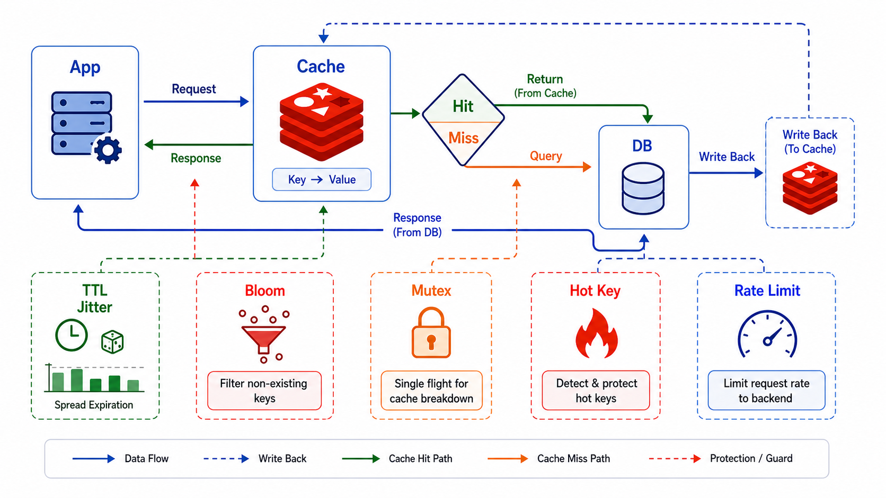

> Redis 常用于缓存加速应用。



## 缓存策略

| 策略              | 说明         |
| ----------------- | ------------ |
| **Cache-Aside**   | 应用自行管理 |
| **Read-Through**  | 缓存自动加载 |
| **Write-Through** | 同步写缓存   |

## 示例

```python
# 缓存查询
def get_user(user_id):
    cache_key = f'user:{user_id}'
    user = r.get(cache_key)
    if user:
        return json.loads(user)

    user = db.query(user_id)
    r.setex(cache_key, 3600, json.dumps(user))
    return user
```

## 小结

- **缓存查询**：先缓存后数据库
- **缓存更新**：删除或更新缓存
