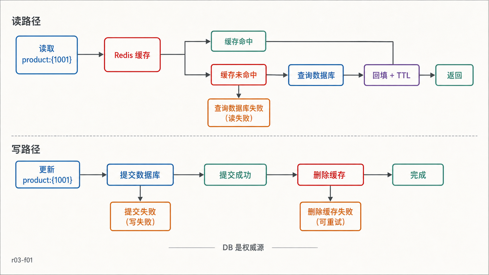
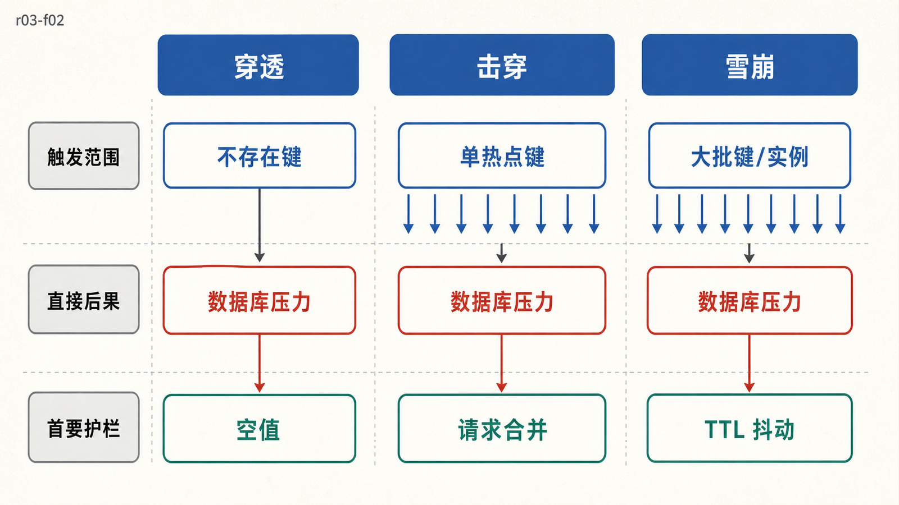
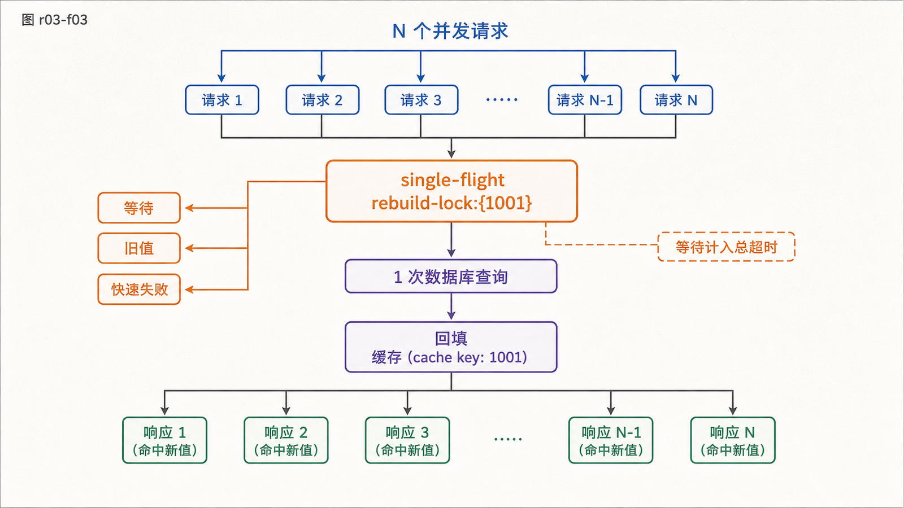

## 前置知识与学习目标

你应理解 Redis 的键、TTL、淘汰策略，并能用 redis-py 区分未命中和连接错误。

读完后，你应该能够：

- 解释 Cache-Aside 在命中、未命中、回源和回填时的状态变化；
- 选择“先更新数据库、再删除缓存”，并说清它仍存在的一致性窗口；
- 区分缓存穿透、击穿和雪崩，并为每种风险选择不同护栏；
- 为缓存设置容量、延迟、命中率和回源压力指标，而不是只看平均命中率。

## 真实场景：快与正确之间有窗口

`shop-api` 读取商品 `1001` 时，Redis 命中可在很低延迟内返回；未命中则查询权威数据库并回填。问题发生在并发更新：一个请求正在回填旧值，另一个请求刚更新数据库并删除缓存，最终谁覆盖谁？

缓存不是权威数据源。设计目标通常不是让缓存和数据库在每个瞬间完全相等，而是定义可接受的不一致窗口、失败时的降级方式和修复路径。

## Cache-Aside 状态机

<!-- figure-anchor:r03-a01 -->

<!-- figure-managed:r03-f01:start -->



<!-- figure-managed:r03-f01:end -->

读取路径：

1. 查询 `product:{1001}`。
2. 命中则反序列化并返回。
3. 未命中则查询数据库。
4. 数据存在时写入带 TTL 的缓存；不存在时可短暂缓存空值。
5. 返回数据库结果。回填失败不应改变本次数据库查询的正确结果。

写入路径通常采用：

1. 在数据库事务中更新权威记录。
2. 提交成功后删除缓存键。
3. 后续读取未命中并回填新值。

相比“先删缓存再写数据库”，先更新数据库再删除缓存缩小了旧值被长期回填的机会。但它仍不是跨系统原子事务：数据库提交成功、删除缓存失败时，旧缓存会活到 TTL 或修复任务执行。

## 最小实现：把正常未命中和故障分开

```python
from __future__ import annotations

import json
import random

NULL_SENTINEL = "__NULL__"

def cache_ttl(base_seconds: int = 300, jitter_ratio: float = 0.2) -> int:
    if base_seconds <= 0 or not 0 <= jitter_ratio < 1:
        raise ValueError("invalid TTL policy")
    delta = int(base_seconds * jitter_ratio)
    return base_seconds + random.randint(-delta, delta)

def get_product(r, db, product_id: int):
    key = f"product:{{{product_id}}}"
    cached = r.get(key)
    if cached == NULL_SENTINEL:
        return None
    if cached is not None:
        return json.loads(cached)

    product = db.find_product(product_id)
    if product is None:
        r.set(key, NULL_SENTINEL, ex=30)
        return None

    r.set(
        key,
        json.dumps(product, ensure_ascii=False, separators=(",", ":")),
        ex=cache_ttl(),
    )
    return product

def update_product(r, db, product_id: int, patch: dict) -> None:
    db.update_product_in_transaction(product_id, patch)
    r.delete(f"product:{{{product_id}}}")
```

输入是商品 ID 或更新字段；读取输出是商品对象或 `None`；写入成功的证据是数据库事务已提交且缓存删除命令成功。空值 TTL 必须短，避免新建商品在很长时间内仍被当成不存在。

若删除缓存失败，不能回滚一个已经提交的数据库事务。应记录可重试事件；对一致性要求更高的系统，可用事务 Outbox 或 CDC 把失效事件可靠地投递给缓存修复消费者。

## 三类缓存风险不是同一个问题

<!-- figure-anchor:r03-a02 -->

<!-- figure-managed:r03-f02:start -->



<!-- figure-managed:r03-f02:end -->

| 风险 | 状态                              | 主要后果             | 常用护栏                                     |
| ---- | --------------------------------- | -------------------- | -------------------------------------------- |
| 穿透 | 大量查询根本不存在的键            | 每次都访问数据库     | 参数校验、短 TTL 空值、布隆过滤器、限流      |
| 击穿 | 单个热点键过期，许多请求同时回源  | 热点数据库查询风暴   | 请求合并、互斥重建、逻辑过期、预热           |
| 雪崩 | 大批键同时过期或 Redis 整体不可用 | 大范围回源与级联超时 | TTL 抖动、多级缓存、熔断限流、容量与故障演练 |

TTL 抖动只分散计划过期时间，不能防止 Redis 实例故障。布隆过滤器可能误判“存在”，仍需数据库确认；删除或新建数据时也要维护过滤器生命周期。

## 热点重建：只让一个请求做昂贵工作

<!-- figure-anchor:r03-a03 -->

<!-- figure-managed:r03-f03:start -->



<!-- figure-managed:r03-f03:end -->

互斥重建可以用短租约实现：第一个未命中请求取得 `rebuild-lock:{1001}`，查询数据库并回填；其他请求短暂等待、返回允许的旧值或快速失败。锁等待时间必须计入 HTTP 总超时，且锁失效不能成为正确性的唯一保障。

本篇只使用这一原则，不展开自制锁代码。锁所有权、续期和 fencing token 在第 6 篇专门讨论。对本进程内的并发，优先使用 single-flight/request coalescing，成本通常低于跨进程分布式锁。

## 一致性窗口与失败矩阵

| 失败点                 | 当前真实状态             | 用户可能看到什么       | 修复方式                             |
| ---------------------- | ------------------------ | ---------------------- | ------------------------------------ |
| 数据库读取失败         | 缓存未命中，权威源不可用 | 错误或受控降级         | 超时、熔断、旧值策略；不要写空值     |
| 回填 Redis 失败        | 数据库结果正确，缓存仍空 | 本次正确，后续继续回源 | 记录指标，限流并重试回填             |
| 数据库提交失败         | 数据未改变               | 仍可读取旧缓存         | 不删除缓存，返回写失败               |
| 数据库成功、删缓存失败 | 数据库新、缓存旧         | TTL 内可能读旧值       | Outbox/CDC 修复、短 TTL、告警        |
| Redis 整体不可用       | 缓存路径失败             | 大量请求转向数据库     | 熔断、回源限额、降级，避免压垮数据库 |

不要默认使用“延迟双删”作为万能修复。它依赖对并发时序和延迟的猜测，进程崩溃也会丢失第二次删除。若业务不能接受窗口，应选择可追踪的失效事件、版本号校验或更强的一致性存储设计。

## 观测与容量门禁

至少跟踪：

- 按业务和结果拆分的命中率，而不是全实例单一平均值；
- 命中、未命中、回源、回填的 p50/p95/p99 延迟；
- 数据库回源 QPS、并发数和失败率；
- `evicted_keys`、`expired_keys`、内存使用和热点键；
- 空值命中、互斥等待、失效事件积压和陈旧数据反馈。

命中率上升不一定是好事：把错误或过期数据缓存得更久也会提高命中率。业务正确率、数据库压力和尾延迟是必要护栏。

## 常见误区与适用边界

- 缓存不是数据库备份，持久化也不会自动解决双写一致性。
- “更新缓存”容易被并发旧值覆盖；Cache-Aside 更常用删除失效，但仍需处理删除失败。
- 所有键使用同一固定 TTL 会放大周期性雪崩，应按业务新鲜度设基准并加抖动。
- 缓存用户权限、余额等强一致数据前，要先定义陈旧值的业务后果。
- 低频、写多读少或查询本身已很快的数据，加入缓存可能只增加复杂度。

## 本篇自检

<details>
<summary>1. 为什么推荐先提交数据库，再删除缓存？</summary>

数据库是权威源。先删后写时，并发读可能在数据库更新前读到旧值并重新回填；先写后删通常缩小该窗口，但仍需处理删除失败。

</details>

<details>
<summary>2. 穿透和击穿有什么不同？</summary>

穿透针对不存在的键，持续绕过缓存；击穿针对存在的热点键在失效瞬间产生并发回源。前者常用校验/空值/过滤器，后者常用请求合并或互斥重建。

</details>

<details>
<summary>3. 为什么不能只用命中率判断缓存成功？</summary>

高命中可能来自过长 TTL 或错误数据。还要观察陈旧数据、数据库压力、尾延迟、淘汰和故障时的降级效果。

</details>

## 本篇总结

Cache-Aside 是一个跨缓存与数据库的状态机，不是三行 `GET/SET`。稳定方案要明确权威源、一致性窗口、失效失败、三类缓存风险和回源上限，并用正确性与尾延迟约束命中率。

## 下一篇衔接

缓存允许丢失时可以重建；库存和订单状态却可能要求重启恢复。下一篇用 RPO、RTO 和运行时延迟比较 RDB、AOF 与混合持久化。

## 资料来源

- [Redis caching](https://redis.io/docs/latest/develop/use/cases/caching/)
- [Key eviction](https://redis.io/docs/latest/develop/reference/eviction/)
- [Redis administration](https://redis.io/docs/latest/operate/oss_and_stack/management/admin/)
- [Client-side caching](https://redis.io/docs/latest/develop/clients/client-side-caching/)
