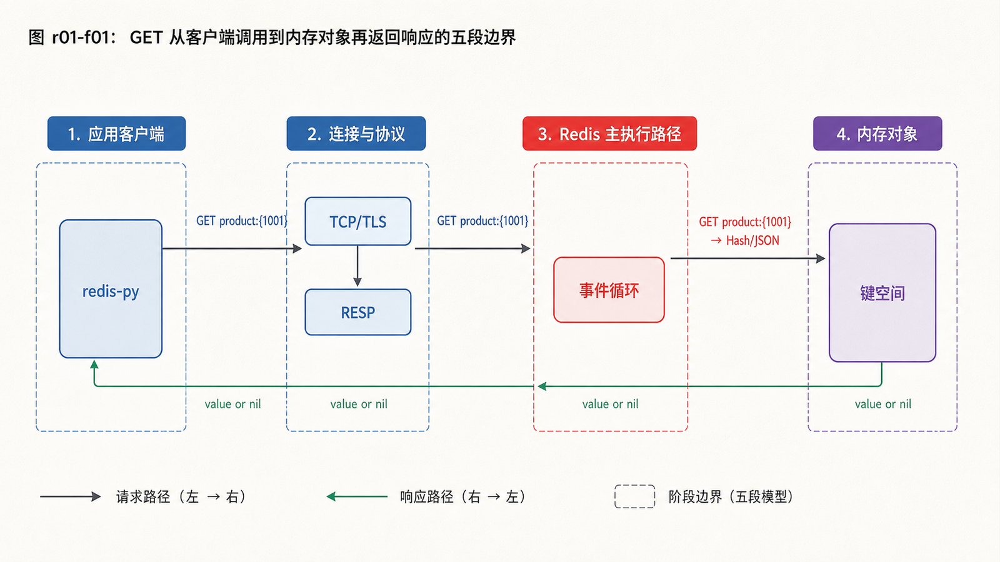
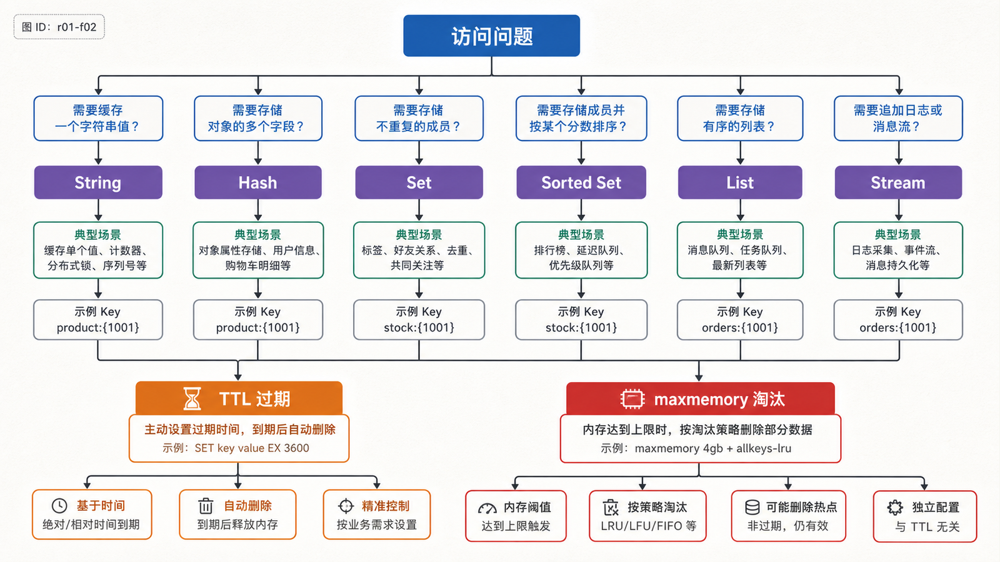

## 前置知识与学习目标

本文面向会使用终端、Docker 和 Python，但尚未系统学习 Redis 的读者。你只需知道应用会通过网络读写数据库。

读完后，你应该能够：

- 解释客户端命令如何经过连接、RESP 协议和事件循环改变内存对象；
- 根据访问方式选择 String、Hash、Set、Sorted Set、List 或 Stream；
- 区分键过期与内存淘汰，并观察 TTL、类型和内存占用；
- 启动一个仅供本机实验的 Redis，并识别不能直接照搬到生产的配置。

全系列使用同一个案例：电商服务 `shop-api` 管理商品 `1001`。详情缓存键为 `product:{1001}`，库存键为 `stock:{1001}`，订单事件流为 `orders:{1001}`。

## 真实场景：Redis 为什么快，但不只是“内存字典”

商品页每秒可能读取同一份详情数千次。每次都查关系数据库会重复解析 SQL、访问索引并传输相同结果。Redis 把高频数据放在内存中，通过明确的数据类型和单条命令完成读取、计数、集合运算或排序。

“在内存中”只是低延迟的一个条件。请求仍要经历网络往返、协议解析、命令执行、序列化和响应传输；大键、慢命令、阻塞式脚本或连接风暴同样会制造延迟。

## 核心机制：一次命令经历什么

<!-- figure-anchor:r01-a01 -->

<!-- figure-managed:r01-f01:start -->



<!-- figure-managed:r01-f01:end -->

以 `GET product:{1001}` 为例：

1. 客户端从连接池取得 TCP/TLS 连接，把命令编码为 RESP。
2. Redis 事件循环读取请求并解析命令参数。
3. 命令处理器在键空间查找对象；若键已逻辑过期，则按不存在处理。
4. Redis 执行类型检查和读取，把结果编码为 RESP 响应。
5. 客户端解码字节，应用再反序列化 JSON。

Redis 的命令执行以短小、确定的操作为优势，但“单线程”不是完整描述：网络 IO、持久化、异步释放和部分后台任务可由其他线程或子进程完成。对应用最重要的边界是：不要让单个命令或 Lua 脚本长时间占用主执行路径。

## 数据对象与建模

选择数据类型时先问“要执行什么操作”，而不是“原数据长什么样”。

| 数据类型   | 适合的访问方式           | 贯穿示例               | 关键边界                                    |
| ---------- | ------------------------ | ---------------------- | ------------------------------------------- |
| String     | 整体读取、计数、位操作   | JSON 详情、库存计数    | 单值最大 512 MB，但大值会放大网络和阻塞风险 |
| Hash       | 按字段读写对象           | 商品的 `name`、`price` | 不是嵌套文档；字段仍需自行编码              |
| Set        | 去重、成员判断、集合运算 | 商品标签               | 无顺序；大集合运算要评估复杂度              |
| Sorted Set | 按分数排序和范围查询     | 热销榜                 | 分数是 double，成员唯一                     |
| List       | 两端推入/弹出、阻塞读取  | 简单任务队列           | 缺少消费组与待处理列表                      |
| Stream     | 追加日志、消费组、确认   | 订单事件               | 必须规划裁剪、ACK、重投和幂等               |

<!-- figure-anchor:r01-a02 -->

<!-- figure-managed:r01-f02:start -->



<!-- figure-managed:r01-f02:end -->

花括号 `{1001}` 是本系列的统一实体标识。单节点中它只是键名的一部分；Cluster 会把花括号内的内容作为 hash tag，使 `product:{1001}`、`stock:{1001}` 和 `orders:{1001}` 落到同一槽位。是否应该同槽，要到 Cluster 篇再根据事务和热点风险决定。

## TTL、过期与淘汰不是一回事

`EXPIRE` 为键设置生存时间。Redis 通过访问时的惰性过期和周期性主动过期回收键，因此 TTL 到达 0 表示键在语义上失效，不承诺内存字节在同一微秒释放。

淘汰发生在设置了 `maxmemory` 且内存接近上限时。策略决定 Redis 从哪些键中选择牺牲者，例如 `allkeys-lru`、`allkeys-lfu` 或 `noeviction`。TTL 是单个业务对象的有效期；淘汰是实例级容量保护，两者不能互相替代。

## 最小部署与实践

下面的容器只监听本机，适合实验，不是生产部署模板：

```bash
docker run --rm --name redis-lab \
  -p 127.0.0.1:6379:6379 \
  -v redis-lab-data:/data \
  redis:8-alpine \
  redis-server --appendonly yes
```

另开终端执行：

```bash
redis-cli --raw PING

HSET product:{1001} name "Mechanical Keyboard" price_cents 69900
HGETALL product:{1001}

SET stock:{1001} 50 EX 3600
INCRBY stock:{1001} -2
TTL stock:{1001}

SADD tags:{1001} keyboard wireless
SMEMBERS tags:{1001}

ZADD sales:daily 12 product:1001
ZREVRANGE sales:daily 0 9 WITHSCORES

TYPE product:{1001}
MEMORY USAGE product:{1001}
```

预期证据：`PING` 返回 `PONG`；库存从 50 变为 48；`TTL` 是不大于 3600 的正数；商品键类型为 `hash`。重复运行 `HSET`、`SADD` 和 `ZADD` 会更新或保持成员，不会机械追加重复对象。

停止实验容器：

```bash
docker stop redis-lab
```

## 配置与安全边界

配置文件用于持久化实例策略，`CONFIG SET` 只适合受控变更。生产环境至少要明确：

- 只监听业务网络，不把 6379 暴露到公网；
- 使用 TLS 或可信内网，并用 ACL 给应用最小命令和键权限；
- 为数据、复制缓冲区、持久化 fork 和内存碎片预留空间；
- 明确 `maxmemory`、淘汰策略、持久化、备份和监控；
- 用版本化配置和变更审计替代手工在线修改。

不要用 `KEYS *` 盘点生产大实例；使用 `SCAN` 渐进遍历。不要把 `FLUSHALL`、`CONFIG`、`DEBUG` 等管理命令授予应用账户。

## 输入、输出与失败边界

| 输入/状态                        | 可观察输出           | 解释与动作                                    |
| -------------------------------- | -------------------- | --------------------------------------------- |
| 读取不存在或已过期键             | nil/`None`           | 正常未命中，不等同于 Redis 故障               |
| 对 String 执行 `HGET`            | `WRONGTYPE`          | 数据模型或键命名冲突，不应重试                |
| 达到 `maxmemory` 且 `noeviction` | 写命令返回 OOM       | 容量或策略问题，不能靠无限重试修复            |
| 网络不可达/认证失败              | 连接或 `NOAUTH` 错误 | 检查地址、TLS、ACL 和凭据，不要降级为匿名访问 |

## 常见误区与适用边界

- Redis 不等于“永不丢数据”的主数据库；耐久性取决于持久化、复制、故障模式和业务写入协议。
- 数据类型多不代表应该把完整关系模型复制进 Redis；围绕查询路径设计键，并保留权威数据源。
- 命令是原子的，不代表跨多条命令的业务流程自动原子。
- `SELECT` 的逻辑数据库不是租户隔离、安全边界或 Cluster 分片方案。
- 大键可能让单条合法命令造成延迟尖峰；键数量和值大小都要观测。

## 本篇自检

<details>
<summary>1. TTL 到期与 maxmemory 淘汰有什么区别？</summary>

TTL 表达业务对象何时失效；淘汰是在实例达到内存上限时按策略释放键。一个键可以尚未过期却被淘汰，也可以在没有内存压力时按 TTL 失效。

</details>

<details>
<summary>2. 为什么商品对象不一定要存成 Hash？</summary>

类型应由访问方式决定。若总是整体读写并由应用维护 JSON 版本，String 更简单；若经常独立更新价格等字段，Hash 更合适。

</details>

<details>
<summary>3. `GET` 返回空值时，为什么不能立刻判定 Redis 故障？</summary>

键可能从未写入、已经过期或被淘汰。连接异常和命令错误会以不同错误返回，应用必须区分正常未命中与基础设施故障。

</details>

## 本篇总结

Redis 是带类型、过期语义和服务器端命令的内存数据系统。稳定使用它的起点不是背命令，而是理解请求链、按访问方式建模、区分过期与淘汰，并把网络和权限边界纳入部署。

## 下一篇衔接

下一篇把这些命令放入 `redis-py`：如何复用连接、控制超时、选择序列化方式，并区分可安全重试与不可盲目重试的失败。

## 资料来源

- [Redis data types](https://redis.io/docs/latest/develop/data-types/)
- [Redis protocol specification](https://redis.io/docs/latest/develop/reference/protocol-spec/)
- [Key eviction](https://redis.io/docs/latest/develop/reference/eviction/)
- [Redis configuration](https://redis.io/docs/latest/operate/oss_and_stack/management/config/)
- [Install Redis Open Source](https://redis.io/docs/latest/operate/oss_and_stack/install/install-stack/)
