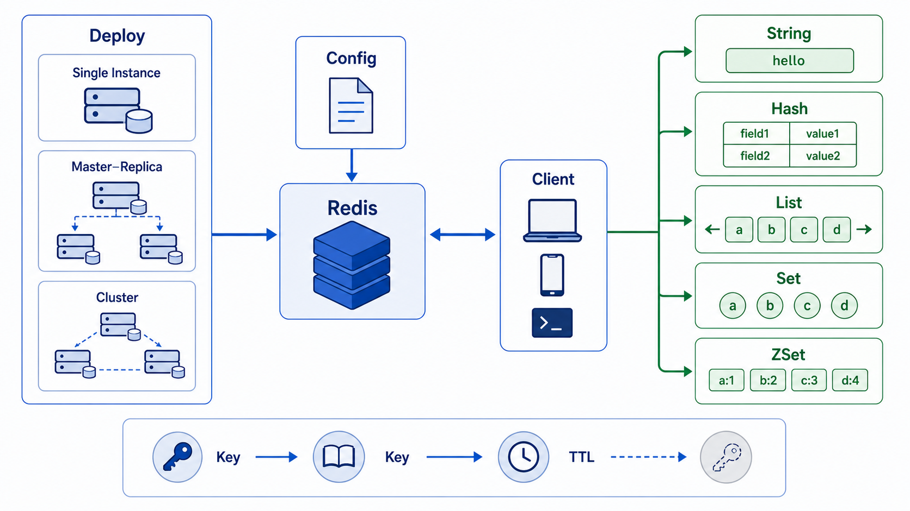

> Redis 是高性能的内存键值存储数据库，广泛用于缓存、消息队列、排行榜等场景。



## Redis 特性

| 特性             | 说明                                |
| ---------------- | ----------------------------------- |
| **高性能**       | 基于内存读写，延迟低                |
| **数据类型丰富** | String、Hash、List、Set、Sorted Set |
| **持久化**       | 支持 RDB、AOF 和混合持久化          |
| **高可用**       | 支持主从复制、Sentinel 和 Cluster   |
| **发布订阅**     | 可用于轻量消息通知                  |

## 安装部署

### YUM 安装

```bash
yum install epel-release
yum install redis
systemctl start redis
systemctl enable redis
```

### Docker 安装

```bash
docker run -d \
  --name redis \
  -p 6379:6379 \
  -v redis-data:/data \
  redis:7-alpine \
  redis-server --appendonly yes
```

### Docker Compose

```yaml
version: "3"
services:
  redis:
    image: redis:7-alpine
    ports:
      - "6379:6379"
    volumes:
      - redis-data:/data
    command: redis-server --appendonly yes
    restart: always

volumes:
  redis-data:
```

### 配置文件

```bash
# 主配置文件
/etc/redis.conf

# 常用配置项
bind 0.0.0.0
port 6379
daemonize no
dir /var/lib/redis
appendonly yes
maxmemory 2gb
maxmemory-policy allkeys-lru
```

## 连接与配置

### 命令行连接

```bash
redis-cli
redis-cli -h localhost -p 6379
redis-cli --raw
redis-cli --no-raw

# 认证
redis-cli -a password
```

### Python 连接池

```python
import redis

pool = redis.ConnectionPool(host='localhost', port=6379, db=0)
r = redis.Redis(connection_pool=pool)
```

### 配置命令

```bash
INFO
CONFIG GET *
CONFIG SET maxmemory 1gb
CONFIG REWRITE
CLIENT LIST
CLIENT KILL ip:port
```

## 数据类型

### String（字符串）

```bash
SET name "Alice"
GET name
MSET name "Bob" age 30
MGET name age
INCR counter
INCRBY counter 5
DECR counter
DECRBY counter 3
APPEND name " Smith"
STRLEN name
```

```python
import redis

r = redis.Redis(host='localhost', port=6379, db=0)
r.set('name', 'Alice')
r.get('name')
r.mset({'name': 'Bob', 'age': 30})
r.mget(['name', 'age'])
r.incr('counter')
```

### Hash（哈希）

```bash
HSET user:1 name "Alice" email "alice@example.com"
HGET user:1 name
HGETALL user:1
HMSET user:2 name "Bob" email "bob@example.com"
HMGET user:2 name email
HKEYS user:1
HVALS user:1
HLEN user:1
HEXISTS user:1 email
HINCRBY user:1 age 1
HDEL user:1 email
```

```python
r.hset('user:1', mapping={'name': 'Alice', 'email': 'alice@example.com'})
r.hget('user:1', 'name')
r.hgetall('user:1')
r.hincrby('user:1', 'age', 1)
```

### List（列表）

```bash
LPUSH tasks "task1"
RPUSH tasks "task2"
LPOP tasks
RPOP tasks
LRANGE tasks 0 -1
LLEN tasks
LINSERT tasks BEFORE "task2" "task1.5"
LSET tasks 0 "new_task1"
```

```python
r.lpush('tasks', 'task1')
r.rpush('tasks', 'task2')
r.lrange('tasks', 0, -1)
r.lpop('tasks')
```

### Set（集合）

```bash
SADD tags "python" "redis" "database"
SMEMBERS tags
SISMEMBER tags "python"
SCARD tags
SREM tags "database"
SINTER tag1 tag2
SUNION tag1 tag2
SDIFF tag1 tag2
SRANDMEMBER tags 2
```

```python
r.sadd('tags', 'python', 'redis', 'database')
r.smembers('tags')
r.sismember('tags', 'python')
r.sinter('tag1', 'tag2')
```

### Sorted Set（有序集合）

```bash
ZADD leaderboard 100 "Alice" 90 "Bob" 80 "Charlie"
ZRANGE leaderboard 0 -1 WITHSCORES
ZREVRANGE leaderboard 0 -1 WITHSCORES
ZRANK leaderboard "Bob"
ZSCORE leaderboard "Alice"
ZINCRBY leaderboard 10 "Bob"
```

```python
r.zadd('leaderboard', {'Alice': 100, 'Bob': 90})
r.zrange('leaderboard', 0, -1, withscores=True)
r.zrevrange('leaderboard', 0, 9, withscores=True)
```

## 键操作

```bash
KEYS pattern
EXISTS key
TYPE key
DEL key
EXPIRE key 60
TTL key
PTTL key
RENAME key newkey
RANDOMKEY
DUMP key
RESTORE key ttl serialized-value
```

## 小结

- **String**：最基本类型，适合缓存
- **Hash**：适合存储对象
- **List**：适合队列、列表
- **Set**：适合标签、好友关系
- **Sorted Set**：适合排行榜、有序集合
