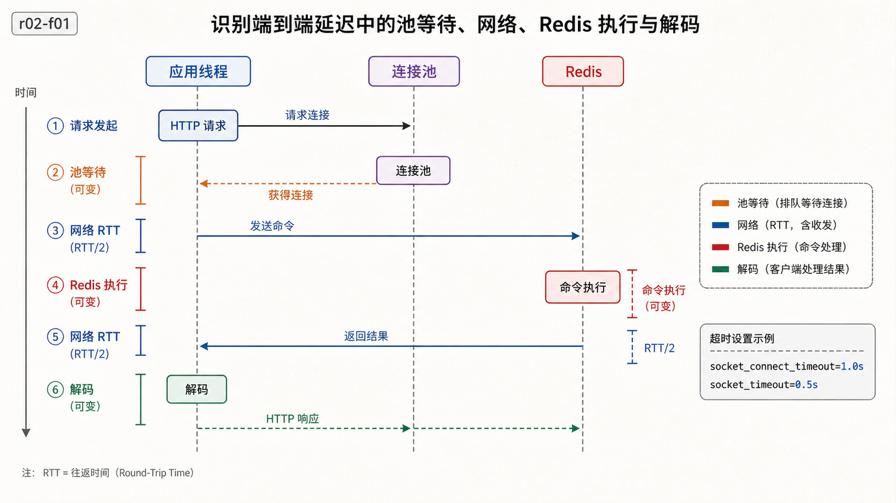
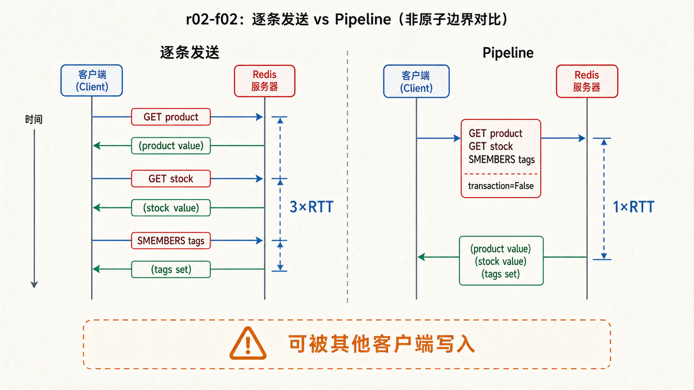
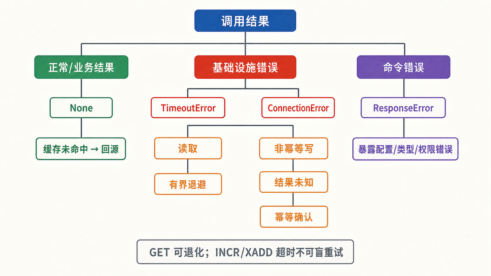

## 前置知识与学习目标

你应已读过上一篇，知道键、数据类型和 TTL 的含义，并能用 `redis-cli` 执行命令。

读完后，你应该能够：

- 解释应用调用、连接池、RESP 请求和 Redis 响应之间的边界；
- 配置连接、解码、超时和健康检查，而不是每次请求新建连接；
- 用非事务 Pipeline 减少网络往返，并知道它不自动提供业务原子性；
- 区分未命中、超时、断连和命令错误，避免危险的盲目重试。

## 真实场景：一行 GET 隐藏了哪些工程决策

`shop-api` 读取 `product:{1001}` 看似只需 `client.get(key)`，但生产行为还取决于：连接从哪里来、等待多久、返回 `bytes` 还是 `str`、JSON 是否兼容、断线能否重试，以及请求结束后谁负责关闭资源。

这些问题不应散落在每个业务函数里。我们需要一个进程级 Redis 客户端和一个窄的数据访问层。

## 核心机制：客户端不是远程字典

<!-- figure-anchor:r02-a01 -->

<!-- figure-managed:r02-f01:start -->



<!-- figure-managed:r02-f01:end -->

一次调用至少包含四段时间：从池中取得连接、网络发送、服务端执行、网络接收与解码。服务端执行很快并不代表端到端延迟一定低；跨可用区 RTT、连接耗尽和超时排队都可能占主要部分。

连接池复用已建立的连接，并限制并发连接数。它不是“连接越多越快”：超过 Redis 或操作系统承载能力的连接会增加内存、上下文切换和故障放大。池大小应由并发请求、单次占用时间和实例限制共同决定。

## 建立一个进程级客户端

安装客户端：

```bash
python -m pip install "redis>=5,<7"
```

```python
import os
import redis

def create_redis() -> redis.Redis:
    return redis.Redis.from_url(
        os.environ.get("REDIS_URL", "redis://localhost:6379/0"),
        decode_responses=True,
        max_connections=50,
        socket_connect_timeout=1.0,
        socket_timeout=0.5,
        health_check_interval=30,
    )

client = create_redis()
client.ping()
```

输入是 `REDIS_URL` 和连接策略；成功输出是 `True`。`decode_responses=True` 把普通响应解码为字符串，适合 UTF-8 JSON；若存二进制数据，应关闭自动解码并明确处理 `bytes`。

在 Web 进程中应复用 `client`。进程退出时调用 `client.close()`；异步客户端则需要 `await client.aclose()`。不要在每个 HTTP 请求中创建并销毁客户端。

## 封装序列化与键契约

```python
from __future__ import annotations

import json
from dataclasses import asdict, dataclass

@dataclass(frozen=True)
class Product:
    id: int
    name: str
    price_cents: int

def product_key(product_id: int) -> str:
    if product_id <= 0:
        raise ValueError("product_id must be positive")
    return f"product:{{{product_id}}}"

def put_product(r, product: Product, ttl_seconds: int = 300) -> None:
    if ttl_seconds <= 0:
        raise ValueError("ttl_seconds must be positive")
    payload = json.dumps(asdict(product), ensure_ascii=False, separators=(",", ":"))
    r.set(product_key(product.id), payload, ex=ttl_seconds)

def get_product(r, product_id: int) -> Product | None:
    payload = r.get(product_key(product_id))
    if payload is None:
        return None
    data = json.loads(payload)
    return Product(**data)
```

键构造、序列化格式和 TTL 在一处定义，便于测试与升级。JSON 可读且跨语言，但类型和日期需要契约；Pickle 等语言私有格式不应读取不可信内容。

## Pipeline：减少 RTT，不等于自动原子

<!-- figure-anchor:r02-a02 -->

<!-- figure-managed:r02-f02:start -->



<!-- figure-managed:r02-f02:end -->

逐条发送三个独立命令通常需要三次往返。Pipeline 先缓存命令，再批量发送：

```python
def product_snapshot(r, product_id: int) -> dict[str, object]:
    entity = f"{{{product_id}}}"
    pipe = r.pipeline(transaction=False)
    pipe.get(f"product:{entity}")
    pipe.get(f"stock:{entity}")
    pipe.smembers(f"tags:{entity}")
    product_json, stock, tags = pipe.execute()
    return {
        "product": None if product_json is None else json.loads(product_json),
        "stock": None if stock is None else int(stock),
        "tags": sorted(tags),
    }
```

输入是商品 ID；输出固定包含 `product`、`stock`、`tags`。`transaction=False` 只优化传输，不阻止其他客户端在命令之间写入，所以三项可能来自略有差异的时刻。需要条件更新或原子组合时，使用后文的事务、WATCH 或 Lua。

Pipeline 也不是无限批量容器。批次过大会增加客户端内存、单次响应体积和服务端连续执行时间，应通过压测选择 `COUNT` 或批大小。

## 错误分类与重试边界

```python
import logging
import redis

log = logging.getLogger(__name__)

def read_with_fallback(r, key: str) -> str | None:
    try:
        return r.get(key)
    except redis.TimeoutError:
        log.warning("redis timeout", extra={"key": key})
        return None
    except redis.ConnectionError:
        log.exception("redis unavailable")
        return None
    except redis.ResponseError:
        log.exception("redis command rejected", extra={"key": key})
        raise
```

- 返回 `None`：正常未命中，可以走数据库回源。
- `TimeoutError`：结果未知。读取通常可以退化或带退避重试；写入可能已经成功，不能假设未执行。
- `ConnectionError`：连接失败或中断。是否重试取决于操作幂等性和总超时预算。
- `ResponseError`：如 `WRONGTYPE`、`NOPERM`、跨槽错误，通常是代码、模型或权限问题，盲重试无效。

对 `INCR`、`XADD`、扣库存等非幂等写，如果超时后直接重发，可能重复生效。需要请求 ID、幂等键、事务脚本或业务侧去重，而不是只打开自动重试。

## 可观测性与最小验证

<!-- figure-anchor:r02-a03 -->

<!-- figure-managed:r02-f03:start -->



<!-- figure-managed:r02-f03:end -->

客户端至少记录：操作类别、成功/未命中/错误、端到端耗时、池等待或连接错误、超时次数。不要把完整键和值写入日志；键可能包含用户标识，值可能包含敏感数据。

```bash
redis-cli INFO clients
redis-cli CLIENT LIST
redis-cli INFO commandstats
redis-cli LATENCY DOCTOR
```

验证顺序应从 `PING`、单个 `SET/GET`、TTL、并发连接逐步增加。`PING` 成功只证明连接和基本响应正常，不证明权限覆盖所有业务命令，也不证明高负载下的延迟。

## 常见误区与适用边界

- 连接池复用连接，但不能替代应用级超时、熔断和容量限制。
- `decode_responses=True` 不是通用答案；二进制值或混合编码需要显式字节契约。
- Pipeline 主要减少往返，不自动保证跨命令一致性。
- 读取失败可以回源，不代表所有 Redis 故障都应静默吞掉；锁、限流和幂等状态失败时通常应拒绝或转移流量。
- 不要用捕获 `Exception` 后无限重试掩盖 `WRONGTYPE`、ACL 或程序错误。

## 本篇自检

<details>
<summary>1. 为什么每个 HTTP 请求创建一个 Redis 客户端不是好主意？</summary>

它会反复建立连接并增加握手、文件描述符和连接风暴风险。进程级客户端通过连接池复用连接，并提供统一的超时和生命周期管理。

</details>

<details>
<summary>2. `pipeline(transaction=False)` 能保证三次读取来自同一时刻吗？</summary>

不能。它减少网络往返，但其他客户端仍可在命令之间写入。需要原子快照时要重新设计数据模型或使用服务端原子机制。

</details>

<details>
<summary>3. 写命令超时后为什么不能立即重发？</summary>

超时只表示客户端没有及时拿到结果，命令可能已经执行。重发非幂等写会重复扣减或重复追加，应依靠幂等标识或原子去重。

</details>

## 本篇总结

可靠的 Redis 接入层要统一连接池、超时、编码、键和错误语义。Pipeline 优化 RTT；异常分类决定回源、重试还是立即暴露问题。客户端工程边界清楚后，缓存策略才不会把故障放大到业务层。

## 下一篇衔接

下一篇以商品详情为例实现 Cache-Aside，并分析缓存未命中、更新并发、穿透、击穿和雪崩的状态变化。

## 资料来源

- [redis-py: Connect to the server](https://redis.io/docs/latest/develop/clients/redis-py/connect/)
- [Connection pools and multiplexing](https://redis.io/docs/latest/develop/clients/pools-and-muxing/)
- [redis-py error handling](https://redis.io/docs/latest/develop/clients/redis-py/error-handling/)
- [Pipelines and transactions](https://redis.io/docs/latest/develop/clients/redis-py/transpipe/)
