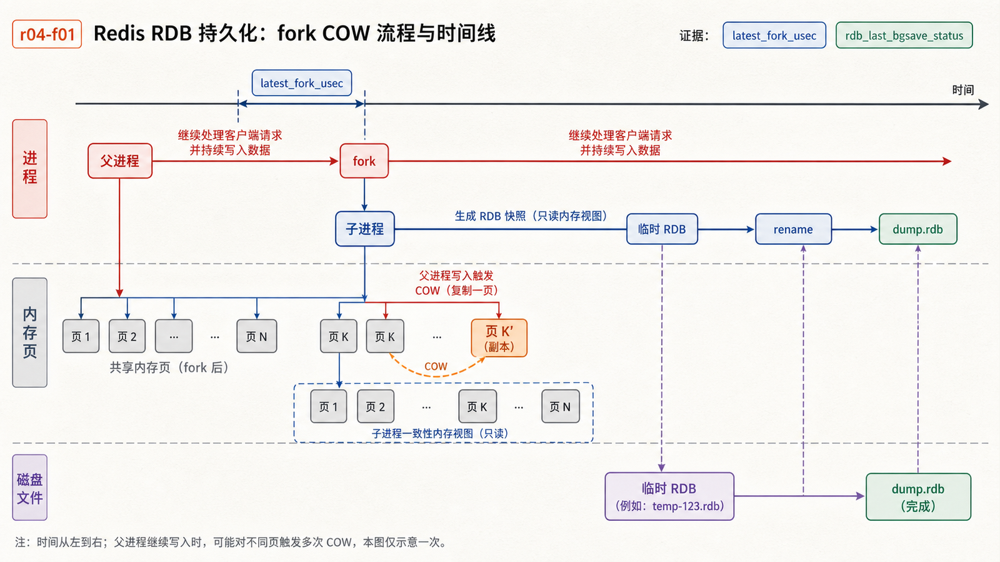
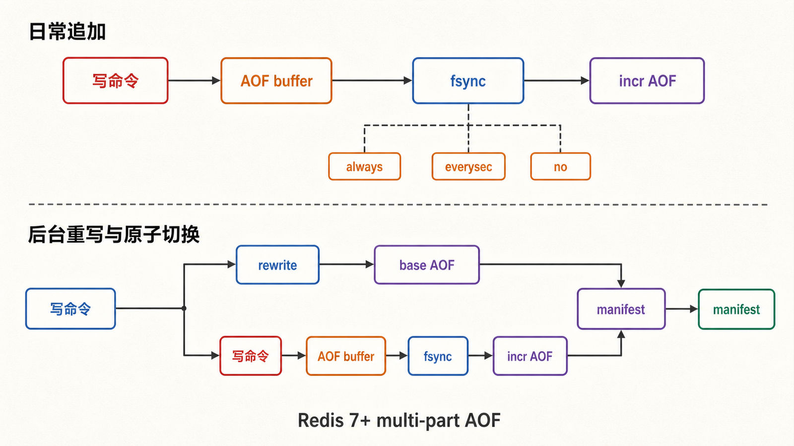
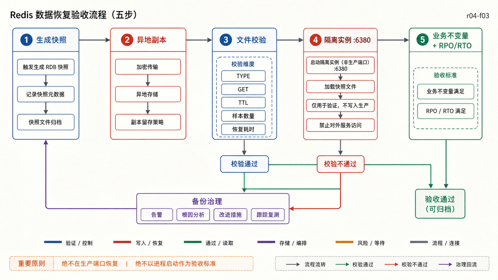

## 前置知识与学习目标

你应理解 Redis 的键、写命令、TTL，并知道缓存数据与权威业务数据的区别。本文以 Redis Open Source 7.2+ 的多文件 AOF 为基线。

读完后，你应该能够：

- 用 RPO、RTO 和运行时延迟定义持久化目标，而不是争论“RDB 还是 AOF 更好”；
- 解释 RDB 的 `fork`/写时复制和 AOF 的追加、`fsync`、重写流程；
- 识别持久化与复制、备份的不同责任；
- 从备份副本启动隔离实例，并验证数据、TTL 和恢复耗时。

## 真实场景：能重启，不等于能恢复业务

`shop-api` 的商品详情缓存可以从数据库重建，但库存键若暂时承担预扣状态，丢失 30 秒可能造成超卖。团队提出“打开 AOF 就安全了”，却没有回答：最多允许丢多少数据？多久必须恢复？备份是否能在另一台机器读取？

持久化方案必须从目标反推：

- **RPO（恢复点目标）**：故障后最多能接受丢失多长时间的数据。
- **RTO（恢复时间目标）**：从故障到业务恢复最多允许多久。
- **运行时预算**：`fork`、磁盘写入和重写能给在线 p99 延迟带来多大影响。

## RDB：某个时刻的数据快照

<!-- figure-anchor:r04-a01 -->

<!-- figure-managed:r04-f01:start -->



<!-- figure-managed:r04-f01:end -->

`BGSAVE` 的典型流程：主进程 `fork` 子进程；子进程遍历当时的内存视图并写临时 RDB；完成后原子替换目标文件。父子进程起初共享物理内存页，之后父进程写入的页面触发写时复制（COW）。

RDB 文件紧凑、便于异地备份和快速加载，但故障时会丢失最后一次成功快照之后的写入。大数据集上的 `fork` 延迟和高写入期间的 COW 额外内存，必须纳入容量与尾延迟测试。

```conf
save 900 1
save 300 10
save 60 10000
dbfilename dump.rdb
dir /data
rdbcompression yes
rdbchecksum yes
stop-writes-on-bgsave-error yes
```

`SAVE` 会同步阻塞服务器，通常只用于明确的离线维护；在线实例使用 `BGSAVE`，并观察 `rdb_bgsave_in_progress`、`rdb_last_bgsave_status` 和 `latest_fork_usec`。

## AOF：记录改变数据集的写操作

<!-- figure-anchor:r04-a02 -->

<!-- figure-managed:r04-f02:start -->



<!-- figure-managed:r04-f02:end -->

写命令执行后进入 AOF 缓冲区，再按策略刷入持久存储：

| `appendfsync` | 故障窗口        | 运行代价 | 适用说明                             |
| ------------- | --------------- | -------- | ------------------------------------ |
| `always`      | 尽量缩到每批写  | 最高     | 仍需验证存储和虚拟化层是否兑现耐久性 |
| `everysec`    | 通常约 1 秒量级 | 常用折中 | Redis 官方建议且常作为默认选择       |
| `no`          | 由操作系统决定  | 较低     | RPO 不确定，不适合重要状态           |

```conf
appendonly yes
appenddirname "appendonlydir"
appendfsync everysec
auto-aof-rewrite-percentage 100
auto-aof-rewrite-min-size 64mb
aof-use-rdb-preamble yes
```

Redis 7 起，AOF 目录通常包含 base 文件、一个或多个 incremental 文件以及 manifest。重写会生成更紧凑的新 base，并在切换时维护增量写入。运维脚本不能再假定只有一个固定路径的 `appendonly.aof`。

AOF 重写不是删除“旧日志行”那么简单，而是根据当前数据集生成能重建相同状态的最短表示。它会消耗 CPU、内存和磁盘带宽；写入密集时要观察重写缓冲、磁盘延迟与尾延迟。

## 混合持久化与启动选择

启用 `aof-use-rdb-preamble yes` 后，AOF base 可使用 RDB 格式，后接增量 AOF，兼顾加载速度与增量耐久性。若 RDB 与 AOF 都启用，重启时 Redis 使用更完整的 AOF 路径恢复数据；RDB 仍适合作为可移动的时间点备份。

持久化不是复制：持久化帮助单个数据集跨进程/主机重启，复制提供副本和可用性。复制也不是备份：错误删除会被复制，空数据集重启在特定配置下也可能传播到副本。历史备份必须独立保存并定期恢复验证。

## 从目标选择方案

| 数据角色      | 典型目标                             | 建议起点                                              | 必须验证                         |
| ------------- | ------------------------------------ | ----------------------------------------------------- | -------------------------------- |
| 可重建缓存    | RPO 可为全部丢失，RTO 受回源能力约束 | 可关闭持久化或保留稀疏 RDB                            | 冷启动会不会压垮数据库           |
| 会话/限流状态 | 可接受短窗口丢失                     | AOF `everysec` + 副本                                 | 丢 1 秒的业务后果和时钟窗口      |
| 重要业务状态  | 很低 RPO、明确审计                   | RDB + AOF + 副本 + 外部备份，或改用更合适的权威数据库 | Redis 故障语义是否满足一致性要求 |
| 灾难恢复      | 多个历史恢复点                       | 周期 RDB、加密异地复制                                | 恢复时间、权限、校验和、TTL      |

不要仅根据“性能优先/安全优先”套固定参数。目标还受数据集大小、写入比例、磁盘尾延迟、内存余量和恢复环境影响。

## 最小恢复演练

<!-- figure-anchor:r04-a03 -->

<!-- figure-managed:r04-f03:start -->



<!-- figure-managed:r04-f03:end -->

以下流程必须在隔离目录和非生产端口执行：

```bash
# 1. 请求生成并确认快照
redis-cli BGSAVE
redis-cli INFO persistence

# 2. 复制已完成的 RDB 到带时间戳的外部目录
install -m 600 /data/dump.rdb /backup/redis/dump-20260715T220000.rdb
redis-check-rdb /backup/redis/dump-20260715T220000.rdb

# 3. 在隔离端口启动恢复实例
mkdir -p /tmp/redis-restore
cp /backup/redis/dump-20260715T220000.rdb /tmp/redis-restore/dump.rdb
redis-server --port 6380 --bind 127.0.0.1 --dir /tmp/redis-restore \
  --dbfilename dump.rdb --appendonly no --daemonize yes

# 4. 验证业务不变量
redis-cli -p 6380 TYPE product:{1001}
redis-cli -p 6380 GET stock:{1001}
redis-cli -p 6380 TTL product:{1001}

# 5. 结束隔离实例
redis-cli -p 6380 SHUTDOWN NOSAVE
```

输入是只读备份副本；输出不只是“进程启动成功”，还包括关键键类型、数值范围、TTL 合理性、样本数量与恢复耗时。AOF 修复前必须先复制原文件，再运行 `redis-check-aof` 并审查被截断内容。

## 失败边界与观测

重点观察 `INFO persistence` 中的保存/重写状态、最后成功时间、COW 大小，以及操作系统磁盘延迟、可用空间和进程 RSS。典型失败包括：

- 磁盘满导致 AOF/RDB 失败；
- `fork` 因内存不足失败或造成延迟尖峰；
- 只备份数据文件，忘记配置、ACL、AOF manifest 或加密密钥；
- 备份存在但从未恢复，直到事故才发现版本、权限或文件损坏；
- 恢复后 TTL 大量同时到期，引发数据库回源雪崩。

## 常见误区与适用边界

- AOF `everysec` 不是零数据丢失承诺；存储层、崩溃时机和复制窗口都影响结果。
- RDB 子进程写盘不等于对在线延迟“零影响”；`fork` 和 COW 会使用资源。
- 副本不是历史备份，逻辑错误和删除会传播。
- 文件可复制不代表业务可恢复；必须验证数据不变量和 RTO。
- Redis 若承载不可重建的强一致核心账务，应先评估是否选错了权威存储。

## 本篇自检

<details>
<summary>1. RDB 每 5 分钟生成一次时，RPO 一定是 5 分钟吗？</summary>

不一定。生成可能失败或延迟，备份也可能尚未复制到独立故障域。RPO 要以最后一个可验证恢复点为准。

</details>

<details>
<summary>2. 为什么 AOF 重写期间要关注内存和磁盘，而不只看文件大小？</summary>

重写需要生成新 base 并承接期间的增量写入，会占用 CPU、内存缓冲和磁盘带宽，可能推高在线尾延迟。

</details>

<details>
<summary>3. “恢复实例能启动”为什么不等于演练通过？</summary>

还要验证关键键、类型、数值、TTL、样本规模和恢复耗时满足业务目标，并确认配置与权限也能恢复。

</details>

## 本篇总结

RDB、AOF 和混合持久化分别改变恢复点、恢复速度与运行成本。正确选择从 RPO/RTO 和故障域开始，以 `fork`、COW、fsync 和重写的可观测证据结束，并通过隔离恢复演练证明备份可用。

## 下一篇衔接

持久化回答“重启后有什么”，下一篇回答“在线并发时多条操作如何组成一个不可插入或带条件的状态变化”：Pipeline、MULTI/EXEC、WATCH 与 Lua 各自解决什么。

## 资料来源

- [Redis persistence](https://redis.io/docs/latest/operate/oss_and_stack/management/persistence/)
- [Redis administration](https://redis.io/docs/latest/operate/oss_and_stack/management/admin/)
- [Redis configuration](https://redis.io/docs/latest/operate/oss_and_stack/management/config/)
