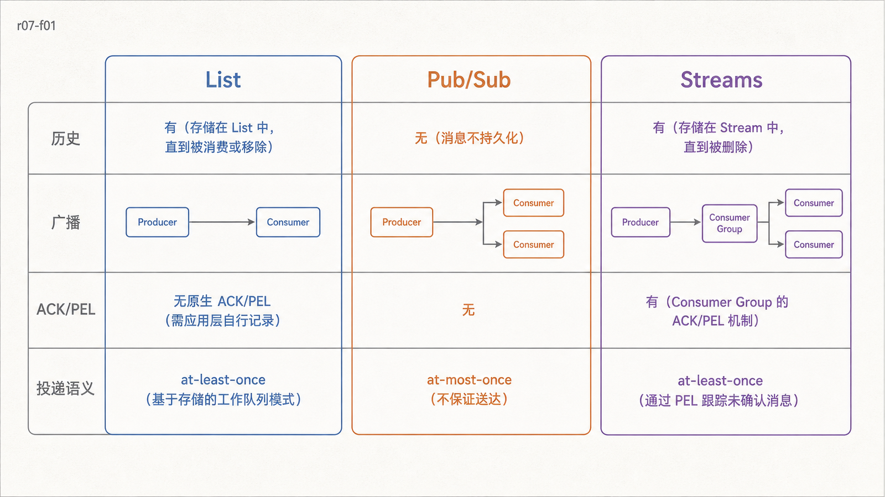
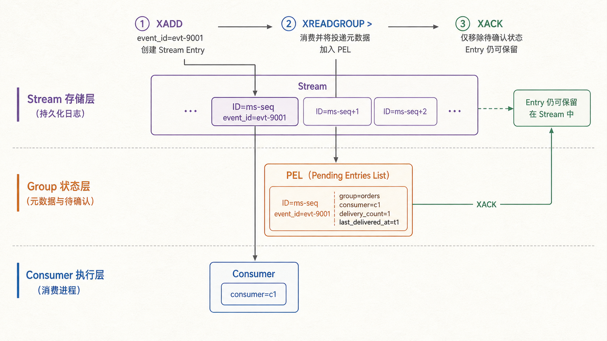
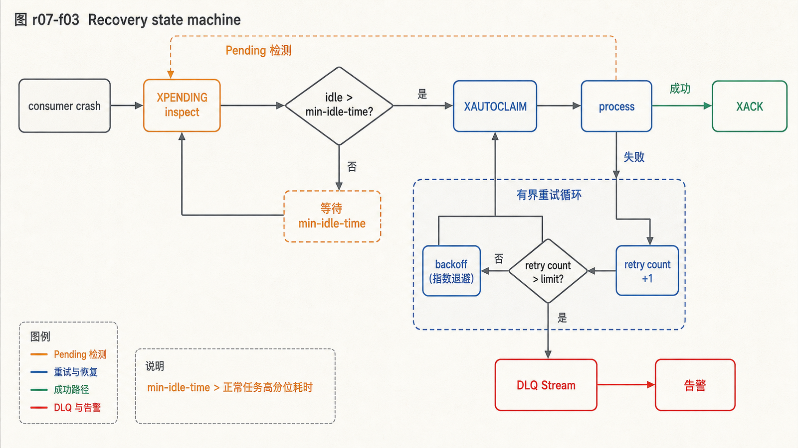

## 前置知识与学习目标

你应理解 List、Sorted Set、TTL、Lua 与幂等请求 ID。本文不把“放入 Redis 的列表”自动等同于可靠消息系统。

读完后，你应该能够：

- 根据是否需要广播、历史、ACK、重投和消费组选择 List、Pub/Sub 或 Streams；
- 解释 Streams 的 entry ID、consumer group、PEL、`XACK` 和 `XAUTOCLAIM`；
- 实现至少一次投递下的幂等消费者，并规划裁剪和死信处理；
- 识别单 Stream 吞吐、异步复制和内存保留的边界。

## 真实场景：消息“发出”之后发生了什么

订单 9001 创建后，`shop-api` 要触发库存、通知和分析。若消费者在处理到一半时崩溃，系统需要知道消息是否仍可找到、由谁处理、是否已经确认，以及重试会不会重复扣库存。

因此先定义投递语义：

- **at-most-once**：最多处理一次，故障时允许丢失；
- **at-least-once**：不轻易丢失，但可能重复，消费者必须幂等；
- **exactly-once effect**：通常需要消息系统与业务存储共同设计，不能由一次 `XACK` 自动获得。

## 三种模型的选择

<!-- figure-anchor:r07-a01 -->

<!-- figure-managed:r07-f01:start -->



<!-- figure-managed:r07-f01:end -->

| 模型            | 历史保留     | 广播                | ACK/待处理           | 典型语义             | 适合场景                  |
| --------------- | ------------ | ------------------- | -------------------- | -------------------- | ------------------------- |
| List + 阻塞弹出 | 弹出后不保留 | 否                  | 需自行设计处理中列表 | 取决于协议           | 简单、低成本工作队列      |
| Pub/Sub         | 不保留       | 是                  | 无                   | at-most-once         | 在线通知、可丢事件        |
| Streams         | 可保留并裁剪 | 多 group 可独立读取 | PEL、ACK、claim      | 常见为 at-least-once | 需要追踪和重投的任务/事件 |

Pub/Sub 订阅者断线期间的消息不会补发。List 使用 `BLPOP` 后进程崩溃会丢失已弹出的元素；可用 `BLMOVE` 把任务原子移到 processing List，再由确认逻辑删除，但超时回收、消费者归属和历史查询都要自行实现。

Streams 把这些状态变成服务器端概念，通常是可靠任务的优先起点。

## Streams 的对象与状态变化

<!-- figure-anchor:r07-a02 -->

<!-- figure-managed:r07-f02:start -->



<!-- figure-managed:r07-f02:end -->

```bash
XGROUP CREATE orders:{1001} inventory 0 MKSTREAM
XADD orders:{1001} MAXLEN ~ 100000 * \
  event_id evt-9001 type order.created order_id 9001 quantity 1
XREADGROUP GROUP inventory worker-1 COUNT 10 BLOCK 2000 \
  STREAMS orders:{1001} >
XACK orders:{1001} inventory 1710000000000-0
```

- Stream entry ID 形如 `milliseconds-sequence`，`*` 让 Redis 生成 ID。
- group 记录“下一个尚未分发的新消息”。
- `>` 表示读取从未投递给该 group 的新消息。
- 消息投递给 consumer 后进入 PEL（Pending Entries List）。
- `XACK` 只从该 group 的 PEL 移除引用，不必然删除 Stream 中的 entry。

一条 Stream 可有多个 group：库存组和通知组都能独立看到每个事件；同一 group 内多个 worker 分担消息。消费组不是 Kafka 分区，一条 Stream key 不会因为消费者增多就自动跨 Redis 分片。

## redis-py 最小消费者

```python
from __future__ import annotations

import socket

def ensure_group(r, stream: str, group: str) -> None:
    try:
        r.xgroup_create(stream, group, id="0", mkstream=True)
    except Exception as exc:
        if "BUSYGROUP" not in str(exc):
            raise

def consume_once(r, stream: str, group: str, handle) -> int:
    consumer = socket.gethostname()
    batches = r.xreadgroup(
        groupname=group,
        consumername=consumer,
        streams={stream: ">"},
        count=10,
        block=2000,
    )
    processed = 0
    for _, entries in batches:
        for message_id, fields in entries:
            handle(fields)  # 必须以 event_id 实现幂等
            acknowledged = r.xack(stream, group, message_id)
            if acknowledged != 1:
                raise RuntimeError(f"unexpected ACK result: {acknowledged}")
            processed += 1
    return processed
```

输入是 Stream、group 和业务处理函数；输出是本批已成功处理并 ACK 的数量。只有业务副作用确认成功后才能 ACK。若 `handle` 成功而 `XACK` 超时，消息可能再次投递，所以业务处理必须以 `event_id` 做唯一约束或条件更新。

不要用字符串匹配异常作为最终 group 初始化方案；生产代码应捕获 redis-py 的具体响应异常并检查错误码。这里保留短代码以突出消费状态机。

## 崩溃恢复、重投与死信

<!-- figure-anchor:r07-a03 -->

<!-- figure-managed:r07-f03:start -->



<!-- figure-managed:r07-f03:end -->

消费者崩溃后，消息留在 PEL。恢复流程：

1. 用 `XPENDING` 观察数量、消费者和空闲时间。
2. 超过业务可接受处理时长的消息，使用 `XAUTOCLAIM` 转移给健康消费者。
3. 增加投递计数；在退避后重试。
4. 超过上限时写入死信 Stream，并 ACK 原 group 消息。
5. 告警并保留可审计的失败原因。

`min-idle-time` 必须大于正常任务高分位耗时，否则健康消费者尚未完成时消息就被抢走。重投解决“无人继续处理”，不解决副作用幂等。

Redis 8.2 增加 `XACKDEL`、`XDELEX` 等多消费组引用控制；Redis 8.6 增加 Streams 幂等消息处理能力。使用前要确认服务器和客户端版本，不能把新版命令写进 7.x 的通用路径。

## 延时消息与顺序边界

Sorted Set 可用执行时间戳作 score，消费者通过 Lua 原子领取到期任务，再写入工作 Stream。它需要轮询、争抢、重试和时间源治理；延时精度与轮询间隔相关。

同一 Stream 的 entry ID 有顺序，但同一 group 的多个消费者并发处理会让完成顺序变化。若同一订单必须顺序执行，可以按实体选择多个 Stream key 或在业务侧用版本号拒绝乱序；不要假设 group 自动保持完成顺序。

## 保留、容量与故障语义

Stream 默认持续增长。`MAXLEN ~ N` 是近似裁剪，效率较高但不保证精确 N。保留策略应同时考虑：最大积压、最慢 group 的恢复窗口、审计需求和 Redis 内存预算。

Streams 与其他 Redis 数据一样依赖持久化和异步复制。主节点确认后立即故障仍可能丢失尚未持久化/复制的消息。需要更强耐久性、大规模分区、长期历史或跨地域日志时，应评估专用消息/日志平台。

## 最小验收指标

- 生产速率、消费速率和 lag；
- 每个 group 的 PEL 数量与最老消息空闲时间；
- 处理成功率、重试次数、死信数量；
- 端到端延迟，而不只是 `XADD` 延迟；
- Stream 长度、内存、裁剪量和故障恢复时间。

## 常见误区与适用边界

- Pub/Sub 不保存离线消息，不能承担必须送达的任务。
- `XREADGROUP` 返回消息不等于处理完成，必须在副作用成功后 `XACK`。
- ACK 不等于 exactly-once；ACK 超时或消费者崩溃都会产生重复窗口。
- 消费者数量增加不等于单 Stream 自动分片。
- 不设裁剪和死信策略会把可靠性问题转成内存问题。

## 本篇自检

<details>
<summary>1. 为什么通知在线 WebSocket 客户端可以用 Pub/Sub，而扣库存不适合？</summary>

在线通知允许断线期间丢失；扣库存需要追踪、重试和幂等。Pub/Sub 是 at-most-once，没有历史和 ACK。

</details>

<details>
<summary>2. 消息进入 PEL 表示什么？</summary>

表示它已投递给某个 consumer，但该 group 尚未 ACK。它可能正在处理、处理失败或消费者已崩溃。

</details>

<details>
<summary>3. 为什么 `XACK` 超时后不能假设消息未确认？</summary>

服务端可能已经执行 ACK，只是响应丢失；反之也可能未执行。业务副作用和确认都要容忍重复观察，并通过幂等状态判断。

</details>

## 本篇总结

消息选型先看投递语义：Pub/Sub 面向可丢广播，List 适合简单队列，Streams 用历史、消费组、PEL、ACK 和 claim 支撑可追踪的至少一次处理。可靠消费的终点仍是业务幂等、保留策略和故障演练。

## 下一篇衔接

消息和缓存都依赖单节点可用性。下一篇解释主节点如何用 replication ID、offset 和 backlog 同步副本，以及 Sentinel 如何检测故障并让客户端发现新主节点。

## 资料来源

- [Redis Streams](https://redis.io/docs/latest/develop/data-types/streams/)
- [Redis Pub/Sub](https://redis.io/docs/latest/develop/pubsub/)
- [Redis streaming use case](https://redis.io/docs/latest/develop/use-cases/streaming/)
- [Redis job queue with redis-py](https://redis.io/docs/latest/develop/use-cases/job-queue/redis-py/)
