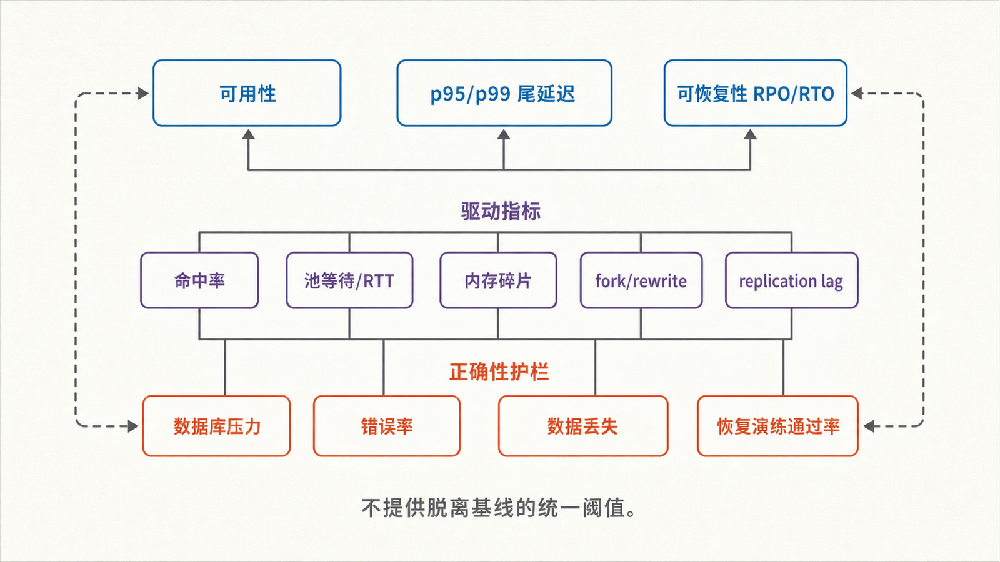
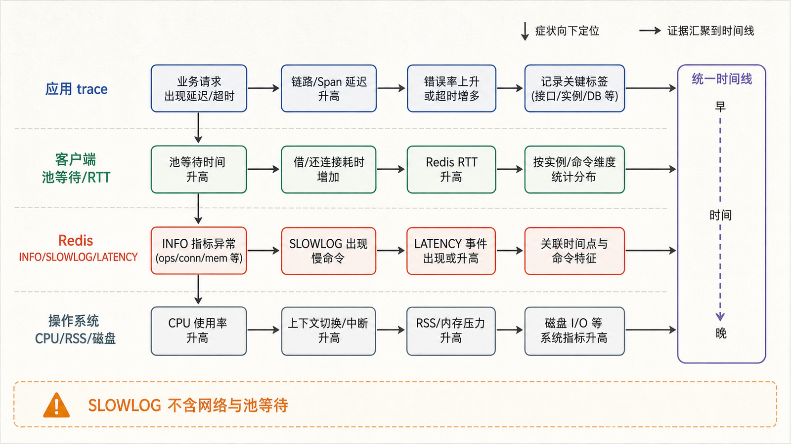
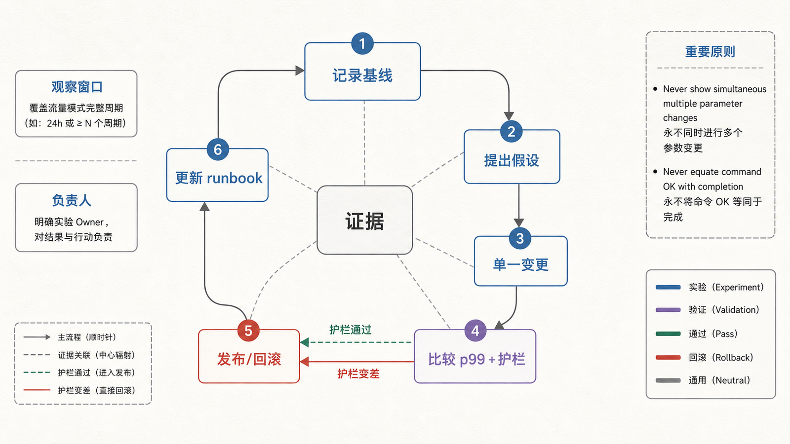

## 前置知识与学习目标

本文是系列收束篇。你应理解前九篇的键、TTL、客户端、缓存、持久化、原子操作、锁、Streams、复制和 Cluster 边界。

读完后，你应该能够：

- 用少量结果 KPI、驱动指标和护栏定义 Redis 服务健康，而不是堆叠仪表盘；
- 从内存、延迟、连接、持久化和复制证据定位风险；
- 用 ACL、网络隔离和 TLS 建立最小权限，而不是只设置一个全局密码；
- 执行有回滚、可验证的变更与恢复演练，并写出最小运行手册。

## 真实场景：命中率 98%，用户仍然超时

`shop-api` 的缓存命中率看起来很好，但商品接口 p99 突然升高。Redis CPU 不高，团队准备扩大连接池。进一步检查发现 AOF 重写叠加大键删除，连接池等待和数据库回源又放大了尾延迟。

运维不能从一个漂亮指标直接跳到调参。需要先定义用户结果，再用可操作的驱动指标定位，并用正确性、下游压力和成本作护栏。

## 运维 KPI 框架

<!-- figure-anchor:r10-a01 -->

<!-- figure-managed:r10-f01:start -->



<!-- figure-managed:r10-f01:end -->

建议保留 3 个结果指标：

| 结果 KPI | 定义                                       | 决策用途                             |
| -------- | ------------------------------------------ | ------------------------------------ |
| 可用性   | 成功完成的业务 Redis 操作 / 合法操作总数   | 是否发布、故障切流、容量扩展         |
| 尾延迟   | 按命令类别和业务拆分的 p95/p99 端到端耗时  | 定位用户超时和排队，不被均值掩盖     |
| 可恢复性 | 最近一次恢复演练的 RPO、RTO 与不变量通过率 | 判断备份、复制和运行手册是否真的可用 |

驱动指标包括池等待、连接错误、缓存回源、`used_memory`、RSS、淘汰、过期、大键、慢日志、fork、AOF/RDB 状态、复制 offset 差、PEL 积压和槽位负载。

护栏包括业务错误率、陈旧数据/重复处理、权威数据库 QPS、网络与磁盘成本。不要用统一静态阈值替代基线：阈值应来自容量上限、SLO、峰值负载和演练结果。

## 证据采集顺序

<!-- figure-anchor:r10-a02 -->

<!-- figure-managed:r10-f02:start -->



<!-- figure-managed:r10-f02:end -->

先确认影响范围和时间线，再按层收集：

```bash
redis-cli PING
redis-cli INFO server
redis-cli INFO clients
redis-cli INFO memory
redis-cli INFO stats
redis-cli INFO persistence
redis-cli INFO replication
redis-cli SLOWLOG GET 20
redis-cli LATENCY LATEST
redis-cli LATENCY DOCTOR
redis-cli MEMORY STATS
```

`MONITOR` 会输出所有命令并显著增加开销与敏感信息风险，不应作为生产常规观测。`KEYS *` 会扫描整个键空间；盘点使用带 `COUNT` 的 `SCAN`，并控制频率。

## 内存：数据、开销和碎片必须一起看

`used_memory` 是 Redis 分配器统计，进程 RSS 还受碎片、COW 和操作系统影响。常用比值：

```text
fragmentation ratio ≈ used_memory_rss / used_memory
```

比值升高可能来自碎片，也可能只是数据集很小时的固定开销；不能看到一个比值就重启。结合 `used_memory_peak`、`mem_fragmentation_bytes`、分配器字段、写入/删除模式和操作系统 RSS 判断。

容量预算至少包含：数据、键/对象开销、复制 backlog、客户端缓冲、AOF/复制缓冲、fork/COW 峰值和安全余量。配置 `maxmemory` 时不能把机器全部内存交给数据集。

大键识别可在低峰使用 `redis-cli --bigkeys` 的渐进扫描；LFU 策略下可辅助使用 `--hotkeys`。扫描本身也有成本，结果要与业务访问指标交叉验证。

## 延迟：找事件，不只找慢命令

Redis 延迟可能来自慢命令、大响应、Lua、fork、COW、AOF fsync、磁盘抖动、CPU 抢占、网络 RTT 或客户端池等待。`SLOWLOG` 记录服务端执行时间，不包含网络和客户端排队，因此端到端慢而 SLOWLOG 为空并不矛盾。

<!-- figure-anchor:r10-a03 -->

<!-- figure-managed:r10-f03:start -->



<!-- figure-managed:r10-f03:end -->

排障最小闭环：

1. 用应用 trace 确定慢的是连接获取、网络还是命令。
2. 对齐 `LATENCY` 事件、SLOWLOG、持久化和系统指标时间线。
3. 找到一个可控变量，在预生产复现实验。
4. 一次只改一个参数，比较 p99 与正确性护栏。
5. 无改善或护栏变差就回滚。

## 客户端与背压

监控 `connected_clients`、`blocked_clients`、`rejected_connections`、输入/输出缓冲和应用池等待。连接数接近 `maxclients` 只是容量信号；简单扩大上限可能耗尽文件描述符或放大故障并发。

超时应分层且总预算递减：连接超时 < Redis 命令预算 < 上游 HTTP 预算。重试需要指数退避、随机抖动、次数上限和幂等条件。Redis 故障时还要限制数据库回源，避免缓存雪崩把权威源拖垮。

## 安全：网络边界 + TLS + ACL

Redis 不应暴露到公网。生产至少组合：私有网络/防火墙、TLS、ACL 最小权限、凭据轮换和审计。

以下是 ACL 文件示意，不要把占位 secret 原样使用：

```conf
user default off
user shop-api reset on >SECRET_FROM_VAULT \
  ~product:* ~stock:* ~orders:* \
  +get +mget +set +del +expire +pttl \
  +xadd +xreadgroup +xack +xpending
```

应用账户不应拥有 `CONFIG`、`ACL`、`FLUSHALL`、`DEBUG` 等管理命令。ACL 规则是累加应用的，变更用户前要了解 `reset` 语义并在测试环境验证。命令重命名不是 ACL 的替代品。

## 备份、恢复与变更门禁

前文已解释 RDB/AOF、复制和 Cluster，本篇只保留运维责任：

- 备份跨独立故障域保存，包含数据、配置、ACL、版本和校验和；
- 定期从只读副本恢复到隔离环境，验证 RPO、RTO 和业务不变量；
- 变更前记录基线、影响范围、回滚条件和负责人；
- 滚动操作先验证副本健康、复制积压和容量余量；
- 变更后比较 KPI 和护栏，不以“命令返回 OK”作为完成标准。

配置在线修改与文件状态可能不同。使用版本化配置和自动化部署；若确需 `CONFIG SET`，明确是否 `CONFIG REWRITE`、配置文件是否可写，以及重启后的真实值。

## 示例运行手册：内存快速上升

```text
触发：used_memory 在 10 分钟内持续上升，预测 30 分钟内触达容量门槛。
确认：业务错误率、evicted_keys、写入 QPS、RSS、复制/AOF 状态。
定位：按命名空间抽样 SCAN；检查 bigkeys、TTL 覆盖、客户端输出缓冲。
止损：限制异常写入方；必要时按预案扩容/迁槽；保护数据库回源。
禁止：直接 FLUSHALL、生产 KEYS *、无证据重启、同时修改多项内存参数。
恢复：指标回到基线并持续一个观察窗口；验证关键业务不变量。
复盘：记录根因、检测缺口、容量模型与自动化修复项。
```

运行手册中的阈值必须替换为本系统数据，且每季度或重大版本变更后演练。

## 常见误区与适用边界

- 命中率高不代表用户延迟和数据正确性好。
- SLOWLOG 空不代表 Redis 路径不慢，它不含网络和客户端排队。
- 增大 `maxclients`、`maxmemory` 或超时不是无条件优化。
- `requirepass` 只围绕 default 用户，不能替代 ACL 最小权限。
- 没有恢复演练的备份只是“存在的文件”，不是已验证恢复能力。

## 本篇自检

<details>
<summary>1. 为什么结果 KPI 不直接使用 connected_clients？</summary>

连接数是驱动/容量指标，升降本身不代表用户价值。可用性、尾延迟和可恢复性才直接影响服务决策。

</details>

<details>
<summary>2. 应用 p99 很高但 SLOWLOG 为空，下一步看什么？</summary>

看客户端池等待、网络 RTT、连接建立、响应体积，并对齐 LATENCY、持久化和系统调度事件；SLOWLOG 只统计服务端命令执行阶段。

</details>

<details>
<summary>3. 为什么备份恢复后还要验证 TTL？</summary>

键存在不代表业务状态正确。TTL 异常可能让旧数据长期保留，或让大量键同时过期并触发回源雪崩。

</details>

## 本篇总结

Redis 生产运维是一个证据闭环：用可用性、尾延迟和可恢复性定义结果，以内存、连接、持久化、复制和积压解释变化，再用业务正确性与下游压力约束优化。ACL、备份恢复和有回滚的变更流程与性能指标同等重要。

## 下一篇衔接

系列到此完成，没有下一篇概念文章。建议把 `shop-api` 示例落到隔离测试环境，建立基准负载，依次演练缓存失效、AOF 重写、消费者崩溃、主节点故障和 Cluster 迁槽，并把实际阈值回填到运行手册。

## 资料来源

- [Redis administration](https://redis.io/docs/latest/operate/oss_and_stack/management/admin/)
- [Redis ACL](https://redis.io/docs/latest/operate/oss_and_stack/management/security/acl/)
- [TLS](https://redis.io/docs/latest/operate/oss_and_stack/management/security/encryption/)
- [Redis latency monitoring](https://redis.io/docs/latest/operate/oss_and_stack/management/optimization/latency-monitor/)
- [Redis memory optimization](https://redis.io/docs/latest/operate/oss_and_stack/management/optimization/memory-optimization/)
