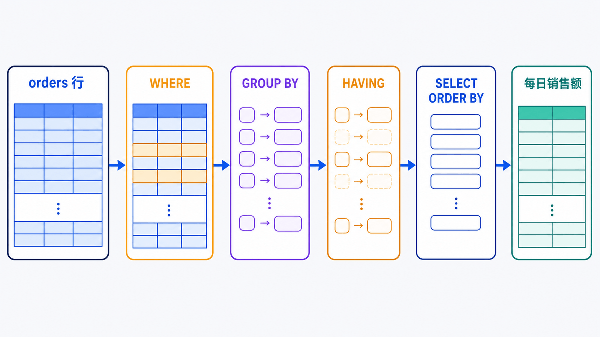

> 单表查询的核心不是背关键字，而是预测每个子句如何改变结果集的列、行数、分组和顺序。

## 前置知识与学习目标

本篇使用前文创建的 `shop_lab.orders`。完成后你应该能够：

- 用明确列清单定义结果形状；
- 正确处理比较、范围、模式和 `NULL` 三值逻辑；
- 区分行级过滤 `WHERE` 与分组后过滤 `HAVING`；
- 构造稳定排序和可复现的基础分页；
- 用预期行数和聚合不变量验证查询。

子查询、多表关联、索引和深分页分别留给后续文章。

## 从一个真实问题开始

<!-- figure:s05-f01:start -->



<!-- figure:s05-f01:end -->

产品经理想知道：“2026 年 7 月已支付或已发货的订单中，每天销售额是多少？只显示销售额至少 500 元的日期，并按金额从高到低排列。”

最终查询是：

```sql
SELECT
    DATE(created_at) AS order_date,
    COUNT(*) AS order_count,
    SUM(total_amount) AS sales_amount
FROM orders
WHERE status IN ('paid', 'shipped')
  AND created_at >= '2026-07-01'
  AND created_at < '2026-08-01'
GROUP BY DATE(created_at)
HAVING SUM(total_amount) >= 500
ORDER BY sales_amount DESC, order_date ASC;
```

先不要把它当成一个整体。下面逐步观察结果形状如何变化。

## 投影：明确需要哪些列

```sql
SELECT id, customer_id, status, total_amount, created_at
FROM orders;
```

投影决定输出列。稳定接口应避免 `SELECT *`：表新增列会改变结果形状，也可能读取大字段、增加网络传输和覆盖索引难度。

表达式可以产生派生列：

```sql
SELECT
    id,
    total_amount,
    ROUND(total_amount * 0.06, 2) AS estimated_fee
FROM orders;
```

别名描述输出，不会修改原表。金额计算仍要明确舍入规则，示例中的 6% 只是演示输入。

## WHERE：在分组前筛选行

```sql
SELECT id, status, total_amount
FROM orders
WHERE status IN ('paid', 'shipped')
  AND total_amount BETWEEN 200 AND 700;
```

`BETWEEN 200 AND 700` 包含两个边界。时间范围更推荐“左闭右开”：

```sql
WHERE created_at >= '2026-07-01'
  AND created_at < '2026-08-01'
```

它不会遗漏月末带时分秒的数据，也能自然衔接下一个月。

### NULL 是第三种逻辑状态

SQL 条件结果可能是 `TRUE`、`FALSE` 或 `UNKNOWN`。`WHERE` 只保留 `TRUE`：

```sql
-- 正确
SELECT * FROM orders WHERE shipped_at IS NULL;

-- 错误：与 NULL 比较得到 UNKNOWN
SELECT * FROM orders WHERE shipped_at = NULL;
```

`NOT IN` 列表或子查询中只要混入 `NULL`，也可能让结果变成 `UNKNOWN`。排除关联记录时通常优先使用 `NOT EXISTS`，将在多表查询篇展开。

### LIKE 只匹配文本模式

```sql
SELECT id, status
FROM orders
WHERE status LIKE 'ship%';
```

`%` 匹配任意长度，`_` 匹配一个字符。前导通配符如 `'%paid'` 常使普通 B+Tree 索引难以用于前缀定位；正确性和性能要分别验证。

## GROUP BY：把多行折叠成组

```sql
SELECT
    status,
    COUNT(*) AS order_count,
    SUM(total_amount) AS total,
    AVG(total_amount) AS average_amount
FROM orders
GROUP BY status;
```

`COUNT(*)` 计行，`COUNT(column)` 只计该列非 `NULL` 的行。聚合前后要验证不变量：各状态的 `order_count` 之和应等于原表行数。

`WHERE` 与 `HAVING` 的职责不同：

```sql
SELECT customer_id, SUM(total_amount) AS customer_total
FROM orders
WHERE status IN ('paid', 'shipped')
GROUP BY customer_id
HAVING SUM(total_amount) >= 500;
```

- `WHERE` 在分组前排除未成交订单；
- `HAVING` 在分组后排除累计金额不足的客户。

能在分组前过滤的条件通常应放在 `WHERE`，既符合语义，也减少后续处理的数据。

## ORDER BY：没有排序就没有“前十”

```sql
SELECT id, total_amount, created_at
FROM orders
ORDER BY created_at DESC, id DESC
LIMIT 10;
```

只按 `created_at` 排序时，同一秒创建的订单顺序不确定。追加唯一的 `id` 作为 tie-breaker，才能得到稳定顺序。`LIMIT 10` 没有 `ORDER BY` 只表示“任意十行”，不能称为最新十行。

MySQL 支持两种写法：

```sql
LIMIT 10 OFFSET 20;
LIMIT 20, 10;
```

两者都是跳过 20 行后取 10 行。小数据或浅页可以使用；深页会扫描并丢弃大量候选行，第 9 篇会比较替代方案。

## 最小验证清单

对重要查询至少核对：

1. 输入范围：时区、边界和状态集合是否明确；
2. 结果形状：列名、类型和行粒度是订单还是分组；
3. 行数守恒：分组计数之和能否解释原始行；
4. 金额守恒：明细和汇总的总额是否一致；
5. 排序稳定：是否包含唯一 tie-breaker；
6. 空值语义：`NULL` 是否被正确纳入或排除。

## 常见误区和适用边界

- `DISTINCT` 是对整个投影行去重，不是“只对某一列去重后随便带出其他列”。
- `HAVING` 不是 `WHERE` 的通用替代品。
- `ORDER BY 1` 虽短，但列顺序变化会悄悄改变语义；教学和长期维护代码优先写列名。
- `LIMIT` 只限制返回行，不自动降低前面过滤、分组或排序的全部成本。
- 报表金额应明确是否包含取消、退款和时区换日；SQL 正确不代表指标定义正确。

## 自检题

1. `COUNT(*)` 和 `COUNT(shipped_at)` 为什么可能不同？
2. 为什么按时间倒序分页还要追加 `id DESC`？
3. “只统计已支付订单”应放在 `WHERE` 还是 `HAVING`？

<details>
<summary>查看答案</summary>

1. 前者统计所有行，后者忽略 `shipped_at IS NULL` 的行。
2. 同一时间可能有多行，唯一 ID 能消除并列顺序的不确定性。
3. 它是分组前的行级条件，应放在 `WHERE`；分组累计金额阈值才放在 `HAVING`。

</details>

## 本篇总结

单表查询是一条结果塑形管线：先定义输入行，再分组聚合，最后投影、排序和截取。每一步都应能解释结果的粒度、行数和边界。

## 下一篇衔接

为什么 `SELECT` 中的别名可以在 `ORDER BY` 使用，却不能直接在 `WHERE` 使用？下一篇用逻辑处理顺序解释这个问题，并区分教学顺序与优化器的物理执行计划。

## 资料来源

- [SELECT Statement](https://dev.mysql.com/doc/refman/8.4/en/select.html)
- [Problems with NULL Values](https://dev.mysql.com/doc/refman/8.4/en/problems-with-null.html)
- [Aggregate Function Descriptions](https://dev.mysql.com/doc/refman/8.4/en/aggregate-functions.html)
- [LIMIT Query Optimization](https://dev.mysql.com/doc/refman/8.4/en/limit-optimization.html)
