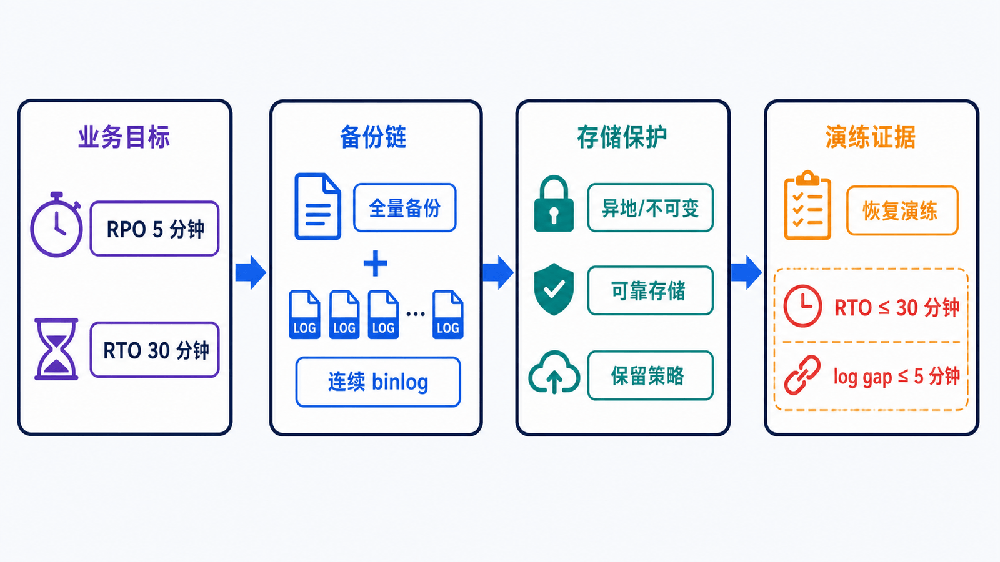
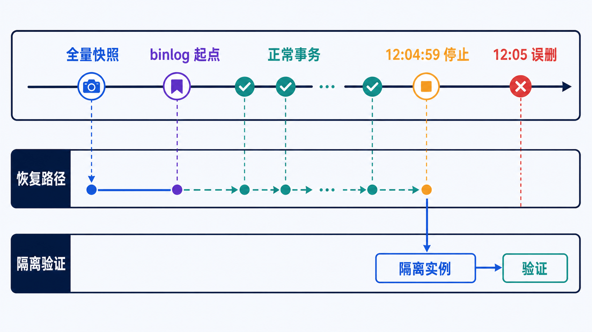

> 备份文件存在不代表数据可恢复。只有恢复链完整、校验通过，并在目标时间内演练成功，备份才具有业务价值。

## 前置知识与学习目标

请先理解 InnoDB 事务、二进制日志和客户端工具职责。完成本篇后，你应该能够：

- 用 RPO 与 RTO 反推备份频率和恢复方式；
- 区分逻辑备份、物理备份、快照和 binlog 的一致性边界；
- 在隔离实例执行“全量 + binlog”的时间点恢复；
- 为校验、加密、保留、异地副本和恢复演练建立验收证据。

## 先定义恢复目标

<!-- figure:s11-f01:start -->



<!-- figure:s11-f01:end -->

- **RPO（Recovery Point Objective）**：最多能丢失多长时间的数据。例如 RPO 5 分钟意味着备份链和 binlog 传输不能留下超过 5 分钟的缺口。
- **RTO（Recovery Time Objective）**：故障发生后，服务最多多久恢复。例如 RTO 30 分钟要求恢复、校验、切流和回滚都在窗口内完成。

假设 `shop_lab` 的目标是 RPO 5 分钟、RTO 30 分钟。仅每天一次 `mysqldump` 最坏会丢 24 小时数据，显然不达标。需要全量基线、连续 binlog、异地保留和可在 30 分钟内完成的恢复方式。

## 备份类型与适用边界

| 类型     | 内容                 | 优点                         | 主要边界                                     |
| -------- | -------------------- | ---------------------------- | -------------------------------------------- |
| 逻辑备份 | SQL 或逻辑对象/行    | 可读、跨平台、便于选择性恢复 | 大库恢复慢；一致性与 DDL 需控制              |
| 物理备份 | 数据页与日志文件     | 大库备份恢复快               | 与版本、平台和工具兼容性更强绑定             |
| 存储快照 | 块设备/卷时间点      | 创建快、适合大数据量         | 必须保证应用一致性，单独快照不是完整恢复流程 |
| binlog   | 全量备份后的变更事件 | 支持时间点恢复、缩小 RPO     | 依赖完整连续的日志、起点和时间/位置          |

复制副本会同步误删、错误 DDL 和逻辑损坏，因此**复制不是备份**。

## 小型 InnoDB 库的逻辑备份

```bash
mysqldump \
  --single-transaction \
  --routines \
  --events \
  --triggers \
  --set-gtid-purged=OFF \
  -u backup_user -p \
  shop_lab > shop_lab-full.sql
```

`--single-transaction` 在 InnoDB 上建立一致性快照，避免长时间全局读锁，但备份期间的 DDL 可能破坏一致性；非事务表也不受同样保证。备份账户只授予工具需要的权限，凭据不写在命令行。

导出后立即记录元数据和校验：

```bash
sha256sum shop_lab-full.sql > shop_lab-full.sql.sha256
```

还应保存：MySQL 版本、备份开始/结束时间、GTID 或 binlog 起点、命令参数、对象清单、文件大小、校验和与保留到期时间。

大库优先评估 MySQL Shell 并行 dump/load 或经过验证的物理备份工具，而不是把单线程 dump 命令无限扩展。

## 时间点恢复：先全量，再重放到错误之前

<!-- figure:s11-f02:start -->



<!-- figure:s11-f02:end -->

场景：12:05 误删订单，希望恢复到 12:04:59。流程必须在**隔离实例**完成：

1. 创建与源版本兼容的新实例；
2. 校验并恢复最近一次全量备份；
3. 定位备份对应的 binlog 起点；
4. 检查日志时间、位置或 GTID，确定误操作边界；
5. 只重放目标边界之前的事件；
6. 验证约束、行数、金额和关键业务查询；
7. 决定导出修复数据还是执行受控切换。

示意命令：

```bash
mysql -u root -p shop_lab < shop_lab-full.sql

mysqlbinlog \
  --start-position=START_POS \
  --stop-datetime='2026-07-15 12:04:59' \
  binlog.000123 binlog.000124 \
  | mysql -u root -p
```

时间受服务器时区和日志解释影响，位置/GTID 边界通常更精确。正式恢复前先把 `mysqlbinlog` 输出到文件审查误删事件，不能把未知日志直接管道进生产。

## 恢复演练才是行为测试

每次演练至少验证：

```sql
CHECK TABLE customers, products, orders, order_items;

SELECT COUNT(*) FROM orders;
SELECT SUM(total_amount)
FROM orders
WHERE status IN ('paid', 'shipped');

SELECT COUNT(*) AS mismatched_orders
FROM orders AS o
JOIN (
    SELECT order_id, SUM(quantity * unit_price) AS items_total
    FROM order_items
    GROUP BY order_id
) AS i ON i.order_id = o.id
WHERE o.total_amount <> i.items_total;
```

同时记录实际恢复耗时，拆分为取回备份、解密、恢复、重放、校验和切流。若总耗时超过 RTO，备份即使完整也不达标。

## 保留与防破坏设计

推荐至少覆盖：

- 多个恢复点，而不是每天覆盖同一文件；
- 与生产账户隔离的存储权限；
- 异地或不同故障域副本；
- 传输和静态加密，密钥与备份分离；
- 对象锁/WORM 或不可变保留，抵御误删和勒索软件；
- 自动校验与定期人工恢复演练；
- 到期删除和敏感数据合规流程。

总体预算应包括全量文件、binlog 增长、校验文件、跨区域副本和恢复临时空间。

## 常见误区和适用边界

- 在线复制数据目录可能得到不一致文件集合；物理备份必须使用支持在线一致性的工具或正确停库流程。
- `mysqldump` 成功退出不代表所有对象、字符集和权限都符合恢复要求。
- binlog 只有连续文件，没有与全量备份对应的起点仍无法可靠 PITR。
- 在原实例直接“试恢复”会覆盖证据和扩大事故。
- 只恢复表结构或抽样几行不能证明 RTO/RPO 达标。

## 自检题

1. 每天一次全量备份能满足 5 分钟 RPO 吗？
2. 为什么复制副本不能替代备份？
3. PITR 为什么必须知道全量备份对应的日志起点？

<details>
<summary>查看答案</summary>

1. 不能；最坏可能丢失接近一天的数据，需要连续 binlog 等增量链。
2. 误删和逻辑错误会被复制；副本也可能受同一凭据、故障域或操作影响。
3. 过早重放会重复事务，过晚开始会缺失事务；起点把全量快照与后续事件连接成连续恢复链。

</details>

## 本篇总结

备份策略从业务恢复目标开始，以隔离恢复成功结束。全量、binlog、校验、异地保留、不可变性和演练缺一不可。

## 下一篇衔接

下一篇在“单实例可恢复”之上讨论服务连续性：GTID 复制、复制延迟、InnoDB Cluster、MySQL Router 和读后写一致性。

## 资料来源

- [Database Backup Methods](https://dev.mysql.com/doc/refman/8.4/en/backup-methods.html)
- [Using mysqldump for Backups](https://dev.mysql.com/doc/refman/8.4/en/using-mysqldump.html)
- [Point-in-Time (Incremental) Recovery](https://dev.mysql.com/doc/refman/8.4/en/point-in-time-recovery.html)
- [MySQL Shell Dump and Load Utilities](https://dev.mysql.com/doc/mysql-shell/8.4/en/mysql-shell-utilities-dump-instance-schema.html)
