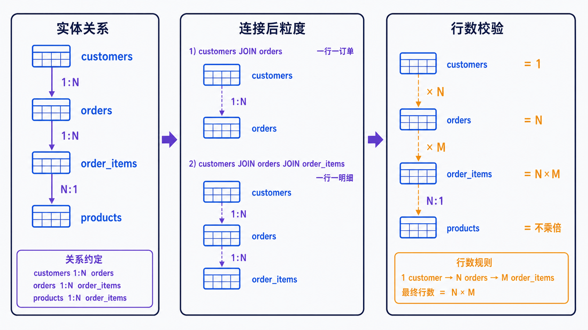
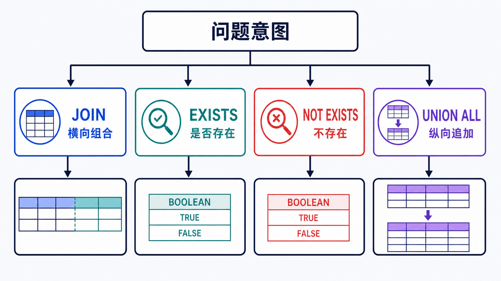

> 多表查询最危险的错误往往没有报错：连接条件少一列，结果行数悄悄放大，汇总金额也随之翻倍。

## 前置知识与学习目标

请先理解主外键、`NULL` 和 SELECT 逻辑处理顺序。完成本篇后，你应该能够：

- 在写 JOIN 前声明每一侧的行粒度和连接基数；
- 正确选择 `INNER JOIN`、`LEFT JOIN`、`EXISTS`、`NOT EXISTS` 或 `UNION ALL`；
- 识别一对多连接导致的重复计数；
- 用行数、唯一键和金额守恒验证连接结果。

## 写 JOIN 前先写“连接合同”

<!-- figure:s07-f01:start -->



<!-- figure:s07-f01:end -->

`shop_lab` 的关系是：

- 一个客户有多张订单：`customers 1 -> N orders`；
- 一张订单有多条明细：`orders 1 -> N order_items`；
- 一个商品可出现在多条明细：`products 1 -> N order_items`。

查询“订单头 + 客户名”时，目标粒度仍是一行一订单：

```sql
SELECT
    o.id AS order_id,
    c.display_name AS customer_name,
    o.status,
    o.total_amount
FROM orders AS o
INNER JOIN customers AS c
    ON c.id = o.customer_id;
```

连接合同是：`orders.customer_id` 每行非空，匹配 `customers.id` 唯一键。因此每张合法订单恰好匹配一个客户，结果行数应等于订单数。

## INNER JOIN 与 LEFT JOIN

`INNER JOIN` 只保留匹配行，适合“必须有关联”的问题。`LEFT JOIN` 保留左侧全部行，右侧无匹配时补 `NULL`：

```sql
SELECT
    c.id,
    c.display_name,
    COUNT(o.id) AS order_count
FROM customers AS c
LEFT JOIN orders AS o
    ON o.customer_id = c.id
GROUP BY c.id, c.display_name;
```

这里必须写 `COUNT(o.id)`，不能写 `COUNT(*)`。没有订单的客户也会产生一条 `NULL` 扩展行，`COUNT(*)` 会错误地计为 1。

### ON 与 WHERE 会改变外连接语义

保留所有客户、只统计已支付订单：

```sql
SELECT c.id, COUNT(o.id) AS paid_order_count
FROM customers AS c
LEFT JOIN orders AS o
    ON o.customer_id = c.id
   AND o.status = 'paid'
GROUP BY c.id;
```

若把 `o.status = 'paid'` 放到 `WHERE`，无订单客户的 `o.status` 为 `NULL`，会被过滤掉，LEFT JOIN 实际上退化成只保留匹配客户。

`RIGHT JOIN` 可以通过交换表顺序改写成 `LEFT JOIN`，统一团队阅读方向。MySQL 不支持原生 `FULL OUTER JOIN`。

## 一对多连接为什么会放大行数

查询订单明细时，一张订单会出现多行：

```sql
SELECT
    o.id AS order_id,
    p.sku,
    oi.quantity,
    oi.unit_price,
    oi.quantity * oi.unit_price AS line_amount
FROM orders AS o
JOIN order_items AS oi ON oi.order_id = o.id
JOIN products AS p ON p.id = oi.product_id
ORDER BY o.id, oi.id;
```

这是正确的“一行一明细”粒度。但如果同时 `SUM(o.total_amount)`，订单头金额会按明细数重复。应选择其一：

- 直接按订单头汇总 `orders.total_amount`；
- 或按明细计算 `SUM(quantity * unit_price)`；
- 先在子查询中聚合明细到一行一订单，再连接订单头。

```sql
SELECT
    o.id,
    o.total_amount AS header_total,
    i.items_total
FROM orders AS o
JOIN (
    SELECT order_id, SUM(quantity * unit_price) AS items_total
    FROM order_items
    GROUP BY order_id
) AS i ON i.order_id = o.id;
```

`header_total = items_total` 是当前模型的重要校验不变量。

## EXISTS 表达“是否存在”

<!-- figure:s07-f02:start -->



<!-- figure:s07-f02:end -->

只想知道客户是否有订单时，不需要把订单行连接出来：

```sql
SELECT c.id, c.display_name
FROM customers AS c
WHERE EXISTS (
    SELECT 1
    FROM orders AS o
    WHERE o.customer_id = c.id
      AND o.status IN ('paid', 'shipped')
);
```

查没有订单的客户使用 `NOT EXISTS`：

```sql
SELECT c.id, c.display_name
FROM customers AS c
WHERE NOT EXISTS (
    SELECT 1
    FROM orders AS o
    WHERE o.customer_id = c.id
);
```

它比 `NOT IN (subquery)` 更不容易受到子查询结果中 `NULL` 的三值逻辑影响。优化器可能把 `IN`/`EXISTS` 改写成半连接或物化；语法选择先服务于正确语义，再看计划。

## UNION ALL 合并同形结果

`UNION ALL` 纵向拼接列数和兼容类型一致的结果，不去重：

```sql
SELECT id, created_at, 'order' AS event_type
FROM orders
UNION ALL
SELECT id, created_at, 'customer' AS event_type
FROM customers
ORDER BY created_at DESC, id DESC;
```

`UNION` 会额外去重，只有业务确实要求集合去重时才使用。它不是 JOIN：JOIN 横向组合关联列，UNION 纵向追加同形行。

如果确实要模拟全外连接，应明确重复语义：先 `LEFT JOIN` 得到全部左侧，再 `UNION ALL` 右侧未匹配行；不能机械地用两个外连接加 `UNION`，否则去重可能改变合法重复行。

## 连接结果的四项验证

1. **粒度**：结果是一行一客户、订单还是明细？
2. **上界**：一对一连接不应放大行数；一对多放大倍数是否可解释？
3. **缺失**：内连接丢掉了哪些外键缺失或过滤不匹配行？
4. **守恒**：订单金额、明细金额和计数在聚合前后是否一致？

可先运行：

```sql
SELECT COUNT(*) FROM orders;
SELECT COUNT(DISTINCT order_id) FROM order_items;
SELECT order_id, COUNT(*) AS item_count
FROM order_items
GROUP BY order_id;
```

再与连接结果比较，而不是只看前十行“长得合理”。

## 常见误区和适用边界

- 遗漏 `ON` 或写成恒真条件会产生笛卡尔积。
- 为消除重复盲目加 `DISTINCT` 会掩盖错误连接基数。
- `LEFT JOIN` 右表条件放入 `WHERE` 可能丢掉本想保留的左表行。
- `STRAIGHT_JOIN` 会限制优化器连接顺序，只在计划证据充分且有回归测试时考虑。
- 子查询不天然比 JOIN 慢；MySQL 可采用半连接、物化或合并等策略，应以计划和实测判断。

## 自检题

1. 为什么统计 LEFT JOIN 右表匹配数时用 `COUNT(o.id)` 而不是 `COUNT(*)`？
2. 一张订单三条明细，直接连接后 `SUM(o.total_amount)` 会发生什么？
3. 查“没有订单的客户”为什么优先使用 `NOT EXISTS`？

<details>
<summary>查看答案</summary>

1. 未匹配左行仍有一条结果，`COUNT(*)` 会计数；右表非空主键只在真实匹配时存在。
2. 订单头金额被重复三次，汇总结果放大。
3. `NOT EXISTS` 直接表达反连接语义，不会因子查询返回 `NULL` 而让谓词变成 UNKNOWN。

</details>

## 本篇总结

多表查询先定义粒度和基数，再选语法。正确性验证依赖唯一键、行数上界、缺失集合和金额守恒，而不是 `DISTINCT` 或肉眼抽样。

## 下一篇衔接

下一篇从查询形状反推复合索引，并用 `EXPLAIN`、`EXPLAIN ANALYZE` 和前后基线验证索引是否真正减少了扫描与排序成本。

## 资料来源

- [JOIN Clause](https://dev.mysql.com/doc/refman/8.4/en/join.html)
- [Subqueries with EXISTS or NOT EXISTS](https://dev.mysql.com/doc/refman/8.4/en/exists-and-not-exists-subqueries.html)
- [Optimizing Subqueries, Derived Tables, Views, and CTEs](https://dev.mysql.com/doc/refman/8.4/en/subquery-optimization.html)
- [UNION Clause](https://dev.mysql.com/doc/refman/8.4/en/union.html)
