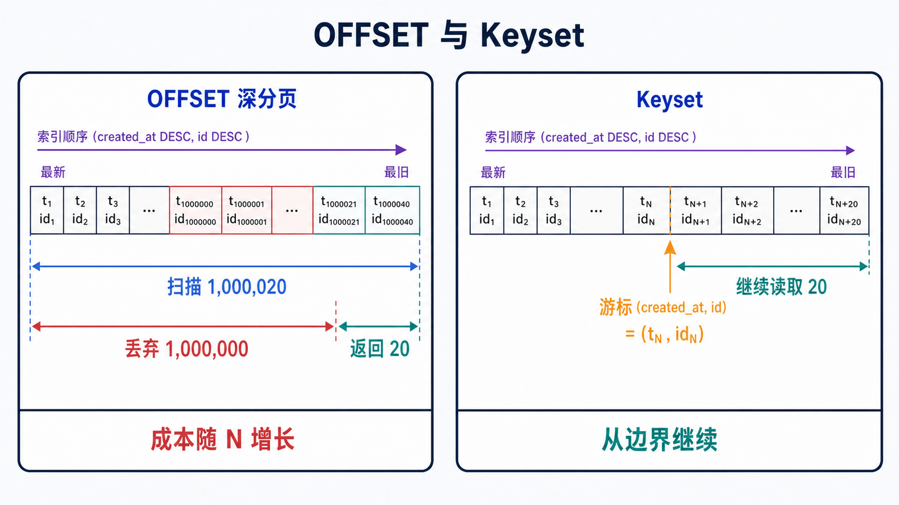
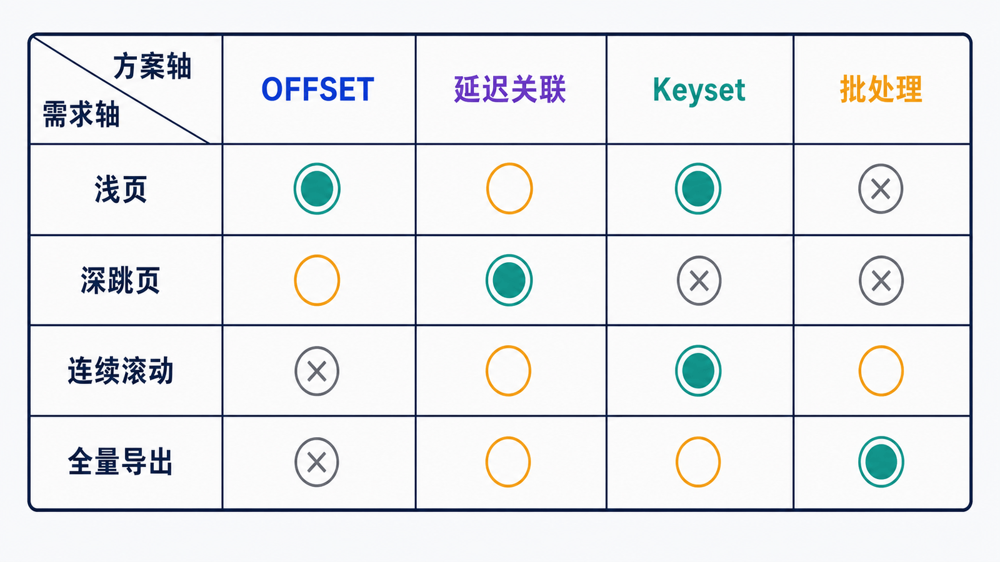

> 深分页慢的根因不是 `LIMIT`，而是数据库通常仍要找到、排序或扫描前面的大量候选行，再把它们丢弃。

## 前置知识与学习目标

请先掌握稳定排序、复合索引和 `EXPLAIN ANALYZE`。完成本篇后，你应该能够：

- 解释 OFFSET 深度增长时的扫描、回表和丢弃成本；
- 在随机跳页、连续滚动和批量导出之间选择方案；
- 用 `(created_at, id)` 构造无重复、少遗漏的 Keyset 分页；
- 识别数据并发变化、游标失效和非唯一排序的边界。

## 先定义分页语义

订单列表按以下稳定顺序展示：

```sql
ORDER BY created_at DESC, id DESC
```

对应索引：

```sql
CREATE INDEX idx_orders_created_id
ON orders (created_at DESC, id DESC);
```

`created_at` 可能重复，`id` 是唯一 tie-breaker。没有唯一稳定顺序，任何分页方法都可能在两次请求之间重复或遗漏行。

## OFFSET 为什么越翻越慢

<!-- figure:s09-f01:start -->



<!-- figure:s09-f01:end -->

```sql
SELECT id, customer_id, status, total_amount, created_at
FROM orders
ORDER BY created_at DESC, id DESC
LIMIT 20 OFFSET 1000000;
```

即使排序使用索引，数据库也通常要沿索引访问前 1,000,020 个位置，丢弃前 1,000,000 个，再返回 20 个。如果选择列不被索引覆盖，还可能产生大量回表。复杂过滤或无法利用索引排序时，成本更高。

用相同参数比较：

```sql
EXPLAIN ANALYZE
SELECT id, customer_id, status, total_amount, created_at
FROM orders
ORDER BY created_at DESC, id DESC
LIMIT 20 OFFSET 1000000;
```

观察实际读取行数，而不是只看最终返回 20 行。

## 方案一：浅页保留 OFFSET

后台管理界面只允许前几十页、数据量可控且产品需要明确页码时，OFFSET 简单且支持随机跳页：

```sql
SELECT id, customer_id, status, total_amount, created_at
FROM orders
ORDER BY created_at DESC, id DESC
LIMIT 20 OFFSET 40;
```

要设置最大页深、超限提示和总数缓存策略，不能让用户构造任意百万级 OFFSET。

## 方案二：延迟关联减少昂贵回表

如果必须跳到深页，可先只在窄索引上取得主键，再回表 20 次：

```sql
SELECT o.id, o.customer_id, o.status, o.total_amount, o.created_at
FROM orders AS o
JOIN (
    SELECT id
    FROM orders
    ORDER BY created_at DESC, id DESC
    LIMIT 20 OFFSET 1000000
) AS page ON page.id = o.id
ORDER BY o.created_at DESC, o.id DESC;
```

它可能显著降低宽行回表成本，但没有消除“跳过一百万个索引位置”。必须用执行计划验证优化器选择和实际收益。

## 方案三：Keyset/Seek 分页

第一页：

```sql
SELECT id, customer_id, status, total_amount, created_at
FROM orders
ORDER BY created_at DESC, id DESC
LIMIT 20;
```

假设最后一行为：

```text
created_at = 2026-07-10 09:30:00, id = 875421
```

下一页只查严格排在它后面的键：

```sql
SELECT id, customer_id, status, total_amount, created_at
FROM orders
WHERE created_at < '2026-07-10 09:30:00'
   OR (created_at = '2026-07-10 09:30:00' AND id < 875421)
ORDER BY created_at DESC, id DESC
LIMIT 20;
```

输入是上一页最后一行的完整排序键；输出是紧随其后的最多 20 行。应用把时间和 ID 编码为不透明游标令牌，并同时绑定过滤条件、排序方向和版本。不要只传 ID，却声称按时间分页。

### 并发变化下的语义

Keyset 分页对列表顶部的新插入较稳定：新订单排在游标之前，不会把后续结果整体推移。已读取行若被更新排序键或删除，仍可能影响后续集合。需要严格快照时，应使用导出任务、快照表或一致性读设计，而不是让 Web 请求持有超长事务。

## 三种方案如何选择

<!-- figure:s09-f02:start -->



<!-- figure:s09-f02:end -->

| 需求            | 推荐          | 原因                     | 代价                             |
| --------------- | ------------- | ------------------------ | -------------------------------- |
| 浅页 + 明确页码 | OFFSET        | 实现简单，可随机跳页     | 深度必须受限                     |
| 必须跳深页      | 延迟关联      | 减少宽行回表             | 仍要扫描并丢弃大量索引项         |
| 信息流/连续翻页 | Keyset        | 成本基本不随页深线性增长 | 不能直接跳任意页，游标与排序绑定 |
| 全量导出        | 批处理 Keyset | 可恢复、批次稳定         | 需要任务状态和失败续跑           |

总页数 `COUNT(*)` 也可能昂贵。产品应确认是否真的需要精确总数，还是“还有更多”、估算值或异步统计即可。

## 为什么 `id BETWEEN ...` 不是通用分页

```sql
WHERE id BETWEEN 1000000 AND 1000020
```

ID 可能有删除空洞、事务回滚、自增不连续；业务排序也可能不是 ID。这个条件既不保证返回 20 行，也不等价于“第 1000000 页”。只有业务本身就是按连续数值区间查询时才合适。

## 验收与失败边界

分页上线前检查：

1. 排序键是否唯一、稳定并与索引方向一致；
2. 第一页和下一页是否无交集，拼接后顺序是否严格单调；
3. 相同游标重复请求是否幂等；
4. 游标被篡改、过期或与过滤条件不匹配时是否拒绝；
5. 浅页、深页、冷缓存和并发写入下的 P95/P99 延迟；
6. 导出中断后是否能从最后成功键继续。

## 常见误区和适用边界

- “返回 20 行”不代表只扫描 20 行。
- 只有 `WHERE id > last_id LIMIT 20` 而没有 `ORDER BY`，结果顺序没有契约。
- Keyset 中漏掉并列排序字段会重复或遗漏。
- 延迟关联优化的是回表，不会神奇消除 OFFSET。
- Web 请求中保持长事务换取快照，会增加 undo 保留和资源压力。

## 自检题

1. OFFSET 1000000 为什么即使有索引仍可能慢？
2. 为什么游标必须包含 `created_at` 和 `id`？
3. 哪种方案最适合无限滚动，哪种支持随机跳页？

<details>
<summary>查看答案</summary>

1. 数据库仍需访问并丢弃前面大量索引项；宽行还可能回表。
2. 查询按二者共同排序，完整键才能唯一确定上一页边界。
3. 无限滚动优先 Keyset；随机跳页通常依赖 OFFSET，或额外维护页边界索引。

</details>

## 本篇总结

分页方案由产品语义决定：页码、跳转、连续浏览和快照要求不同。Keyset 用上一页的稳定排序键把“跳过 N 行”改成“从这个键继续”，但游标治理和并发语义也必须进入设计。

## 下一篇衔接

下一篇讨论视图、CTE、窗口函数、触发器与存储程序：哪些逻辑适合在数据库内复用，哪些会制造隐藏副作用和运维负担。

## 资料来源

- [LIMIT Query Optimization](https://dev.mysql.com/doc/refman/8.4/en/limit-optimization.html)
- [Descending Indexes](https://dev.mysql.com/doc/refman/8.4/en/descending-indexes.html)
- [ORDER BY Optimization](https://dev.mysql.com/doc/refman/8.4/en/order-by-optimization.html)
- [EXPLAIN ANALYZE](https://dev.mysql.com/doc/refman/8.4/en/explain.html#explain-analyze)
