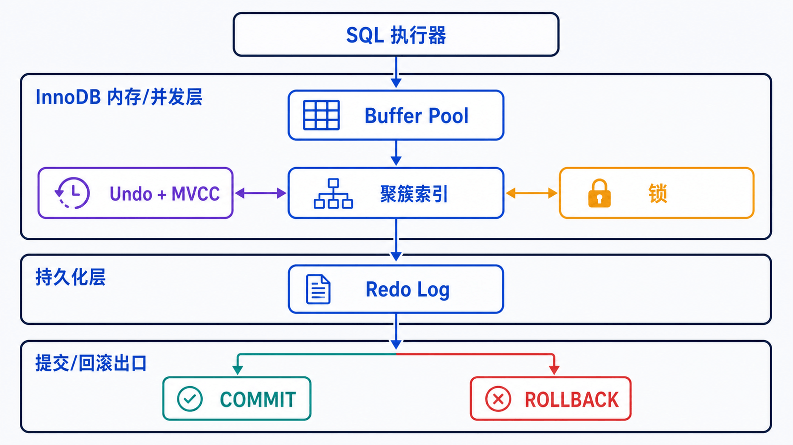
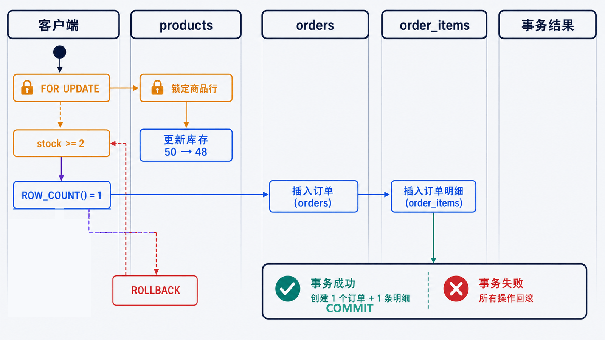

> 存储引擎不是文件格式选项。它决定一张表能否参与事务、如何组织索引、如何并发读写，以及崩溃后能恢复到什么状态。

## 前置知识与学习目标

请先理解表、主键、外键和基本 CRUD。完成本篇后，你应该能够：

- 解释 SQL 层与存储引擎的职责边界；
- 用 buffer pool、聚簇索引、redo、undo/MVCC 和锁解释一次事务；
- 写出“创建订单并扣减库存”的原子操作；
- 识别死锁、锁等待和替代存储引擎的适用边界。

## SQL 层与引擎层如何协作

一次查询大致跨过这些职责：

1. 连接与权限层确认账户能否访问对象；
2. SQL 层解析语法，优化器选择访问路径；
3. 执行器通过存储引擎接口请求行或索引范围；
4. InnoDB 从 buffer pool 或磁盘页读取数据，维护锁、undo 和 redo；
5. 结果返回客户端，事务按 `COMMIT` 或 `ROLLBACK` 结束。

SQL 优化器属于服务层；行如何持久化、锁定和恢复主要由存储引擎负责。同一实例可以存在不同引擎的表，但跨引擎事务能力受最弱参与者限制。

确认当前配置：

```sql
SELECT @@default_storage_engine;
SHOW ENGINES;
SHOW TABLE STATUS FROM shop_lab;
```

MySQL 8.4 默认使用 InnoDB。除非有经过验证的特殊需求，新业务表应保持这个默认值。

## InnoDB 的五个关键部件

<!-- figure:s04-f01:start -->



<!-- figure:s04-f01:end -->

| 部件/机制       | 解决的问题           | 观察到的行为                         |
| --------------- | -------------------- | ------------------------------------ |
| Buffer Pool     | 缓存数据页和索引页   | 热数据不必每次从磁盘读取             |
| 聚簇索引        | 按主键组织整行数据   | 主键查找高效；二级索引叶子保存主键值 |
| Redo Log        | 记录可重放的物理变化 | 提交后崩溃可前滚已提交修改           |
| Undo Log + MVCC | 保存旧版本与回滚信息 | 普通一致性读可看到事务视图中的版本   |
| 锁              | 协调冲突写入和锁定读 | 不兼容请求等待、超时或形成死锁       |

ACID 可以映射到这些机制：事务将多条语句作为原子单元；约束与应用规则维护一致性；隔离级别、MVCC 和锁控制并发可见性；redo、刷盘策略和硬件共同影响持久性。

## 贯穿示例：订单与库存必须一起成功

<!-- figure:s04-f02:start -->



<!-- figure:s04-f02:end -->

假设客户 2 购买两只鼠标。输入是 `product_id = 2`、`quantity = 2`；成功输出是库存减少 2、产生一张订单和一条明细。任何一步失败都不应留下半成品。

```sql
START TRANSACTION;

SELECT id, price, stock
FROM products
WHERE id = 2
FOR UPDATE;

UPDATE products
SET stock = stock - 2
WHERE id = 2 AND stock >= 2;

-- 应用必须检查 ROW_COUNT() = 1；否则回滚并返回“库存不足”
SELECT ROW_COUNT() AS changed_rows;

INSERT INTO orders (customer_id, status, total_amount)
VALUES (2, 'pending', 398.00);

SET @new_order_id = LAST_INSERT_ID();

INSERT INTO order_items (order_id, product_id, quantity, unit_price)
VALUES (@new_order_id, 2, 2, 199.00);

COMMIT;
```

关键中间状态：`FOR UPDATE` 锁住目标商品；条件更新防止库存变成负数；订单 ID 只在当前连接中读取；`COMMIT` 后其他事务才看到完整结果。若 `changed_rows` 不是 1，应用必须 `ROLLBACK`，不能继续插入订单。

### 两个会话如何产生等待

会话 A：

```sql
START TRANSACTION;
SELECT stock FROM products WHERE id = 2 FOR UPDATE;
-- 暂不提交
```

会话 B 对同一行执行 `UPDATE` 时会等待 A 释放不兼容锁。A 提交或回滚后，B 才能继续。普通 `SELECT` 在 InnoDB 默认隔离级别下通常走一致性读，不等于也持有相同写锁。

诊断锁等待可查询 `performance_schema.data_locks`、`data_lock_waits` 和 `information_schema.innodb_trx`，而不是只调大超时时间。

## 隔离级别只选择业务需要的保证

| 隔离级别         | 典型特征                                | 代价/边界                            |
| ---------------- | --------------------------------------- | ------------------------------------ |
| READ UNCOMMITTED | 允许看到未提交变化                      | 很少适合业务事务                     |
| READ COMMITTED   | 每条一致性读建立较新的读视图            | 同一事务两次查询可看到不同已提交结果 |
| REPEATABLE READ  | InnoDB 默认；事务内一致性读通常共享快照 | 锁定读和写仍需理解范围锁             |
| SERIALIZABLE     | 普通读也获得更强串行化约束              | 并发度最低，适合少数场景             |

隔离级别不是“越高越好”。先定义允许哪些并发现象，再用并发测试验证。

## 其他引擎的边界

| 引擎   | 主要用途                       | 关键限制                                           |
| ------ | ------------------------------ | -------------------------------------------------- |
| InnoDB | 通用事务型业务                 | 需要合理主键、事务设计和容量规划                   |
| MEMORY | 会话间共享的易失临时数据       | 重启丢数据、容量受内存限制，不支持事务             |
| MyISAM | 兼容历史只读工作负载           | 无事务、外键和可靠崩溃恢复，新业务通常不选         |
| NDB    | MySQL NDB Cluster 的分布式场景 | 部署与数据模型约束不同，不能当作 InnoDB 的直接替换 |

`ALTER TABLE ... ENGINE = ...` 可能重建大表、占用额外空间并改变事务语义，不能作为无成本切换。

## 常见误区和失败边界

- “InnoDB 是行锁”不代表每次只锁一行；访问范围、索引和隔离级别会影响锁范围。
- 死锁是并发系统的正常失败模式。InnoDB 会回滚一个事务，应用应重试**整个事务**并限制次数。
- 默认锁等待超时通常只回滚当前语句，不应假设整个事务自动清空。
- `COMMIT` 成功不等于可以忽略备份；硬件、配置和恢复链共同决定持久性风险。
- 长事务会延长锁持有和旧版本保留，应尽量缩短“第一次写入到提交”的时间。

## 自检题

1. 二级索引叶子为什么还需要保存主键值？
2. 库存更新影响 0 行后为什么不能继续创建订单？
3. 遇到死锁时应该重试单条失败 SQL 还是整个事务？

<details>
<summary>查看答案</summary>

1. InnoDB 的整行数据按聚簇主键组织，二级索引通过主键定位对应聚簇索引记录。
2. 0 行表示商品不存在或库存不足；继续插入会破坏“订单与库存一起成功”的业务不变量。
3. 重试整个事务，因为死锁牺牲者的事务会被整体回滚，之前语句的效果也不存在。

</details>

## 本篇总结

InnoDB 把 SQL 层选出的访问路径落到页、索引、日志、版本和锁上。理解这些中间状态后，事务、慢查询和故障恢复不再是互相割裂的知识点。

## 下一篇衔接

下一篇暂时只读 `orders`，从投影、过滤、NULL 三值逻辑进入分组、稳定排序和基础分页，为后续逻辑处理顺序打基础。

## 资料来源

- [Introduction to InnoDB](https://dev.mysql.com/doc/refman/8.4/en/innodb-introduction.html)
- [InnoDB and the ACID Model](https://dev.mysql.com/doc/refman/8.4/en/mysql-acid.html)
- [InnoDB Transaction Isolation Levels](https://dev.mysql.com/doc/refman/8.4/en/innodb-transaction-isolation-levels.html)
- [InnoDB Locking Reads](https://dev.mysql.com/doc/refman/8.4/en/innodb-locking-reads.html)
- [InnoDB Error Handling](https://dev.mysql.com/doc/refman/8.4/en/innodb-error-handling.html)
