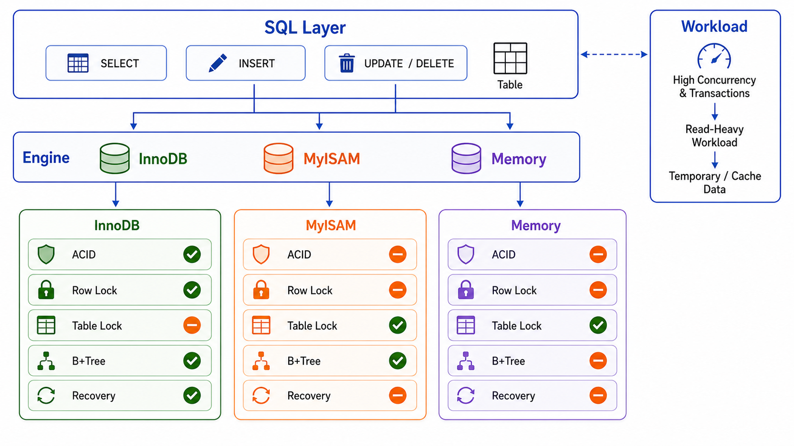

> 存储引擎决定数据的存储方式。



## 常用引擎

| 引擎        | 特点           |
| ----------- | -------------- |
| **InnoDB**  | 事务支持、行锁 |
| **MyISAM**  | 表锁、全文索引 |
| **Memory**  | 内存存储       |
| **Archive** | 压缩存储       |

## 设置引擎

```sql
CREATE TABLE t (id INT) ENGINE=InnoDB;
ALTER TABLE t ENGINE=MyISAM;
```

## InnoDB 与 MyISAM 对比

| 特性         | InnoDB                 | MyISAM                 |
| ------------ | ---------------------- | ---------------------- |
| **事务**     | 支持                   | 不支持                 |
| **外键**     | 支持                   | 不支持                 |
| **锁粒度**   | 行锁                   | 表锁                   |
| **全文索引** | MySQL 5.6+ 支持        | 支持                   |
| **崩溃恢复** | 支持自动恢复           | 恢复能力较弱           |
| **适用场景** | 事务、高并发、写多读多 | 只读、低并发、历史系统 |

选择建议：

- **优先 InnoDB**：新项目、事务需求、外键约束和高并发读写场景。
- **谨慎 MyISAM**：只读数据、老系统兼容或特定全文检索场景。

## 小结

- **InnoDB**：默认引擎，事务支持
- **MyISAM**：高速读取
- **Memory**：临时表
