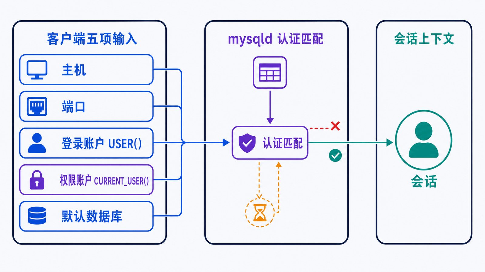
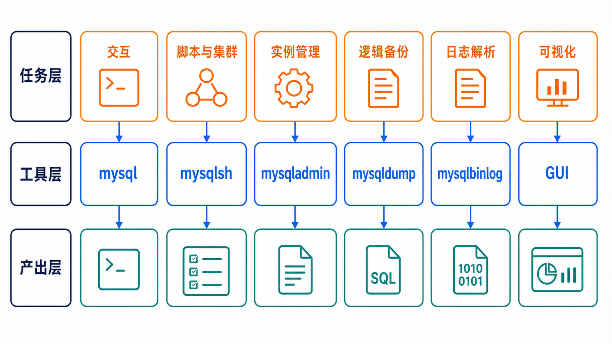

> 客户端不是数据库本身。它把你的身份、目标实例、会话参数和 SQL 发送给 `mysqld`；很多“SQL 错误”其实是连错主机、账户或数据库。

## 前置知识与学习目标

请先完成上一篇的实例安装。完成本篇后，你应该能够：

- 安全连接到指定主机、端口和数据库；
- 区分登录账户、权限匹配账户和当前数据库；
- 按任务选择官方客户端，并避免重复承担后续文章的职责；
- 正确区分用户变量、会话系统变量、全局系统变量和持久化配置。

本篇只用少量 SQL 验证连接，不系统讲 CRUD、备份策略或执行计划。

## 连接之前先回答五个问题

<!-- figure:s02-f01:start -->



<!-- figure:s02-f01:end -->

以 `shop_lab` 为例，一次连接至少包含：主机、端口、账户、认证信息和默认数据库。

```bash
mysql --protocol=TCP \
  -h 127.0.0.1 \
  -P 3306 \
  -u root \
  -p \
  shop_lab
```

`-p` 后不写密码，客户端会交互式询问。把密码直接写成 `-psecret` 会暴露在命令历史或进程列表中。自动化任务应使用权限受控的 option file、`mysql_config_editor` 或外部密钥系统，而不是把密码写进脚本。

连接后立即打印上下文：

```sql
SELECT
    USER() AS login_identity,
    CURRENT_USER() AS privilege_identity,
    DATABASE() AS current_database,
    @@hostname AS server_host,
    @@port AS server_port,
    @@version AS server_version;
```

`USER()` 是客户端提交的身份，`CURRENT_USER()` 是服务器实际用于权限检查的账户。两者不同通常意味着 host 匹配到了另一条账户记录。

## 用最小权限账户运行贯穿示例

root 用于实例管理，不应成为应用连接账户：

```sql
CREATE USER 'shop_app'@'localhost' IDENTIFIED BY 'replace-with-a-secret';
GRANT SELECT, INSERT, UPDATE, DELETE ON shop_lab.*
TO 'shop_app'@'localhost';

SHOW GRANTS FOR 'shop_app'@'localhost';
```

如果应用从另一台主机连接，应把 `localhost` 改成受控网段或明确主机，并配置 TLS。不要为了“先连通”长期保留 `'shop_app'@'%'` 和 `GRANT ALL`。

重新以业务账户连接并执行脚本：

```bash
mysql -h 127.0.0.1 -P 3306 -u shop_app -p shop_lab < verify.sql
```

或在交互客户端中：

```text
source verify.sql
```

批处理失败时检查退出码；不要只看终端最后一行。需要在遇错时停止的迁移任务，应由具备失败策略和迁移记录的工具执行，而不是盲目拼接多个 SQL 文件。

## 工具按职责分层

<!-- figure:s02-f02:start -->



<!-- figure:s02-f02:end -->

| 工具                  | 核心职责                                             | 典型输出                 | 不在本篇展开            |
| --------------------- | ---------------------------------------------------- | ------------------------ | ----------------------- |
| `mysql`               | 交互 SQL、执行脚本                                   | 结果集、错误码           | 查询优化原理            |
| MySQL Shell `mysqlsh` | SQL/JavaScript/Python 模式、AdminAPI、并行 dump/load | 结构化输出、集群管理对象 | InnoDB Cluster 部署细节 |
| `mysqladmin`          | ping、状态、刷新、关闭等管理动作                     | 实例状态                 | 日常业务 SQL            |
| `mysqldump`           | 逻辑导出                                             | 可重放 SQL               | 完整备份策略与 RPO/RTO  |
| `mysqlbinlog`         | 解码与筛选二进制日志                                 | binlog 事件或 SQL 表示   | 时间点恢复链            |
| Workbench 等 GUI      | 浏览对象、建模、查询                                 | 可视化对象与结果         | 代替版本化迁移脚本      |

GUI 能提高探索效率，但生产变更仍应保留可审阅、可重复执行的 SQL 或迁移记录。

## 会话命令与系统变量

先读再改，并明确作用域：

```sql
SHOW VARIABLES LIKE 'transaction_isolation';
SELECT @@SESSION.transaction_isolation, @@GLOBAL.max_connections;

-- 只影响当前连接
SET SESSION transaction_isolation = 'READ-COMMITTED';

-- 影响之后建立的连接；重启后是否保留取决于配置方式
SET GLOBAL max_connections = 250;

-- 修改运行值并写入 mysqld-auto.cnf（需相应权限）
SET PERSIST max_connections = 250;
```

`SET @max_connections = 250` 创建的是名为 `max_connections` 的**用户变量**，不会改变服务器连接上限。这类名称相似但作用完全不同，是运维脚本常见陷阱。

任何全局修改都应记录：旧值、新值、原因、观测指标、回滚语句和是否持久化。高风险变量不能仅因“可动态修改”就在线变更。

## 连接失败的最小诊断链

按从客户端到服务端的顺序排查：

1. `mysql --version`：客户端是否存在、版本是否符合预期；
2. 主机与端口：`127.0.0.1` 和 `localhost` 可能选择不同协议；
3. `mysqladmin -h 127.0.0.1 -P 3306 -u root -p ping`：实例是否响应；
4. 错误码：区分网络拒绝、TLS、认证和授权；
5. 登录后上下文查询：确认没有连错实例或数据库。

不要用关闭防火墙、跳过授权表或给账户全局权限来“验证”。这些动作扩大风险，也掩盖真正原因。

## 常见误区和适用边界

- `mysql -u root -p password` 中的 `password` 会被当成数据库名，而不是密码；正确做法是只写 `-p`。
- `FLUSH PRIVILEGES` 不是每次 `CREATE USER` 或 `GRANT` 后都必需；账户管理语句会立即生效。
- `SHOW PROCESSLIST` 是快照，不是完整的慢查询历史。
- `SET GLOBAL` 通常只影响后续连接，且不等于持久化。
- 客户端工具能发出危险命令；“工具支持”不代表操作安全。

## 自检题

1. 为什么登录后要同时查看 `USER()` 和 `CURRENT_USER()`？
2. `SET @x = 1` 与 `SET SESSION x = 1` 的本质区别是什么？
3. 为什么应用不应直接使用 root？

<details>
<summary>查看答案</summary>

1. 前者显示客户端提交身份，后者显示实际权限匹配身份，可定位 host 账户匹配问题。
2. 前者创建当前会话的用户变量；后者修改已存在、允许会话级变更的系统变量。
3. root 权限远超业务需要，凭据泄露或 SQL 注入时会放大影响范围，也无法清晰审计职责。

</details>

## 本篇总结

可靠操作从确认“我以谁的身份连接到哪台实例的哪个数据库”开始。工具应按职责选择，凭据不进入命令行，系统变量修改必须明确作用域、持久性与回滚路径。

## 下一篇衔接

下一篇会用 `shop_app` 之外的建表账户创建 `customers`、`products`、`orders` 和 `order_items`，把业务约束翻译成数据类型、主外键与安全 CRUD。

## 资料来源

- [mysql Client Options](https://dev.mysql.com/doc/refman/8.4/en/mysql-command-options.html)
- [End-User Guidelines for Password Security](https://dev.mysql.com/doc/refman/8.4/en/password-security-user.html)
- [Using System Variables](https://dev.mysql.com/doc/refman/8.4/en/using-system-variables.html)
- [MySQL Programs](https://dev.mysql.com/doc/refman/8.4/en/programs.html)
