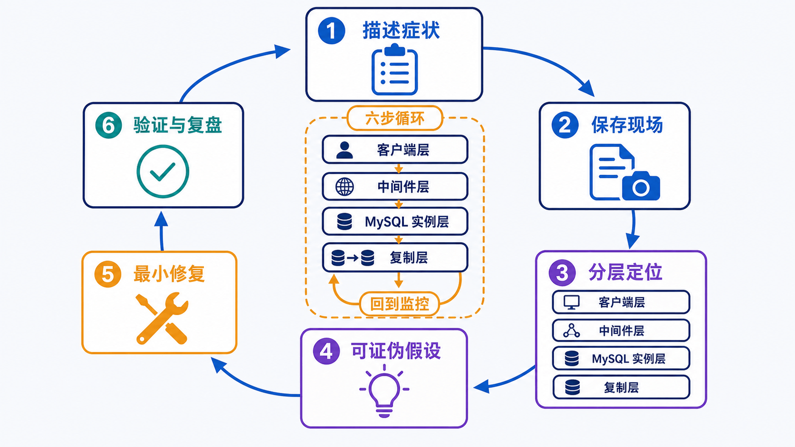
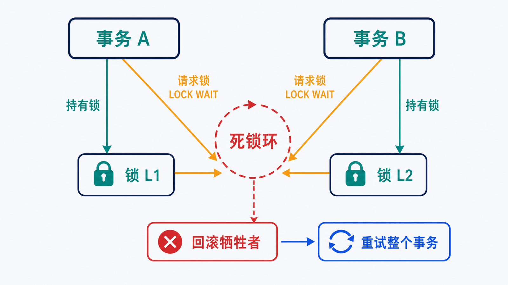

> 错误码是症状索引，不是修复命令。可靠排障要保留现场、分层收集证据、提出可证伪假设，并用最小变更验证。

## 前置知识与学习目标

本篇是系列收束，需要前文的连接、事务、索引、备份和复制知识。完成后你应该能够：

- 按客户端、网络、认证、服务、锁/事务、资源和复制分层定位；
- 为 1045、2003、锁等待、死锁、慢查询和复制延迟建立证据链；
- 在变更前保存现场、评估影响、准备回滚；
- 用原始症状、指标和业务不变量证明修复有效。

## 通用六步闭环

<!-- figure:s13-f01:start -->



<!-- figure:s13-f01:end -->

1. **描述症状**：错误码、首次发生时间、受影响请求、范围和频率；
2. **保存现场**：日志、指标、执行计划、连接/锁/复制状态，避免先重启；
3. **分层定位**：客户端 → DNS/网络/TLS → 认证授权 → 服务 → SQL/事务 → 资源 → 复制；
4. **提出假设**：每个假设写出支持证据和可证伪检查；
5. **最小修复**：只改变一个必要因素，准备回滚和变更窗口；
6. **验证与复盘**：原请求成功、错误率回落、无新告警、业务数据一致。

“重启好了”只能说明状态被重置，不能证明根因消失。

## 1045：认证成功之前就被拒绝

症状：

```text
ERROR 1045 (28000): Access denied for user 'shop_app'@'host' ...
```

按顺序检查：

```sql
-- 由有权限的管理账户执行
SELECT User, Host, plugin, account_locked, password_expired
FROM mysql.user
WHERE User = 'shop_app';

SHOW GRANTS FOR 'shop_app'@'localhost';
```

同时确认客户端实际来源主机、是否走 TCP、密码是否来自正确密钥、TLS/认证插件是否被驱动支持。`'shop_app'@'localhost'` 与 `'shop_app'@'%'` 是不同账户，服务器会选择最匹配的 Host 记录。

安全修复示例：

```sql
ALTER USER 'shop_app'@'localhost'
IDENTIFIED BY 'new-secret-from-secure-channel';
```

修改后用目标应用路径验证，随后轮换密钥并撤销临时权限。常规排障不要启动 `--skip-grant-tables`；管理员密码完全丢失时，按目标版本官方重置流程在维护窗口操作，并先限制网络访问。

## 2003：客户端尚未建立 MySQL 连接

症状：

```text
ERROR 2003 (HY000): Can't connect to MySQL server ...
```

证据链：

```bash
mysql --connect-timeout=5 -h 127.0.0.1 -P 3306 -u shop_app -p
mysqladmin -h 127.0.0.1 -P 3306 -u monitor -p ping
```

服务端检查进程、监听地址、端口映射和 error log。区分：

- `Connection refused`：目标端口没有监听或被主动拒绝；
- `Timeout`：路由、防火墙、安全组、DNS 或网络路径丢包；
- 连接后 TLS/握手错误：协议、证书或驱动兼容性；
- `Too many connections`：服务在监听，但连接配额/连接池耗尽。

不要先把 `bind-address` 改成全网监听或关闭防火墙。最小开放源网段，并保留 TLS 和账户 Host 限制。

## 锁等待与死锁：先找阻塞链

<!-- figure:s13-f02:start -->



<!-- figure:s13-f02:end -->

```sql
SELECT * FROM information_schema.innodb_trx\G
SELECT * FROM performance_schema.data_lock_waits\G
SELECT * FROM performance_schema.data_locks\G
SHOW ENGINE INNODB STATUS\G
```

记录等待事务、阻塞事务、开始时间、SQL、锁对象和应用请求。修复优先级通常是：缩短事务、按一致顺序访问资源、为谓词补合适索引、避免用户交互期间持有事务。

死锁发生时 InnoDB 会回滚一个完整事务，应用应带退避和次数上限重试整个事务。锁等待超时默认可能只回滚当前语句，应用必须显式决定剩余事务是提交还是回滚。

直接 `KILL` 阻塞会话只适合确认影响和事务回滚成本后的应急止损；长事务回滚本身也可能耗时。

## 慢查询：从样本到计划再到实测

先确认是单条 SQL 退化、流量上升、锁等待还是资源饱和：

```sql
SHOW FULL PROCESSLIST;
SHOW GLOBAL STATUS LIKE 'Threads_running';
SHOW GLOBAL STATUS LIKE 'Created_tmp_disk_tables';
```

对可复现查询保存参数，再运行：

```sql
EXPLAIN FORMAT=TREE
SELECT id, total_amount
FROM orders
WHERE customer_id = 42 AND status = 'paid'
ORDER BY created_at DESC, id DESC
LIMIT 20;
```

在隔离环境使用 `EXPLAIN ANALYZE` 对比估算/实际行数。若偏差大，检查统计信息和参数倾斜；若计划合理但整体慢，检查锁、I/O、CPU、buffer pool、并发和网络。

不要把 `max_connections` 调大当通用修复。更多连接可能把数据库从排队状态推向资源崩溃，根因应在连接池、慢 SQL、事务和容量之间定位。

## 复制延迟与中断

```sql
SHOW REPLICA STATUS\G
```

重点收集：接收/应用线程状态、last error、retrieved/executed GTID、relay log 队列、应用并行度、源库写入峰值和副本资源。`Seconds_Behind_Source` 只能作为一个信号。

处理顺序：

1. 保存错误和 GTID 状态；
2. 判断是网络接收慢、应用慢、事务冲突还是数据不一致；
3. 修复根因或从可信快照重建副本；
4. 验证 GTID 集合、关键数据和延迟恢复；
5. 恢复读流量前确认读后写一致性策略。

不要通过跳过事务或手改复制位置来“让状态变绿”；这可能制造静默数据分叉。

## 数据修复先生成候选集

发现重复邮箱时先只读定位：

```sql
WITH ranked AS (
    SELECT
        id,
        email,
        ROW_NUMBER() OVER (
            PARTITION BY email
            ORDER BY created_at, id
        ) AS rn
    FROM customers
)
SELECT * FROM ranked WHERE rn > 1;
```

然后导出候选、确认保留规则、处理外键引用、在隔离副本演练、准备备份和回滚，再执行受控修复。不要使用带 `NOT IN` 的一行删除语句直接清理生产；`NULL`、并发写入和引用关系都会改变结果。

## 修复验收模板

每次事故至少记录：

```text
症状与影响：
开始/恢复时间：
证据链接：
根因假设与证伪过程：
实际根因：
修复与回滚：
原症状验证：
业务不变量验证：
监控观察窗口：
预防动作与负责人：
```

## 常见误区和适用边界

- 错误码相同不代表根因相同；1045 可能是密码、Host 匹配、账户锁定或插件兼容。
- 重启会销毁部分现场证据，应先采集再决定。
- 日志包含 SQL、账户和业务数据，分享前要脱敏并限制权限。
- 临时放大权限、关闭安全控制或跳过复制事件必须有到期、回滚和审计；多数情况下应避免。
- 单点修复后仍需观察一个完整业务周期或高峰窗口。

## 自检题

1. `Connection refused` 与 `Access denied` 分别位于哪一层？
2. 为什么死锁后要重试整个事务？
3. 为什么不能只看 `Seconds_Behind_Source = 0` 判断副本健康？

<details>
<summary>查看答案</summary>

1. 前者是网络/监听层，后者已到认证授权层。
2. InnoDB 会回滚死锁牺牲者的完整事务，之前的成功语句也不再生效。
3. 它可能为 `NULL`，也不完整表达接收/应用线程、GTID 缺口、错误和业务数据一致性。

</details>

## 本篇总结

排障能力来自可重复的证据链，而不是错误码命令集。保存现场、分层定位、最小修复、回滚和业务验证构成统一闭环。

## 下一篇衔接

系列到此形成闭环。回到第一篇，在隔离环境按“安装—建模—查询—优化—备份—切换—排障”完成一次端到端演练，并把每一步证据纳入自己的运行手册。

## 资料来源

- [MySQL Server Error Message Reference](https://dev.mysql.com/doc/mysql-errors/8.4/en/)
- [InnoDB Lock and Lock-Wait Information](https://dev.mysql.com/doc/refman/8.4/en/innodb-information-schema-understanding-innodb-locking.html)
- [InnoDB Error Handling](https://dev.mysql.com/doc/refman/8.4/en/innodb-error-handling.html)
- [Troubleshooting Replication](https://dev.mysql.com/doc/refman/8.4/en/replication-problems.html)
- [How to Reset the Root Password](https://dev.mysql.com/doc/refman/8.4/en/resetting-permissions.html)
