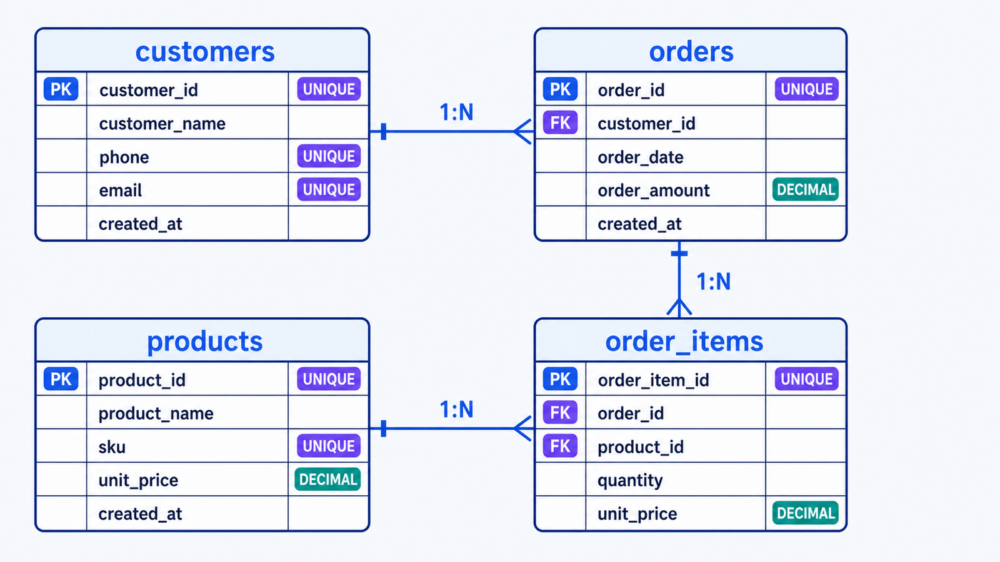
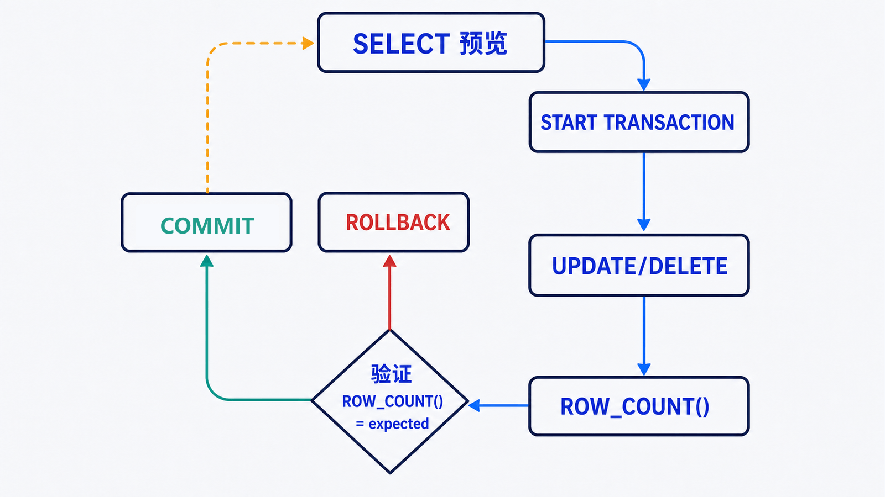

> 数据库基础操作不只是记住 `CREATE`、`INSERT`、`UPDATE`、`DELETE`。真正的目标是把业务不变量写进表结构，并让每次变更都可验证、可回滚。

## 前置知识与学习目标

你需要能连接 `shop_lab` 并执行 SQL。完成本篇后，你应该能够：

- 区分 DDL、DML、DQL 和事务控制语句；
- 为标识、金额、时间、状态和可空字段选择合理类型；
- 用主键、唯一约束、外键和检查约束保护订单模型；
- 在修改或删除数据前预览影响范围，并用事务验证结果。

复杂查询、索引与存储引擎内部机制将在后文展开。

## 从业务不变量到四张表

<!-- figure:s03-f01:start -->



<!-- figure:s03-f01:end -->

贯穿示例有四条规则：客户邮箱唯一；商品价格和订单金额必须非负；订单明细必须引用存在的订单和商品；一个订单中的同一商品只出现一次。

```sql
CREATE DATABASE IF NOT EXISTS shop_lab
  CHARACTER SET utf8mb4
  COLLATE utf8mb4_0900_ai_ci;

USE shop_lab;

CREATE TABLE customers (
    id BIGINT UNSIGNED PRIMARY KEY AUTO_INCREMENT,
    email VARCHAR(254) NOT NULL,
    display_name VARCHAR(80) NOT NULL,
    created_at DATETIME NOT NULL DEFAULT CURRENT_TIMESTAMP,
    CONSTRAINT uq_customers_email UNIQUE (email)
) ENGINE = InnoDB;

CREATE TABLE products (
    id BIGINT UNSIGNED PRIMARY KEY AUTO_INCREMENT,
    sku VARCHAR(40) NOT NULL,
    name VARCHAR(120) NOT NULL,
    price DECIMAL(10, 2) NOT NULL,
    stock INT UNSIGNED NOT NULL DEFAULT 0,
    CONSTRAINT uq_products_sku UNIQUE (sku),
    CONSTRAINT chk_products_price CHECK (price >= 0)
) ENGINE = InnoDB;

CREATE TABLE orders (
    id BIGINT UNSIGNED PRIMARY KEY AUTO_INCREMENT,
    customer_id BIGINT UNSIGNED NOT NULL,
    status VARCHAR(20) NOT NULL DEFAULT 'pending',
    total_amount DECIMAL(12, 2) NOT NULL DEFAULT 0,
    created_at DATETIME NOT NULL DEFAULT CURRENT_TIMESTAMP,
    CONSTRAINT fk_orders_customer
      FOREIGN KEY (customer_id) REFERENCES customers (id),
    CONSTRAINT chk_orders_status
      CHECK (status IN ('pending', 'paid', 'shipped', 'cancelled')),
    CONSTRAINT chk_orders_total CHECK (total_amount >= 0)
) ENGINE = InnoDB;

CREATE TABLE order_items (
    id BIGINT UNSIGNED PRIMARY KEY AUTO_INCREMENT,
    order_id BIGINT UNSIGNED NOT NULL,
    product_id BIGINT UNSIGNED NOT NULL,
    quantity INT UNSIGNED NOT NULL,
    unit_price DECIMAL(10, 2) NOT NULL,
    CONSTRAINT uq_order_product UNIQUE (order_id, product_id),
    CONSTRAINT fk_items_order
      FOREIGN KEY (order_id) REFERENCES orders (id),
    CONSTRAINT fk_items_product
      FOREIGN KEY (product_id) REFERENCES products (id),
    CONSTRAINT chk_items_quantity CHECK (quantity > 0),
    CONSTRAINT chk_items_price CHECK (unit_price >= 0)
) ENGINE = InnoDB;
```

选择背后的理由：

| 数据 | 类型                  | 原因                                       |
| ---- | --------------------- | ------------------------------------------ |
| 主键 | `BIGINT UNSIGNED`     | 范围大、含义明确，适合持续增长的业务标识   |
| 金额 | `DECIMAL(p,s)`        | 十进制定点数，避免二进制浮点舍入误差       |
| 状态 | `VARCHAR` + `CHECK`   | 允许受控演进，同时由数据库拒绝非法值       |
| 时间 | `DATETIME`            | 保存业务时间；时区策略由应用和连接统一管理 |
| 文本 | `VARCHAR` + `utf8mb4` | 支持完整 Unicode，并限制合理最大长度       |

`NULL` 表示“未知或不适用”，不是空字符串、0 或默认值。只有业务确实允许未知时才使用可空列。

## DDL、DML、DQL 与事务控制

| 类别 | 目的     | 代表语句                                  |
| ---- | -------- | ----------------------------------------- |
| DDL  | 定义结构 | `CREATE`、`ALTER`、`DROP`                 |
| DML  | 改变行   | `INSERT`、`UPDATE`、`DELETE`              |
| DQL  | 读取结果 | `SELECT`                                  |
| TCL  | 控制事务 | `START TRANSACTION`、`COMMIT`、`ROLLBACK` |

DDL 可能触发隐式提交、元数据锁或耗时重建。生产结构变更必须先查目标版本的 online DDL 能力，并在接近真实数据量的环境演练。

## 插入可重复使用的种子数据

```sql
INSERT INTO customers (email, display_name) VALUES
  ('alice@example.com', 'Alice'),
  ('bob@example.com', 'Bob');

INSERT INTO products (sku, name, price, stock) VALUES
  ('KB-001', '机械键盘', 499.00, 20),
  ('MS-001', '无线鼠标', 199.00, 50),
  ('HB-001', 'USB-C 扩展坞', 699.00, 10);

INSERT INTO orders (customer_id, status, total_amount, created_at) VALUES
  (1, 'paid', 698.00, '2026-07-01 10:00:00'),
  (1, 'shipped', 699.00, '2026-07-02 11:30:00'),
  (2, 'pending', 199.00, '2026-07-03 09:15:00');

INSERT INTO order_items (order_id, product_id, quantity, unit_price) VALUES
  (1, 1, 1, 499.00),
  (1, 2, 1, 199.00),
  (2, 3, 1, 699.00),
  (3, 2, 1, 199.00);
```

输入是四组符合约束的业务行；输出可用计数和金额和验证：

```sql
SELECT COUNT(*) AS order_count, SUM(total_amount) AS total
FROM orders;
-- 预期：3, 1596.00
```

## 安全地读、改、删

<!-- figure:s03-f02:start -->



<!-- figure:s03-f02:end -->

写操作采用“同一谓词先查、事务中修改、再次验证”的节奏：

```sql
SELECT id, status
FROM orders
WHERE id = 3 AND status = 'pending';

START TRANSACTION;

UPDATE orders
SET status = 'cancelled'
WHERE id = 3 AND status = 'pending';

SELECT ROW_COUNT() AS changed_rows;
SELECT id, status FROM orders WHERE id = 3;

ROLLBACK; -- 本次只演练，不保留修改
```

`ROW_COUNT()` 预期为 1；若为 0，可能是状态已变化或 ID 不存在，应停止而不是放宽 `WHERE`。删除同理：先 `SELECT`，再在事务中 `DELETE`，核对行数后才决定 `COMMIT`。

结构命令风险不同：

- `DELETE` 按行删除，可带 `WHERE`，受事务控制；
- `TRUNCATE TABLE` 清空整表，是 DDL，不能当成“更快的 DELETE”随意使用；
- `DROP TABLE` 删除定义和数据；
- `ALTER TABLE ... DROP COLUMN` 会永久移除列，先确认应用、备份和回滚方案。

## 常见误区和适用边界

- `SELECT *` 适合临时探索，不适合作为稳定接口；列新增会改变结果形状和网络开销。
- 金额使用 `FLOAT` 会引入舍入问题，应使用 `DECIMAL` 或最小货币单位整数。
- 外键不是 JOIN 的前提，但能阻止孤儿记录；是否使用还要考虑写入路径和变更治理。
- `ON DELETE CASCADE` 很方便，也会扩大一次误删的影响；只有业务语义明确时才配置。
- 修改列类型前必须检查现有数据能否转换，不能只看新表上的示例成功。

## 自检题

1. 为什么订单金额不使用 `FLOAT`？
2. `NULL`、空字符串和 0 能互换吗？
3. 为什么生产 `UPDATE` 前要用相同 `WHERE` 做 `SELECT`？

<details>
<summary>查看答案</summary>

1. `DECIMAL` 按十进制定点精确保存货币数值；二进制浮点可能产生不可接受的舍入差异。
2. 不能。`NULL` 表示未知/不适用，空字符串是已知的空文本，0 是明确数值。
3. 它能预览影响范围和当前状态；修改后再对比 `ROW_COUNT()`，可及时发现谓词错误或并发变化。

</details>

## 本篇总结

可靠的数据模型把业务不变量下沉为类型和约束；可靠的写操作把预览、事务、影响行数和回滚组合成闭环。这样后续查询才能建立在可信数据之上。

## 下一篇衔接

四张表都使用 InnoDB。下一篇会解释这个选择如何影响 ACID、聚簇索引、MVCC、行锁和崩溃恢复，并用“创建订单并扣库存”演示原子事务。

## 资料来源

- [CREATE TABLE Statement](https://dev.mysql.com/doc/refman/8.4/en/create-table.html)
- [Data Types](https://dev.mysql.com/doc/refman/8.4/en/data-types.html)
- [FOREIGN KEY Constraints](https://dev.mysql.com/doc/refman/8.4/en/create-table-foreign-keys.html)
- [Atomic Data Definition Statement Support](https://dev.mysql.com/doc/refman/8.4/en/atomic-ddl.html)
