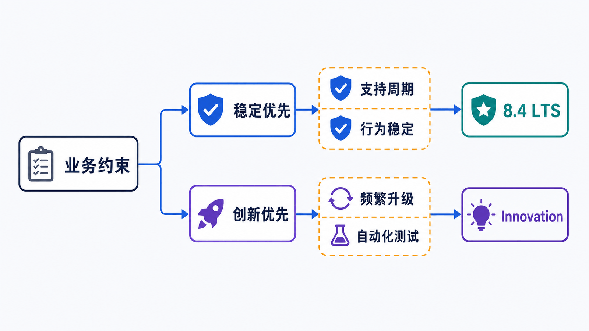
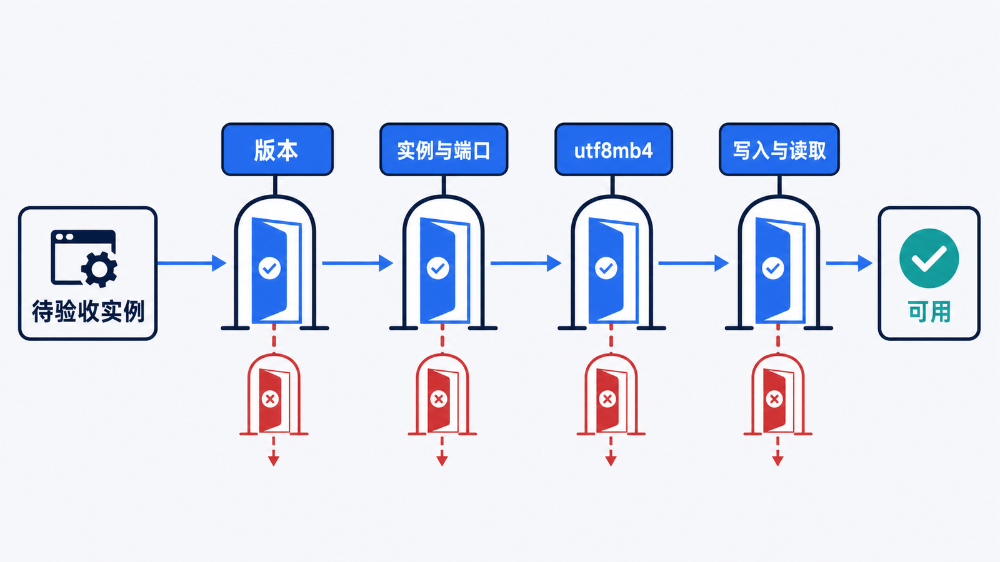

> 本系列统一以 **MySQL 8.4 LTS、InnoDB、utf8mb4** 为实验基线，并用一个电商订单系统 `shop_lab` 贯穿后续文章。

## 前置知识与学习目标

阅读前只需要知道什么是进程、端口和客户端/服务端。完成本篇后，你应该能够：

- 在 LTS 与 Innovation 轨道之间做出有依据的选择；
- 用 Docker 启动一个固定版本、数据持久化的 MySQL 实例；
- 用版本、进程、端口和读写四项检查证明“安装完成”；
- 识别端口冲突、数据目录权限和跨大版本复用数据卷等常见风险。

本篇不展开 SQL 查询、容量规划和生产高可用。

## 先做版本决策，再选安装方式

<!-- figure:s01-f01:start -->



<!-- figure:s01-f01:end -->

MySQL 现在有两条发布轨道。两者都可用于生产，但变化节奏不同：

| 轨道           | 适合谁                               | 变化特征                                 | 本系列建议                       |
| -------------- | ------------------------------------ | ---------------------------------------- | -------------------------------- |
| **LTS**        | 需要长维护周期、行为稳定的业务       | 同一 LTS 系列主要接收必要修复            | 新的长期项目优先选 8.4 LTS       |
| **Innovation** | 有完善自动化测试、愿意频繁升级的团队 | 更快获得功能，也可能遇到行为变化和移除项 | 用于验证新能力，不作为本系列基线 |

旧系统的版本选择应先看厂商支持策略、驱动兼容性和升级路径。**不要为新项目选择已停止常规支持的 5.7**；也不要仅因“旧版本熟悉”就跳过安全更新。使用镜像时固定 `8.4` 或更精确的补丁版本，不使用含义会变化的 `latest`。

决策可以压缩为四个问题：

1. 目标版本是否仍在支持期？
2. 应用驱动、ORM、备份工具和字符集是否兼容？
3. 能否在测试环境完成升级与回滚演练？
4. 数据目录是新建，还是来自需要迁移的旧实例？

## 最小可复现安装：Docker

本地学习最容易复现的方式是固定镜像和命名卷：

```bash
docker pull mysql:8.4

docker run -d \
  --name shop-mysql \
  -p 3306:3306 \
  -e MYSQL_ROOT_PASSWORD=local-only-password \
  -e MYSQL_DATABASE=shop_lab \
  -v shop-mysql-data:/var/lib/mysql \
  mysql:8.4 \
  --character-set-server=utf8mb4 \
  --collation-server=utf8mb4_0900_ai_ci
```

这里有三个关键状态：

- 容器可删除，命名卷 `shop-mysql-data` 才保存数据；
- `3306:3306` 的左侧是宿主机端口，冲突时可改成 `3307:3306`；
- 环境变量密码只适合隔离的本地实验。生产应使用密钥管理，不能写入仓库或命令历史。

先观察初始化，而不是立刻重复启动：

```bash
docker logs -f shop-mysql
docker ps --filter name=shop-mysql
```

日志出现“ready for connections”后再连接：

```bash
docker exec -it shop-mysql mysql -uroot -p
```

## 安装完成的四项验收

<!-- figure:s01-f02:start -->



<!-- figure:s01-f02:end -->

“安装程序结束”不等于数据库可用。依次检查：

```sql
-- 1. 版本与发行信息
SELECT VERSION(), @@version_comment;

-- 2. 当前实例与端口
SELECT @@hostname, @@port, @@datadir;

-- 3. 字符集和排序规则
SELECT @@character_set_server, @@collation_server;

-- 4. 最小写入与读取
CREATE TABLE shop_lab.install_check (
    id INT PRIMARY KEY,
    note VARCHAR(40) NOT NULL
) ENGINE = InnoDB;

INSERT INTO shop_lab.install_check VALUES (1, 'mysql-ready');
SELECT * FROM shop_lab.install_check;
DROP TABLE shop_lab.install_check;
```

预期结果是：版本属于所选轨道；实例、端口和数据目录与部署一致；字符集为 `utf8mb4`；测试行能写入、读出并清理。若只验证“能连上”，磁盘只读、权限错误和选错实例仍可能被遗漏。

## 原生安装时要保持同一验收标准

Windows Installer、Linux 官方仓库和压缩包安装的目录、服务名不同，但判断是否成功的方法相同：

1. 从 MySQL 官方仓库选择 LTS 轨道；
2. 为 `mysqld` 创建独立服务账户与数据目录；
3. 初始化数据目录并保存临时凭据；
4. 启动服务，确认监听地址和端口；
5. 修改初始密码，创建业务账户；
6. 执行上一节的四项验收。

不要复制一整份“性能配置模板”。`innodb_buffer_pool_size`、连接上限和日志保留都依赖内存、并发和恢复目标。先使用可解释的默认值，再用监控和压测驱动修改。

## 常见失败与适用边界

| 症状                   | 先检查                                      | 不要直接做                                |
| ---------------------- | ------------------------------------------- | ----------------------------------------- |
| 容器不断重启           | `docker logs` 中的初始化、权限和参数错误    | 反复删除数据卷                            |
| 连接被拒绝             | 容器状态、端口映射、监听地址、防火墙        | 先关闭所有防火墙                          |
| 宿主机 3306 被占用     | `docker ps` 或系统端口占用                  | 同时运行两个同端口实例                    |
| 升级后无法启动旧数据卷 | 官方支持的升级路径与错误日志                | 把旧卷直接挂到任意新大版本                |
| 中文比较结果异常       | server/database/table/connection 四层字符集 | 只在客户端执行一次 `SET NAMES` 当永久修复 |

Docker 适合学习、CI 和可替换环境；需要研究操作系统 I/O、NUMA、文件系统或真实故障切换时，应使用更接近生产的虚拟机或物理机。

## 自检题

1. 为什么新业务更适合从 8.4 LTS 而不是 5.7 开始？
2. 容器删除后数据仍在，状态保存在哪里？
3. 哪四类证据可以证明实例真的可用？

<details>
<summary>查看答案</summary>

1. 8.4 LTS 具有当前维护轨道和稳定的功能集合；5.7 已不应作为新项目起点。
2. 状态保存在挂载到 `/var/lib/mysql` 的命名卷中，而不是容器可写层。
3. 版本、进程/实例与端口、字符集配置、最小写入读取。

</details>

## 本篇总结

版本选择本质上是支持周期、变化速度和升级能力的权衡。安装的 Definition of Done 不是“安装器结束”，而是一个固定版本的实例能被定位、连接、写入、读取，并且数据目录和配置来源都可解释。

## 下一篇衔接

实例已经运行。下一篇将创建最小权限账户，安全连接 `shop_lab`，并区分 `mysql`、MySQL Shell、`mysqldump` 与 `mysqlbinlog` 的职责。

## 资料来源

- [MySQL Releases: Innovation and LTS](https://dev.mysql.com/doc/refman/8.4/en/mysql-releases.html)
- [Installing MySQL](https://dev.mysql.com/doc/refman/8.4/en/installing.html)
- [Which MySQL Version and Distribution to Install](https://dev.mysql.com/doc/refman/8.4/en/which-version.html)
- [MySQL Docker images](https://hub.docker.com/_/mysql)
